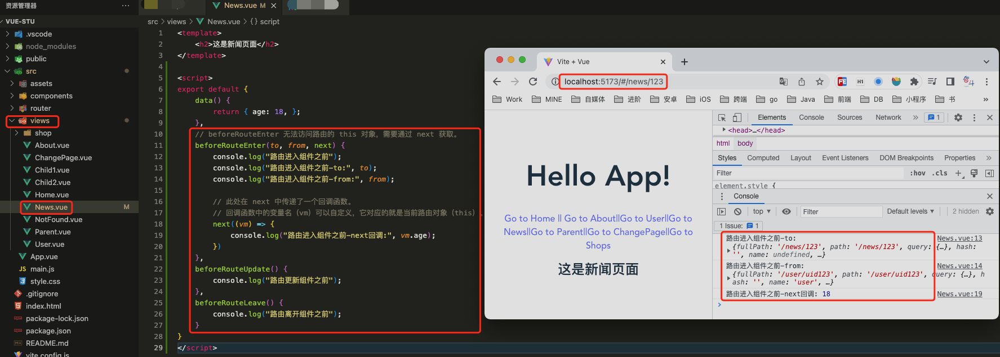
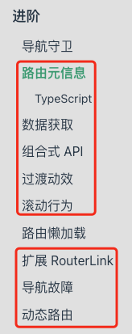

# 1. 023-VueRouter进阶


## 1.1. 导航守卫

>2023-01-13 周五

[文档：导航守卫](https://router.vuejs.org/zh/guide/advanced/navigation-guards.html)

正如其名，vue-router 提供的导航守卫主要**用来通过跳转或取消的方式守卫导航**。这里有很多方式植入路由导航中：全局的，单个路由独享的，或者组件级的。

>CnPeng：守卫就是在触发路由的某种事件时执行相应处理。

### 1.1.1. 全局前置守卫

也叫全球首位。

#### 1.1.1.1. 全局前置守卫

你可以使用 `router.beforeEach` 注册一个全局前置守卫：

```vue
const router = createRouter({ ... })

router.beforeEach((to, from) => {
  // ...
  // 返回 false 以取消导航
  return false
})
```

当一个导航触发时，**全局前置守卫按照创建顺序调用**。**守卫是异步解析执行，此时导航在所有守卫 resolve 完之前一直处于等待中**。

每个守卫方法接收两个参数：

* `to`: 即将要进入的目标路由对象（到哪里去） [用一种标准化的方式](https://router.vuejs.org/zh/api/#routelocationnormalized)
* `from`: 当前导航正要离开的路由对象（从哪里来） [用一种标准化的方式](https://router.vuejs.org/zh/api/#routelocationnormalized)

可以返回的值如下:

* `false` : 取消当前的导航。如果浏览器的 URL 改变了(可能是用户手动或者浏览器后退按钮)，那么 URL 地址会重置到 `from` 路由对应的地址。
* 一个[路由地址](https://router.vuejs.org/zh/api/#routelocationraw): 通过一个路由地址跳转到一个不同的地址，就像你调用 `router.push()` 一样，你可以设置诸如 `replace: true` 或 `name: 'home'` 之类的配置。当前的导航被中断，然后进行一个新的导航，就和 `from` 一样。

```vue
 router.beforeEach(async (to, from) => {
   if (
     // 检查用户是否已登录
     !isAuthenticated &&
     // ❗️ 避免无限重定向
     to.name !== 'Login'
   ) {
     // 将用户重定向到登录页面
     return { name: 'Login' }
   }
 })
```

如果遇到了意料之外的情况，可能会抛出一个 `Error`。这会取消导航并且调用 `router.onError()` 注册过的回调。如果什么都没有，`undefined` 或返回 `true`，则导航是有效的，并调用下一个导航守卫

以上所有都同 `async` 函数 和 Promise 工作方式一样：

```vue
router.beforeEach(async (to, from) => {
  // canUserAccess() 返回 `true` 或 `false`
  const canAccess = await canUserAccess(to)
  if (!canAccess) return '/login'
})
```

#### 1.1.1.2. 可选的第三个参数-`next`

>CnPeng : next 是一个函数，通常用在满足某种条件时的路由跳转。

在之前的 Vue Router 版本中，也是可以使用 第三个参数 `next` 的。这是一个常见的错误来源，可以通过 [RFC](https://github.com/vuejs/rfcs/blob/master/active-rfcs/0037-router-return-guards.md#motivation) 来消除错误。然而，它仍然是被支持的，这意味着你可以向任何导航守卫传递第三个参数。在这种情况下，**确保 `next` 在任何给定的导航守卫中都被严格调用一次**。它可以出现多于一次，但是只能在所有的逻辑路径都不重叠的情况下，否则钩子永远都不会被解析或报错。

这里有一个在用户未能验证身份时重定向到 `/login` 的错误用例：

```vue
// ❌ 这是错误示例
router.beforeEach((to, from, next) => {
  if (to.name !== 'Login' && !isAuthenticated) next({ name: 'Login' })
  // 如果用户未能验证身份，则 `next` 会被调用两次
  next()
})
```

下面是正确的版本:

```vue
// ✅ 这是正确的示例
router.beforeEach((to, from, next) => {
  if (to.name !== 'Login' && !isAuthenticated) next({ name: 'Login' })
  // 直接执行后续操作
  else next()
})
```

### 1.1.2. 全局解析守卫

你可以用 `router.beforeResolve` 注册一个全局守卫。这和 `router.beforeEach` 类似，因为**它在每次导航时都会触发**，但是确保在导航被确认之前，同时**在所有组件内守卫和异步路由组件被解析之后，解析守卫就被正确调用**。这里有一个例子，确保用户可以访问[自定义 meta 属性](https://router.vuejs.org/zh/guide/advanced/meta.html) `requiresCamera` 的路由：

```vue
router.beforeResolve(async to => {
  if (to.meta.requiresCamera) {
    try {
      await askForCameraPermission()
    } catch (error) {
      if (error instanceof NotAllowedError) {
        // ... 处理错误，然后取消导航
        return false
      } else {
        // 意料之外的错误，取消导航并把错误传给全局处理器
        throw error
      }
    }
  }
})
```

**`router.beforeResolve` 是获取数据或执行任何其他操作**（如果用户无法进入页面时你希望避免执行的操作）**的理想位置**。

### 1.1.3. 全局后置钩子

你也可以注册全局后置钩子，然而和守卫不同的是，这些钩子不会接受 `next` 函数也不会改变导航本身：

```vue
router.afterEach((to, from) => {
  sendToAnalytics(to.fullPath)
})
```

它们对于分析、更改页面标题、声明页面等辅助功能以及许多其他事情都很有用。

它们也反映了 [navigation failures](https://router.vuejs.org/zh/guide/advanced/navigation-failures.html)作为第三个参数：

```vue
router.afterEach((to, from, failure) => {
  if (!failure) sendToAnalytics(to.fullPath)
})
```

了解更多[关于 navigation failures 的信息在它的指南中](https://router.vuejs.org/zh/guide/advanced/navigation-failures.html)。

### 1.1.4. 路由独享的守卫

> 也叫每路守卫

你可以直接在路由配置上定义 `beforeEnter` 守卫：

```vue
const routes = [
  {
    path: '/users/:id',
    component: UserDetails,
    beforeEnter: (to, from) => {
      // reject the navigation
      return false
    },
  },
]
```

**`beforeEnter` 守卫 只在进入路由时触发**，不会在 `params`、`query` 或 `hash `改变时触发。例如，从 `/users/2` 进入到 `/users/3` 或者从 `/users/2#info` 进入到 `/users/2#projects`。它们只有在从一个不同的 路由导航时，才会被触发。

你也可以**将一个函数数组传递给 `beforeEnter`**，这**在为不同的路由重用守卫时很有用**：

```vue
function removeQueryParams(to) {
  if (Object.keys(to.query).length)
    return { path: to.path, query: {}, hash: to.hash }
}

function removeHash(to) {
  if (to.hash) return { path: to.path, query: to.query, hash: '' }
}

const routes = [
  {
    path: '/users/:id',
    component: UserDetails,
    beforeEnter: [removeQueryParams, removeHash],
  },
  {
    path: '/about',
    component: UserDetails,
    beforeEnter: [removeQueryParams],
  },
]
```

请注意，你也可以通过使用[路径 meta 字段](https://router.vuejs.org/zh/guide/advanced/meta.html)和[全局导航守卫](https://router.vuejs.org/zh/guide/advanced/navigation-guards.html#global-before-guards)来实现类似的行为。

### 1.1.5. 组件内的守卫

前面几种路由守卫都是定义在 `src`-`router`-`index.js` 中，我们还可以**在路由对应的组件内直接定义路由导航守卫**(传递给路由配置的)。

#### 1.1.5.1. 可用的配置 API

你可以为路由组件添加以下配置：

* beforeRouteEnter
* beforeRouteUpdate
* beforeRouteLeave

```js
const UserDetails = {
  template: `...`,
  beforeRouteEnter(to, from) {
    // 在渲染该组件的对应路由被验证前调用
    // 不能获取组件实例 `this` ！
    // 因为当守卫执行时，组件实例还没被创建！
  },
  beforeRouteUpdate(to, from) {
    // 在当前路由改变，但是该组件被复用时调用
    // 举例来说，对于一个带有动态参数的路径 `/users/:id`，在 `/users/1` 和 `/users/2` 之间跳转的时候，
    // 由于会渲染同样的 `UserDetails` 组件，因此组件实例会被复用。而这个钩子就会在这个情况下被调用。
    // 因为在这种情况发生的时候，组件已经挂载好了，导航守卫可以访问组件实例 `this`
  },
  beforeRouteLeave(to, from) {
    // 在导航离开渲染该组件的对应路由时调用
    // 与 `beforeRouteUpdate` 一样，它可以访问组件实例 `this`
  },
}
```

**`beforeRouteEnter` 守卫 不能 访问 `this`**，因为守卫在导航确认前被调用，因此即将渲染的新组件还没被创建。

不过，你可以通过传一个回调给 `next` 来访问组件实例。**在导航被确认的时候执行回调，并且把组件实例作为回调方法的参数**：

```js
beforeRouteEnter (to, from, next) {
  next(vm => {
    // 通过 `vm` 访问组件实例
  })
}
```

注意 **`beforeRouteEnter` 是支持给 `next` 传递回调的唯一守卫**。对于 `beforeRouteUpdate` 和 `beforeRouteLeave` 来说，`this` 已经可用了，所以不支持 传递回调，因为没有必要了：

```vue
beforeRouteUpdate (to, from) {
  // just use `this`
  this.name = to.params.name
}
```

这个 **`离开守卫` 通常用来预防用户在还未保存修改前突然离开**。该导航可以通过返回 `false` 来取消。

```vue
beforeRouteLeave (to, from) {
  const answer = window.confirm('Do you really want to leave? you have unsaved changes!')
  if (!answer) return false
}
```

#### 1.1.5.2. 使用组合 API

如果你正在[使用组合 API 和 setup 函数](https://v3.vuejs.org/guide/composition-api-setup.html#setup)来编写组件，你可以通过 `onBeforeRouteUpdate` 和 `onBeforeRouteLeave` 分别添加 update 和 leave 守卫。 请参考[组合 API](https://router.vuejs.org/zh/guide/advanced/composition-api.html#%E5%AF%BC%E8%88%AA%E5%AE%88%E5%8D%AB) 部分以获得更多细节。


#### 1.1.5.3. 补充示例

基于前述小节的补充示例修改。



* `src`-`views`-`News.vue`:

```vue
<template>
    <h2>这是新闻页面</h2>
</template>

<script>
export default {
    data() {
        return { age: 18, };
    },
    // beforeRouteEnter 无法访问路由的 this 对象，需要通过 next 获取。
    beforeRouteEnter(to, from, next) {
        console.log("路由进入组件之前");
        console.log("路由进入组件之前-to:", to);
        console.log("路由进入组件之前-from:", from);

        // 此处在 next 中传递了一个回调函数。
        // 回调函数中的变量名（vm）可以自定义，它对应的就是当前路由对象（this）。
        next((vm) => {
            console.log("路由进入组件之前-next回调:", vm.age);
        })
    },
    beforeRouteUpdate() {
        console.log("路由更新组件之前");
    },
    beforeRouteLeave() {
        console.log("路由离开组件之前");
    }
}
</script>
```

### 1.1.6. 完整的导航解析流程

* 导航被触发。
* 在失活的组件里调用 `beforeRouteLeave` 守卫。
* 调用全局的 `beforeEach` 守卫。
* 在重用的组件里调用 `beforeRouteUpdate` 守卫(2.2+)。
* 在路由配置里调用 `beforeEnter`。
* 解析异步路由组件。
* 在被激活的组件里调用 `beforeRouteEnter`。
* 调用全局的 `beforeResolve` 守卫(2.5+)。
* 导航被确认。
* 调用全局的 `afterEach` 钩子。
* 触发 DOM 更新。
* 调用 `beforeRouteEnter` 守卫中传给 `next` 的回调函数，创建好的组件实例会作为回调函数的参数传入。

## 1.2. 路由懒加载

>2023-01-13 周五

[文档：路由懒加载](https://router.vuejs.org/zh/guide/advanced/lazy-loading.html)

### 1.2.1. 路由懒加载

> 通常情况下， 我们注册路由时会直接在 `src`-`router`-`index.js` 中通过 `import UserDetails from './views/xxx.vue'` 的形式静态导入组件。但如果组件比较多，当程序执行到 `index.js` 时就会变得很慢。所以就需要**懒加载（动态导入，用到时才加载）**。

当打包构建应用时，JavaScript 包会变得非常大，影响页面加载。如果我们能把不同路由对应的组件分割成不同的代码块，然后当路由被访问的时候才加载对应组件，这样就会更加高效。

Vue Router 支持开箱即用的[动态导入](https://developer.mozilla.org/en-US/docs/Web/JavaScript/Reference/Statements/import#Dynamic_Imports)，这意味着你可以用动态导入代替静态导入：

```vue
// 将
// import UserDetails from './views/UserDetails.vue'
// 替换成
const UserDetails = () => import('../views/UserDetails.vue')

const router = createRouter({
  // component 或 components 的值需要是一个返回值为 Promise 组件的函数。
  routes: [{ path: '/users/:id', component: UserDetails }],
})
```

`component` (和 `components`) 配置接收一个返回 Promise 组件的函数，**Vue Router 只会在第一次进入页面时才会获取这个函数，然后使用缓存数据**。这意味着你也可以使用更复杂的函数，只要它们返回一个 Promise ：

```vue
const UserDetails = () =>
  Promise.resolve({
    /* 组件定义 */
  })
```

一般来说，**对所有的路由都使用动态导入是个好主意**。

>注意:
>
>**不要在路由中使用[异步组件](https://v3.vuejs.org/guide/component-dynamic-async.html#async-components)**。异步组件仍然可以在路由组件中使用，但路由组件本身就是动态导入的。

如果你使用的是 webpack 之类的打包器，它将自动从[代码分割](https://webpack.js.org/guides/code-splitting/)中受益。

如果你使用的是 Babel，你将需要添加 [syntax-dynamic-import](https://babeljs.io/docs/plugins/syntax-dynamic-import/) 插件，才能使 Babel 正确地解析语法。

### 1.2.2. 把组件按组分块

#### 1.2.2.1. 使用 webpack

有时候我们想把某个路由下的所有组件都打包在同个异步块 (chunk) 中。只需要使用[命名 chunk](https://webpack.js.org/guides/code-splitting/#dynamic-imports)，一个特殊的注释语法来提供 chunk name (需要 Webpack > 2.4)：

```vue
const UserDetails = () =>
  import(/* webpackChunkName: "group-user" */ './UserDetails.vue')
const UserDashboard = () =>
  import(/* webpackChunkName: "group-user" */ './UserDashboard.vue')
const UserProfileEdit = () =>
  import(/* webpackChunkName: "group-user" */ './UserProfileEdit.vue')
```

webpack 会将任何一个异步模块与相同的块名称组合到相同的异步块中。

#### 1.2.2.2. 使用 Vite

在Vite中，你可以在 `rollupOptions` 下定义分块：

```js
// vite.config.js
export default defineConfig({
  build: {
    rollupOptions: {
      // https://rollupjs.org/guide/en/#outputmanualchunks
      output: {
        manualChunks: {
          'group-user': [
            './src/UserDetails',
            './src/UserDashboard',
            './src/UserProfileEdit',
          ],
        },
    },
  },
})
```

## 1.3. 其他内容：

除上述内容之外，官方文档中还有如下内容：



具体可[点击链接进行查看](https://router.vuejs.org/zh/guide/advanced/meta.html)
