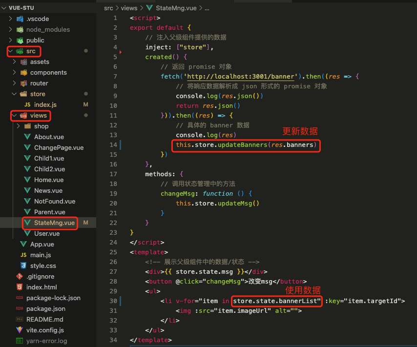

# 1. 024-状态管理

> 2023-01-16 周一

[视频：如何进行状态管理](https://www.bilibili.com/video/BV1QA4y1d7xf/?p=66&spm_id_from=pageDriver&vd_source=52532367532c4237b88b472159331d19)

## 1.1. vue3 中如何设置状态管理

> * 状态可以理解为数据、参数。
> * 状态管理本质就是对公共数据的集中管理，方便实现跨页面/组件的数据通信。

在普通小型项目可以使用 `provide/inject` 来实现状态管理；大型醒目中则可以使用 VueX 可用来对公共的状态（数据、参数）的集中管理，通常用于。

### 1.1.1. provide/inject 实现状态管理

基于前述章节的补充示例进行修改。

* 在 `src` 目录下新建 `store` 目录，然后新建 `index.js` 文件，在该文件存储公共的数据内容，方便进行集中管理。


```vue
// 该 index.js 文件用于对状态（变量、参数）进行集中管理

// 1、数据实现响应式（ref-字符串、数值；reactive-引用类型数据）
import { reactive } from "vue";

const store = {
    state: reactive({
        // 定义响应式状态（变量）
        msg: "你好，CnPeng!"
    }),

    // 定义更新状态的方法
    updateMsg: function () {
        this.state.msg = "Hello,CnPeng!"
    }
}

// 2、如何在 App.vue 组件中将数据通过 provide 提供出来
// 将包含状态（变量、参数）的 store 常量导出。
export default store

```

* 在 `src`-`views` 目录中新建 `StateMng.vue` 组件，并编辑其内容（注入将由父组件提供的数据，即 `src/store/index.js` 中定义的常量对象）


```vue
<script>
export default {
    // 注入父级组件提供的数据
    inject: ["store"],
    methods: {
        // 调用状态管理中的方法
        changeMsg: function () {
            this.store.updateMsg()
        }
    }
}
</script>
<template>
    <!-- 展示父级组件中的数据/状态 -->
    <div>{{ store.state.msg }}</div>
    <button @click="changeMsg">改变msg</button>
</template>

```

* 修改 `src`-`App.vue` 文件：导入并使用 `StateMng.vue` 组件；引入 `src`-`store`-`index.js` 中定义的变量和方法，并将其导出：


```vue
<script>
import StateMng from "./views/StateMng.vue"
import store from './store'
export default {
  provide: {
    // 将状态管理常量暴露出去
    store
  },
  // 注册组件
  components: {
    StateMng
  }
}

</script>

<template>
  <StateMng />
</template>
```

## 1.2. 使用 fetch 获取数据

>2023-01-16 周一

[视频：P67-使用 js 原生的 fetch 在组件中获取数据](https://www.bilibili.com/video/BV1QA4y1d7xf/?p=67&spm_id_from=pageDriver&vd_source=52532367532c4237b88b472159331d19)

fetch 是 JS 原生的一种 http 数据请求方式。

### 1.2.1. 使用 fetch 获取数据

基于前一小节的代码修改。

* 修改 `src`-`views`-`StateMng.vue` 中的代码：


```vue
<script>
export default {
    // 注入父级组件提供的数据
    inject: ["store"],
    data() {
        return {
            bannerList: []
        }
    },
    created() {
        // fetch 默认是 get 请求
        // 返回 promise 对象
        fetch('http://localhost:3001/banner').then((res => {
            // 将响应数据解析成 json 形式的 promise 对象
            console.log(res.json())
            return res.json()
        })).then((res) => {
            // 具体的 banner 数据
            console.log(res)
            this.bannerList = res.banners
        })
    },
    methods: {
        // 调用状态管理中的方法
        changeMsg: function () {
            this.store.updateMsg()
        }
    }
}
</script>
<template>
    <!-- 展示父级组件中的数据/状态 -->
    <div>{{ store.state.msg }}</div>
    <button @click="changeMsg">改变msg</button>
    <ul>
        <li v-for="item in bannerList" :key="item.targetId">
            
        </li>
    </ul>
</template>
```

banners 的数据结构如下：


### 1.2.2. 改为集中状态管理

如果有多个页面使用上面示例中的 banner 数据（含展示和修改）,我们就需要将其改为集中状态管理。

基于上一节中的代码进行修改：

* 在 `src`-`store`-`index.js` 文件中定义变量及其修改方法：


* 修改 `src`-`views`-`StateMng.vue` 中填充和使用 bannerList 的方法：



## 1.3. 使用 axios 获取数据

>2023-01-16 周一

[视频：p68](https://www.bilibili.com/video/BV1QA4y1d7xf/?p=68&spm_id_from=pageDriver&vd_source=52532367532c4237b88b472159331d19)

[Axios 是一个基于 promise 的 HTTP 库，可以用在浏览器和 node.js 中。](http://www.axios-js.com/zh-cn/docs/index.html)


### 1.3.1. 特性

* 从浏览器中创建 [XMLHttpRequests](https://developer.mozilla.org/en-US/docs/Web/API/XMLHttpRequest)
* 从 node.js 创建 [http](http://nodejs.org/api/http.html) 请求
* 支持 [Promise](https://developer.mozilla.org/en-US/docs/Web/JavaScript/Reference/Global_Objects/Promise) API
* 拦截请求和响应
* 转换请求数据和响应数据
* 取消请求
* 自动转换 JSON 数据
* 客户端支持防御 [XSRF](http://en.wikipedia.org/wiki/Cross-site_request_forgery)

### 1.3.2. 安装和运行

使用 npm 安装:

```bash
$ npm install axios
```

运行：

```bash
# 也可以使用 yarn run dev
$ npm run dev
```

安装成功之后，在 `package.json` 中可以看到对应的 axios 版本信息：


### 1.3.3. 案例

#### 1.3.3.1. 执行 GET 请求

```vue
// 为给定 ID 的 user 创建请求
axios.get('/user?ID=12345')
  .then(function (response) {
    console.log(response);
  })
  .catch(function (error) {
    console.log(error);
  });

// 上面的请求也可以这样做
axios.get('/user', {
    params: {
      ID: 12345
    }
  })
  .then(function (response) {
    console.log(response);
  })
  .catch(function (error) {
    console.log(error);
  });
```


#### 1.3.3.2. 执行 POST 请求

```vue
axios.post('/user', {
    firstName: 'Fred',
    lastName: 'Flintstone'
  })
  .then(function (response) {
    console.log(response);
  })
  .catch(function (error) {
    console.log(error);
  });
```

#### 1.3.3.3. 执行多个并发请求

```vue
function getUserAccount() {
  return axios.get('/user/12345');
}

function getUserPermissions() {
  return axios.get('/user/12345/permissions');
}

axios.all([getUserAccount(), getUserPermissions()])
  .then(axios.spread(function (acct, perms) {
    // 两个请求现在都执行完成
  }));
```

> [点击查看更多 axios 文档内容](http://www.axios-js.com/zh-cn/docs/index.html#axios-patch-url-data-config)

## 1.4. Vite 通过 proxy 解决跨域问题

在 A 域名的页面中，请求 B 域名的数据接口，就会触发跨域问题。

CORS（同源策略），是浏览器的一种保护机制，即页面的域名和页面内的请求地址域名必须一致，不一致就会触发跨域问题。

想要实现跨域请求就需要配置 proxy. （A 域名下的页面发送请求到 proxy , proxy 再将请求中转到 B 域名下的服务器）


如上图，我们在自己的本地页面中使用 axios 直接请求猫眼电影的地址时，浏览器中就会爆出上面的跨域问题。

为了解决这个问题，我们就需要配置 proxy:

* 在项目根目录的 `vite.config.js` 中配置代理信息：


```vue
import { defineConfig } from 'vite'
import vue from '@vitejs/plugin-vue'

// https://vitejs.dev/config/
export default defineConfig({
  plugins: [vue()],
  server: {
    // 配置代理（中转服务器, 解决跨域访问
    proxy: {
      // 代理标识，
      '/proxypath': {
        // 被代理的地址
        target: 'https://i.maoyan.com',
        // 表示开启代理，允许跨域请求数据
        changeOrigin: true,
        // 此处的 reqPath 代表 axios 中请求的地址
        // 这句的意思是将 reqPath 中的代理标识替换为空格
        rewrite:reqPath=>reqPath.replace(/^\/proxypath/,'')
      }
    }
  }
})
```

* 使用代理地址实现请求


```vue
<script>
import axios from "axios"
export default {
    // 注入父级组件提供的数据
    inject: ["store"],
    created() {
        // axios：直接请求猫眼会触发跨域，请求失败
        // axios.get('https://i.maoyan.com/api/mmdb/movie/v3/list/hot.json?ct=%E9%95%BF%E6%B2%99&ci=70&channerID=4').then((res => {
        // axios：使用代理解决跨域。此处的 /proxypath 是在根目录的 vite.config.js 中配置的。
        axios.get('/proxypath/api/mmdb/movie/v3/list/hot.json?ct=%E9%95%BF%E6%B2%99&ci=70&channerID=4').then((res => {
            console.log(res);
        }))

        // axios：使用 axios 实现网络请求   
        // axios.get('http://localhost:3001/banner').then((res => {
        //     console.log(res);
        //     console.log(res.json())
        // }))

        // // 返回 promise 对象
        // fetch('http://localhost:3001/banner').then((res => {
        //     // 将响应数据解析成 json 形式的 promise 对象
        //     console.log(res.json())
        //     return res.json()
        // })).then((res) => {
        //     // 具体的 banner 数据
        //     console.log(res)
        //     this.store.updateBanners(res.banners)
        // })
    },
    methods: {
        // 调用状态管理中的方法
        changeMsg: function () {
            this.store.updateMsg()
        }
    }
}
</script>
<template>
    <!-- 展示父级组件中的数据/状态 -->
    <div>{{ store.state.msg }}</div>
    <button @click="changeMsg">改变msg</button>
    <ul>
        <li v-for="item in store.state.bannerList" :key="item.targetId">
            
        </li>
    </ul>
</template>
```

运行结果（可以正常获取到猫眼电影的数据信息）：


