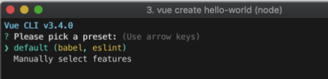
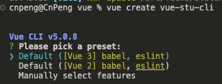
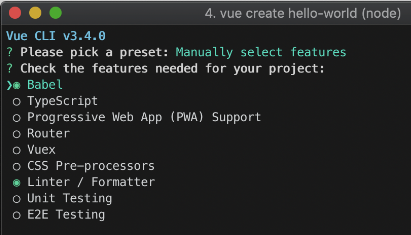
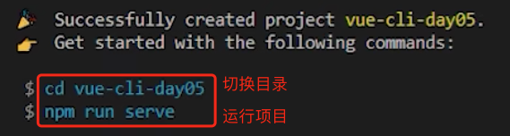
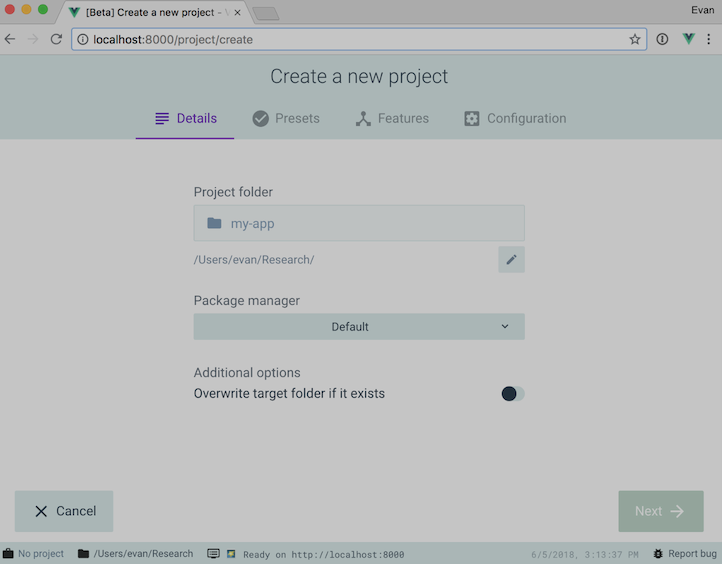

# 1. 025-VueCli

> 2023-01-17 周二，Vue Cli 官网提示当前已处于维护状态，推荐使用 [create-vue](https://github.com/vuejs/create-vue) 来创建项目。

[官网地址](https://cli.vuejs.org)

[文档地址](https://cli.vuejs.org/zh/guide/)

Vue CLI 是一个基于 Vue.js 进行快速开发的完整系统。

## 1.1. 安装和升级

### 1.1.1. 安装

#### 1.1.1.1. 官方安装说明

>Node 版本要求
>Vue CLI 4.x 需要 [https://nodejs.org/](Node.js) v8.9 或更高版本 (推荐 v10 以上)。你可以使用 [n](https://github.com/tj/n)，[nvm](https://github.com/creationix/nvm) 或 [nvm-windows](https://github.com/coreybutler/nvm-windows) 在同一台电脑中管理多个 Node 版本。

可以使用下列任一命令安装这个新的包：

```bash
npm install -g @vue/cli

# 2. OR
yarn global add @vue/cli
```

安装之后，你就可以在命令行中访问 `vue` 命令。你可以通过简单运行 `vue`，看看是否展示出了一份所有可用命令的帮助信息，来验证它是否安装成功。

你还可以用这个命令来检查其版本是否正确：

```bash
vue --version
```

>CnPeng: 
>
>* Mac 电脑下使用 yarn 安装后，`vue --version` 校验是否安装成功时，提示 `vue` 不是内部或外部命令。
>* Mac 电脑下使用 npm 安装时，需要在 npm 命令前添加 `sudo` 命令， 不然会提示无权限创建目录。

#### 1.1.1.2. 其他安装说明

[原文链接](https://blog.csdn.net/weixin_50889870/article/details/117465605)

安装最新版本：

```bash
npm install -g @vue/cli

# 或者
yarn global add @vue/cli
```

卸载指令：

```bash
# 卸载3.0之前的版本
npm uninstall -g vue-cli
yarn global remove vue-cli

# 卸载3.0之后的版本（可以统一使用此指令卸载）
npm uninstall -g @vue/cli
yarn global remove @vue/cli
```

查看当前版本号：

```bash
vue -V
# 或
vue --version
```

查看帮助信息：

```bash
vue -h 

# 或
vue --help
```

查看所有版本号：

```bash
# 查询3.0之前的版本
npm view vue-cli versions --json
# 查询3.0之后的版本
npm view @vue/cli versions --json
```

安装指定版本：

```bash
# 安装4.0.5版本
npm install -g @vue/cli@4.0.5
yarn global add @vue/cli@4.0.5
```

### 1.1.2. 升级

如需升级全局的 Vue CLI 包，请运行：

```bash
npm update -g @vue/cli

# 2. 或者
yarn global upgrade --latest @vue/cli
```

### 1.1.3. 项目依赖

上面列出来的命令是用于升级全局的 Vue CLI。如需升级项目中的 Vue CLI 相关模块（以 `@vue/cli-plugin-` 或 `vue-cli-plugin-` 开头），请在项目目录下运行 `vue upgrade`：

```bash
用法： upgrade [options] [plugin-name]

（试用）升级 Vue CLI 服务及插件

选项：
  -t, --to <version>    升级 <plugin-name> 到指定的版本
  -f, --from <version>  跳过本地版本检测，默认插件是从此处指定的版本升级上来
  -r, --registry <url>  使用指定的 registry 地址安装依赖
  --all                 升级所有的插件
  --next                检查插件新版本时，包括 alpha/beta/rc 版本在内
  -h, --help            输出帮助内容
```

## 1.2. 创建项目

[文档地址](https://cli.vuejs.org/zh/guide/creating-a-project.html)

### 1.2.1. vue create

运行以下命令来创建一个新项目：

```bash
vue create hello-world
```

界面中会提示选取一个 preset。可以选默认的包含了基本的 Babel + ESLint 设置的 preset，也可以选“手动选择特性”来选取需要的特性。



> 2023-01-17 输入 create 命令后会看到如下的界面：
>


这个默认的设置非常适合快速创建一个新项目的原型，而**手动设置（点击空格键可以选中或取消选中）**则提供了更多的选项，它们是面向生产的项目更加需要的，如下图：





>CnPeng : 如果使用 yarn ，在运行项目时直接使用 `yarn serve` 即可。

如果你决定手动选择特性，在操作提示的最后你可以选择将已选项保存为一个将来可复用的 preset。我们会在下一个章节讨论 preset 和插件。

>~/.vuerc
>
>被保存的 preset 将会存在用户的 home 目录下一个名为 `.vuerc` 的 JSON 文件里。如果你想要修改被保存的 preset / 选项，可以编辑这个文件。
>
>在项目创建的过程中，你也会被提示选择喜欢的包管理器或使用[淘宝 npm 镜像源](https://npmmirror.com/)以更快地安装依赖。这些选择也将会存入 `~/.vuerc`。

`vue create` 命令有一些可选项，你可以通过运行以下命令进行探索：

```bash
vue create --help
```

```bash
用法：create [options] <app-name>

创建一个由 `vue-cli-service` 提供支持的新项目


选项：

  -p, --preset <presetName>       忽略提示符并使用已保存的或远程的预设选项
  -d, --default                   忽略提示符并使用默认预设选项
  -i, --inlinePreset <json>       忽略提示符并使用内联的 JSON 字符串预设选项
  -m, --packageManager <command>  在安装依赖时使用指定的 npm 客户端
  -r, --registry <url>            在安装依赖时使用指定的 npm registry
  -g, --git [message]             强制 / 跳过 git 初始化，并可选的指定初始化提交信息
  -n, --no-git                    跳过 git 初始化
  -f, --force                     覆写目标目录可能存在的配置
  -c, --clone                     使用 git clone 获取远程预设选项
  -x, --proxy                     使用指定的代理创建项目
  -b, --bare                      创建项目时省略默认组件中的新手指导信息
  -h, --help                      输出使用帮助信息
```

### 1.2.2. 使用图形化界面

你也可以通过 `vue ui` 命令以图形化界面创建和管理项目：

```bash
vue ui
```

上述命令会打开一个浏览器窗口，并以图形化界面将你引导至项目创建的流程。




### 1.2.3. 拉取 2.x 模板 (旧版本)

Vue CLI >= 3 和旧版使用了相同的 `vue` 命令，所以 Vue CLI 2 (`vue-cli`) 被覆盖了。如果你仍然需要使用旧版本的 `vue init` 功能，你可以全局安装一个桥接工具：

```bash
npm install -g @vue/cli-init
# 2. `vue init` 的运行效果将会跟 `vue-cli@2.x` 相同
vue init webpack my-project
```

### 1.2.4. 补充

Vue-cli 模式创建的项目会自动创建 views、router 等目录，但创建速度略慢。

使用 Vite 模式创建的项目需要手动创建 views、router 等目录。


