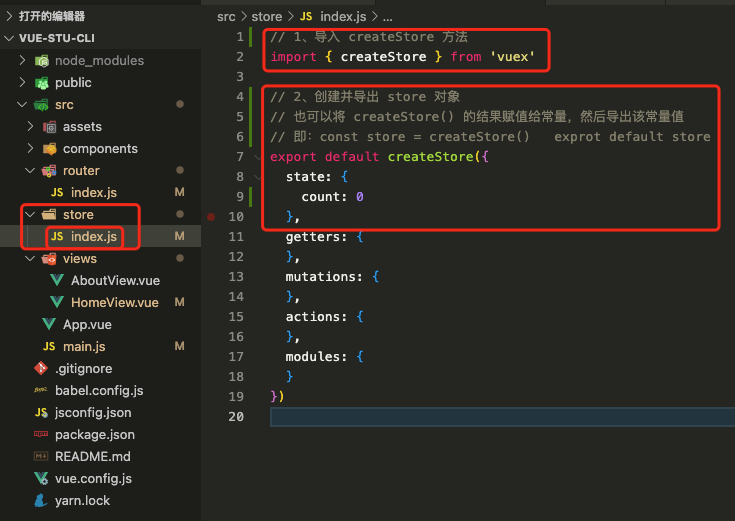
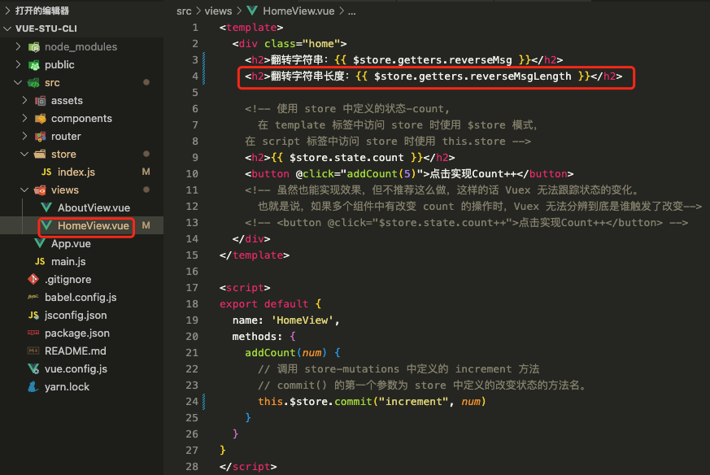

# 1. 026-VueX

> 2023-01-17 周二

[文档地址](https://vuex.vuejs.org/zh/)

Vuex 是一个专为 Vue.js 应用程序开发的状态管理模式 + 库。它采用集中式存储管理应用的所有组件的状态，并以相应的规则保证状态以一种可预测的方式发生变化。


上图摘自：[Scrimba 上的 Vuex 课程](https://scrimba.com/g/gvuex)

Vuex 主要应用于大型页面应用，小型应用可以直接使用 [store模式（状态管理）](https://cn.vuejs.org/guide/scaling-up/state-management.html)。

## 1.1. 安装和介绍

### 1.1.1. 安装

```bash
# 使用 npm
npm install vuex@next --save

# 或使用 Yarn
yarn add vuex@next --save
```

除上述两种方式外，还可以[直接下载或自己构建](https://vuex.vuejs.org/zh/installation.html)。

### 1.1.2. 最简单的 Store

Vuex 应用的核心就是 store（仓库）。“store”基本上就是一个容器，它包含着你的应用中大部分的**状态 (state，即驱动应用的数据源)**。

Vuex 和单纯的全局对象有以下两点不同：

* Vuex 的**状态存储是响应式的**。当 Vue 组件从 store 中读取状态的时候，若 store 中的状态发生变化，那么相应的组件也会相应地得到高效更新。
* 不能直接改变 store 中的状态。**改变 store 中的状态的唯一途径就是显式地提交 (commit) mutation**。这样使得我们可以方便地跟踪每一个状态的变化，从而让我们能够实现一些工具帮助我们更好地了解我们的应用。


>提示
>我们将在后续的文档示例代码中使用 ES2015 语法。如果你还没能掌握 [ES2015](https://babeljs.io/docs/learn-es2015/)，你得抓紧了！

安装 Vuex 之后，让我们来创建一个 store。创建过程直截了当——仅需要提供一个初始 state 对象和一些 mutation：

```vue
# main.js 不推荐在 main.js 中写过多的内容

import { createApp } from 'vue'
import { createStore } from 'vuex'

// 创建一个新的 store 实例
const store = createStore({
  state () {
    return {
      count: 0
    }
  },
  mutations: {
    increment (state) {
      state.count++
    }
  }
})

const app = createApp({ /* 根组件 */ })

// 将 store 实例作为插件安装
app.use(store)
```

现在，你可以**通过 `store.state` 来获取状态对象**，并**通过 `store.commit` 方法触发状态变更**：

```vue
store.commit('increment')

console.log(store.state.count) // -> 1
```

在 Vue 组件中， 可以通过 `this.$store` 访问 store 实例。现在我们可以从组件的方法提交一个变更：

```vue
methods: {
  increment() {
    this.$store.commit('increment')
    console.log(this.$store.state.count)
  }
}
```

再次强调，我们通过提交 `mutation` 的方式，而非直接改变 `store.state.count`，是因为我们想要更明确地追踪到状态的变化。这个简单的约定能够让你的意图更加明显，这样你在阅读代码的时候能更容易地解读应用内部的状态改变。此外，这样也让我们有机会去实现一些能记录每次状态改变，保存状态快照的调试工具。有了它，我们甚至可以实现如时间穿梭般的调试体验。

由于 store 中的状态是响应式的，在组件中调用 store 中的状态简单到仅需要在计算属性中返回即可。触发变化也仅仅是在组件的 methods 中提交 mutation。

接下来，我们将会更深入地探讨一些核心概念。让我们先从 [State](https://vuex.vuejs.org/zh/guide/state.html) 概念开始。


#### 1.1.2.1. 补充示例

>上面的官方示例中，将 `createStore()` 放在了 `main.js` 中，实际编码时不推荐在 main.js 中编写过多的逻辑。

##### 1.1.2.1.1. 准备

先基于 `vue-cli` 创建一个新项目：`sudo npm install -g @vue/cli`, 新建时可以选择是否安装 Vuex 和 router（建议选中）。

然后安装 Vuex：`yarn add vuex@next --save`(如果新建项目时勾选了 Vuex, 此处可以跳过)

在 `src` 目录下新建 `router` 目录，并在其中创建 `index.js` 文件(如果新建项目时勾选了 Vuex, 此处可以跳过)

在 `src` 目录下新建 `store` 目录，并在其中创建 `index.js` 文件。

##### 1.1.2.1.2. 使用 store 中的状态

* 编辑 `src`-`store`-`index.js` 中的内容：



* 挂载 store 对象


* 使用 store 对象暴露出来的状态


* 完善 `src`-`router`-`index.js` 中的内容：


运行效果（可以正常展示 `src/store/index.js` 中定义的 `count`）：


##### 1.1.2.1.3. 改变 store 中的状态

* 在 `src`-`store`-`index.js` 中定义修改状态的方法


* 在 `src`-`views`-`HomeView.vue` 中调用改变状态的方法：


##### 1.1.2.1.4. 改变 store 中的状态时进行传参

* 修改 `src`-`view`-`HomeView.vue`:


* 修改 `src`-`store`-`index.js`:


## 1.2. 核心概念

### 1.2.1. state

[文档地址](https://vuex.vuejs.org/zh/guide/state.html)

#### 1.2.1.1. 单一状态树

Vuex 使用**单一状态树**——是的，**用一个对象就包含了全部的应用层级状态**。至此它便作为一个“[唯一数据源 (SSOT)](https://en.wikipedia.org/wiki/Single_source_of_truth)”而存在。这也意味着，**每个应用将仅仅包含一个 store 实例**。单一状态树让我们能够直接地定位任一特定的状态片段，在调试的过程中也能轻易地取得整个当前应用状态的快照。

单状态树和模块化并不冲突——在后面的章节里我们会讨论如何将状态和状态变更事件分布到各个子模块中。

存储在 Vuex 中的数据和 Vue 实例中的 `data` 遵循相同的规则，例如状态对象必须是纯粹 (plain) 的。参考：[Vue#data](https://v3.cn.vuejs.org/api/options-data.html#data-2)。

#### 1.2.1.2. 在 Vue 组件中获得 Vuex 状态

那么我们如何在 Vue 组件中展示状态呢？由于 **Vuex 的状态存储是响应式的**，从 store 实例中读取状态最简单的方法就是在[计算属性](https://cn.vuejs.org/guide/computed.html)中返回某个状态：

```js
// 创建一个 Counter 组件.
const Counter = {
  template: `<div>{{ count }}</div>`,
  computed: {
    // 基础版
    count () {
      return store.state.count
    }
  }
}
```

每当 `store.state.count` 变化的时候, 都会重新求取计算属性，并且触发更新相关联的 DOM。

然而，这种模式导致组件依赖全局状态单例。在模块化的构建系统中，在每个需要使用 state 的组件中需要频繁地导入，并且在测试组件时需要模拟状态。

Vuex 通过 Vue 的插件系统将 store 实例从根组件中“注入”到所有的子组件里。且子组件能通过 `this.$store` 访问到。让我们更新下 Counter 的实现：

```js
const Counter = {
  template: `<div>{{ count }}</div>`,
  computed: {
    count () {
      // 改进版
      return this.$store.state.count
    }
  }
}
```

#### 1.2.1.3. mapState 辅助函数

当一个组件需要获取多个状态的时候，将这些状态都声明为计算属性会有些重复和冗余。

为了解决这个问题，我们可以**使用 `mapState` 辅助函数帮助我们生成计算属性**，让你少按几次键：

```js
// 在单独构建的版本中辅助函数为 Vuex.mapState
import { mapState } from 'vuex'

export default {
  // ...
  computed: mapState({
    // 箭头函数可使代码更简练
    count: state => state.count,

    // 传字符串参数 'count' 等同于 `state => state.count`
    countAlias: 'count',

    // 为了能够使用 `this` 获取局部状态，必须使用常规函数
    countPlusLocalState (state) {
      return state.count + this.localCount
    }
  })
}
```

当映射的计算属性的名称与 state 的子节点名称相同时，我们也可以给 `mapState` 传一个字符串数组。

```js
computed: mapState([
  // 映射 this.count 为 store.state.count
  'count'
])
```

> 相关内容还可以参考后面的 `mapMutations` 、 `mapGetters`、`mapActions`

##### 1.2.1.3.1. 补充示例

辅助函数用于映射状态中的数据和方法，从而简化组件访问状态中内容时的逻辑。

在 `src/store/index.js` 的 `state` 中定义状态：


* `src/store/index.js`

```js
// 1、导入 createStore 方法
import { createStore } from 'vuex'
import moduleA from './moduleA'

// 2、创建并导出 store 对象
// 也可以将 createStore() 的结果赋值给常量，然后导出该常量值
// 即：const store = createStore()   exprot default store
export default createStore({
  state() {
    // 存储基本数据
    return {
      count: 0,
      msg: "helloworld",
      hotList: []
    }
  },
  getters: {},
  mutations: { // 通过 store.commit 触发函数，mutations 是同步操作
    increment(state, value) {
      state.count += value
    }
  },
  actions: {},
  modules: {
    a: moduleA
  }
})


```

修改 `src/views/HomeView.vue` 中的内容：


* `src/views/HomeView.vue`

```vue
<template>
  <div class="home">
    <!-- 基础访问方式： -->
    <h2>基础访问方式:{{ $store.state.count }}</h2>
    <!-- 使用 mapstate 辅助函数的访问方式 -->
    <h2>store 中的 count:{{ count2 }}</h2>

    <button @click="changeCount(5)">点击改变store中的count</button>
  </div>
</template>

<script>
import { mapState } from "vuex";
export default {
  // computed: mapState({
  //   // 方式1：
  //   count1: state => state.count,
  //   // 方式2: 冒号后面引号中的内容必须是 store-state 中声明的属性名成
  //   count2: "count",
  // }),

  // 下面这种方式等价于：computed: mapState({count:"count"}) 和 computed: mapState({count:state => state.count})
  computed: mapState([
    // 方式3：计算属性的名称与 store/state 中状态的名称相同时,可以直接声明为字符串数组。
    "count",
  ]),

  // 生命周期-页面挂载
  mounted() {
    // 查看 store 信息
    console.log(this.$store);
  },
  methods: {
    changeCount(num) {
      // 调用 store-mutations 中的 increment 方法
      this.$store.commit("increment", num)
    }
  }
}
</script>
```

#### 1.2.1.4. 对象展开运算符

我们在组件中通过 `computed:mapState()` 引入 `store/state` 中的状态后，由于仅能声明一次 `computed`，所以当组件本身又有计算属性时，我们就不能再写一个 `computed` 语句。此时，我们就需要使用对象展开运算符。

`mapState` 函数返回的是一个对象。我们如何将它与局部计算属性混合使用呢？通常，我们需要使用一个工具函数将多个对象合并为一个，以使我们可以将最终对象传给 `computed` 属性。但是自从有了[对象展开运算符](https://github.com/tc39/proposal-object-rest-spread)，我们可以极大地简化写法：

```vue
computed: {
  localComputed () { /* ... */ },
  // 使用对象展开运算符将此对象混入到外部对象中
  ...mapState({
    // ...
  })
}
```

##### 1.2.1.4.1. 补充示例

基于前一小节示例修改：

下面的示例中，在展开 `store/state` 中状态的同时，还声明了属于当前组件自身的计算属性。


```vue
<template>
  <div class="home">
    <h2>组件本身的 num :{{ num }}</h2>
    <h2>组件本身的计算属性：{{ addNum }}</h2>

    <!-- 使用 mapstate 辅助函数的访问方式 -->
    <h2>store 中的 msg:{{ msg }}</h2>
    <h2>store 中的 count:{{ count }}</h2>
    <button @click="changeCount(5)">点击改变store中的count</button>
  </div>
</template>

<script>
import { mapState } from "vuex";
export default {
  data() {
    return {
      num: 10
    }
  },

  computed: {
    // 这是当前组件自身的计算属性
    addNum() {
      return this.num * 10
    },
    // ...maoState 为对象展开运算符，将 store/state 中的 count 和 msg 展开，供当前组件使用
    ...mapState(["count", "msg"])
  },

  // 生命周期-页面挂载
  mounted() {
    // 查看 store 信息
    console.log(this.$store);
    // 因为上面已经使用 computed 和 ...mapState 进行了展开，所以可以直接访问.注意加上 this. 前缀
    console.log("打印 store/state 中的 count:", this.count);
    console.log("打印 store/state 中的 msg:", this.msg);
  },
  methods: {
    changeCount(num) {
      // 调用 store-mutations 中的 increment 方法
      this.$store.commit("increment", num)
    }
  }
}
</script>
```

#### 1.2.1.5. 组件仍然保有局部状态

使用 Vuex 并不意味着你需要将所有的状态放入 Vuex。

虽然将所有的状态放到 Vuex 会使状态变化更显式和易调试，但也会使代码变得冗长和不直观。**如果有些状态严格属于单个组件，最好还是作为组件的局部状态**。

你应该根据你的应用开发需要进行权衡和确定。

### 1.2.2. getters

[文档地址](https://vuex.vuejs.org/zh/guide/getters.html)

有时候我们需要从 store 中的 state 中派生出一些状态，例如对列表**进行过滤**并计数：

```vue
computed: {
  doneTodosCount () {
    return this.$store.state.todos.filter(todo => todo.done).length
  }
}
```

如果有多个组件需要用到此属性，我们要么复制这个函数，或者抽取到一个共享函数然后在多处导入它——无论哪种方式都不是很理想。

Vuex 允许我们在 store 中定义“getter”（**可以认为是 store 的计算属性**）。

>注意
>**从 Vue 3.0 开始，getter 的结果不再像计算属性一样会被缓存起来**。这是一个已知的问题，将会在 3.1 版本中修复。详情请看[PR #1878](https://github.com/vuejs/vuex/pull/1883)。

Getter 接受 state 作为其第一个参数：

```js
const store = createStore({
  state: {
    todos: [
      { id: 1, text: '...', done: true },
      { id: 2, text: '...', done: false }
    ]
  },
  getters: {
    doneTodos (state) {
      return state.todos.filter(todo => todo.done)
    }
  }
})
```

#### 1.2.2.1. 通过属性访问

Getter 会暴露为 `store.getters` 对象，你可以以属性的形式访问这些值：

```vue
store.getters.doneTodos // -> [{ id: 1, text: '...', done: true }]
```

Getter 也可以接受其他 getter 作为第二个参数，这样就可以在方法中使用其他方法的结果：

```js
getters: {
  // 将 getters 作为第二的参数，就可以获取到 getters 中 doneTodos() 的结果并使用
  doneTodosCount (state, getters) {
    return getters.doneTodos.length
  }
}
```

```vue
store.getters.doneTodosCount // -> 1
```

我们可以很容易地在任何组件中使用它：

```vue
computed: {
  doneTodosCount () {
    return this.$store.getters.doneTodosCount
  }
}
```

注意，**getter 在通过属性访问时是作为 Vue 的响应式系统的一部分缓存其中的。**

##### 1.2.2.1.1. 补充示例1

* 在 `src`-`store`-`index.js` 中定义 getters 对象：


* 在 `src`-`views`-`HomeView.vue` 中使用 getters 中的方法：


##### 1.2.2.1.2. 补充示例2

* 修改 `src`-`router`-`index.js` , 将 getters 做为第二个参数：


* 使用 getters 中的方法：



#### 1.2.2.2. 通过方法访问

你也可以通过让 getter **返回一个函数**，来实现给 getter 传参。在你对 store 里的数组进行查询时非常有用。

```vue
getters: {
  // ...
  getTodoById: (state) => (id) => {
    return state.todos.find(todo => todo.id === id)
  }
}
```

```vue
store.getters.getTodoById(2) // -> { id: 2, text: '...', done: false }
```

注意，**getter 在通过方法访问时，每次都会去进行调用，而不会缓存结果**。

#### 1.2.2.3. mapGetters 辅助函数

`mapGetters` 辅助函数仅仅是**将 store 中的 getter 映射到局部计算属性**：

```vue
// 在 vue 组件内的 `<script>` 节点中书写下面的代码内容
import { mapGetters } from 'vuex'

export default {
  // ...
  computed: {
    // 使用对象展开运算符将 getter 混入 computed 对象中
    ...mapGetters([
      'doneTodosCount',
      'anotherGetter',
      // ...
    ])
  }
}
```

如果你想将一个 getter 属性另取一个名字，使用对象形式：

```vue
...mapGetters({
  // 把 `this.doneCount` 映射为 `this.$store.getters.doneTodosCount`
  doneCount: 'doneTodosCount'
})
```

通过上面的方式完成映射之后，可以直接在 vue 组件的 `<template>` 中直接进行使用：

```vue
<template>
  <div class="home">
    <h2>{{ doneTodosCount }}</h2>
    <h2>{{ anotherGetter }}</h2>
  </div>
</template>
```

### 1.2.3. mutations

[文档地址](https://vuex.vuejs.org/zh/guide/mutations.html)

>CnPeng: `mutaions` 对象用于定义改变状态的方法，供组件通过 `this.$store.commit("方法名")` 进行调用

**更改 Vuex 的 store 中的状态的唯一方法是提交 mutation**。

Vuex 中的 mutation 非常类似于事件：**每个 mutation 都有一个字符串的事件类型 (type)和一个回调函数 (handler)**。这个回调函数就是我们实际进行状态更改的地方，并且它会接受 state 作为第一个参数：

```vue
const store = createStore({
  state: {
    count: 1
  },
  mutations: {
    // 该 increment 名称是自定义的
    // 它包含了一个字符串的事件类型（就是 increment 本身）和一个回调函数。
    increment (state) {
      // 变更状态
      state.count++
    }
  }
})
```

你不能直接调用一个 mutation 处理函数。这个选项更像是事件注册：“当触发一个类型为 `increment` 的 mutation 时，调用此函数。”要唤醒一个 mutation 处理函数，你需要以相应的 type 调用 store.commit 方法：

```vue
store.commit('increment')

```
#### 1.2.3.1. 提交载荷（Payload）

你可以向 `store.commit` 传入额外的参数，即 mutation 的载荷（payload）：

```vue
// ...
mutations: {
  // 这里的 n 就是额外的参数
  increment (state, n) {
    state.count += n
  }
}
```

```vue
store.commit('increment', 10)
```

在大多数情况下，**载荷应该是一个对象，这样可以包含多个字段并且记录的 mutation 会更易读**：

```vue
// ...
mutations: {
  increment (state, payload) {
    state.count += payload.amount
  }
}
```

```vue
store.commit('increment', {
  amount: 10
})
```

#### 1.2.3.2. 对象风格的提交方式

提交 mutation 的另一种方式是直接使用包含 `type` 属性的对象：

```vue
store.commit({
  type: 'increment',
  amount: 10
})
```

当使用对象风格的提交方式，整个对象都作为载荷传给 mutation 函数，因此处理函数保持不变：

```vue
mutations: {
  increment (state, payload) {
    state.count += payload.amount
  }
}
```

#### 1.2.3.3. 使用常量替代 Mutation 事件类型

使用常量替代 mutation 事件类型在各种 Flux 实现中是很常见的模式。

这样可以使 linter 之类的工具发挥作用，同时把这些常量放在单独的文件中可以让你的代码合作者对整个 app 包含的 mutation 一目了然：

```vue
// mutation-types.js
export const SOME_MUTATION = 'SOME_MUTATION'
```

```vue
// store.js
import { createStore } from 'vuex'
import { SOME_MUTATION } from './mutation-types'

const store = createStore({
  state: { ... },
  mutations: {
    // 我们可以使用 ES2015 风格的计算属性命名功能
    // 来使用一个常量作为函数名
    [SOME_MUTATION] (state) {
      // 修改 state
    }
  }
})
```

用不用常量取决于你——在需要多人协作的大型项目中，这会很有帮助。但如果你不喜欢，你完全可以不这样做。

#### 1.2.3.4. Mutation 必须是同步函数

一条重要的原则就是要记住 **mutation 必须是同步函数**。为什么？请参考下面的例子：

```vue
mutations: {
  someMutation (state) {
    //❌ 错误示例，mutations 中不能使用异步函数，必须是同步的
    api.callAsyncMethod(() => {
      state.count++
    })
  }
}
```

现在想象，我们正在 debug 一个 app 并且观察 devtool 中的 mutation 日志。每一条 mutation 被记录，devtools 都需要捕捉到前一状态和后一状态的快照。然而，在上面的例子中 mutation 中的异步函数中的回调让这不可能完成：因为当 mutation 触发的时候，回调函数还没有被调用，devtools 不知道什么时候回调函数实际上被调用——实质上任何在回调函数中进行的状态的改变都是不可追踪的。

#### 1.2.3.5. 在组件中提交 Mutation

你可以在组件中使用 `this.$store.commit('xxx')` 提交 mutation，或者使用 `mapMutations` 辅助函数将组件中的 methods 映射为 `store.commit` 调用（需要在根节点注入 `store`）。

```js
// 下面的内容写在 vue 组件的 <script> 节点中
import { mapMutations } from 'vuex'

export default {
  // ...
  methods: {
    ...mapMutations([
      'increment', // 将 `this.increment()` 映射为 `this.$store.commit('increment')`

      // `mapMutations` 也支持载荷：
      'incrementBy' // 将 `this.incrementBy(amount)` 映射为 `this.$store.commit('incrementBy', amount)`
    ]),
    ...mapMutations({
      add: 'increment' // 将 `this.add()` 映射为 `this.$store.commit('increment')`
    }),

    // 访问映射出来的方法1
    addCount1(){
        this.increment();
    },
     // 访问映射出来的方法2
    addCount2(num){
        this.incrementBy(num);
    }
    // 访问映射出来的方法2
    addCount3(){
        this.add();
    }
  }
}
```

#### 1.2.3.6. 下一步：Action

在 mutation 中混合异步调用会导致你的程序很难调试。例如，当你调用了两个包含异步回调的 mutation 来改变状态，你怎么知道什么时候回调和哪个先回调呢？这就是为什么我们要区分这两个概念。**在 Vuex 中，mutation 都是同步事务**：

```vue
store.commit('increment')
// 任何由 "increment" 导致的状态变更都应该在此刻完成。
```

为了处理异步操作，让我们来看一看 [Action](https://vuex.vuejs.org/zh/guide/actions.html)。

### 1.2.4. actions

[文档地址](https://vuex.vuejs.org/zh/guide/actions.html)

Action 类似于 mutation，不同在于：

* Action 提交的是 mutation，而不是直接变更状态。
* **Action 可以包含任意异步操作**。

让我们来注册一个简单的 action：

```vue
const store = createStore({
  state: {
    count: 0
  },
  mutations: {
    increment (state) {
      state.count++
    }
  },
  actions: {
    increment (context) {
      context.commit('increment')
    }
  }
})
```

Action 函数接受一个与 store 实例具有相同方法和属性的 context 对象，因此你可以调用 `context.commit` 提交一个 mutation，或者通过 `context.state` 和 `context.getters` 来获取 state 和 getters。当我们在之后介绍到 [Modules](https://vuex.vuejs.org/zh/guide/modules.html) 时，你就知道 context 对象为什么不是 store 实例本身了。

实践中，我们会经常用到 [ES2015](https://github.com/lukehoban/es6features#destructuring) 的参数解构来简化代码（特别是我们需要调用 `commit` 很多次的时候）：

```vue
actions: {
  increment ({ commit }) {
    commit('increment')
  }
}
```

#### 1.2.4.1. 分发 Action

Action 通过 `store.dispatch` 方法触发：

```vue
store.dispatch('increment')
```

乍看上去感觉多此一举，我们直接分发 mutation 岂不更方便？实际上并非如此，还记得 **mutation 必须同步执行**这个限制么？Action 就不受约束！**我们可以在 action 内部执行异步操作：**

```vue
actions: {
  incrementAsync ({ commit }) {
    setTimeout(() => {
      commit('increment')
    }, 1000)
  }
}
```

Actions 支持同样的载荷方式和对象方式进行分发：

```vue
// 以载荷形式分发
store.dispatch('incrementAsync', {
  amount: 10
})

// 以对象形式分发
store.dispatch({
  type: 'incrementAsync',
  amount: 10
})
```

来看一个更加实际的购物车示例，涉及到**调用异步 API 和分发多重 mutation**：

```js
actions: {
  checkout ({ commit, state }, products) {
    // 把当前购物车的物品备份起来
    const savedCartItems = [...state.cart.added]
    // 发出结账请求
    // 然后乐观地清空购物车
    commit(types.CHECKOUT_REQUEST)
    // 购物 API 接受一个成功回调和一个失败回调
    shop.buyProducts(
      products,
      // 成功操作
      () => commit(types.CHECKOUT_SUCCESS),
      // 失败操作
      () => commit(types.CHECKOUT_FAILURE, savedCartItems)
    )
  }
}
```

注意我们正在进行一系列的异步操作，并且通过提交 mutation 来记录 action 产生的副作用（即状态变更）。


##### 1.2.4.1.1. 补充示例1：有跨域问题

* 在 `src`-`store`-`index.js` 的 `actions` 节点中使用 `fetch` 请求猫眼电影的路由：


* 在 `src`-`views`-`HomeView.vue` 中调用上面定义的方法（使用 `this.$store.dispatch("方法名")` 的方式）：


##### 1.2.4.1.2. 补充示例2：解决跨域问题

[视频：p71](https://www.bilibili.com/video/BV1QA4y1d7xf/?p=76&spm_id_from=pageDriver&vd_source=52532367532c4237b88b472159331d19)

* 在根目录下的 `vue.config.js` 中配置代理信息：


```vue
const { defineConfig } = require('@vue/cli-service')
module.exports = defineConfig({
  transpileDependencies: true,
  devServer:{
    proxy:{
      // 通过代理实现跨域
      // 代理标识，
      '/proxypath': {
        // 被代理的地址
        target: 'https://i.maoyan.com',
        // 表示开启代理，允许跨域请求数据
        changeOrigin: true,
        // 基于 vue-cli 创建的项目中，使用这种替代代理表示的方式。
        pathRewrite:{
            "^/proxypath":""
        }

        // 基于 vite 创建的项目中，使用这种替代代理表示的方式。
        // // 此处的 reqPath 代表 axios 中请求的地址
        // // 这句的意思是将 reqPath 中的代理标识替换为空格
        // rewrite:reqPath=>reqPath.replace(/^\/proxypath/,''),
      }
    }
  }
})
```

* 使用代理：


完成上述修改之后，需要通过 `yarn serve` 或  `npm run serve` 重新运行项目。

请求效果如下（已经没有了跨域问题）：


##### 1.2.4.1.3. 补充示例3：获取数据

在 `state` 中定义 `hotList` 数组，用来接收 `fetch` 请求回来的热门影视数据：


```js
// 1、导入 createStore 方法
import { createStore } from 'vuex'

// 2、创建并导出 store 对象
// 也可以将 createStore() 的结果赋值给常量，然后导出该常量值
// 即：const store = createStore()   exprot default store
export default createStore({
  state: {
    // 定义需要暴露的状态 
    count: 0,
    msg: "Helloworld",
    hotList: []
  },
  actions: {
    // actions 中的方法有一个默认的 context 对象，它与 store 示例具有相同的属性和方法。
    getHost(context) {
      // 使用 fetch 请求网络数据
      fetch("/proxypath/api/mmdb/movie/v3/list/hot.json?ct=%E9%95%BF%E6%B2%99&ci=70&channerID=4").then((res) => {
        // 此处能访问到 state 对象中的 hotList, 但因为没有赋值，所以为空
        console.log(context.state.hotList);

        // 如果下面做 return 则不能打印，因为 res 只能被使用一次。
        // console.log(res.json());
        return res.json()
      }).then((resJson) => {
        console.log(resJson.data.hot);
        // 提交数据更改
        context.commit('updateHotList', resJson.data.hot);
        console.log(context.state.hotList);
      })
    },
  },
  mutations: {
    // 定义改变状态的方法，传递上面定义的 state 对象作为第一个参数
    // 这种方式能让 Vuex 对状态的变化进行跟踪,也就是能让 Vuex 知道到底是哪个组件触发了该方法。
    // 组件的 script 标签中通过 this.$store.commit("方法名") 进行调用
    increment(state, num) {
      state.count += num // num 为外部传递进来的参数
    },

    // 更新 hotList
    updateHotList(state, value) {
      state.hotList = value
    }
  },

  // 可以将其理解为 store 中的计算属性
  // 如果 state 的状态需要过滤或者执行其他操作，可以在 getters 中处理
  getters: {
    // 定义字符串翻转方法。
    // reverseMsg() 的结果会被缓存，当 msg 的内容发生变化时会自动计算新的结果。
    reverseMsg(state) {
      return state.msg.split("").reverse().join("")
    },
    // 将 getters 作为第二个参数，就可以获取 getters 中的其他方法结果
    reverseMsgLength(state, getters) {
      // 不使用 getters. 进行调用的话会报编译错误。
      return getters.reverseMsg.length
    },
  },
  modules: {
  }
})
```

运行上述示例后，即可将数据赋值给 `state` 中的 `hotList`:


##### 1.2.4.1.4. 补充示例4：使用 axios 获取数据

打开终端，切换到当前项目的根目录下，然后执行 `npm install axios` 安装 axios。

基于 axios 请求热门影视数据，并将请求回来的数据赋值给 `hotList`:


`src`-`store`-`index.js`:

```js
// 1、导入 createStore 方法
import { createStore } from 'vuex'
import axios from 'axios'

// 2、创建并导出 store 对象
// 也可以将 createStore() 的结果赋值给常量，然后导出该常量值
// 即：const store = createStore()   exprot default store
export default createStore({
  state: {
    // 定义需要暴露的状态 
    count: 0,
    msg: "Helloworld",
    hotList: []
  },
  actions: {
    // actions 中的方法有一个默认的 context 对象，它与 store 示例具有相同的属性和方法。
    getHost(context) {
      axios.get('/proxypath/api/mmdb/movie/v3/list/hot.json?ct=%E9%95%BF%E6%B2%99&ci=70&channerID=4').then((res) => {
        // 通过 axios 拿到的 res 本身就是解构之后的 promise 对象。等同于 fetch 请求中的 res.json()
        console.log(res)
        // 提交数据更改
        context.commit('updateHotList', res.data.data.hot);
        // 上面定义的 context 必须使用，否则编译报错，提示定义但未使用
        console.log(context.state.hotList)
      })
    },
  },
  mutations: {
    // 定义改变状态的方法，传递上面定义的 state 对象作为第一个参数
    // 这种方式能让 Vuex 对状态的变化进行跟踪,也就是能让 Vuex 知道到底是哪个组件触发了该方法。
    // 组件的 script 标签中通过 this.$store.commit("方法名") 进行调用
    increment(state, num) {
      state.count += num // num 为外部传递进来的参数
    },

    // 更新 hotList
    updateHotList(state, value) {
      state.hotList = value
    }
  },

  // 可以将其理解为 store 中的计算属性
  // 如果 state 的状态需要过滤或者执行其他操作，可以在 getters 中处理
  getters: {
    // 定义字符串翻转方法。
    // reverseMsg() 的结果会被缓存，当 msg 的内容发生变化时会自动计算新的结果。
    reverseMsg(state) {
      return state.msg.split("").reverse().join("")
    },
    // 将 getters 作为第二个参数，就可以获取 getters 中的其他方法结果
    reverseMsgLength(state, getters) {
      // 不使用 getters. 进行调用的话会报编译错误。
      return getters.reverseMsg.length
    },
  },
  modules: {
  }
})
```

编辑完成后，使用 `yarn run serve` 重新构建项目，然后我们就会在控制台中看到期望的数据：


#### 1.2.4.2. 在组件中分发 Action

你在组件中使用 `this.$store.dispatch('xxx')` 分发 action，或者使用 `mapActions` 辅助函数将组件的 methods 映射为 `store.dispatch` 调用（需要先在根节点注入 `store`）：

```js
// 下面的内容写在 vue 组件的 <script> 节点中
import { mapActions } from 'vuex'

export default {
  // ...
  methods: {
    ...mapActions([
      'increment', // 将 `this.increment()` 映射为 `this.$store.dispatch('increment')`

      // `mapActions` 也支持载荷：
      'incrementBy' // 将 `this.incrementBy(amount)` 映射为 `this.$store.dispatch('incrementBy', amount)`
    ]),
    ...mapActions({
      add: 'increment' // 将 `this.add()` 映射为 `this.$store.dispatch('increment')`
    })
  }

  mounted(){
      //完成上面的映射之后，就可以直接访问了
      this.increment();
      this.incrementBy(5);
      this.add();
  }
}
```


#### 1.2.4.3. 组合 Action

Action 通常是异步的，那么如何知道 action 什么时候结束呢？更重要的是，我们如何才能组合多个 action，以处理更加复杂的异步流程？

首先，你需要明白 `store.dispatch` 可以处理被触发的 action 的处理函数返回的 Promise，并且 `store.dispatch` 仍旧返回 Promise：

```js
actions: {
  actionA ({ commit }) {
    return new Promise((resolve, reject) => {
      setTimeout(() => {
        commit('someMutation')
        resolve()
      }, 1000)
    })
  }
}
```

现在你可以：

```vue
store.dispatch('actionA').then(() => {
  // ...
})
```

在另外一个 action 中也可以：

```vue
actions: {
  // ...
  actionB ({ dispatch, commit }) {
    return dispatch('actionA').then(() => {
      commit('someOtherMutation')
    })
  }
}
```

最后，如果我们利用 [async / await](https://tc39.github.io/ecmascript-asyncawait/)，我们可以如下组合 action：

```vue
// 假设 getData() 和 getOtherData() 返回的是 Promise

actions: {
  async actionA ({ commit }) {
    commit('gotData', await getData())
  },
  async actionB ({ dispatch, commit }) {
    await dispatch('actionA') // 等待 actionA 完成
    commit('gotOtherData', await getOtherData())
  }
}
```

一个 `store.dispatch` 在不同模块中可以触发多个 action 函数。在这种情况下，只有当所有触发函数完成后，返回的 Promise 才会执行。


### 1.2.5. modules

[文档地址](https://vuex.vuejs.org/zh/guide/modules.html)

由于使用单一状态树，应用的所有状态会集中到一个比较大的对象。当应用变得非常复杂时，store 对象就有可能变得相当臃肿。

为了解决以上问题，**Vuex 允许我们将 store 分割成模块（module）**。每个模块拥有自己的 state、mutation、action、getter、甚至是嵌套子模块——从上至下进行同样方式的分割：

```js
// 定义 moduleA
const moduleA = {
  state: () => ({ ... }),
  mutations: { ... },
  actions: { ... },
  getters: { ... }
}

// 定义 moduleB
const moduleB = {
  state: () => ({ ... }),
  mutations: { ... },
  actions: { ... }
}

// 这里创建的 store 对应下一小节中的 rootState
const store = createStore({
  modules: {
    a: moduleA,
    b: moduleB
  }
})
```

```js
store.state.a // -> moduleA 的状态
store.state.b // -> moduleB 的状态
```

#### 1.2.5.1. 模块的局部状态

> 本小节中的 `rootState` 对应前面 `const store = createStore({})` 创建的 store 实例。

对于模块内部的 mutation 和 getter，接收的第一个参数是**模块的局部状态对象**。

```js
const moduleA = {
  state: () => ({
    count: 0
  }),
  mutations: {
    increment (state) {
      // 这里的 `state` 对象是模块的局部状态
      state.count++
    }
  },
  getters: {
    doubleCount (state) {
      return state.count * 2
    }
  }
}
```

同样，对于模块内部的 action，**局部状态通过 `context.state` 暴露出来，根节点状态则为 `context.rootState`**：

```js
const moduleA = {
  // ...
  actions: {
    incrementIfOddOnRootSum ({ state, commit, rootState }) {
      // 局部状态通过 `context.state` 暴露出来，根节点状态则为 `context.rootState
      if ((state.count + rootState.count) % 2 === 1) {
        commit('increment')
      }
    }
  }
}
```

对于模块内部的 getter，根节点状态会作为第三个参数暴露出来：

```js
const moduleA = {
  // ...
  getters: {
    // 模块内部的 getter，根节点状态会作为第三个参数暴露出来
    sumWithRootCount (state, getters, rootState) {
      return state.count + rootState.count
    }
  }
}
```

##### 1.2.5.1.1. 补充示例：拆分 store 到 module 并使用

修改 `src`-`store`-`index.js` ，增加 `moduleA` 并在其中定义 `state`、`getters` 等：


```js
// 1、导入 createStore 方法
import { createStore } from 'vuex'

// 定义模块 A 及其状态
const moduleA = {
  // 在 state 中定义状态
  // 在视图中可以直接通过 $store.state.模块别名.状态名 进行访问。模块别名在 createStore 的 modules 中定义
  state() {
    return {
      userName: 'CnPeng',
      age: 18
    }
  },
  getters: {
    // 定义使用 state 中状态的方法
    // 在视图中可以直接使用 $store.getters.方法名 直接访问
    getNameAndAge(state) {
      return state.userName + '，今年 ' + state.age
    }
  },
  mutations: {
    // 定义改变状态的函数
    // 视图中使用 this.$store.commit('方法名',...参数) 的方式调用
    updateName(state) {
      state.userName = "CNPENG"
    }
  }
}

// 2、创建并导出 store 对象
// 也可以将 createStore() 的结果赋值给常量，然后导出该常量值
// 即：const store = createStore()   exprot default store
export default createStore({
  modules: {
    // 声明 moduleA 模块。格式：别名:模块名，a 为 moduleA 的别名。
    // 如果别名和模块名一致，可以省略后面的 :模块名。即 moduleA:moduleA 可以简写为 moduleA
    a: moduleA
  }
})
```

在 `src`-`views`-`HomeView.vue` 中使用 `moduleA` 中定义的内容：
 


```vue
<template>
  <div class="home">
    <!-- 使用 moduleA 中的方法：模块中的方法会被合并到 store.getters 中 -->
    <h2>用户和年龄：{{ $store.getters.getNameAndAge }}</h2>
    <!-- 使用 moduleA 中的状态：模块中的状态在方法时需要使用：store.state.模块别名.状态名 的格式 -->
    <h2>用户名称：{{ $store.state.a.userName }}</h2>
    <button @click="changeUName">点击改变moduleA 中的 userName</button>
  </div>
</template>

<script>
export default {
  // 生命周期-页面挂载
  mounted() {
    // 查看 store 信息
    console.log(this.$store);
  },
  methods: {
    changeUName() {
      // 使用 moduleA 中定义的 mutations 方法
      this.$store.commit("updateName")
    }
  }
}
</script>
```

##### 1.2.5.1.2. 补充示例：将模块拆分成单独文件

在上一小节示例中我们将 `moduleA` 也定义在了 `src/store/index.js` 中，如果 `moduleA` 较多时，这样还是显的很乱，所以，还需要做进一步抽取： 

在 `src/store` 中新建 `moduleA` 目录，并在其中新建 `index.js` 文件，文件中导出模块状态等：


也可以按下图的方式导出：


在 `src/store/index.js` 中声明 `moduleA`:


上述代码的抽取思路是：相同逻辑相关的内容放在同一 module 中。

在 `HomeView.vue` 中使用 `moduleA` 中的 state、gettters 等的方式不变。


#### 1.2.5.2. 命名空间

默认情况下，模块内部的 action 和 mutation 仍然是注册在**全局命名空间**的——这样使得多个模块能够对同一个 action 或 mutation 作出响应。Getter 同样也默认注册在全局命名空间，但是目前这并非出于功能上的目的（仅仅是维持现状来避免非兼容性变更）。必须注意，**不要在不同的、无命名空间的模块中定义两个相同的 getter 从而导致错误。**

##### 1.2.5.2.1. 启用命名空间

如果希望你的模块具有更高的封装度和复用性，你可以通过**添加 `namespaced: true` 的方式使其成为带命名空间的模块**。当模块被注册后，它的所有 getter、action 及 mutation 都会自动根据模块注册的路径调整命名。（这样方便区分同名属性到底属于哪个组件/模块）。例如：

```js
const store = createStore({
  modules: {
    account: {
      namespaced: true,

      // 模块内容（module assets）
      state: () => ({ ... }), // 模块内的状态已经是嵌套的了，使用 `namespaced` 属性不会对其产生影响
      getters: {
        isAdmin () { ... } // -> getters['account/isAdmin']
      },
      actions: {
        login () { ... } // -> dispatch('account/login')
      },
      mutations: {
        login () { ... } // -> commit('account/login')
      },

      // 嵌套模块
      modules: {
        // 继承父模块的命名空间
        myPage: {
          state: () => ({ ... }),
          getters: {
            profile () { ... } // -> getters['account/profile']
          }
        },

        // 进一步嵌套命名空间
        posts: {
          namespaced: true,

          state: () => ({ ... }),
          getters: {
            popular () { ... } // -> getters['account/posts/popular']
          }
        }
      }
    }
  }
})
```

启用了命名空间的 getter 和 action 会收到局部化的 `getter`，`dispatch` 和 `commit`。

换言之，你在使用模块内容（module assets）时不需要在同一模块内额外添加空间名前缀。

更改 `namespaced` 属性后不需要修改模块内的代码。


###### 1.2.5.2.1.1. 补充示例：

启用命名空间：


声明 module 及其别名：


访问启用了命名空间的 module 中的数据：


运行结果：


* src/store/moduleA/index.js

```js
// 定义模块 moduleA 及其状态
const moduleA = {
  // 启用命名空间
  namespaced: true,
  // 在 state 中定义状态
  // 在视图中可以直接通过 $store.state.模块别名.状态名 进行访问。模块别名在 createStore 的 modules 中定义
  state() {
    return {
      userName: 'CnPeng',
      age: 18
    }
  },
  getters: {
    // 定义使用 state 中状态的方法
    // 在视图中可以直接使用 $store.getters.方法名 直接访问
    getNameAndAge(state) {
      return state.userName + '，今年 ' + state.age
    }
  },
  mutations: {
    // 定义改变状态的函数
    // 视图中使用 this.$store.commit('方法名',...参数) 的方式调用
    updateName(state) {
      state.userName = "CNPENG"
    }
  }
}

// 导出
export default moduleA
```

* src/store/index.js

```js
// 1、导入 createStore 方法
import { createStore } from 'vuex'
import moduleA from './moduleA'

// 2、创建并导出 store 对象
// 也可以将 createStore() 的结果赋值给常量，然后导出该常量值
// 即：const store = createStore()   exprot default store
export default createStore({
  state() {
    // 存储基本数据
    return {
      count: 0,
      msg: "helloworld",
      hotList: []
    }
  },
  getters: {},
  mutations: { // 通过 store.commit 触发函数，mutations 是同步操作
    increment(state, value) {
      state.count += value
    }
  },
  actions: {},
  modules: {
    a: moduleA
  }
})
```

* src/views/HomeView.vue

```vue
<template>
  <div class="home">
    <!-- 启用命名空间后，这种方式无法访问到 moduleA 中的 getters -->
    <h2> moduleA/getters/getNameAndAge：{{ $store.getters.getNameAndAge }}</h2>
    <!-- 使用这种方式才可以访问 moduleA 中的 getters 。格式：module别名/getters方法名 -->
    <!-- 这里的别名 a 是在 src/store/index.js 的 modules 中定义的 -->
    <h2> moduleA/getters/getNameAndAge：{{ $store.getters["a/getNameAndAge"] }}</h2>

    <!-- 启用命名空间后可正常访问 moduleA/state 中的状态  -->
    <h2>moduleA/state/userName：{{ $store.state.a.userName }}</h2>
  </div>
</template>

<script>
export default {
  data() {
    return {
      num: 10
    }
  },

  computed: {},
  // 生命周期-页面挂载
  mounted() {
    console.log("store数据：", this.$store)
  },
  methods: {
    changeCount(num) {
      // 调用 store-mutations 中的 increment 方法
      this.$store.commit("increment", num)
    }
  }
}
</script>
```

###### 1.2.5.2.1.2. 补充示例2

启用命名空间后，访问 module/mutations 中的方法时，也需要加上命名空间前缀：


###### 1.2.5.2.1.3. 补充3

module 启用命名空间后，在使用 `...mapMutations` 辅助函数展开 module 中的内容时，需要将其命名空间作为第一个参数：


##### 1.2.5.2.2. 在带命名空间的模块内访问全局内容（Global Assets）

如果你希望**使用全局 state 和 getter，`rootState` 和 `rootGetters` 会作为第三和第四参数传入 getter，也会通过 `context` 对象的属性传入 action**。

若需要在全局命名空间内分发 action 或提交 mutation，将 `{ root: true }` 作为第三参数传给 `dispatch` 或 `commit` 即可。

```vue
modules: {
  foo: {
    namespaced: true,

    getters: {
      // 在这个模块的 getter 中，`getters` 被局部化了
      // 你可以使用 getter 的第四个参数来调用 `rootGetters`
      someGetter (state, getters, rootState, rootGetters) {
        getters.someOtherGetter // -> 'foo/someOtherGetter'
        rootGetters.someOtherGetter // -> 'someOtherGetter'
        rootGetters['bar/someOtherGetter'] // -> 'bar/someOtherGetter'
      },
      someOtherGetter: state => { ... }
    },

    actions: {
      // 在这个模块中， dispatch 和 commit 也被局部化了
      // 他们可以接受 `root` 属性以访问根 dispatch 或 commit
      someAction ({ dispatch, commit, getters, rootGetters }) {
        getters.someGetter // -> 'foo/someGetter'
        rootGetters.someGetter // -> 'someGetter'
        rootGetters['bar/someGetter'] // -> 'bar/someGetter'

        dispatch('someOtherAction') // -> 'foo/someOtherAction'
        dispatch('someOtherAction', null, { root: true }) // -> 'someOtherAction'

        commit('someMutation') // -> 'foo/someMutation'
        commit('someMutation', null, { root: true }) // -> 'someMutation'
      },
      someOtherAction (ctx, payload) { ... }
    }
  }
}
```

##### 1.2.5.2.3. 在带命名空间的模块注册全局 action

若需要**在带命名空间的模块注册全局 action，你可添加 `root: true`**，并将这个 action 的定义放在函数 `handler` 中。例如：

```js
{
  actions: {
    someOtherAction ({dispatch}) {
      dispatch('someAction')
    }
  },
  modules: {
    foo: {
      namespaced: true,

      actions: {
        someAction: {
          // 在带命名空间的模块注册全局 action
          root: true,
          handler (namespacedContext, payload) { ... } // -> 'someAction'
        }
      }
    }
  }
}
```

##### 1.2.5.2.4. 带命名空间的绑定函数

当使用 `mapState`、`mapGetters`、`mapActions` 和 `mapMutations` 这些函数来绑定带命名空间的模块时，写起来可能比较繁琐：

```js
// ❌ 不推荐这种写法 ❌ 
computed: {
  ...mapState({
    a: state => state.some.nested.module.a,
    b: state => state.some.nested.module.b
  }),
  ...mapGetters([
    'some/nested/module/someGetter', // -> this['some/nested/module/someGetter']
    'some/nested/module/someOtherGetter', // -> this['some/nested/module/someOtherGetter']
  ])
},
methods: {
  ...mapActions([
    'some/nested/module/foo', // -> this['some/nested/module/foo']()
    'some/nested/module/bar' // -> this['some/nested/module/bar']()
  ])
}
```

对于这种情况，你**可以将模块的空间名称字符串作为第一个参数传递给上述函数**，这样所有绑定都会自动将该模块作为上下文。于是上面的例子可以简化为：

```js
// ✅ 推荐这种写法
computed: {
  // 可以将模块的空间名称字符串作为第一个参数传递给函数
  ...mapState('some/nested/module', {
    a: state => state.a,
    b: state => state.b
  }),
  ...mapGetters('some/nested/module', [
    'someGetter', // -> this.someGetter
    'someOtherGetter', // -> this.someOtherGetter
  ])
},
methods: {
  ...mapActions('some/nested/module', [
    'foo', // -> this.foo()
    'bar' // -> this.bar()
  ])
}
```

而且，你可以通过使用 `createNamespacedHelpers` 创建基于某个命名空间辅助函数。它返回一个对象，对象里有新的绑定在给定命名空间值上的组件绑定辅助函数：

```js
import { createNamespacedHelpers } from 'vuex'

// 使用 createNamespacedHelpers 创建基于某个命名空间辅助函数
const { mapState, mapActions } = createNamespacedHelpers('some/nested/module')

export default {
  computed: {
    // 在 `some/nested/module` 中查找
    ...mapState({
      a: state => state.a,
      b: state => state.b
    })
  },
  methods: {
    // 在 `some/nested/module` 中查找
    ...mapActions([
      'foo',
      'bar'
    ])
  }
}
```

##### 1.2.5.2.5. 给插件开发者的注意事项

如果你开发的[插件（Plugin）](https://vuex.vuejs.org/zh/guide/plugins.html)提供了模块并允许用户将其添加到 Vuex store，可能需要考虑模块的空间名称问题。对于这种情况，你可以通过插件的参数对象来允许用户指定空间名称：

```js
// 通过插件的参数对象得到空间名称
// 然后返回 Vuex 插件函数
export function createPlugin (options = {}) {
  return function (store) {
    // 把空间名字添加到插件模块的类型（type）中去
    const namespace = options.namespace || ''
    store.dispatch(namespace + 'pluginAction')
  }
}
```

#### 1.2.5.3. 模块动态注册

在 store 创建之后，你可以使用 `store.registerModule` 方法注册模块：

```js
import { createStore } from 'vuex'

const store = createStore({ /* 选项 */ })

// 注册模块 `myModule`
store.registerModule('myModule', {
  // ...
})

// 注册嵌套模块 `nested/myModule`
store.registerModule(['nested', 'myModule'], {
  // ...
})
```

之后就可以通过 `store.state.myModule` 和 `store.state.nested.myModule` 访问模块的状态。

模块动态注册功能使得其他 Vue 插件可以通过在 store 中附加新模块的方式来使用 Vuex 管理状态。例如，`vuex-router-sync` 插件就是通过动态注册模块将 Vue Router 和 Vuex 结合在一起，实现应用的路由状态管理。

你也可以使用 `store.unregisterModule(moduleName)` 来动态卸载模块。注意，你不能使用此方法卸载静态模块（即创建 store 时声明的模块）。

注意，你可以通过 `store.hasModule(moduleName)` 方法检查该模块是否已经被注册到 store。需要记住的是，嵌套模块应该以数组形式传递给 `registerModule` 和 `hasModule`，而不是以路径字符串的形式传递给 module。

##### 1.2.5.3.1. 保留 state

在注册一个新 module 时，你很有可能想保留过去的 state，例如从一个服务端渲染的应用保留 state。你可以通过 `preserveState` 选项将其归档：`store.registerModule('a', module, { preserveState: true })`。

当你设置 `preserveState: true` 时，该模块会被注册，action、mutation 和 getter 会被添加到 store 中，但是 state 不会。这里假设 store 的 state 已经包含了这个 module 的 state 并且你不希望将其覆写。

#### 1.2.5.4. 模块重用

有时我们可能需要创建一个模块的多个实例，例如：

* 创建多个 store，他们公用同一个模块 (例如当 `runInNewContext` 选项是 `false` 或 `'once'` 时，[为了在服务端渲染中避免有状态的单例](https://ssr.vuejs.org/en/structure.html#avoid-stateful-singletons))
* 在一个 store 中多次注册同一个模块

如果我们使用一个纯对象来声明模块的状态，那么这个状态对象会通过引用被共享，导致状态对象被修改时 store 或模块间数据互相污染的问题。

实际上这和 Vue 组件内的 `data` 是同样的问题。因此解决办法也是相同的——使用一个函数来声明模块状态（仅 2.3.0+ 支持）：

```vue
const MyReusableModule = {
  state: () => ({
    foo: 'bar'
  }),
  // mutation、action 和 getter 等等...
}
```


## 1.3. 进阶

[点击查看更多进阶内容：](https://vuex.vuejs.org/zh/guide/structure.html)

