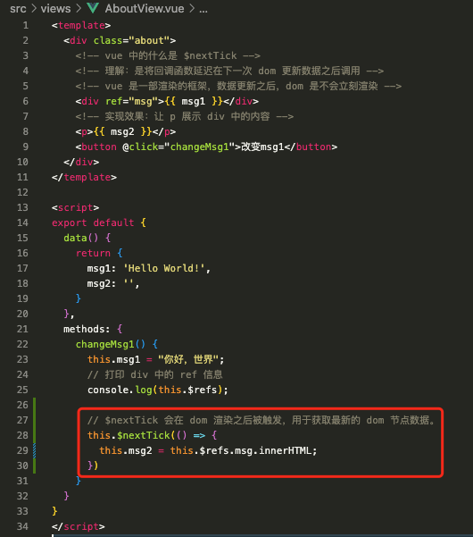

# 1. 027-Vue面试题

[B站视频P80](https://www.bilibili.com/video/BV1QA4y1d7xf/?p=80&spm_id_from=pageDriver&vd_source=52532367532c4237b88b472159331d19)

## 1.1. v-for 和 v-if 为什么不建议一起使用？

v-for 的优先级高于 v-if 

错误示例：


正确示例：


## 1.2. vue 中如何使用自定义指令

[官方文档](https://cn.vuejs.org/guide/reusability/custom-directives.html)

[视频P81](https://www.bilibili.com/video/BV1QA4y1d7xf/?p=81&spm_id_from=pageDriver&vd_source=52532367532c4237b88b472159331d19) 

vue 自带的指令包括：`v-bind`、`v-if`、`v-for`、`v-model` 等


### 1.2.1. 局部注册


```vue
<template>
  <div class="about">
    <h1>This is an about page</h1>
  </div>
</template>
<script>
export default {
  // 自定义指令的关键字
  directives: { 
    // 自定义指令的关键字名称
    focus: { 
      // 组件/元素触发自定义指令时的钩子函数。el 为触发指令的元素
      mounted(el) { // 当使用了自定义指令的元素触发了 mounted 被挂载到父元素时，自动获取焦点
        // 获取元素的焦点 
        el.focus() 
      }
    }
  }
}
</script>
```

### 1.2.2. 全局注册


* `src/main.js`

```js
import { createApp } from 'vue'
import App from './App.vue'
import router from './router'
import store from './store'

createApp(App)
    .use(store) // 使用 use() 挂载后就会生成一个 $store 对象
    .use(router) // 使用 use() 挂载后就会生成一个 $router 对象
    // directive-自定义指令的关键字
    .directive(
        "focus",   // 自定义指令的关键字名称
        {
            // 组件/元素触发自定义指令时的钩子函数。el 为触发指令的元素
            mounted(el) { // 当使用了自定义指令的元素触发了 mounted 被挂载到父元素时，自动获取焦点
                // 获取元素的焦点 
                el.focus()
            }
        }
    )
    .mount('#app')
```

* `src/views/AboutView.vue`

```vue
<template>
  <div class="about">
    <input type="text">
    <input type="text" v-focus>
  </div>
</template>

```

## 1.3. vue 中什么是 `$nextTick`

[视频P82](https://www.bilibili.com/video/BV1QA4y1d7xf/?p=82&spm_id_from=pageDriver&vd_source=52532367532c4237b88b472159331d19)

理解：是将回调函数延迟在下一次 dom 更新数据之后调用。
 
Vue 是异步渲染框架，数据更新之后， dom 并不会立即渲染 ，而是延迟到下一次数据变更时才渲染。

而 `$nextTick` 则会在 dom 渲染之后被触发，用于获取最新的 dom 节点数据。

`$nextTick`  的使用场景：

* 在生命周期函数 `created` 中进行 dom 操作时，必须要放到 `nextTick` 函数中执行。（`created` 执行时，dom 还没有开始渲染，所以，此时执行 dom 操作将无效，因此必须放到 `nextTick` 函数中，等待 dom 渲染之后，再去触发 `nextTick` 中的操作）
* 在数据变化时执行某个操作，但该操作需要使用 dom 结构，dom 结构会随着数据变化而变化，此时，该操作就需要放在 `nextTick` 中。


### 1.3.1. 延迟渲染


```vue
<template>
  <div class="about">
    <!-- vue 中的什么是 $nextTick -->
    <!-- 理解：是将回调函数延迟在下一次 dom 更新数据之后调用 -->
    <!-- vue 是一部渲染的框架，数据更新之后，dom 是不会立刻渲染 -->
    <div ref="msg">{{ msg1 }}</div>
    <!-- 实现效果：让 p 展示 div 中的内容 -->
    <p>{{ msg2 }}</p>
    <button @click="changeMsg1">改变msg1</button>
  </div>
</template>

<script>
export default {
  data() {
    return {
      msg1: 'Hello World!',
      msg2: '',
    }
  },
  methods: {
    changeMsg1() {
      this.msg1 = "你好，世界";
      // 打印 div 中的 ref 信息
      console.log(this.$refs);
      this.msg2 = this.$refs.msg.innerHTML;
    }
  }
}
</script>
```


上面的示例中，进入页面时由于 msg2 并没有初始值，所以 `p` 标签内不会展示内容。

第一次点击 `button` 后，msg1 的内容变更为 “你好，世界”，`div` 标签的内容随之变化；此时，`msg2` 读取到的数据却是 "hello, world"。

我们二次点击 `button` 后，`msg2` 的内容才会变成 “你好，世界”。

这个示例并没有完全达到我们的需要。msg2 中的内容仅会在 `ref` 中的数据发生变化后才能拿到之前的值。

### 1.3.2. 解决延迟渲染-方案1


基于上面修改之后，我们点击按钮后，`msg2` 将会变更为和 `msg1` 一致的值。


```vue
<template>
  <div class="about">
    <!-- vue 中的什么是 $nextTick -->
    <!-- 理解：是将回调函数延迟在下一次 dom 更新数据之后调用 -->
    <!-- vue 是一部渲染的框架，数据更新之后，dom 是不会立刻渲染 -->
    <div ref="msg">{{ msg1 }}</div>
    <!-- 实现效果：让 p 展示 div 中的内容 -->
    <p>{{ msg2 }}</p>
    <button @click="changeMsg1">改变msg1</button>
  </div>
</template>

<script>
export default {
  data() {
    return {
      msg1: 'Hello World!',
      msg2: '',
    }
  },
  methods: {
    changeMsg1() {
      this.msg1 = "你好，世界";
      // 打印 div 中的 ref 信息
      console.log(this.$refs);
      // 使用 setTimeout 让 msg2 的内容在 100 毫秒后变更，
      // 而不是默认的当 ref 中下一次数据变更时再改变。
      setTimeout(() => {
        this.msg2 = this.$refs.msg.innerHTML;
      }, 100)
    }
  }
}
</script>
```


### 1.3.3. 解决延迟渲染-方案2



```vue
<template>
  <div class="about">
    <!-- vue 中的什么是 $nextTick -->
    <!-- 理解：是将回调函数延迟在下一次 dom 更新数据之后调用 -->
    <!-- vue 是一部渲染的框架，数据更新之后，dom 是不会立刻渲染 -->
    <div ref="msg">{{ msg1 }}</div>
    <!-- 实现效果：让 p 展示 div 中的内容 -->
    <p>{{ msg2 }}</p>
    <button @click="changeMsg1">改变msg1</button>
  </div>
</template>

<script>
export default {
  data() {
    return {
      msg1: 'Hello World!',
      msg2: '',
    }
  },
  methods: {
    changeMsg1() {
      this.msg1 = "你好，世界";
      // 打印 div 中的 ref 信息
      console.log(this.$refs);

      // $nextTick 会在 dom 渲染之后被触发，用于获取最新的 dom 节点数据。
      this.$nextTick(() => {
        this.msg2 = this.$refs.msg.innerHTML;
      })
    }
  }
}
</script>


```
