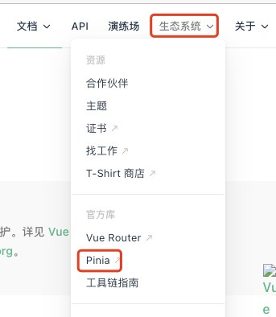

# 1. 028-pinia

[视频地址](https://www.bilibili.com/video/BV1QA4y1d7xf/?p=80)

[pinia官网](https://pinia.vuejs.org/zh/)

## 1.1. pinia简介

在 [Vue 官网](https://cn.vuejs.org/guide/introduction.html) 可以通过如下方式进入 [pinia 官网](https://pinia.vuejs.org/zh/)：

Pinia 是 Vue 的专属状态管理库，它允许你跨组件或页面共享状态。

如果你熟悉组合式 API 的话，你可能会认为可以通过一行简单的 `export const state = reactive({})` 来共享一个全局状态。对于单页应用来说确实可以，但如果应用在服务器端渲染，这可能会使你的应用暴露出一些安全漏洞。

而如果使用 Pinia，即使在小型单页应用中，你也可以获得如下功能：

* Devtools 支持
    * 追踪 actions、mutations 的时间线
    * 在组件中展示它们所用到的 Store
    * 让调试更容易的 Time travel
* 热更新
    * 不必重载页面即可修改 Store
    * 开发时可保持当前的 State
* 插件：可通过插件扩展 Pinia 功能
* 为 JS 开发者提供适当的 TypeScript 支持以及自动补全功能。
* 支持服务端渲染

## 1.2. 创建vue3项目并安装pinia

## 1.3. 定义OptionStore

## 1.4. 定义SetupStore并使用Store

## 1.5. Pinia核心概念-State的基本使用

## 1.6. Pinia核心概念-Getter的基本使用

## 1.7. Pinia核心概念-Action的基本使用

## 1.8. pinia和vuex的比较

