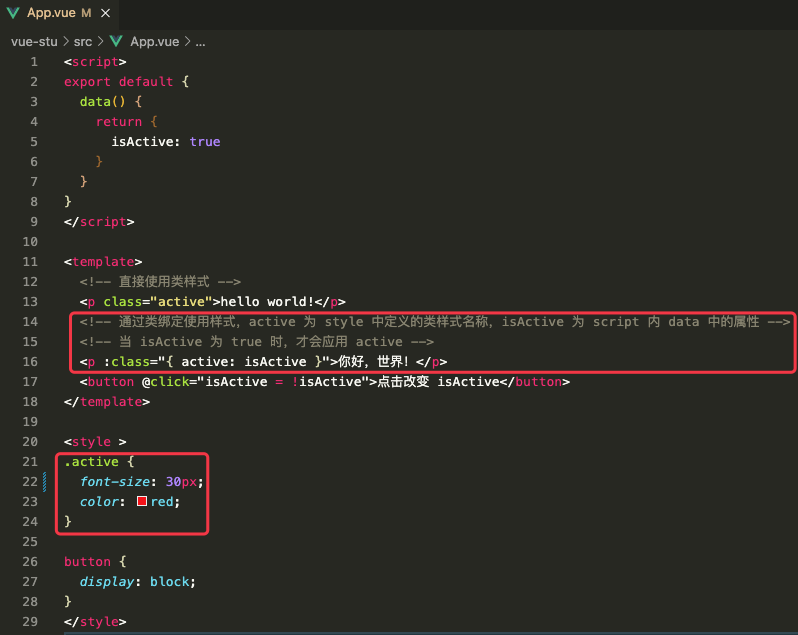
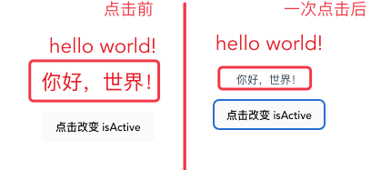
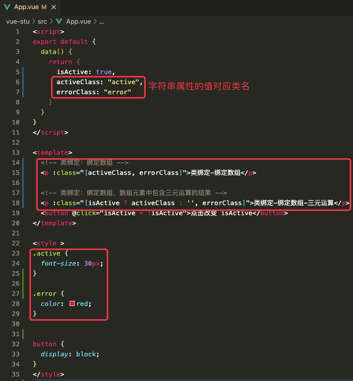
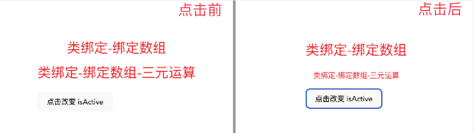
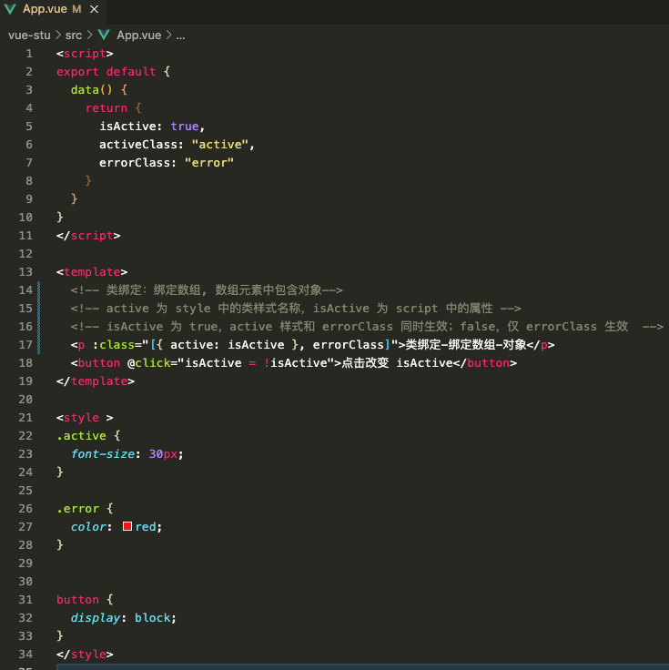
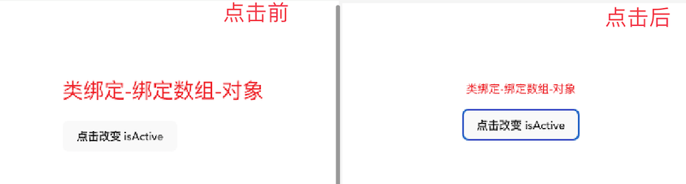

# 1. 6-类与样式绑定

>2022-11-08

数据绑定的一个常见需求场景是操纵元素的 CSS class 列表和内联样式。

因为 `class` 和 `style` 都是 attribute，我们可以和其他 attribute 一样使用 `v-bind` 将它们和动态的字符串绑定。但是，在处理比较复杂的绑定时，通过拼接生成字符串是麻烦且易出错的。因此，Vue 专门为 `class` 和 `style` 的 `v-bind` 用法提供了特殊的功能增强。**除了字符串外，表达式的值也可以是对象或数组**。

## 1.1. 绑定 HTML class

绑定 `class` 时使用 `v-bind:class` ，简写为 `:class`。

### 1.1.1. 绑定对象

#### 1.1.1.1. 内联字面量

我们可以给 `:class` (`v-bind:class` 的缩写) 传递一个对象来动态切换 class：

```vue
<!--active 为 style 中定义的样式；isActive 为 script 内 data 中的布尔属性-->
<div :class="{ active: isActive }"></div>
```

上面的语法表示 `active` 是否存在取决于数据属性 `isActive` 的真假值。





```vue
<script>
export default {
  data() {
    return {
      isActive: true
    }
  }
}
</script>

<template>
  <!-- 直接使用类样式 -->
  <p class="active">hello world!</p>
  <!-- 通过类绑定使用样式，active 为 style 中定义的类样式名称，isActive 为 script 内 data 中的属性 -->
  <!-- 当 isActive 为 true 时，才会应用 active -->
  <p :class="{ active: isActive }">你好，世界！</p>
  <button @click="isActive = !isActive">点击改变 isActive</button>
</template>

<style >
.active {
  font-size: 30px;
  color: red;
}

button {
  display: block;
}
</style>
```

#### 1.1.1.2. 多个内联字面量

我们可以在对象中写多个字段来操作多个 class。

此外，**`:class` 指令也可以和一般的 `class` attribute 共存**。示例如下：

```js
data() {
  return {
    isActive: true,
    hasError: false
  }
}
```

配合以下模板（`<template>` 节点）：

```vue
<!-- static、active、'text-danger' 都是在 style 中定义的类样式-->
<!--:class 中可以声明多个内联字面量，使用英文逗号间隔-->
<!-- class="static" 是普通的类声明方式，可以和 :class 类绑定样式共存-->
<div
  class="static"
  :class="{ active: isActive, 'text-danger': hasError }"
></div>
```

渲染的结果会是：

```vue
<div class="static active"></div>
```

当 `isActive` 或者 `hasError` 改变时，class 列表会随之更新。举例来说，如果 `hasError` 变为 `true` ，class 列表也会变成 `"static active text-danger"`。

#### 1.1.1.3. 绑定对象

**也可以直接绑定一个对象**：

```js
data() {
  return {
    classObject: {
      active: true,
      'text-danger': false
    }
  }
}
```

```vue
<!--注意：这里因为绑定的是对象，所以不需要 {} 包裹-->
<div :class="classObject"></div>
```

这也会渲染出相同的结果。

### 1.1.2. 绑定计算属性

**也可以绑定一个返回对象的计算属性**。这是一个常见且很有用的技巧：

```js
data() {
  return {
    isActive: true,
    error: null
  }
},
computed: {
  classObject() {
    return {
      active: this.isActive && !this.error,
      'text-danger': this.error && this.error.type === 'fatal'
    }
  }
}
```

```vue
<!--此处的 classObject 是一个返回对象的计算属性，所以不需要 {}-->
<div :class="classObject"></div>
```

### 1.1.3. 绑定数组

我们可以给 `:class` 绑定一个数组来渲染多个 CSS class：

```js
data() {
  return {
    activeClass: 'active',
    errorClass: 'text-danger'
  }
}
```

```vue
<!--activeClass、errorClass是 script 节点内 data 中的字符串属性，它们的值对应 style 中声明的类样式-->
<div :class="[activeClass, errorClass]"></div>
```

渲染的结果是：

```vue
<div class="active text-danger"></div>
```

#### 1.1.3.1. 数组中的三元表达式

如果想**在数组中有条件地渲染某个 class ，你可以使用三元表达式**：

```vue
<!--isActive 是 script 节点内 data 中布尔属性-->
<!--activeClass、errorClass 是 script 节点内 data 中字符串属性，它们的值对应 style 中声明的类样式-->
<div :class="[isActive ? activeClass : '', errorClass]"></div>
```

`errorClass` 会一直生效，但 `activeClass` 只会在 `isActive` 为 true 时才生效。





```vue
<script>
export default {
  data() {
    return {
      isActive: true,
      activeClass: "active",
      errorClass: "error"
    }
  }
}
</script>

<template>
  <!-- 类绑定：绑定数组 -->
  <p :class="[activeClass, errorClass]">类绑定-绑定数组</p>

  <!-- 类绑定：绑定数组，数组元素中包含三元运算的结果 -->
  <p :class="[isActive ? activeClass : '', errorClass]">类绑定-绑定数组-三元运算</p>
  <button @click="isActive = !isActive">点击改变 isActive</button>
</template>

<style >
.active {
  font-size: 30px;
}

.error {
  color: red;
}


button {
  display: block;
}
</style>
```


#### 1.1.3.2. 数组中的对象

在有多个依赖条件的 class 时使用三元表达式可能会有些冗长。因此也可以**在数组中嵌套对象**：

```vue
<div :class="[{ active: isActive }, errorClass]"></div>
```





```vue
<script>
export default {
  data() {
    return {
      isActive: true,
      activeClass: "active",
      errorClass: "error"
    }
  }
}
</script>

<template>
  <!-- 类绑定：绑定数组, 数组元素中包含对象-->
  <!-- active 为 style 中的类样式名称，isActive 为 script 中的属性 -->
  <!-- isActive 为 true，active 样式和 errorClass 同时生效；false，仅 errorClass 生效  -->
  <p :class="[{ active: isActive }, errorClass]">类绑定-绑定数组-对象</p>
  <button @click="isActive = !isActive">点击改变 isActive</button>
</template>

<style >
.active {
  font-size: 30px;
}

.error {
  color: red;
}


button {
  display: block;
}
</style>
```

### 1.1.4. 在组件上使用

>本节假设你已经有 [Vue 组件](https://cn.vuejs.org/guide/essentials/component-basics.html) 的知识基础。如果没有，你也可以暂时跳过，以后再阅读。

#### 1.1.4.1. 单个根元素的组件

对于只有一个根元素的组件，当你使用了 `class` attribute 时，这些 class 会被添加到根元素上，并**与该元素上已有的 class 合并**。

举例来说，如果你声明了一个组件名叫 `MyComponent` ，模板如下：

```vue
<!-- 子组件模板 -->
<p class="foo bar">Hi!</p>
```

在使用时添加一些 class：

```vue
<!-- 在使用组件时 -->
<MyComponent class="baz boo" />
```

渲染出的 HTML 为：

```vue
<p class="foo bar baz boo">Hi</p>
```

Class 的绑定也是同样的：

```vue
<MyComponent :class="{ active: isActive }" />
```

当 `isActive` 为真时，被渲染的 HTML 会是：

```vue
<p class="foo bar active">Hi</p>
```

#### 1.1.4.2. 多个根元素的组件

如果你的组件有多个根元素，你将需要**指定哪个根元素来接收这个 class**。你可以**通过组件的 `$attrs` 属性**来实现指定：

```vue
<!-- MyComponent 模板使用 $attrs 时 -->
<p :class="$attrs.class">Hi!</p>
<span>This is a child component</span>
```

```vue
<MyComponent class="baz" />
```

这将被渲染为：

```vue
<p class="baz">Hi!</p>
<span>This is a child component</span>
```

在[透传 Attribute](https://cn.vuejs.org/guide/components/attrs.html) 一章中可以了解更多关于组件 attribute 继承的细节。

## 1.2. 绑定内联样式

绑定内联样式时使用 `v-bind:style` ，简写为 `:style`。

### 1.2.1. 绑定对象

#### 1.2.1.1. 绑定字面量

`:style` 支持**绑定 JavaScript 对象值**，对应的是 [HTML 元素的 `style` 属性](https://developer.mozilla.org/en-US/docs/Web/API/HTMLElement/style)：

```js
data() {
  return {
    activeColor: 'red',
    fontSize: 30
  }
}
```

```vue
<!--此处 :style 的值需要使用 {} 包裹-->
<!--color、fontSize 是 css 中的属性名；activeColor 和 后一个 fontSize 是 script 内 data 中的属性-->
<div :style="{ color: activeColor, fontSize: fontSize + 'px' }"></div>
```

尽管推荐使用 camelCase（驼峰命名），但 `:style` 也支持 kebab-cased （中线连接命名）形式的 CSS 属性 key (对应其 CSS 中的实际名称)，例如：

```vue
<!--📢 注意：此处的 font-size 使用引号包裹了-->
<div :style="{ 'font-size': fontSize + 'px' }"></div>
```

#### 1.2.1.2. 绑定对象

直接绑定一个样式对象可以使模板更加简洁：

```js
data() {
  return {
    styleObject: {
      color: 'red',
      fontSize: '13px'
    }
  }
}
```

```vue
<!--styleObject 本就是对象，所以此处不需要 {}-->
<div :style="styleObject"></div>
```

### 1.2.2. 绑定计算属性

同样的，如果样式对象需要更复杂的逻辑，**也可以使用返回样式对象的计算属性**。

代码略。

### 1.2.3. 绑定数组

我们还可以给 `:style` 绑定一个包含多个**样式对象**的数组。这些对象会被**合并后渲染到同一元素上**：

```vue
<!--baseStyles,overridingStyles 是 script 中 data 内的对象属性，该对象定义了 css 样式-->
<div :style="[baseStyles, overridingStyles]"></div>
```

还可以绑定下面这种数组：

```vue
<!--baseStyles 是定义在 script 内 data 中的对象属性。-->
<div :style="[baseStyles, {border:'5px solid'}]"></div>
```

### 1.2.4. 自动前缀

在 `:style` 中使用了需要[浏览器特殊前缀](https://developer.mozilla.org/en-US/docs/Glossary/Vendor_Prefix)的 CSS 属性时，Vue 会自动为他们加上相应的前缀。

Vue 是在运行时检查该属性是否支持在当前浏览器中使用。如果浏览器不支持某个属性，那么将尝试加上各个浏览器特殊前缀，以找到哪一个是被支持的。

### 1.2.5. 样式多值

你可以对一个样式属性提供多个 (不同前缀的) 值，举例来说：

```vue
<div :style="{ display: ['-webkit-box', '-ms-flexbox', 'flex'] }"></div>
```

**数组仅会渲染浏览器支持的最后一个值**。

在这个示例中，**在支持不需要特别前缀的浏览器中都会渲染为 `display: flex`**。

