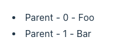
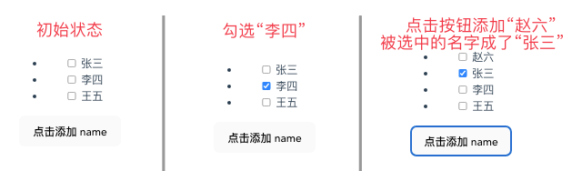
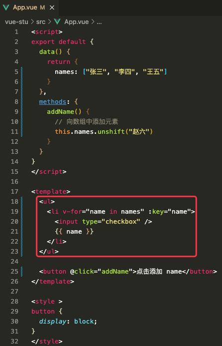
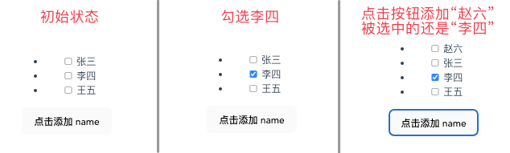

# 1. 8-列表渲染

## 1.1. v-for

我们可以使用 `v-for` 指令基于一个数组来渲染一个列表。

### 1.1.1. 基本用法

`v-for` 指令的值需要使用 `item in items` 形式的特殊语法，其中 `items` 是源数据的数组名，而 **`item` 是迭代项的别名**：

```js
data() {
  return {
    items: [{ message: 'Foo' }, { message: 'Bar' }]
  }
}
```

```vue
<ul>
    <!--items 是源数组名称，item 是数组中元素别名，二者都是自定义的-->
    <li v-for="item in items"> {{ item.message }} </li>
</ul>
```

### 1.1.2. 带有索引的用法

在 `v-for` 块中**可以完整地访问父作用域内的属性和变量**。

`v-for` 也**支持使用可选的第二个参数表示当前项的位置索引**。

```js
data() {
  return {
    parentMessage: 'Parent',
    items: [{ message: 'Foo' }, { message: 'Bar' }]
  }
}
```

```vue
<li v-for="(item, index) in items">
  {{ parentMessage }} - {{ index }} - {{ item.message }}
</li>
```

运行效果：



### 1.1.3. `v-for` 变量的作用域

#### 1.1.3.1. 作用域说明

`v-for` 变量的作用域和下面的 JavaScript 代码很类似：

```js
const parentMessage = 'Parent'
const items = [
  /* ... */
]

items.forEach((item, index) => {
  // 可以访问外层的 `parentMessage`
  // 而 `item` 和 `index` 只在这个作用域可用
  console.log(parentMessage, item.message, index)
})
```

#### 1.1.3.2. 嵌套 `v-for` 中的作用域

对于多层嵌套的 `v-for`，作用域的工作方式和函数的作用域很类似。每个 `v-for` 作用域都可以访问到父级作用域：

```vue
<li v-for="item in items">
  <span v-for="childItem in item.children">
    {{ item.message }} {{ childItem }}
  </span>
</li>
```

### 1.1.4. 关于`v-for` 的变量别名

#### 1.1.4.1. 基本定义方式

基本方式即：`item in items` 形式。

```vue
<div v-for="item in items"></div>
```

#### 1.1.4.2. 使用 of 替代 in

也可以使用 `of` 作为分隔符来替代 `in` ，这更接近 JavaScript 的迭代器语法：

```vue
<div v-for="item of items"></div>
```

#### 1.1.4.3. 使用解构定义 `v-for` 的变量别名

注意 `v-for` 是如何对应 `forEach` 回调的函数签名的。实际上，你也可以在定义 `v-for` 的变量别名时使用解构，和解构函数参数类似：

```vue
<!--此处没有使用 item，而是使用 {message} 代替，表示此处仅需要调用 items 中元素的 message 属性-->
<li v-for="{ message } in items">
  {{ message }}
</li>

<!-- 有 index 索引时 -->
<li v-for="({ message }, index) in items">
  {{ message }} {{ index }}
</li>
```


## 1.2. v-for 与对象

也可以**使用 `v-for` 来遍历一个对象的所有属性**。

遍历的顺序会基于对该对象调用 `Object.keys()` 的返回值来决定。

### 1.2.1. 遍历属性值

```js
data() {
  return {
    myObject: {
      title: 'How to do lists in Vue',
      author: 'Jane Doe',
      publishedAt: '2016-04-10'
    }
  }
}
```

```vue
<ul>
  <!--格式为：变量别名 in 对象名，此处的变量别名指向的是对象中的属性值-->
  <li v-for="value in myObject">
    {{ value }}
  </li>
</ul>
```

### 1.2.2. 遍历属性名和属性值

可以通过提供第二个参数表示属性名 (例如 key)：

```vue
<li v-for="(value, key) in myObject">
  {{ key }}: {{ value }}
</li>
```

### 1.2.3. 遍历属性名、属性值、索引

还可以通过提供第三个参数表示位置索引：

```vue
<li v-for="(value, key, index) in myObject">
  {{ index }}. {{ key }}: {{ value }}
</li>
```

## 1.3. 在 `v-for` 里使用范围值

`v-for` 可以直接接受一个整数值。

在这种用例中，会将该模板基于 `1...n` 的取值范围重复多次。

```vue
<span v-for="n in 10">{{ n }}</span>
```

注意：**此处 `n` 的初值是从 1 开始而非 0。**

## 1.4. `<template>` 上的 v-for

与模板上的 `v-if` 类似，你也可以在 `<template>` 标签上使用 `v-for` 来渲染一个包含多个元素的块。例如：

```vue
<ul>
  <template v-for="item in items">
    <li>{{ item.msg }}</li>
    <li class="divider" role="presentation"></li>
  </template>
</ul>
```

## 1.5. `v-for` 与 `v-if`

>注意：
>不推荐同时使用 `v-if` 和 `v-for` ，因为这样二者的优先级不明显。请转阅[风格指南](https://cn.vuejs.org/style-guide/rules-essential.html#avoid-v-if-with-v-for)查看更多细节。

当它们**同时存在于一个节点上时，`v-if` 比 `v-for` 的优先级更高**。

**这意味着 `v-if` 的条件将无法访问到 `v-for` 作用域内定义的变量别名：**

```vue
<!--这会抛出一个错误，因为属性 todo 此时没有在该实例上定义-->
<li v-for="todo in todos" v-if="!todo.isComplete">
  {{ todo.name }}
</li>
```

在外新包装一层 `<template>` 再在其上使用 `v-for` 可以解决这个问题 (这也更加明显易读)：

```vue
<template v-for="todo in todos">
  <li v-if="!todo.isComplete">
    {{ todo.name }}
  </li>
</template>
```

## 1.6. 通过 key 管理状态

Vue 默认按照“就地更新”的策略来更新通过 `v-for` 渲染的元素列表。

**当数据项的顺序改变时，Vue 不会随之移动 DOM 元素的顺序，而是就地更新每个元素，确保它们在原本指定的索引位置上渲染。**

**默认模式是高效的，但只适用于列表渲染输出的结果不依赖子组件状态或者临时 DOM 状态 (例如表单输入值) 的情况。**

为了给 Vue 一个提示，以便它可以跟踪每个节点的标识，从而**重用和重新排序现有的元素，你需要为每个元素对应的块提供一个唯一的 `key` attribute**：

```vue
<div v-for="item in items" :key="item.id">
  <!-- 内容 -->
</div>
```

当你使用 `<template v-for>` 时， `key` 应该被放置在这个 `<template>` 容器上：

```vue
<template v-for="todo in todos" :key="todo.name">
  <li>{{ todo.name }}</li>
</template>
```

>注意：
> `:key` 在这里是一个通过 `v-bind` 绑定的特殊 attribute。请不要和在 **`v-for` 中使用对象**里所提到的对象属性名相混淆。

[推荐](https://cn.vuejs.org/style-guide/rules-essential.html#use-keyed-v-for)在任何可行的时候为 `v-for` 提供一个 `key` attribute，除非所迭代的 DOM 内容非常简单 (例如：不包含组件或有状态的 DOM 元素)，或者你想有意采用默认行为来提高性能。

**`key` 绑定的值期望是一个基础类型的值**，例如字符串或 number 类型。不要用对象作为 `v-for` 的 key。关于 `key` attribute 的更多用途细节，请参阅 [`key` API 文档](https://cn.vuejs.org/api/built-in-special-attributes.html#key)。

### 1.6.1. 示例-未指定 key 时




在上述示例中，我们在使用 `v-for` 时，没有绑定 `key`。

先勾选“李四”，然后点击按钮将 “赵六”添加到数组中，此时界面重新渲染将其展示出来。

但是，我们发现，此时被选中的不再是“李四”，而是变成了“张三”。

也就是说，在未指定 key 时，选中状态默认关联到数组元素的索引上，而不是数组元素本身。

### 1.6.2. 示例-指定 key 时





上述代码中，我们在使用 `v-for` 的时候，绑定了 `:key`。

先勾选“李四”，然后点击按钮将 “赵六”添加到数组中，此时界面重新渲染将其展示出来。

我们发现，此时被选中的依旧是“李四”。

也就是说，**通过 `:key` 绑定 key 之后，选中状态被关联到数组元素本身。**有利于减少渲染次数，进而提升渲染性能。

完整代码如下：

```vue
<script>
export default {
  data() {
    return {
      names: ["张三", "李四", "王五"]
    }
  },
  methods: {
    addName() {
      // 向数组中添加元素
      this.names.unshift("赵六")
    }
  }
}
</script>

<template>
  <ul>
    <li v-for="name in names" :key="name">
      <input type="checkbox" />
      {{ name }}
    </li>
  </ul>

  <button @click="addName">点击添加 name</button>
</template>

<style >
button {
  display: block;
}
</style>
```


## 1.7. 组件上使用 `v-for`

>这一小节假设你已了解[组件](https://cn.vuejs.org/guide/essentials/component-basics.html)的相关知识，或者你也可以先跳过这里，之后再回来看。

我们可以直接在组件上使用 `v-for`，和在一般的元素上使用没有区别 (别忘记提供一个 `key`)：

```vue
<MyComponent v-for="item in items" :key="item.id" />
```

但是，这不会自动将任何数据传递给组件，因为组件有自己独立的作用域。**为了将迭代后的数据传递到组件中，我们还需要传递 props**：

```vue
<MyComponent
  v-for="(item, index) in items"
  :item="item"
  :index="index"
  :key="item.id"
/>
```

**不自动将 `item` 注入组件的原因是，这会使组件与 `v-for` 的工作方式紧密耦合。明确其数据的来源可以使组件在其他情况下重用。**

这里是一个简单的 [Todo List 的例子](https://sfc.vuejs.org/#eyJBcHAudnVlIjoiPHNjcmlwdD5cbmltcG9ydCBUb2RvSXRlbSBmcm9tICcuL1RvZG9JdGVtLnZ1ZSdcbiAgXG5leHBvcnQgZGVmYXVsdCB7XG4gIGNvbXBvbmVudHM6IHsgVG9kb0l0ZW0gfSxcbiAgZGF0YSgpIHtcbiAgICByZXR1cm4ge1xuICAgICAgbmV3VG9kb1RleHQ6ICcnLFxuICAgICAgdG9kb3M6IFtcbiAgICAgICAge1xuICAgICAgICAgIGlkOiAxLFxuICAgICAgICAgIHRpdGxlOiAnRG8gdGhlIGRpc2hlcydcbiAgICAgICAgfSxcbiAgICAgICAge1xuICAgICAgICAgIGlkOiAyLFxuICAgICAgICAgIHRpdGxlOiAnVGFrZSBvdXQgdGhlIHRyYXNoJ1xuICAgICAgICB9LFxuICAgICAgICB7XG4gICAgICAgICAgaWQ6IDMsXG4gICAgICAgICAgdGl0bGU6ICdNb3cgdGhlIGxhd24nXG4gICAgICAgIH1cbiAgICAgIF0sXG4gICAgICBuZXh0VG9kb0lkOiA0XG4gICAgfVxuICB9LFxuICBtZXRob2RzOiB7XG4gICAgYWRkTmV3VG9kbygpIHtcbiAgICAgIHRoaXMudG9kb3MucHVzaCh7XG4gICAgICAgIGlkOiB0aGlzLm5leHRUb2RvSWQrKyxcbiAgICAgICAgdGl0bGU6IHRoaXMubmV3VG9kb1RleHRcbiAgICAgIH0pXG4gICAgICB0aGlzLm5ld1RvZG9UZXh0ID0gJydcbiAgICB9XG4gIH1cbn1cbjwvc2NyaXB0PlxuXG48dGVtcGxhdGU+XG5cdDxmb3JtIHYtb246c3VibWl0LnByZXZlbnQ9XCJhZGROZXdUb2RvXCI+XG4gICAgPGxhYmVsIGZvcj1cIm5ldy10b2RvXCI+QWRkIGEgdG9kbzwvbGFiZWw+XG4gICAgPGlucHV0XG4gICAgICB2LW1vZGVsPVwibmV3VG9kb1RleHRcIlxuICAgICAgaWQ9XCJuZXctdG9kb1wiXG4gICAgICBwbGFjZWhvbGRlcj1cIkUuZy4gRmVlZCB0aGUgY2F0XCJcbiAgICAvPlxuICAgIDxidXR0b24+QWRkPC9idXR0b24+XG4gIDwvZm9ybT5cbiAgPHVsPlxuICAgIDx0b2RvLWl0ZW1cbiAgICAgIHYtZm9yPVwiKHRvZG8sIGluZGV4KSBpbiB0b2Rvc1wiXG4gICAgICA6a2V5PVwidG9kby5pZFwiXG4gICAgICA6dGl0bGU9XCJ0b2RvLnRpdGxlXCJcbiAgICAgIEByZW1vdmU9XCJ0b2Rvcy5zcGxpY2UoaW5kZXgsIDEpXCJcbiAgICA+PC90b2RvLWl0ZW0+XG4gIDwvdWw+XG48L3RlbXBsYXRlPiIsImltcG9ydC1tYXAuanNvbiI6IntcbiAgXCJpbXBvcnRzXCI6IHtcbiAgICBcInZ1ZVwiOiBcImh0dHBzOi8vc2ZjLnZ1ZWpzLm9yZy92dWUucnVudGltZS5lc20tYnJvd3Nlci5qc1wiXG4gIH1cbn0iLCJUb2RvSXRlbS52dWUiOiI8c2NyaXB0PlxuZXhwb3J0IGRlZmF1bHQge1xuXHRwcm9wczogWyd0aXRsZSddLFxuICBlbWl0czogWydyZW1vdmUnXVxufVxuPC9zY3JpcHQ+XG5cbjx0ZW1wbGF0ZT5cbiAgPGxpPlxuICAgIHt7IHRpdGxlIH19XG4gICAgPGJ1dHRvbiBAY2xpY2s9XCIkZW1pdCgncmVtb3ZlJylcIj5SZW1vdmU8L2J1dHRvbj5cbiAgPC9saT5cbjwvdGVtcGxhdGU+In0=)，展示了如何通过 `v-for` 来渲染一个组件列表，并向每个实例中传入不同的数据。

## 1.8. 数组变化侦测

### 1.8.1. 变更方法

**变更方法**，顾名思义，**就是会对调用它们的原数组进行变更**。

**Vue 能够侦听响应式数组的`变更方法`，并在它们被调用时触发相关的更新**。这些变更方法包括：

方法名 | 作用
---|---
push() | 追加元素到数组末尾。一次追加多个元素时，元素间使用逗号间隔，如：`list.push(7,8,9)`
pop() | 删除数组最末尾的元素。无参。
shift() | 删除数组开头的元素（0索引元素）。无参。
unshift() | 将元素添加到数组的 0 索引位置。一次追加多个元素时，元素间使用逗号间隔，如：`list.unshift(7,8,9)`
splice() | 可以删除、插入、替换元素。具体参见后面的小节。
sort() | 对元素进行排序。默认从小到大排
reverse() | 对元素进行翻转。空参。

#### 1.8.1.1. splice(,) 删除元素

在使用 `splice(,)` 删除数组元素时，其参数含义如下：

* 第一个参数：起始索引，表示从哪个元素开始执行删除
* 第二个参数：要删除的数量。如果不传，则表示删除起始索引向后的全部元素，包含起始索引。

如：`arr.splice(1,2)`, 表示从索引 1 开始，删除两个元素。即删除索引为 1 和 2 的元素。

完整示例见后面的 `splice(,,)替换元素` 一节。

#### 1.8.1.2. splice(,,)添加元素

在使用 `splice(,,)` 添加数组元素时，其参数含义如下：

* 第一个参数：起始索引，表示从哪个元素开始执行添加
* 第二个参数：固定传值 0。用于标记是添加数组元素
* 第三个参数：该参数是一个可变长参数，表示要传入的元素内容。多个元素之间使用逗号间隔。

如：`arr.splice(1,0,7,8,9)`，表示从 1 索引开始执行添加操作，要添加的数据是 7、8、9。7 放在 1 索引处，8 放在 2 索引处，9 放在 3 索引处。原先 1 索引及其后的数据会顺延到 9 的后面。

完整示例见后面的 `splice(,,)替换元素` 一节。

#### 1.8.1.3. splice(,,)替换元素

在使用 `splice(,,)` 替换数组元素时，其参数含义如下：

* 第一个参数：起始索引，表示从哪个元素开始执行替换
* 第二个参数：要替换的数量。
* 第三个参数：该参数是一个可变长参数，表示要传入的元素内容。多个元素之间使用逗号间隔。

如：`arr.splice(1,3,7,8,9)`，表示从 1 索引开始执行替换操作，替换 3 个元素，使用数据 7、8、9 分别替换索引 1、2、3 处的数据。

完整示例如下：

```vue
<script>
export default {
  data() {
    return {
      arr: [1, 2, 3, 4]
    }
  },
  methods: {
    spliceArr() {
      // 删除：从 1 索引开始，删除两个元素。执行后, arr 的结果为：[1,4]
      this.arr.splice(1, 2)
      // 添加：从 1 索引开始添加元素，要添加的元素为 7,8。以原始 arr 为基准，执行后结果为：[1,7,8,2,3,4]
      this.arr.splice(1, 0, 7, 8)
      // 替换：从 1 索引开始替换 2 个元素，使用 7，8 替换。以原始 arr 为基准，执行后结果为：[1,7,8,4]
      this.arr.splice(1.2, 7, 8)
    }
  }
}
</script>

<template>
  <ul>
    <li v-for="num in arr" :key="num">
      <input type="checkbox" />
      {{ num }}
    </li>
  </ul>
</template>

<style >
</style>
```

### 1.8.2. 替换一个数组

相对于变更方法，也有一些**不可变 (immutable) 方法**，例如 `filter()`，`concat()` 和 `slice()`，**这些都不会更改原数组，而总是返回一个新数组**。

当遇到的是非变更方法时，我们需要将旧的数组替换为新的：

```js
this.items = this.items.filter((item) => item.message.match(/Foo/))
```

你可能认为这将导致 Vue 丢弃现有的 DOM 并重新渲染整个列表——幸运的是，情况并非如此。

**Vue 实现了一些巧妙的方法来最大化对 DOM 元素的重用，因此用另一个包含部分重叠对象的数组来做替换，仍会是一种非常高效的操作。**

## 1.9. 展示过滤或排序后的结果

有时，我们希望**显示数组经过过滤或排序后的内容，而不实际变更或重置原始数据**。

在这种情况下，我们**可以创建返回已过滤或已排序数组的计算属性或方法**。

### 1.9.1. 使用计算属性

```js
data() {
  return {
    numbers: [1, 2, 3, 4, 5]
  }
},
computed: {
  evenNumbers() {
    return this.numbers.filter(n => n % 2 === 0)
  }
}
```

```vue
<li v-for="n in evenNumbers">{{ n }}</li>
```

### 1.9.2. 使用方法

在计算属性不可行的情况下 (例如在多层嵌套的 `v-for` 循环中)，你可以使用以下方法：

```js
data() {
  return {
    sets: [[ 1, 2, 3, 4, 5 ], [6, 7, 8, 9, 10]]
  }
},
methods: {
  even(numbers) {
    return numbers.filter(number => number % 2 === 0)
  }
}
```

```vue
<ul v-for="numbers in sets">
  <li v-for="n in even(numbers)">{{ n }}</li>
</ul>
```

在计算属性中使用 `reverse()` 和 `sort()` 的时候务必小心！**这两个方法将变更原始数组**，计算函数中不应该这么做。请**在调用这些方法之前创建一个原数组的副本**：

```diff
- return numbers.reverse()
+ return [...numbers].reverse()
```