## 4.1 CSS 布局概述和实例

[Web 开发技术 > CSS（层叠样式表）> 布局模式](https://developer.mozilla.org/zh-CN/docs/Web/CSS/Layout_mode)

 CSS 布局模式，有时简称为布局，是一种基于盒子与其兄弟和祖辈盒子的交互方式来确定盒子的位置和大小的算法。有以下几种形式：

* 块布局：用来布置文件。块布局包含以文档为中心的功能，例如 浮动元素或将其放置在多列上的功能。
* 行内布局：用来布置文本。
* 表格布局：用来布置表格。
* 定位布局：用来对那些与其他元素无交互的定位元素进行布置 。
* 弹性盒子布局：用来布置那些可以顺利调整大小的复杂页面。
* 网格布局：用来布置那些与一个固定网格相关的元素。

## 4.2 浮动与清除

### 4.2.1 浮动-float

浮动的作用是让原本垂直排列的内容实现水平排列

* 未使用浮动时的原始效果：

```html
<head>
    <meta charset="UTF-8" />
    <style>
        div {
            width: 500px;
            background-color: #ffc;
        }
        
        #p1 {
            width: 75px;
            height: 150px;
            margin: 0px;
            background-color: pink;
        }
        
        #p2 {
            width: 150px;
            height: 75px;
            margin: 0px;
            background-color: greenyellow;
        }
    </style>
</head>

<body>
    <div>
        <p id="p1">p1</p>
        <p id="p2">p2</p>
    </div>
</body>
```

上述代码中，未使用浮动，所以对于块级元素 p1 和 p2 是垂直排列的，如下图：

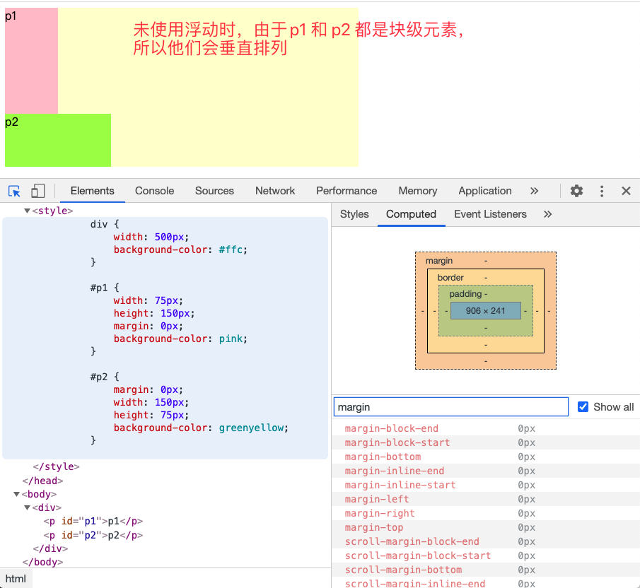

* 为 p1 使用浮动 float 之后，效果如下：

```html
<head>
    <meta charset="UTF-8" />
    <style>
        div {
            width: 500px;
            background-color: #ffc;
        }
        
        #p1 {
            width: 75px;
            height: 150px;
            margin: 0px;
            float: left;
            background-color: pink;
        }
        
        #p2 {
            margin: 0px;
            width: 150px;
            height: 75px;
            background-color: greenyellow;
        }
    </style>
</head>

<body>
    <div>
        <p id="p1">p1</p>
        <p id="p2">p2</p>
    </div>
</body>
```

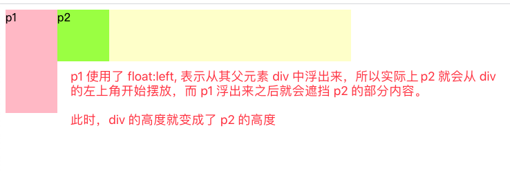

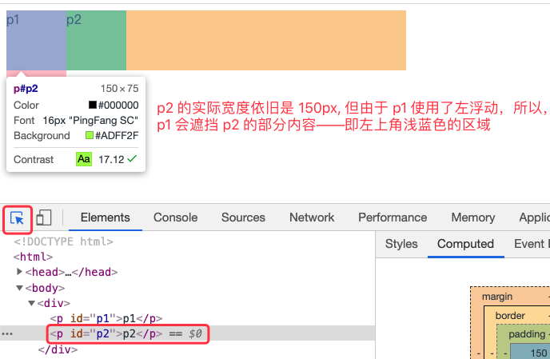

* 都使用左浮动

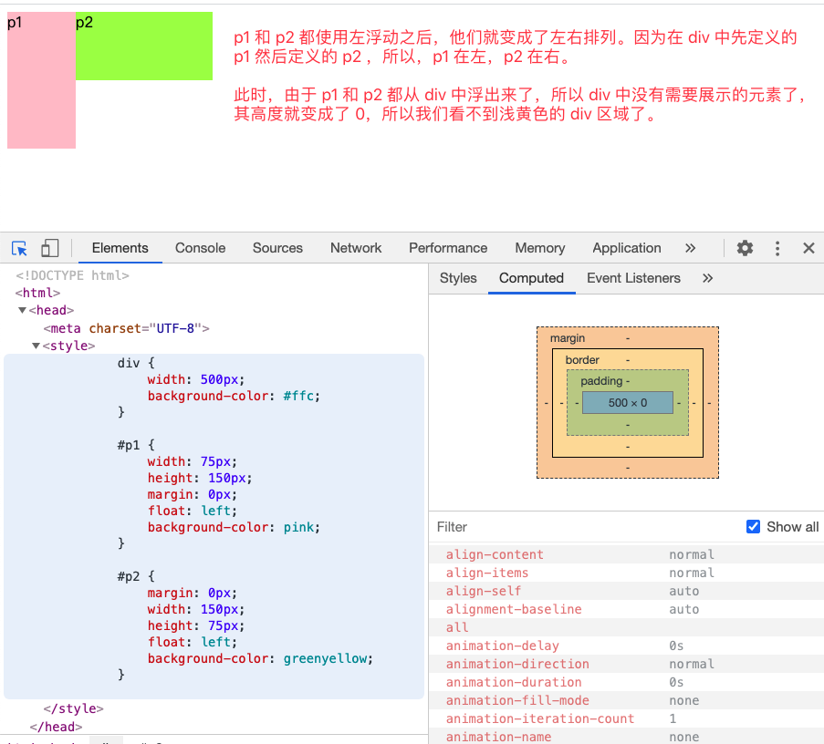

当 p1 和 p2 都使用左浮动之后，他们就变成了左右排列。因为在 div 中先定义的 p1 然后定义的 p2 ，所以，p1 在左，p2 在右。

此时，由于 p1 和 p2 都从 div 中浮出来了，所以 div 中没有需要展示的元素了，其高度就变成了 0，所以我们看不到浅黄色的 div 区域了。

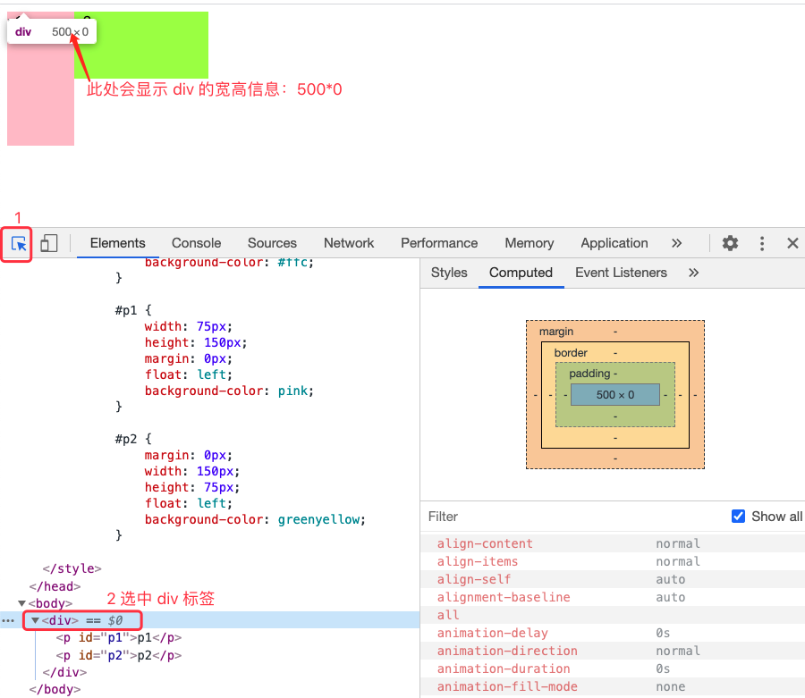

* 一左一右的浮动

我们把 p1 设置为右浮动时，p1 就跑到了 div 区域的最右侧，p2 在 div 的最左侧。

也就是说，右浮动时会受限于父元素的宽度。

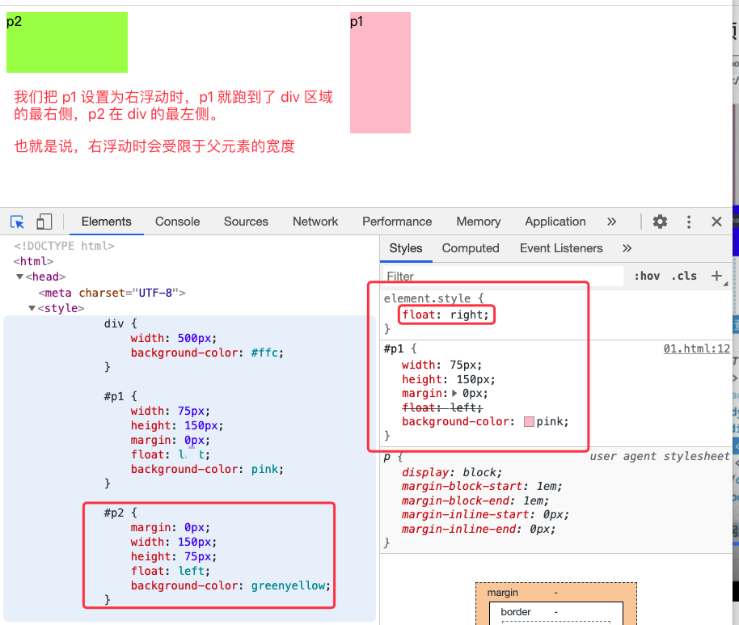

* 全都右浮动

全都右浮动时会从右向左排列，右侧起点受限于父元素的宽度——即不会超过父元素的最右侧

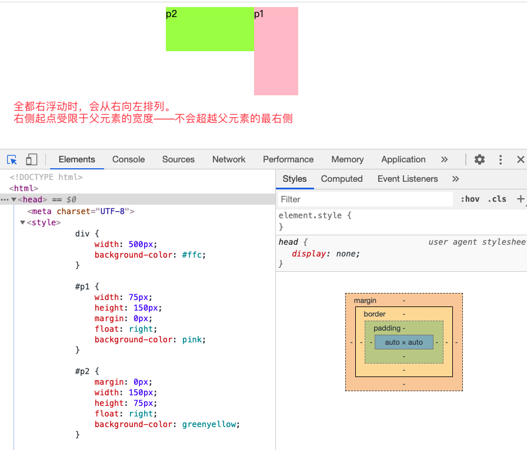

### 4.2.2 清除-clear

清除的作用是让添加了浮动效果的元素在其父级元素中依旧占位，避免因为浮动而遮挡了其他未浮动的元素。

在下面的代码中，p3 没有使用浮动，所以它会从父元素 div 的左上角开始摆放，直接父元素的最右端。而 p1 和 p2 使用了浮动，所以，p1 和 p2 会遮挡部分 p3 的部分区域。

```html
<head>
    <meta charset="UTF-8" />
    <style>
        div {
            width: 500px;
            background-color: #ffc;
        }
        
        #p1 {
            width: 75px;
            height: 150px;
            margin: 0px;
            float: left;
            background-color: pink;
        }
        
        #p2 {
            margin: 0px;
            width: 150px;
            height: 75px;
            float: right;
            background-color: greenyellow;
        }
        
        #p3 {
            background-color: yellow;
        }
    </style>
</head>

<body>
    <div>
        <p id="p1">p1</p>
        <p id="p2">p2</p>
        <p id="p3">p3</p>
    </div>
</body>
```

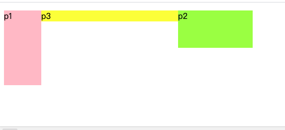

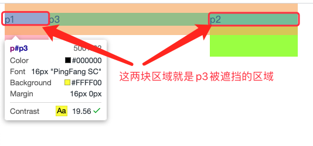

* 给未使用浮动的元素添加 `clear:left` 属性

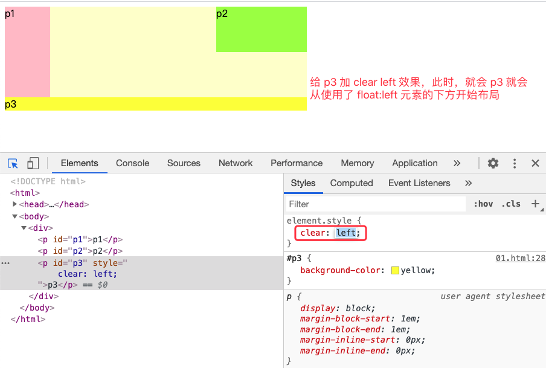

上图中，p3 没有使用浮动，所以要给它添加 `clear:left` 属性，然后就可以让使用 `float:left` 的元素在父元素中占位，所以，p3 就会摆放在该元素的下方。

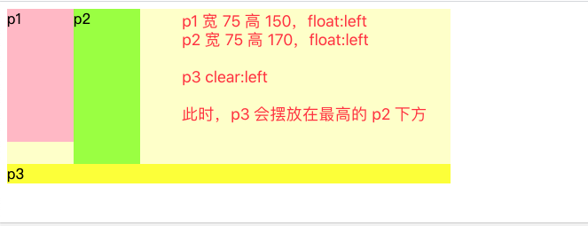

* 给未使用浮动的元素添加 `clear:right` 属性

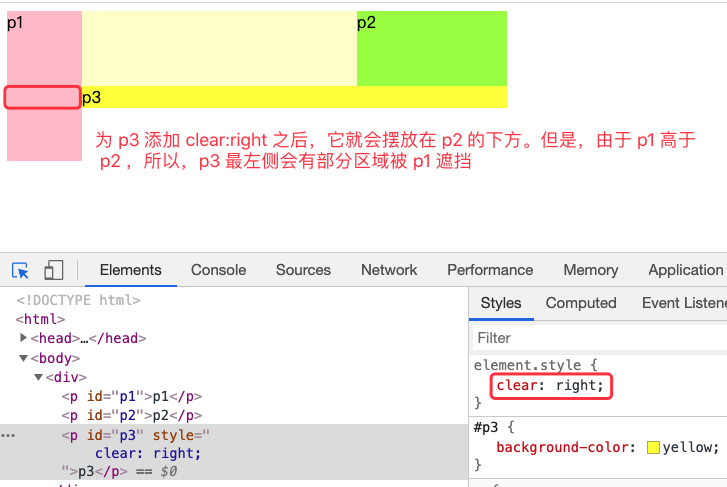

上图中，为 p3 添加 `clear:right` 属性之后，它就会摆放在 p2 的下方。但是，由于 p1 比 p2 高，所以，p1 会遮挡 p3 的部分区域。

* `clear:both`

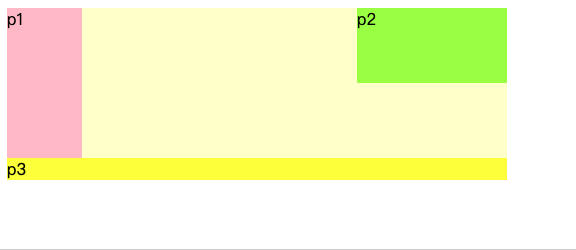

如上图 `clear:both` 之后就不会遮挡内容了


## 4.3 让父元素围住浮动的子元素

让父元素围住浮动子元素的目的是为了避免布局错乱，如下：

```html
<head>
    <meta charset="UTF-8" />
    <style>
        #div1 {
            width: 500px;
            background-color: #ffc;
        }
        
        #div2 {
            width: 500px;
            background-color: #cff;
        }
        
        #p1 {
            width: 75px;
            height: 150px;
            margin: 0px;
            float: left;
            background-color: pink;
        }
        
        #p2 {
            margin: 0px;
            width: 75px;
            height: 175px;
            float: right;
            background-color: greenyellow;
        }
    </style>
</head>

<body>
    <div id="div1">
        <p id="p1">p1</p>
        <p id="p2">p2</p>
    </div>

    <div id="div2"> div2 </div>
</body>
```

上述代码的运行效果如下：

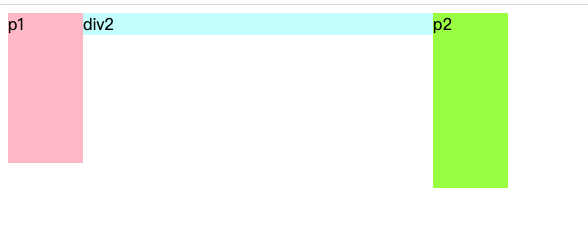

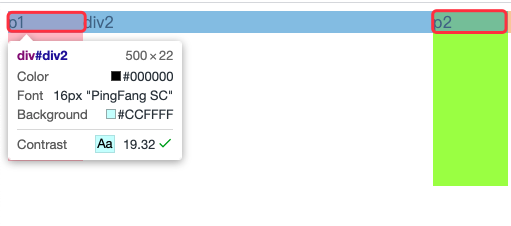

在上面的示例中，由于 div1 中的两个子元素都使用了 float 属性，所以，div1 的高度会变成 0， 那么，div2 在摆放时就会从 body 的 (0,0) 位置开始。从而导致 div2 的部分内容被 p1 和 p2 遮挡了。

### 4.3.1 `overflow:hidden`

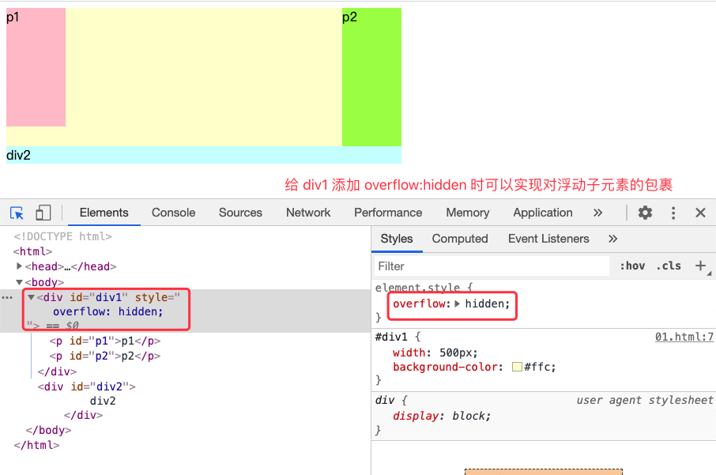

### 4.3.2 让父布局也浮动

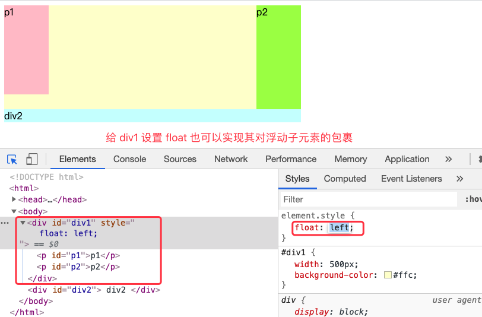

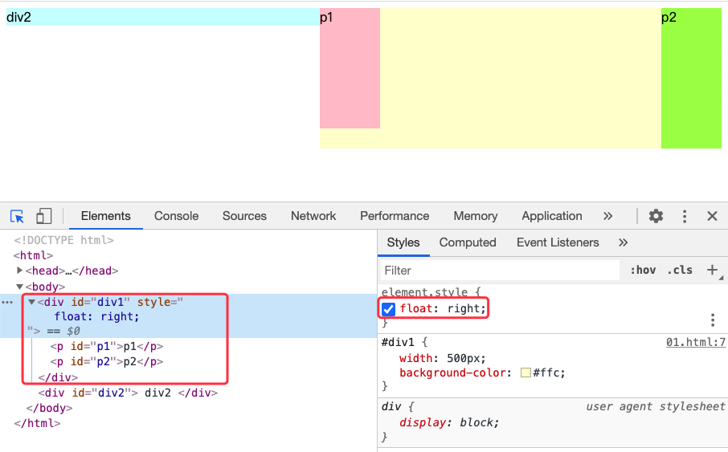

### 4.3.3 添加空的子元素，并设置 clear

在现有浮动元素的后面添加空的子元素，并设置其 `clear:both`

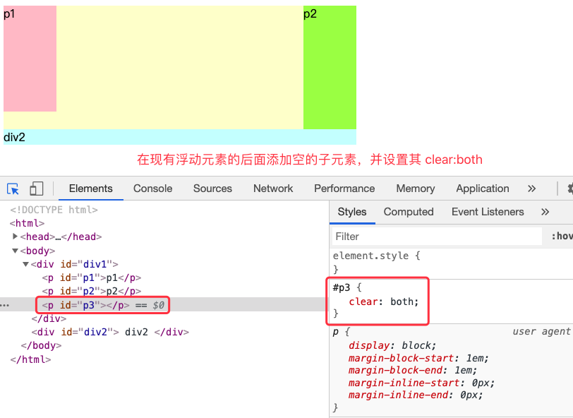

### 4.3.4 添加虚拟子元素

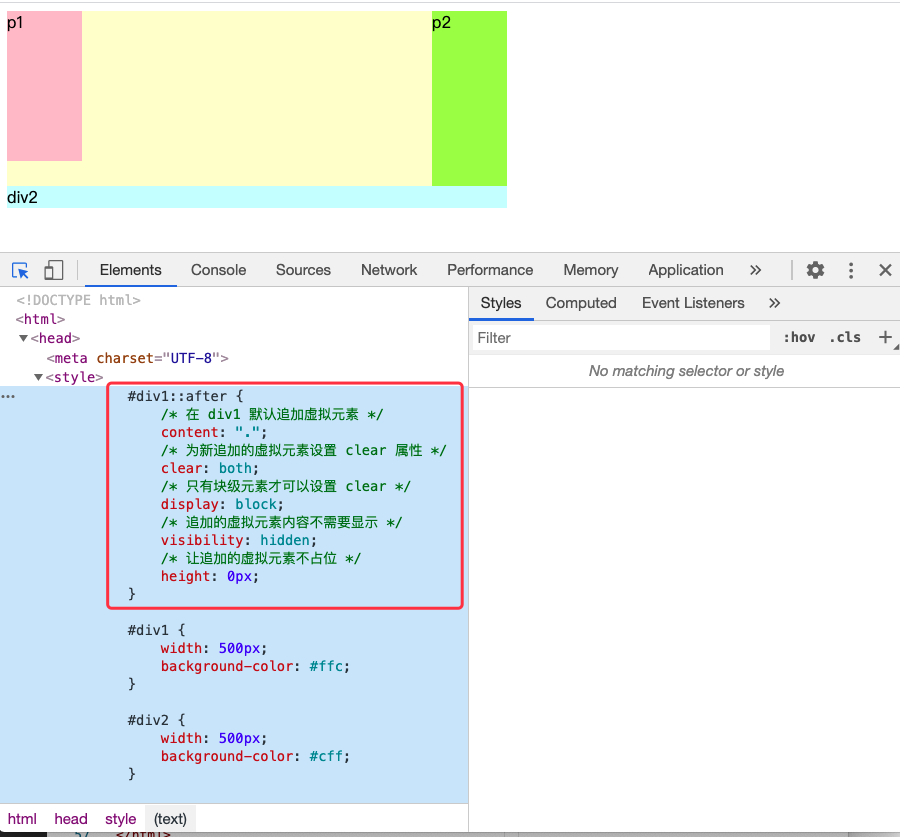

完整代码如下：

```html
<head>
    <meta charset="UTF-8" />
    <style>
        #div1::after {
            /* 在 div1 默认追加虚拟元素 */
            content: ".";
            /* 为新追加的虚拟元素设置 clear 属性 */
            clear: both;
            /* 只有块级元素才可以设置 clear */
            display: block;
            /* 追加的虚拟元素内容不需要显示 */
            visibility: hidden;
            /* 让追加的虚拟元素不占位 */
            height: 0px;
        }
        
        #div1 {
            width: 500px;
            background-color: #ffc;
        }
        
        #div2 {
            width: 500px;
            background-color: #cff;
        }
        
        #p1 {
            width: 75px;
            height: 150px;
            margin: 0px;
            float: left;
            background-color: pink;
        }
        
        #p2 {
            margin: 0px;
            width: 75px;
            height: 175px;
            float: right;
            background-color: greenyellow;
        }
    </style>
</head>

<body>
    <div id="div1">
        <p id="p1">p1</p>
        <p id="p2">p2</p>
    </div>

    <div id="div2"> div2 </div>
</body>
```

实际应用中推荐使用这种添加虚拟子元素的方式，但通常是通过类选择器实现：

```html
.clearFix::after {
            /* 在 div1 默认追加虚拟元素 */
            content: ".";
            /* 为新追加的虚拟元素设置 clear 属性 */
            clear: both;
            /* 只有块级元素才可以设置 clear */
            display: block;
            /* 追加的虚拟元素内容不需要显示 */
            visibility: hidden;
            /* 让追加的虚拟元素不占位 */
            height: 0px;
        }
```

## 4.4 基于浮动的布局 demo

```html
<head>
    <meta charset="UTF-8" />
    <style>
        * {
            margin: 0px;
            padding: 0px;
        }
        
        div {
            width: 100%;
            overflow: hidden;
            background-color: #ffc;
        }
        
        #p1 {
            width: 75px;
            height: 150px;
            float: left;
            background-color: pink;
        }
        
        #p2 {
            margin-left: 85px;
            margin-right: 85px;
            height: 160px;
            background-color: blue;
        }
        
        #p3 {
            width: 75px;
            height: 175px;
            float: right;
            background-color: greenyellow;
        }
    </style>
</head>

<body>
    <div>
        <p id="p1">p1</p>
        <p id="p3">p3</p>
        <p id="p2">p2</p>
    </div>
</body>
```

运行效果如下：

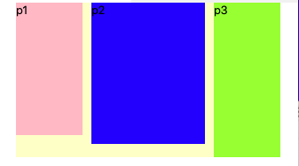

## 4.5 定位详解--position

position 的取值：

取值|含义
---|---
static | 不启用定位功能
relative | 相对定位
absolute | 绝对定位
fixed | 固定定位

### 4.5.1 相对定位

#### 4.5.1.1 基本示例

```html

<head>
    <meta charset="UTF-8" />
    <style>
        * {
            margin: 0px;
            padding: 0px;
        }
        
        div {
            width: 100%;
            overflow: hidden;
            background-color: #ffc;
        }
        
        #p1 {
            width: 75px;
            height: 80px;
            background-color: pink;
        }
        
        #p2 {
            height: 80px;
            position: relative;
            left: 20px;
            top: 30px;
            width: 75px;
            background-color: blue;
        }
        
        #p3 {
            width: 75px;
            height: 80px;
            background-color: greenyellow;
        }
    </style>
</head>

<body>
    <div>
        <p id="p1">p1</p>
        <p id="p2">p2</p>
        <p id="p3">p3</p>
    </div>
</body>
```

效果如下：

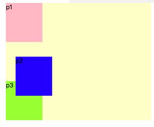

上面的示例代码中，为 p2 设置了 `position:relative` 之后，表示其启用相对定位。然后设置的 `left:20px; right:30px` 才会生效，表示相对于左侧控件 20px，相对于上方控件 30px。

但，如上图，我们需要注意，为 p2 启动相对定位并设置了相应的间距之后，p3 并没有随之下移，而是被 p2 给遮盖了。


#### 4.5.1.2 通过定位让被遮挡的内容显示在上层

```html
<head>
    <meta charset="UTF-8" />
    <style>
        * {
            margin: 0px;
            padding: 0px;
        }
        
        div {
            width: 100%;
            overflow: hidden;
            background-color: #ffc;
        }
        
        #p1 {
            width: 75px;
            height: 80px;
            background-color: pink;
        }
        
        #p2 {
            height: 80px;
            width: 75px;
            background-color: blue;
        }
        
        #p3 {
            width: 75px;
            height: 80px;
margin-top: -30px;
            background-color: greenyellow;
        }
    </style>
</head>

<body>
    <div>
        <p id="p1">p1</p>
        <p id="p2">p2</p>
        <p id="p3">p3</p>
    </div>
</body>
```

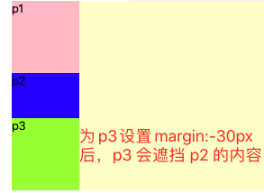

如上图，由于为 p3 设置了 `margin-top:-30px` , 所以 p3 会整体上移，从而覆盖了 p2 的内容。为了让 p2 的内容能够显示出来，我们可以为 p2 启用定位——启用定位的控件会优先渲染。如下：

```html
 #p2 {
            height: 80px;
            width: 75px;
            position: relative;
            background-color: blue;
        }
```

效果如下：

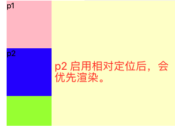

#### 4.5.1.3 `z-index`

```html

<head>
    <meta charset="UTF-8" />
    <style>
        * {
            margin: 0px;
            padding: 0px;
        }
        
        div {
            width: 100%;
            overflow: hidden;
            background-color: #ffc;
        }
        
        #p1 {
            width: 75px;
            height: 80px;
            background-color: pink;
        }
        
        #p2 {
            height: 80px;
            width: 75px;
            position: relative;
            background-color: blue;
        }
        
        #p3 {
            width: 75px;
            position: relative;
            height: 80px;
            margin-top: -30px;
            background-color: greenyellow;
        }
    </style>
</head>

<body>
    <div>
        <p id="p1">p1</p>
        <p id="p2">p2</p>
        <p id="p3">p3</p>
    </div>
</body>
```

效果如下：

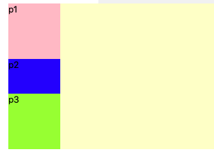
 
在上述示例中，我们将 p2 和 p3 都启用的定位功能，此时他们会按照 body 中定义的顺序进行渲染，所以，p3 又盖住了 p2 的部分内容。此时，我们可以通过 `z-index` 调整 p2 和 p3 的渲染顺序，取值大的渲染层级高（即后渲染）。如下：

```html
 #p2 {
            height: 80px;
            width: 75px;
            position: relative;
            background-color: blue;
            z-index: 3;
        }
        
        #p3 {
            width: 75px;
            position: relative;
            height: 80px;
            z-index: 2;
            margin-top: -30px;
            background-color: greenyellow;
        }
```

效果如下:

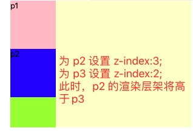

### 4.5.2 绝对定位

#### 4.5.2.1 基本使用

未启动定位时普通排列的三个 p 标签：

```html
<head>
    <meta charset="UTF-8" />
    <style>
        * {
            margin: 0px;
            padding: 0px;
        }
        
        div {
            width: 100%;
            overflow: hidden;
            background-color: #ffc;
        }
        
        #p1 {
            width: 40px;
            height: 80px;
            background-color: pink;
        }
        
        #p2 {
            height: 80px;
            width: 40px;
            background-color: blue;
        }
        
        #p3 {
            width: 80px;
            height: 40px;
            background-color: greenyellow;
        }
    </style>
</head>

<body>
    <div>
        <p id="p1">p1</p>
        <p id="p2">p2</p>
        <p id="p3">p3</p>
    </div>
</body>
```


为 p2 启动绝对定位：

```html
 #p2 {
            height: 80px;
            width: 40px;
            position: absolute;
            background-color: blue;
        }
```

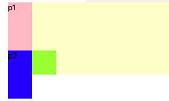

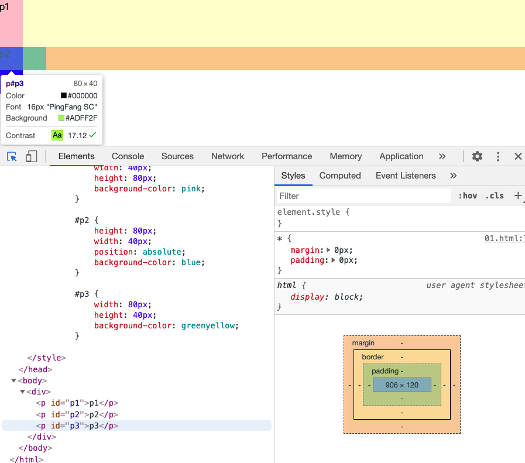

在上面的示例中，我们为 p2 设置了 `position: absolute;` 之后，它会浮在上层，从而覆盖了 p3 的部分内容，也就是说，**绝对布局的效果与 float 浮动一样，都会从父布局中浮动出来**。

#### 4.5.2.2 绝对定位的参照物

**绝对布局在摆放时，会以启用了定位功能的上层布局（含父布局、爷爷布局、html 跟布局，直到浏览器最外层与浏览器窗口同等大小的首屏区域--但不是浏览器窗口）为参照物。**

```html

<head>
    <meta charset="UTF-8" />
    <style>
        * {
            margin: 0px;
            padding: 0px;
        }
        
        div {
            width: 100%;
            overflow: hidden;
            background-color: #ffc;
        }
        
        #p1 {
            width: 40px;
            height: 80px;
            background-color: pink;
        }
        
        #p2 {
            height: 80px;
            width: 40px;
            position: absolute;
            left: 20px;
            top: 20px;
            background-color: blue;
        }
        
        #p3 {
            width: 80px;
            height: 40px;
            background-color: greenyellow;
        }
    </style>
</head>

<body>
    <div>
        <p id="p1">p1</p>
        <p id="p2">p2</p>
        <p id="p3">p3</p>
    </div>
</body>
```

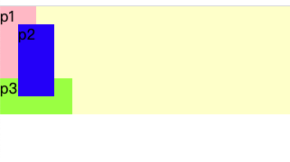

上述代码中，因为 p2 的父布局、爷布局等都没有启用定位，所以，会以最顶层的首屏区域为定位参照物。

```html
<head>
    <meta charset="UTF-8" />
    <style>
        * {
            margin: 0px;
            padding: 0px;
        }
        
        div {
            margin: 50px;
            width: 100%;
            overflow: hidden;
            position: relative;
            background-color: #ffc;
        }
        
        #p1 {
            width: 40px;
            height: 80px;
            background-color: pink;
        }
        
        #p2 {
            height: 80px;
            width: 40px;
            position: absolute;
            left: 20px;
            top: 20px;
            background-color: blue;
        }
        
        #p3 {
            width: 80px;
            height: 40px;
            background-color: greenyellow;
        }
    </style>
</head>

<body>
    <div>
        <p id="p1">p1</p>
        <p id="p2">p2</p>
        <p id="p3">p3</p>
    </div>
</body>
```

效果如下：

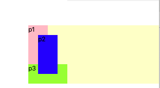

上述代码中，因为 p2 的父层布局 div 启动了 `position:relative` ，所以，p2 的绝对定位就会以 div 为参照物。

### 4.5.3 固定定位-fixed

#### 4.5.3.1 基本使用

下面的代码是未启动定位时的效果：

```html
<head>
    <meta charset="UTF-8" />
    <style>
        * {
            margin: 0px;
            padding: 0px;
        }
        
        div {
            width: 100%;
            overflow: hidden;
            background-color: #ffc;
        }
        
        #p1 {
            width: 40px;
            height: 250px;
            background-color: pink;
        }
        
        #p2 {
            height: 80px;
            width: 40px;
            left: 20px;
            top: 20px;
            background-color: blue;
        }
        
        #p3 {
            width: 80px;
            height: 40px;
            background-color: greenyellow;
        }
    </style>
</head>

<body>
    <div>
        <p id="p1">p1</p>
        <p id="p2">p2</p>
        <p id="p3">p3</p>
    </div>
</body>
```

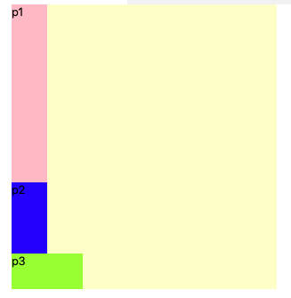

设置 p2 的定位模式为 fixed :

```css
 #p2 {
            height: 80px;
            width: 40px;
            position: fixed;
            top: 30px;
            background-color: blue;
        }
```

效果如下：

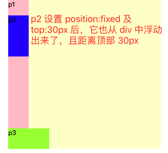

#### 4.5.3.2 fixed 与 absolute 的区别

fixed 和 absolute 都可以实现浮动，二者的区别在于:

* 设置 fixed 后，元素的位置使用固定，不会随着界面的滚动而滚动
* 设置 absolute 之后，元素的位置是相对于父布局的，会随着界面的滚动而发生滚动。
 

## 4.6 绝对定位的应用 demo

绝对定位通常用于组件的局部布局。

```html

<head>
    <meta charset="UTF-8" />
    <style>
        * {
            margin: 0px;
            padding: 0px;
        }
        
        ul {
            background-color: #ffc;
            width: 300px;
        }
        
        li {
            background-color: rgb(4, 168, 113);
            color: #fff;
            height: 60px;
            margin-bottom: 10px;
            line-height: 60px;
        }
    </style>
</head>

<body>
    <div>
        <h4>请勾选已经读过的书：</h2>
            <ul>
                <li> 11111 <input type="checkbox" /></li>
                <li>2222222 <input type="checkbox" /></li>
                <li>3333333333 <input type="checkbox" /></li>
            </ul>
    </div>
</body>
```

效果如下：

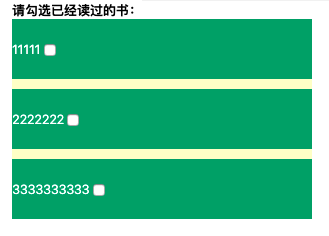

上述代码中， 111111、222222、333333 是书名，我们发现，checkbox 紧随其后，这样排列不整齐，我们希望能够让 checkbox 统一靠右对齐，并实现垂直居中。

### 4.6.1 通过 float 浮动实现

```html
 <style>
        /* 其他省略 */
        
        input[type="checkbox"] {
            float: right;
            width: 20px;
            height: 20px;
            margin-right: 40px;
            /* li 的高度为 60，checkbox 也设置了宽高 20px，所以，margin-top 后，可以垂直居中 */
            margin-top: 20px;
        }
    </style>
```

显示效果如下：

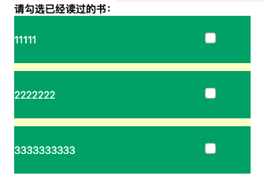

### 4.6.2 通过绝对定位实现

```html
<style>
 li {
            background-color: rgb(4, 168, 113);
            color: #fff;
            height: 60px;
            margin-bottom: 10px;
            line-height: 60px;
            position: relative;
        }
        
        input[type="checkbox"] {
            width: 20px;
            height: 20px;
            /* 父布局 li 启用了相对定位，所以该绝对定位会生效 */
            position: absolute;
            /* 距离父布局顶部 20px */
            top: 20px;
            /* 距离父布局右侧 40px */
            right: 40px;
        }
  </style>        
```

显示效果（同浮动方式实现效果一致)：


## 4.7 固定定位的应用 demo

需要实现的效果是，让指定元素固定的显示在指定的位置——不论屏幕区域的内容是否滚动，它的位置都固定。

```html

<head>
    <meta charset="UTF-8" />
    <style>
        * {
            margin: 0px;
            padding: 0px;
        }
        
        ul {
            background-color: #ffc;
            width: 300px;
        }
        
        li {
            background-color: rgb(4, 168, 113);
            color: #fff;
            height: 60px;
            margin-bottom: 10px;
            line-height: 60px;
            position: relative;
        }
        
        input[type="checkbox"] {
            width: 20px;
            height: 20px;
            /* 父布局 li 启用了相对定位，所以该绝对定位会生效 */
            position: absolute;
            /* 距离父布局顶部 20px */
            top: 20px;
            /* 距离父布局右侧 40px */
            right: 40px;
        }
        
        button {
            width: 60px;
            height: 60px;
            position: fixed;
            right: 20px;
            /* 让按钮的上边缘居于屏幕高度的 1/2 */
            top: 50%;
            /* button 高度为 60，所以上移 30px 配合上面的 top:50% 即可实现完全垂直居中 */
            margin-top: -30px;
        }
    </style>
</head>

<body>
    <div>
        <h4>请勾选已经读过的书：</h2>
            <ul>
                <li> 11111 <input type="checkbox" /></li>
                <li>2222222 <input type="checkbox" /></li>
                <li>3333333333 <input type="checkbox" /></li>
            </ul>
            <button>我要反馈</button>
    </div>
</body>
```

效果如下：

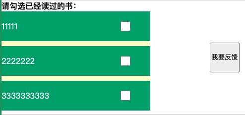

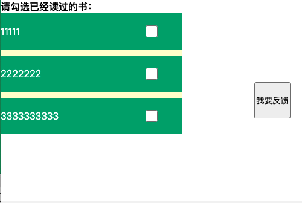

如上图，我们发现，不论窗口有多高，button 固定的都处于垂直居中的位置。

## 4.8 Flexbox布局介绍

[w3.org : CSS Flexible Box Layout Module Level 1](https://www.w3.org/TR/css-flexbox-1/#box-model)

### 4.8.1 简单实用

 未启用 flex 布局时的代码：

```html
<head>
    <meta charset="UTF-8" />
    <title>position details </title>
    <style>
        * {
            margin: 0px;
            padding: 0px;
        }
        
        .container {
            width: 1200px;
            margin: 0 auto;
            background-color: #eee;
        }
        
        .box {
            height: 30px;
            font-size: 20px;
            width: 30px;
        }
        
        .box1 {
            background: #bdc3cc;
        }
        
        .box2 {
            background: #2eccaa;
        }
        
        .box3 {
            background: #169045;
        }
        
        .box4 {
            background: #34ff66;
        }
        
        .box5 {
            background: #f1c400;
        }
        
        .box6 {
            background: #e67e22;
        }
        
        .box7 {
            background: #e74ccc;
        }
        
        .box8 {
            background: #1abcff;
        }
        
        .box9 {
            background: #3498dd;
        }
        
        .box10 {
            background: #9b59bb;
        }
    </style>
</head>

<body>
    <div class="container">
        <div class="box box1">1</div>
        <div class="box box2">2</div>
        <div class="box box3">3</div>
        <div class="box box4">4</div>
        <div class="box box5">5</div>
        <div class="box box6">6</div>
        <div class="box box7">7</div>
        <div class="box box8">8</div>
        <div class="box box9">9</div>
        <div class="box box10">10</div>
    </div>
</body>
```

效果如下：


#### 4.8.1.1 启用 flex 布局

```css
/*其他内容基于上一节代码*/
.container {
            width: 1200px;
            margin: 0 auto;
            background-color: #eee;
            display: flex;
        }
```

效果如下：

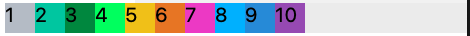

#### 4.8.1.2 配合 ` justify-content: center;` 实现水平居中

```css
/*其他内容基于上一节代码*/
.container {
            width: 1200px;
            margin: 0 auto;
            background-color: #eee;
            display: flex;
            justify-content: center;
        }
```

效果如下：

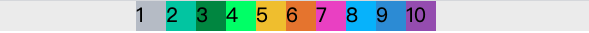

#### 4.8.1.3 `flex-direction` 调整排列方式

```html
/*其他内容基于上一节代码*/
 .container {
            width: 1200px;
            margin: 0 auto;
            background-color: #eee;
            display: flex;
            justify-content: center;
            flex-direction: column;
        }
```

效果如下：

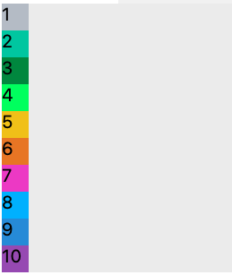

#### 4.8.1.4 通过 `order` 调整显示顺序

```css
/*其他内容基于上一节代码*/
.box3 {
            /* order 默认为0，小值优先摆放 */
            order: -1;
            background: #169045;
        }
```

效果如下：

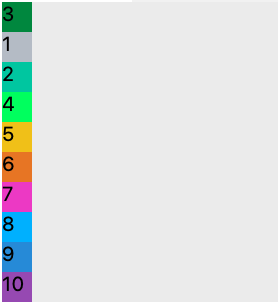

### 4.8.2 轴

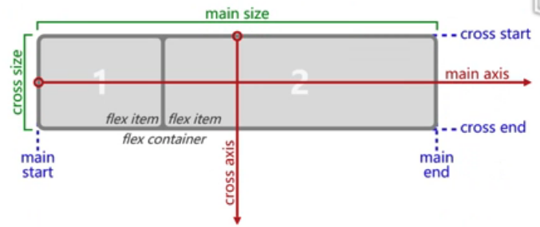

轴 即元素的排列方向。当元素从左向右排列时，主轴即水平方向线，与之垂直交叉的称为测轴；当元素从上向下排列时，主轴即为垂直方向线，水平方向线则为测轴。

轴可以通过 `flex-direction` 设置, 默认从左往右。

### 4.8.3 行

基于 4.8.1 的最终效果，我们再设置 `flex-wrap` ,此时内容就可以换行显示：

```css
/* 基于 4.8.1 的最终效果 */
 .container {
            width: 120px;
            margin: 0 auto;
            background-color: #eee;
            display: flex;
            justify-content: center;
            /* flex-direction: column; */
            flex-wrap: wrap;
        }
```

效果如下：

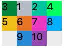

如上图，界面中的内容产生了换行，每一行都称为 `flex line` ，即 flex 行。

如果我们把代码修改成下面的样子：

```css
.container {
            height: 120px;
            margin: 0 auto;
            background-color: #eee;
            display: flex;
            justify-content: center;
            flex-direction: column;
            flex-wrap: wrap;
        }
```

效果如下：

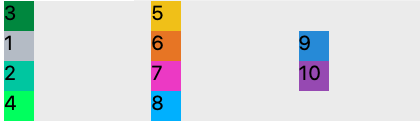

由于上述代码中指定了 `flex-direction:column`  也就是垂直排列，并且指定了  `flex-wrap: wrap;` , 所以就会以列的形式显示内容。这里的列也被称为 `flex line`，即 flex 行。

**也就是说，flex 受 `flex-direction` 影响，flex 行的方向与 `flex-driection` 的方向一致** 

### 4.8.4 flex container 和 flex item

声明了 `display:flex` 的容器就称为 `flex container`, 该容器内的子元素就称为 `flex item`


## 4.9 Flexbox相关属性详解

[参考：A Complete Guide to Flexbox](https://css-tricks.com/snippets/css/a-guide-to-flexbox/#flexbox-basics)

### 4.9.1 flex container 的属性

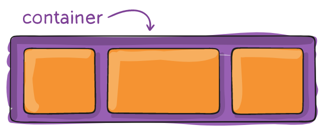

#### 4.9.1.1 display

```css
.container {
  display: flex; /* or inline-flex */
}
```

#### 4.9.1.2 `flex-direction` 轴向

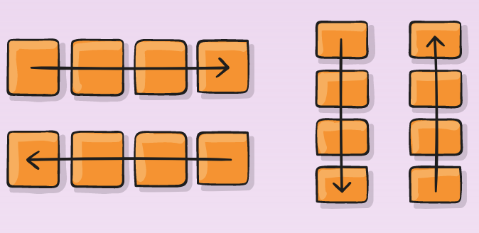

```css
.container {
  flex-direction: row | row-reverse | column | column-reverse;
}
```

#### 4.9.1.3 `flex-wrap` 自动换行

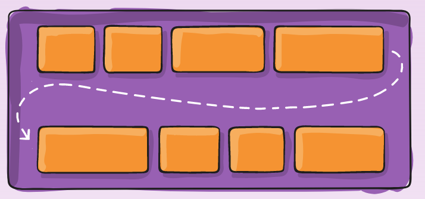

```css
.container {
  flex-wrap: nowrap | wrap | wrap-reverse;
}
```

#### 4.9.1.4 `flex-flow`

是 `flex-direction` 和 `flex-wrap` 二者的简写，同时定义了主轴和交叉轴（测轴），默认取值 `row nowrap`

```css
.container {
	/* 前面设置 flex-dircetion 的取值，后面设置 flex-wrap 的取值 */
  flex-flow: <‘flex-direction’> || <’flex-wrap‘>;
}
```

```css
.container {
  flex-flow: column wrap;
}
```

#### 4.9.1.5 `justify-content`

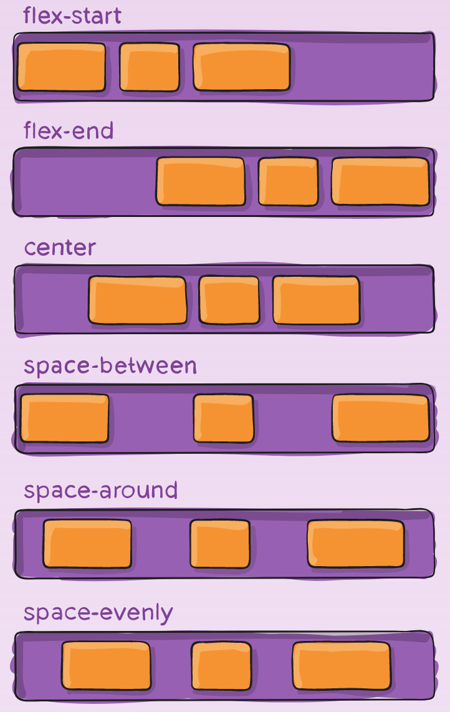

```css
.container {
  justify-content: flex-start | flex-end | center | space-between | space-around | space-evenly | start | end | left | right ... + safe | unsafe;
}
```

* `flex-start` (default): items are packed toward the start of the flex-direction.
* `flex-end`: items are packed toward the end of the flex-direction.
* `start`: items are packed toward the start of the writing-mode direction.
* `end`: items are packed toward the end of the writing-mode direction.
* `left`: items are packed toward left edge of the container, unless that doesn’t make sense with the flex-direction, then it behaves like start.
* `right`: items are packed toward right edge of the container, unless that doesn’t make sense with the flex-direction, then it behaves like start.
* `center`: items are centered along the line
* `space-between`: items are evenly distributed in the line; first item is on the start line, last item on the end line
* `space-around`: items are evenly distributed in the line with equal space around them. Note that visually the spaces aren’t equal, since all the items have equal space on both sides. The first item will have one unit of space against the container edge, but two units of space between the next item because that next item has its own spacing that applies.
* `space-evenly`: items are distributed so that the spacing between any two items (and the space to the edges) is equal.


Note that that browser support for these values is nuanced ([nju:'ɑ:nst]
adj. 微妙的；具有细微差别的). For example, space-between never got support from some versions of Edge, and start/end/left/right aren’t in Chrome yet. MDN has detailed charts. The safest values are flex-start, flex-end, and center.

There are also two additional keywords you can pair with these values: `safe` and `unsafe`. Using safe ensures that however you do this type of positioning, you can’t push an element such that it renders off-screen (e.g. off the top) in such a way the content can’t be scrolled too (called “data loss”).

#### 4.9.1.6 `align-items` 

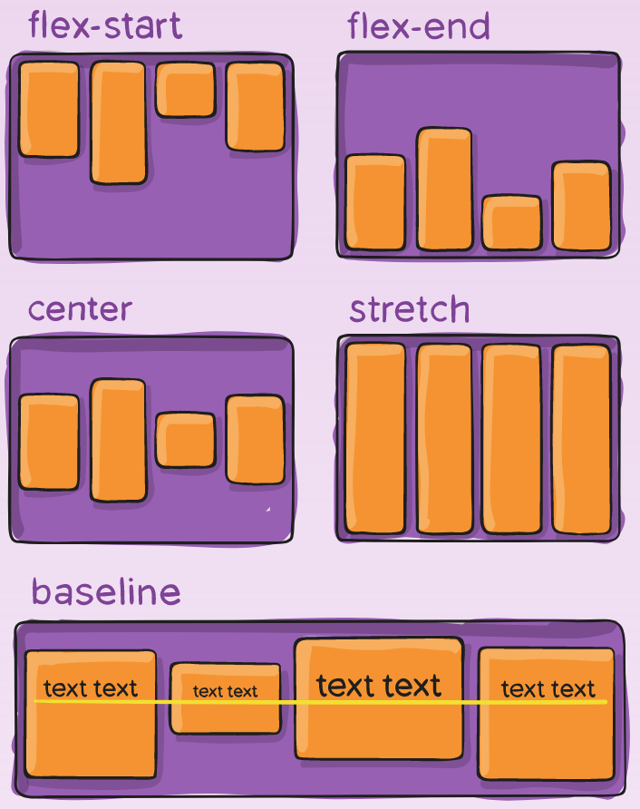

```css
.container {
  align-items: stretch | flex-start | flex-end | center | baseline | first baseline | last baseline | start | end | self-start | self-end + ... safe | unsafe;
}
```

This defines the default behavior for how flex items are laid out along the cross axis on the current line. Think of it as the justify-content version for the cross-axis (perpendicular to the main-axis).

* `stretch` (default): stretch to fill the container (still respect min-width/max-width),注意，只有在明确设置 height 的时候才会做伸展。
* `flex-start / start / self-start`: items are placed at the start of the cross axis. The difference between these is subtle, and is about respecting the flex-direction rules or the writing-mode rules.
* `flex-end / end / self-end`: items are placed at the end of the cross axis. The difference again is subtle and is about respecting flex-direction rules vs. writing-mode rules.
* `center`: items are centered in the cross-axis
* `baseline`: items are aligned such as their baselines align

The safe and unsafe modifier keywords can be used in conjunction with all the rest of these keywords (although note browser support), and deal with helping you prevent aligning elements such that the content becomes inaccessible.

#### 4.9.1.7 `align-content`

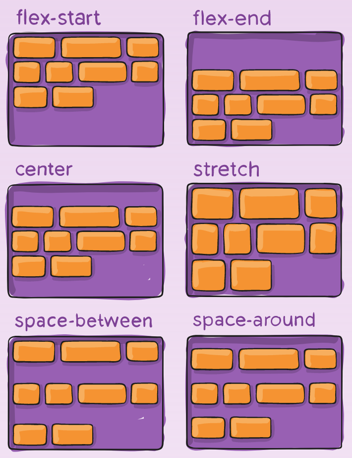

```css
.container {
  align-content: flex-start | flex-end | center | space-between | space-around | space-evenly | stretch | start | end | baseline | first baseline | last baseline + ... safe | unsafe;
}

```

This aligns a flex container’s lines within when there is extra space in the cross-axis, similar to how justify-content aligns individual items within the main-axis.

**Note: this property has no effect when there is only one line of flex items.**

* `flex-start / start`: items packed to the start of the container. The (more supported) flex-start honors the flex-direction while start honors the writing-mode direction.
* `flex-end / end`: items packed to the end of the container. The (more support) flex-end honors the flex-direction while end honors the writing-mode direction.
* `center`: items centered in the container
* `space-between`: items evenly distributed; the first line is at the start of the container while the last one is at the end
* `space-around`: items evenly distributed with equal space around each line
* `space-evenly`: items are evenly distributed with equal space around them
* `stretch` (default): lines stretch to take up the remaining space

The safe and unsafe modifier keywords can be used in conjunction with all the rest of these keywords (although note browser support), and deal with helping you prevent aligning elements such that the content becomes inaccessible.

```html

<head>
    <meta charset="UTF-8" />
    <title>position details </title>
    <style>
        * {
            margin: 0px;
            padding: 0px;
        }
        /* 基于 4.8.1 的最终效果 */
        
        .container {
            width: 120px;
            height: 200px;
            margin: 0 auto;
            background-color: #eee;
            display: flex;
            justify-content: center;
            flex-direction: row;
            align-content: flex-end;
            flex-wrap: wrap;
        }
        
        .box {
            /* height: 30px; */
            font-size: 20px;
            width: 30px;
        }
        
        .box1 {
            background: #bdc3cc;
        }
        
        .box2 {
            background: #2eccaa;
        }
        
        .box3 {
            /* order */
            order: -1;
            background: #169045;
        }
        
        .box4 {
            background: #34ff66;
        }
        
        .box5 {
            background: #f1c400;
        }
        
        .box6 {
            background: #e67e22;
        }
        
        .box7 {
            background: #e74ccc;
            flex-shrink: 2;
        }
        
        .box8 {
            background: #1abcff;
            flex-shrink: 4;
        }
        
        .box9 {
            background: #3498dd;
        }
        
        .box10 {
            background: #9b59bb;
        }
    </style>
</head>

<body>
    <div class="container">
        <div class="box box1">1</div>
        <div class="box box2">2</div>
        <div class="box box3">3</div>
        <div class="box box4">4</div>
        <div class="box box5">5</div>
        <div class="box box6">6</div>
        <div class="box box7">7</div>
        <div class="box box8">8</div>
        <div class="box box9">9</div>
        <div class="box box10">10</div>
    </div>
</body>
```

效果如下：

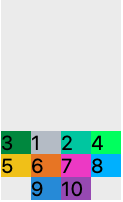

### 4.9.2

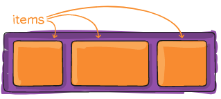


#### 4.9.2.1 order

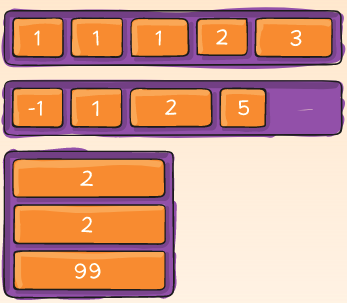

By default, flex items are laid out in the source order. However, the order property controls the order in which they appear in the flex container.

默认情况下，flex 容器中的 items 是按照源码中的书写顺序进行排列的。但是，通过 order 属性我们可以改变这些条目的显示顺序。

默认情况下，每个条目的 order 取值为 0，取值小的优先显示，取值大的后显示。

```css
.item {
  order: 5; /* default is 0 */
}
```

#### 4.9.2.2 `flex-grow`

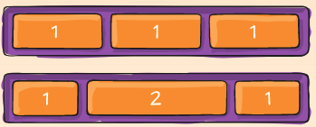

```css
.item {
  flex-grow: 4; /* default 0 */
}
```

取值为正数，负数无效，默认值为0，不带单位，表示一个比例。

当条目内容不足以填满容器时，

* 如果我们为某个条目设置了 `flex-grow`, 则该条目会占满剩余空间。
* 如果我们同时为多个条目设置了 `flex-grow`, 则会按照其值进行分配。如：条目 1 设置的 `flex-grow` 为2，条目 2 设置的 `flex-grow` 为 3，那么，条目 1 会占据容器的 2/5，条目 2 会占据容器的 3/5。

This defines the ability for a flex item to grow if necessary. It accepts a unitless value that serves as a proportion. It dictates what amount of the available space inside the flex container the item should take up.

If all items have flex-grow set to 1, the remaining space in the container will be distributed equally to all children. If one of the children has a value of 2, the remaining space would take up twice as much space as the others (or it will try to, at least).

#### 4.9.2.3 `flex-shrink`

```css
.item {
  flex-shrink: 3; /* default 1 */
}
```

This defines the ability for a flex item to shrink if necessary.

Negative numbers are invalid.

#### 4.9.2.4 `flex-basis`

```css
.item {
  flex-basis:  | auto; /* default auto */
}
```

This defines the default size of an element before the remaining space is distributed. It can be a length (e.g. 20%, 5rem, etc.) or a keyword. The auto keyword means “look at my width or height property” (which was temporarily done by the main-size keyword until deprecated). The content keyword means “size it based on the item’s content” – this keyword isn’t well supported yet, so it’s hard to test and harder to know what its brethren max-content, min-content, and fit-content do.

If set to 0, the extra space around content isn’t factored in. If set to auto, the extra space is distributed based on its flex-grow value. 如下：

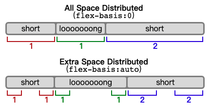

#### 4.9.2.5 `flex`

```css
.item {
  flex: none | [ <'flex-grow'> <'flex-shrink'>? || <'flex-basis'> ]
}
```

This is the shorthand for flex-grow, flex-shrink and flex-basis combined. The second and third parameters (flex-shrink and flex-basis) are optional. The default is 0 1 auto, but if you set it with a single number value, it’s like 1 0.

**It is recommended that you use this shorthand property rather than set the individual properties**. The shorthand sets the other values intelligently.

#### 4.9.2.6 `align-self`

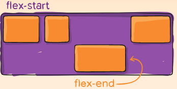

```css
.item {
  align-self: auto | flex-start | flex-end | center | baseline | stretch;
}
```

This allows the default alignment (or the one specified by align-items) to be overridden for individual flex items.

Please see the align-items explanation to understand the available values.

Note that `float`, `clear` and `vertical-align` have no effect on a flex item.

## 4.10 Flexbox 应用 demo

### 4.10.1 让子元素始终位于父元素的正中心


#### 4.10.1.1 基于定位实现

```html
<head>
    <meta charset="UTF-8" />
    <title>position details </title>
    <style>
        * {
            margin: 0px;
            padding: 0px;
        }
        
        .container {
            width: 320px;
            /* 让元素与视窗高度保持一致 */
            height: 100vh;
            background-color: #eee;
            position: relative;
        }
        
        .box1 {
            background: aquamarine;
            width: 60px;
            height: 60px;
            position: absolute;
            /* 水平方向左上角起点居中 */
            left: 50%;
            /* 垂直方向上左上角起点居中 */
            top: 50%;
            /* 上移 1/2 视图高度 */
            margin-top: -30px;
            /* 左移 1/2 视图高度 */
            margin-left: -30px;
        }
    </style>
</head>

<body>
    <div class="container">
        <div class="box1">1</div>
    </div>
</body>
```

#### 4.10.1.2 基于 flex 实现

```html
<head>
    <meta charset="UTF-8" />
    <title>position details </title>
    <style>
        * {
            margin: 0px;
            padding: 0px;
        }
        
        .container {
            width: 320px;
            /* 让元素与视窗高度保持一致 */
            height: 100vh;
            background-color: #eee;
            display: flex;
            justify-content: center;
            align-items: center;
        }
        
        .box1 {
            background: aquamarine;
            width: 60px;
            height: 60px;
        }
    </style>
</head>

<body>
    <div class="container">
        <div class="box1">1</div>
    </div>
</body>
```

效果如下：


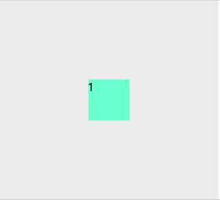

基于定位的方式不灵活，会随着子元素宽高的变化而修改代码。flex 方式灵活，不需要关心子元素的宽高情况。

### 4.10.2 实现子元素的等高等宽排列

**注意：此处代码有问题，未能实现视频中等宽等高的效果，暂时不确定问题出在哪里。😢 下面的示例只是其中的部分代码**

```html
<head>
    <meta charset="UTF-8" />
    <title>position details </title>
    <style>
        body {
            margin: 0px;
        }
        
        header {
            background: #c3a;
            height: 50px;
        }
        
        h2 {
            text-align: center;
            color: #fff;
            line-height: 50px;
            margin: 0;
        }
        
        section {
            display: flex;
            flex-wrap: wrap;
        }
        
        article {
            width: 200px;
            background: #ffc;
            margin: 10px;
            padding: 10px;
        }
        
        p {
            word-break: normal;
        }
    </style>
</head>

<body>
    <header>
        <h2>flexbox example</h2>
    </header>
    <section>
        <article>
            <h3>1111111</h3>
            <p>aaaaaaaaaaaaaaaaaaaaaaaaaaaaaaaaaaaaaaaaaaaaaaaaaaaaaaaa</p>
        </article>
        <article>
            <h3>2222222</h3>
            <p>bbbbbbbbbbbbbbbbbbbbbbbbbbbbbbbbbbbbbbbbbbbbbbbbbbbbbbbbbbbbbbbbbbbbbbbbbbbbbbbbbbbbbbbbbbbbbbbbbbbbbbbbbbbbbbbbbbbbbbbbbbbbbbbbbbbbbbbbbbbbbbbbbbbbbbbbbbbbbbbbbbbbbbbbbbbbbb</p>
        </article>
        <article>
            <h3>33333333</h3>
            <p>ccccccccccccccccccccccccccccccccccccccccccccccccccccccc</p>
        </article>
    </section>
</body>
```

## 4.11 Flexbox 兼容性

### 4.11.1 兼容性

[在 caniuse 网站中查看 flexbox 的兼容性](https://caniuse.com/#search=flexbox)

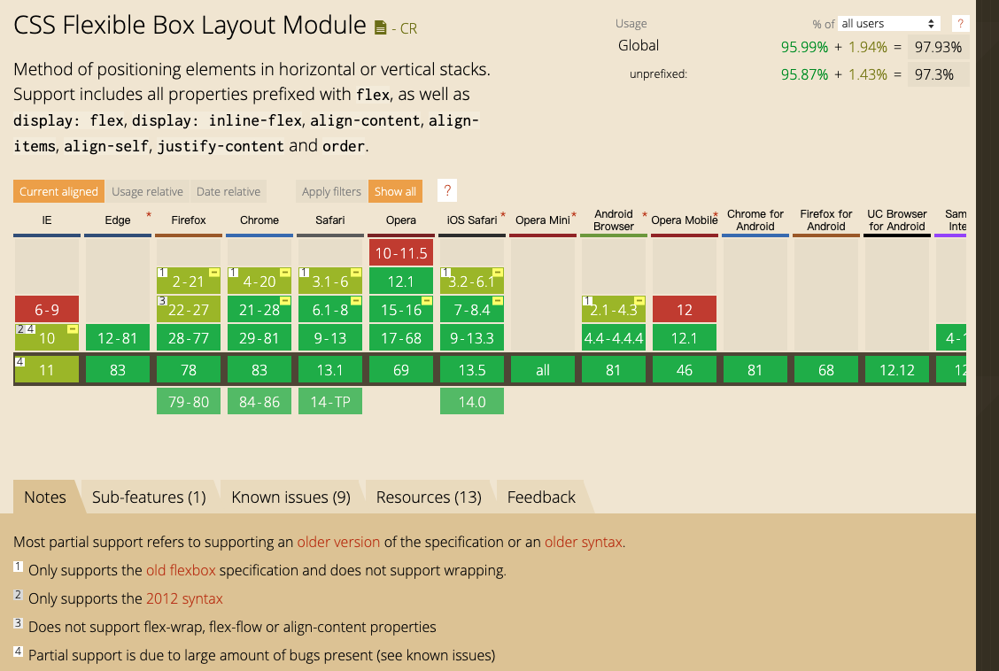

### 4.11.2 厂商前缀

厂商前缀的作用是，不同属性在不同厂商的浏览器中写法可能会有差异，通过下面的这个网站可以查看一个属性在不同浏览器中的写法， 从而实现兼容。

[需要翻墙：http://autoprefixer.github.io/](http://autoprefixer.github.io/)


## 4.12 Grid 布局简介-实现一个简单 Grid 系统

TODO
最终要实现的效果为：

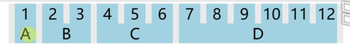

基础代码：

```html
<head>
    <meta charset="UTF-8" />
    <title>position details </title>
    <style>
        .clearfix::after {
            content: ".";
            display: block;
            clear: both;
            visibility: hidden;
        }
        
        .wrapper {
            width: 1100px;
            margin: 0 auto;
            background: #eeeeee;
        }
        
        .col {
            font-size: 50px;
            width: 70px;
            text-align: center;
            background: lightblue;
        }
    </style>
</head>

<body>
    <div class="wrapper">
        <div class="row">
            <div class="col">1</div>
            <div class="col">2</div>
            <div class="col">3</div>
            <div class="col">4</div>
            <div class="col">5</div>
            <div class="col">6</div>
            <div class="col">7</div>
            <div class="col">8</div>
            <div class="col">9</div>
            <div class="col">10</div>
            <div class="col">11</div>
            <div class="col">12</div>
        </div>
        <div class="row">
            <div class="col">A</div>
            <div class="col">B</div>
            <div class="col">C</div>
            <div class="col">D</div>
        </div>
    </div>
</body>
```

效果如下：

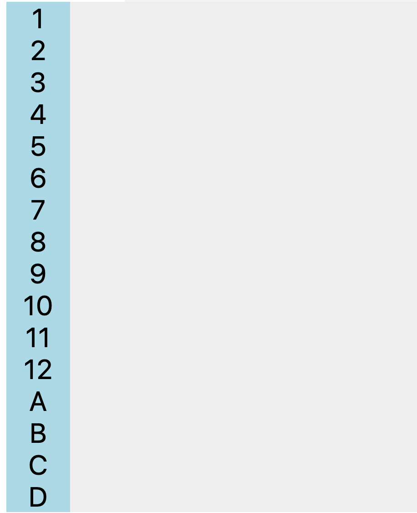

### 4.12.1 通过浮动实现

* 先实现上下两行排列

```css
.col {
            font-size: 50px;
            width: 70px;
            text-align: center;
            background: lightblue;
            float: left;
            /* 最终效果图中每个数字左右都有间距，共13个，所以，(总宽度-12数字*单个数字宽度）/13=单个数字的单侧间距 */
            margin-left: 20px;
        }
```

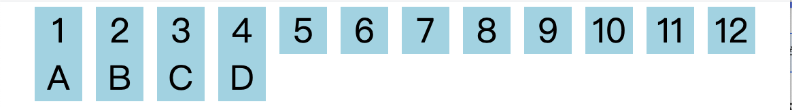

* 让父布局 wrapper 包裹子内容（让字内容摆放在父布局的灰色背景上）

```html
 <div class="wrapper clearfix">
 	<!--其他内容省略-->
 </div>
```

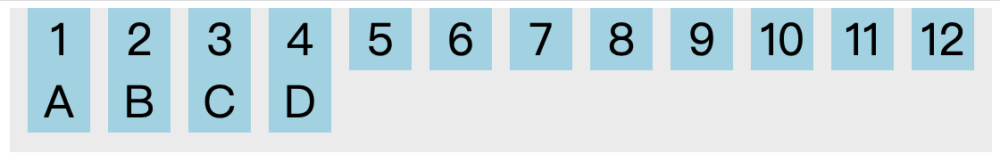

* 通过修改单元格的宽度实现跨越多列

```css
.span2 {
    /* 两个单元格的宽度+1个间距宽度 */
    width: 160px;
}

.span3 {
    /* 三个单元格宽度+2个间距 */
    width: 250px;
}

.span6 {
    /* 6个单元格宽度+5个间距 */
    width: 520px;
}
```

```html
<div class="row">
     <div class="col">A</div>
     <div class="col span2">B</div>
     <div class="col span3">C</div>
     <div class="col span6">D</div>
</div>
```

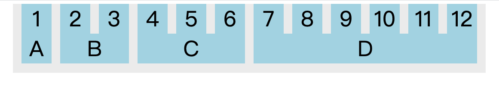

上述代码虽然能实现预定效果，但宽度都是固定的，每当宽度变化时都要修改布局，不灵活，所以，通常使用三方框架实现网格效果。

### 4.12.2 CSS Grid Layout

因为兼容性问题，原视频中没有详细介绍，后期可以自行点击该链接查看：[CSS Grid Layout Module Level 1](https://www.w3.org/TR/css-grid-1/) 

[其对个浏览器的兼容情况如下：](https://caniuse.com/#search=grid)

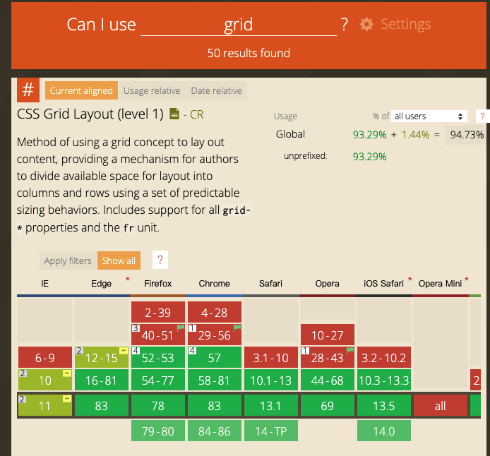


## 4.13 Boostrap Grid 系统应用 demo

[视频基于 https://getbootstrap.com/docs/3.4/css/ 中的 Grid system 讲解](https://getbootstrap.com/docs/3.4/css/)


Boostrap 是响应式的、流式的、对移动端有良好兼容的一个 Grid 框架。

### 4.13.1 通过 Boostrap 实现 4.12 中的网格效果


#### 4.13.1.1 基础代码

```html
<head>
    <meta charset="UTF-8" />
    <title>前端攻城狮</title>
    <!-- 引用三方框架 -->
    <link rel="stylesheet" type="text/css" href="bootstrap-lib/css/bootstrap.css">
    <style>
        .wrapper {
            background: #eeeeee;
        }
        
        .col {
            font-size: 50px;
            text-align: center;
            background: lightblue;
        }
    </style>
</head>

<body>
    <div class="wrapper clearfix">
        <div class="row">
            <div class="col">1</div>
            <div class="col">2</div>
            <div class="col">3</div>
            <div class="col">4</div>
            <div class="col">5</div>
            <div class="col">6</div>
            <div class="col">7</div>
            <div class="col">8</div>
            <div class="col">9</div>
            <div class="col">10</div>
            <div class="col">11</div>
            <div class="col">12</div>
        </div>
        <div class="row">
            <div class="col">A</div>
            <div class="col span2">B</div>
            <div class="col span3">C</div>
            <div class="col span6">D</div>
        </div>
    </div>
</body>
```

效果如下：

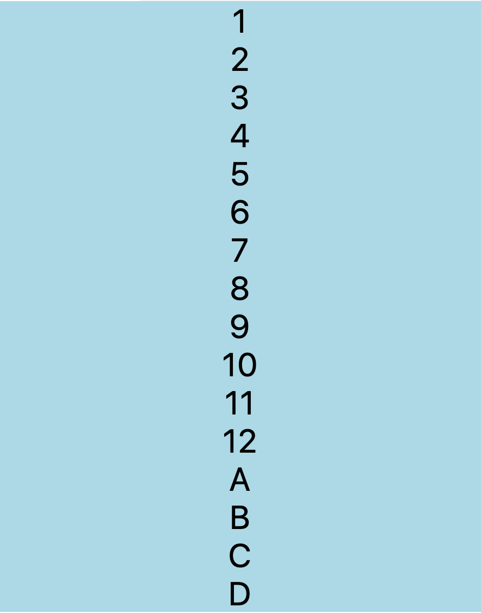

#### 4.13.1.2 实现网格效果

```html
<head>
    <meta charset="UTF-8" />
    <title>前端攻城狮</title>
    <!-- 引用三方框架 -->
    <link rel="stylesheet" href="https://stackpath.bootstrapcdn.com/bootstrap/3.4.1/css/bootstrap.min.css" integrity="sha384-HSMxcRTRxnN+Bdg0JdbxYKrThecOKuH5zCYotlSAcp1+c8xmyTe9GYg1l9a69psu" crossorigin="anonymous">

    <style>
        .wrapper {
            background: #eeeeee;
        }
        
        .col {
            font-size: 50px;
            text-align: center;
            background: lightblue;
        }
    </style>
</head>

<body>
    <div class="wrapper clearfix">
        <div class="row">
            <div class="col col-md-1">1</div>
            <div class="col col-md-1">2</div>
            <div class="col col-md-1">3</div>
            <div class="col col-md-1">4</div>
            <div class="col col-md-1">5</div>
            <div class="col col-md-1">6</div>
            <div class="col col-md-1">7</div>
            <div class="col col-md-1">8</div>
            <div class="col col-md-1">9</div>
            <div class="col col-md-1">10</div>
            <div class="col col-md-1">11</div>
            <div class="col col-md-1">12</div>
        </div>
        <div class="row">
            <div class="col col-md-1">A</div>
            <div class="col col-md-2">B</div>
            <div class="col col-md-3">C</div>
            <div class="col col-md-6">D</div>
        </div>
    </div>
</body>
```

效果如下：

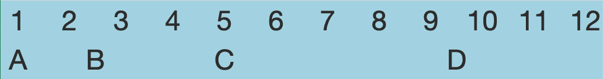

上述代码中，通过 link 引用了 BootStrap 框架，然后使用了其内置的 `col-md-` 类。

#### 4.13.1.3 BootStrap 内置类与容器宽度的对应关系

在 BootStrap 中，内置类与对应容器宽度的关系如下：

> 图片来自 [https://getbootstrap.com/docs/3.4/css/](https://getbootstrap.com/docs/3.4/css/)

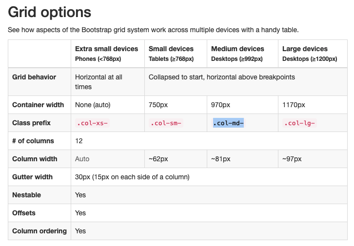

在上面的代码中，我们仅使用了 `col-md-`  类，那么，当屏幕尺寸大于等于 970px 时可以得到我们想要的网格效果；但是，如果小于 970px ，就会变成默认的显示效果。

注意，BootStrap 最大可以分为 12 列。

### 4.13.2 实现效果2

实现的目标是，在大屏效果上显示下面 4 列的样子，然后随着屏幕的变小动态适配，逐步变成 3 列、2列、1列。

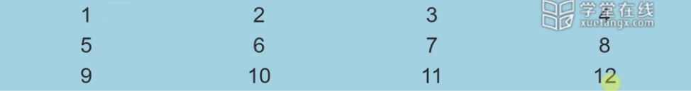

完整代码如下：

```html
<head>
    <meta charset="UTF-8" />
    <title>前端攻城狮</title>
    <!-- 引用三方库 -->
    <link rel="stylesheet" href="https://stackpath.bootstrapcdn.com/bootstrap/3.4.1/css/bootstrap.min.css" integrity="sha384-HSMxcRTRxnN+Bdg0JdbxYKrThecOKuH5zCYotlSAcp1+c8xmyTe9GYg1l9a69psu" crossorigin="anonymous">
    <style>
        .clearfix::after {
            content: ".";
            display: block;
            clear: both;
            visibility: hidden;
        }
        
        .wrapper {
            background: #eeeeee;
        }
        
        .col {
            font-size: 30px;
            text-align: center;
            background: lightblue;
        }
    </style>
</head>

<body>
    <div class="wrapper container-fluid">
        <div class="row">
            <div class="col col-xs-12 col-sm-6 col-md-4 col-lg-3">1</div>
            <div class="col col-xs-12 col-sm-6 col-md-4 col-lg-3">2</div>
            <div class="col col-xs-12 col-sm-6 col-md-4 col-lg-3">3</div>
            <div class="col col-xs-12 col-sm-6 col-md-4 col-lg-3">4</div>
            <div class="col col-xs-12 col-sm-6 col-md-4 col-lg-3">5</div>
            <div class="col col-xs-12 col-sm-6 col-md-4 col-lg-3">6</div>
            <div class="col col-xs-12 col-sm-6 col-md-4 col-lg-3">7</div>
            <div class="col col-xs-12 col-sm-6 col-md-4 col-lg-3">8</div>
            <div class="col col-xs-12 col-sm-6 col-md-4 col-lg-3">9</div>
            <div class="col col-xs-12 col-sm-6 col-md-4 col-lg-3">10</div>
            <div class="col col-xs-12 col-sm-6 col-md-4 col-lg-3">11</div>
            <div class="col col-xs-12 col-sm-6 col-md-4 col-lg-3">12</div>
        </div>
    </div>
</body>
```

上述代码中，引用了 BootStrap 框架，并使用了其内置的 `col-xs-12`、 `col-sm-6` 、`col-md-4` 、`col-lg-3` 类，从而实现了我们期望的效果。

**注意：**视频中引用该框架时，引用语句为：`<link rel="stylesheet" type="text/css" href="bootstrap-lib/css/bootstrap.css"> ` ，这么引用的前提是，已经将 BootStrap 下载到了本地，并放到了与当前 html 同目录下。

引用 BootStrap 的方式参考：[Getting started](https://getbootstrap.com/docs/3.4/getting-started/)