## 5.1 响应式设计 

响应式设计即一套代码适配所有可能出现的终端（PC、Pad、Phone等）。

实现响应式设计时需要三大技术：

* 流式布局（fluid grid）
* 弹性图片 (flex image)
* 媒体查询（media queries）

### 5.1.1 流式布局

宽度取值可以是具体的数值，也可以是 `100%`——占满父窗体 ，还可以是 `100vw`——填满视口的宽度（view port width）

与 `vw` 对应的还有 `vh`, 即视口的高度。

在响应式设计中，不推荐使用绝对的宽高，如 100px。百分比、vw/vh、em 这三者则都属于相对宽度，是被推荐使用的。

### 5.1.2 弹性图片

默认情况下，图片的显示不受其父元素的影响。所以，当图片小，父元素大时，图片就仅占据父元素的一个角落；反之，如果图片大，而父元素小，则会导致图片超出父元素的空间。

也就是说，默认情况下，图片并不会随着父元素的大小而改变显示效果。

但实际情况下，我们通常需要让图片随着容器大小的改变而改变，避免图片占据的位置过小或超出父元素。

```html
<head>
    <meta charset="UTF-8" />
    <title>前端攻城狮</title>
    <style>
        body {
            margin: 0;
            background: #eae;
        }
        
        .container {
            width: 80vw;
            background: #eee;
            float: left;
        }
        
        nav, section {
            margin: 2%;
            height: 80vh;
        }
        
        nav {
            width: 20%;
            float: left;
            background: #ffc;
        }
        
        section {
            background: #cff;
            width: 72%;
            float: left;
        }
        
        img {
            max-width: 100%;
            max-height: 100%;
        }
    </style>
</head>

<body>
    <div class="container">
        <nav>nav</nav>
        <section>
            
    </div>
</body>
```

当浏览器尺寸发生变化时，我们就会看到如下效果

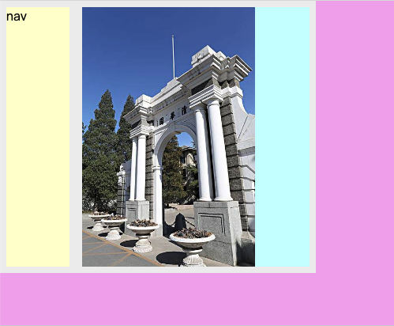

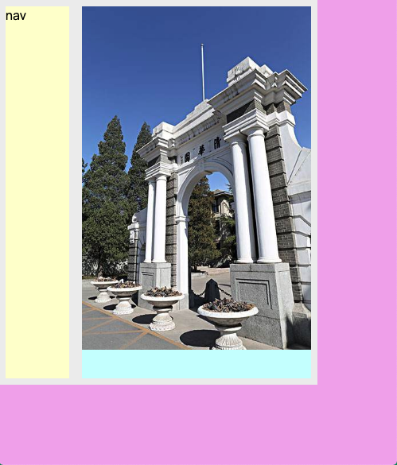

### 5.1.3 CSS3 media query 

避免设备尺寸过小时，界面显示异常。

#### 5.1.3.1  示例

实现的效果是，当设备宽度大于 600px 时，保持左右排列；当设备宽度小于或等于 600px 时，呈上下排列。

```html
<head>
    <meta charset="UTF-8" />
    <title>前端攻城狮</title>
    <style>
        body {
            margin: 0;
            background: #eae;
        }
        
        .container {
            width: 100vw;
            background: #eee;
            float: left;
        }
        
        nav,
        section {
            margin: 2%;
            height: 80vh;
        }
        
        nav {
            width: 20%;
            float: left;
            background: #ffc;
        }
        
        section {
            background: #cff;
            width: 72%;
            float: left;
        }
        
        img {
            max-width: 100%;
            max-height: 100%;
        }
        
        /* 当屏幕宽度小于等于 600px 时，使用内部的样式*/
        @media (max-width: 600px) {
            nav, section {
                float: none;
                width: auto;
            }
            nav {
                height: 80px;
            }
        }
    </style>
</head>

<body>
    <div class="container">
        <nav>nav</nav>
        <section>
            
    </div>
</body>
```

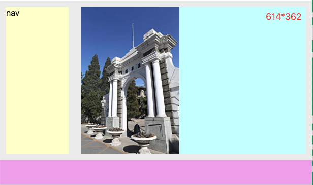

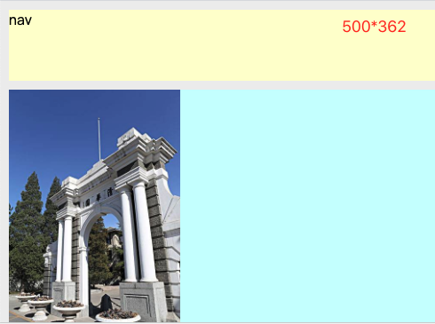

#### 5.1.3.2 语法规则

[参考链接：Media Queries Level 4](https://www.w3.org/TR/mediaqueries-4/#mq-features)

```css
@media mt and (mf1) and (mf2) and (mf3) {
	rule1
	rule2
}
```

* `@media` 是固定格式
* `mt` 表示媒体类型
* `and` 是媒体类型和条件、条件之间的连接符
* `mf1`、`mf2`、`mf3` 是条件
* `rule1`、`rule2` 是样式规则

在上面的这个语法规则中，只有同时满足了 `and` 连接的多个条件，才会执行 `rule1` 和 `rule2`.

`5.1.3.1` 示例代码中，媒体查询语句的完整写法为：

```css
  @media screen and (max-width: 600px) {
            nav,
            section {
                float: none;
                width: auto;
            }
            nav {
                height: 80px;
            }
        }
```

## 5.2 mobile first 的响应式设计

之前的代码中，我们都是基于宽屏思路编写的。也就是说，代码默认是宽屏设备，然后通过特殊代码匹配窄屏或移动设备。而移动设备优先的思路则是，代码默认就是基于窄屏或者移动设备的，然后对宽屏设备做特殊处理。

```css
@media screen and (min-width: 768px) {
	 /* 当屏幕宽度大于 768px 时应用其中的样式 */
}    
```

移动设备优先的优点：

* 节省在移动设备的渲染时间 (移动设备上的界面结构可能会比 pc 端少，移动设备优先避免了一系列的匹配，从而节省了渲染时间)
* 节约移动设备的带宽（移动设备上利用的网络资源可能会比较少，移动优先就避免了加载 pc 端才需要的资源）

## 5.3 CSS3 transform

transform 即给元素添加各种变形效果。

视频中的参考链接主要为：

* [CSS Transforms Module Level 1——二维变幻效果](https://drafts.csswg.org/css-transforms-1/) 
* [CSS Transforms Module Level 2——三维变幻效果](https://drafts.csswg.org/css-transforms-2/)


视频中的内容主要基于二维变幻举例。

**块级元素、inner box 元素可以实现变幻；行内元素不可以实现变幻，行内元素如果想变幻需要先转换为行内块元素。**

### 5.3.1 transform

* [视频中的参考链接：developer.mozilla.org——transform](https://developer.mozilla.org/en-US/docs/Web/CSS/transform?v=example)

#### 5.3.1.1 单一变幻

```css
div {
      /* 顺时针旋转45度 */
      transform: rotate(45deg);
}
```

样式|含义
---|---
` transform: rotate(45deg);` |  顺时针旋转 45度
`transform: rotate(-45deg);` | 逆时针旋转45度
`transform: scale(.5);` | 变为原视图的 0.5 ，即原视图大小*0.5
`transform: scale(2);` | 变为原视图的 2 倍 ，即原视图大小*2
`transform: scaleX(.5);` | x 轴方向变为原视图的 0.5 倍（即宽度变为原视图 0.5 倍）
`transform: scaleY(2);` | 垂直方向变为原视图的 2 倍
`transform: scale(.5,2);` | 水平方向变为原视图 0.5 倍，垂直方向变为原视图的 2 倍
`transform: translateX(20px);` | 水平方向右移 20px （正数右移，负数左移）
`transform: translateY(-20px);` | 垂直方向上移 20px (正数下移，负数下移)
`transform: translate(-20px);` | 水平方向左移 20px 
`transform: translate(-20px,40px);` | 水平左移 20px, 垂直下移 40px
`transform: skewX(45deg);` | 水平方向向左倾斜 45 度 （正数左倾斜，负数右倾斜）
`transform: skewY(45deg);` | 垂直方向倾斜 45 度 （正数下倾，负数上倾）
`transform: skew(45deg,-45deg);` | 水平倾斜 45 度，垂直方向倾斜 -45 度

#### 5.3.1.2 组合变幻：

代码|含义
---|---
`transform: scale(.5, 2) translate(40px) rotate(45deg);` | 水平缩放 0.5，垂直缩放 2，左移 40px, 水平旋转 45 度

上述代码就是一个组合效果，组合时有如下主要事项：

* 多个效果之间使用空格间隔，末尾一个效果后面追加分号。
* 效果执行顺序时从右向左（上述代码会先执行 rotate, 然后执行 translate , 最后执行 scale）
* 效果顺序不同，最终得到的结果也不同，具体如下：

```html

<head>
    <meta charset="UTF-8" />
    <title>前端攻城狮</title>
    <style>
        body {
            background: #FFC;
        }
        
        img {
            width: 100px;
            height: 100px;
            margin: 30px;
        }
        
        #img1 {
            transform: scale(2) translate(50px);
        }
        
        #img2 {
            transform: translate(50px) scale(2);
        }
    </style>
</head>

<body>
    <div class="container">
        <section>
            

        </section>
        <section>
            
        </section>
    </div>
</body>
```

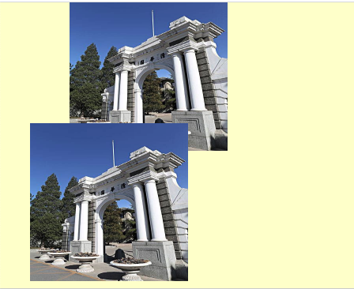

> skew  [skjuː] 倾斜 ； scale [skeil] 缩放

### 5.3.2 `transform-origin`

[视频中的参考链接：developer.mozilla.org——transform-origin](https://developer.mozilla.org/zh-CN/docs/Web/CSS/transform-origin)

在 5.3.1 中我们没有指定 `transform-origin` 属性，所以，它们都是基于视图的中心点为基准进行变幻的。而通过 `transform-origin` 则可以更改这个基准点。

代码|含义
---|---
`transform-origin: left top;` | 以左上角为基准点/原点进行变幻（关键字有：left、right、top、bottom、center）
`transform-origin: 100% 100%;` | 以右下角为基准点（第一个 100% 表示水平方向宽度，第二个 100% 表示垂直方向的高度，这种方式可以取任意百分点）
` transform-origin: 20px 40px;` | 以视图左上角右侧 20px, 下侧 40px 的位置为基准点


关键词取值是百分比取值的一个特例，其对应关系如下：

关键字|百分比
---|---
left | 0%
right | 100%
top | 0%
bottom | 100%
center | 50%

### 5.3.3 transform 的兼容性

#### 5.3.3.1 兼容性

通过 [caniuse.com](https://caniuse.com/#search=transform) 我们可以查询到其兼容性如下：

* 2D 的兼容效果

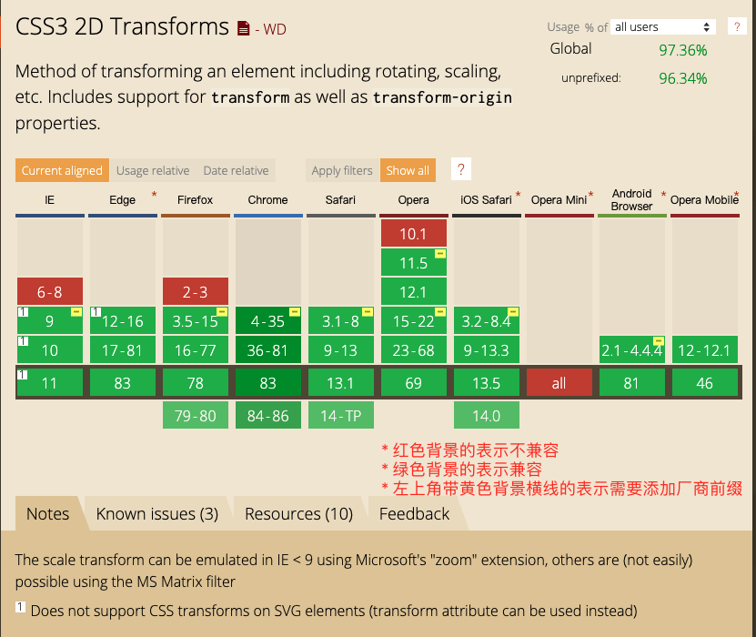

* 3D 的兼容效果

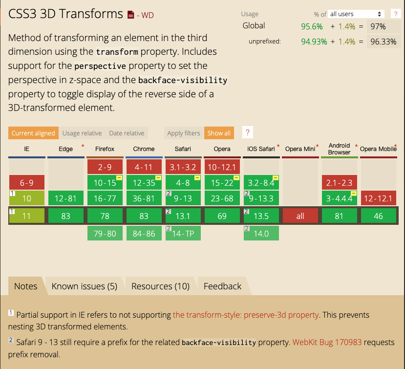

#### 5.3.3.2 通过添加厂商前缀扩展兼容性

为了更好的兼容性，我们需要添加厂商前缀以适应不同浏览器的早前版本，查看厂商前缀的方式如下图：

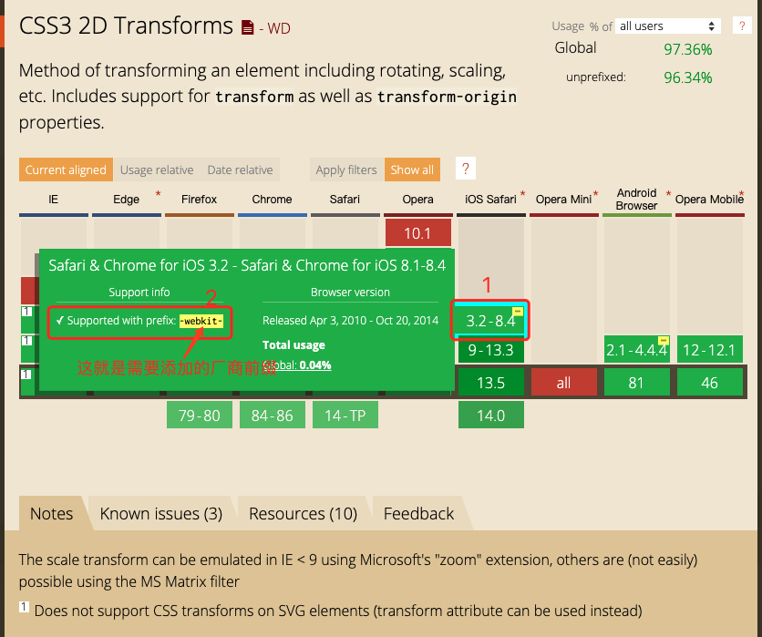

获取到厂商前缀之后，就可以编辑样式了，如下：

```css
#img1 {
    /* 兼容 safari 浏览器的 3.1-8 版本 */
    -webkit-transform: scale(2) translate(50px);
    /* 兼容 IE9 浏览器*/
    -ms-transform: scale(2) translate(50px);
    /* 兼容 fireFox 浏览器的 3.5-15 版本 */
    -moz-transform: scale(2) translate(50px);
    /* 标准写法放在最后 */
    transform: scale(2) translate(50px);
}
```

## 5.4 CSS3 transition

transition 即给文档中的样式变化添加平滑的过渡效果。

### 5.4.1 过渡效果基本展示

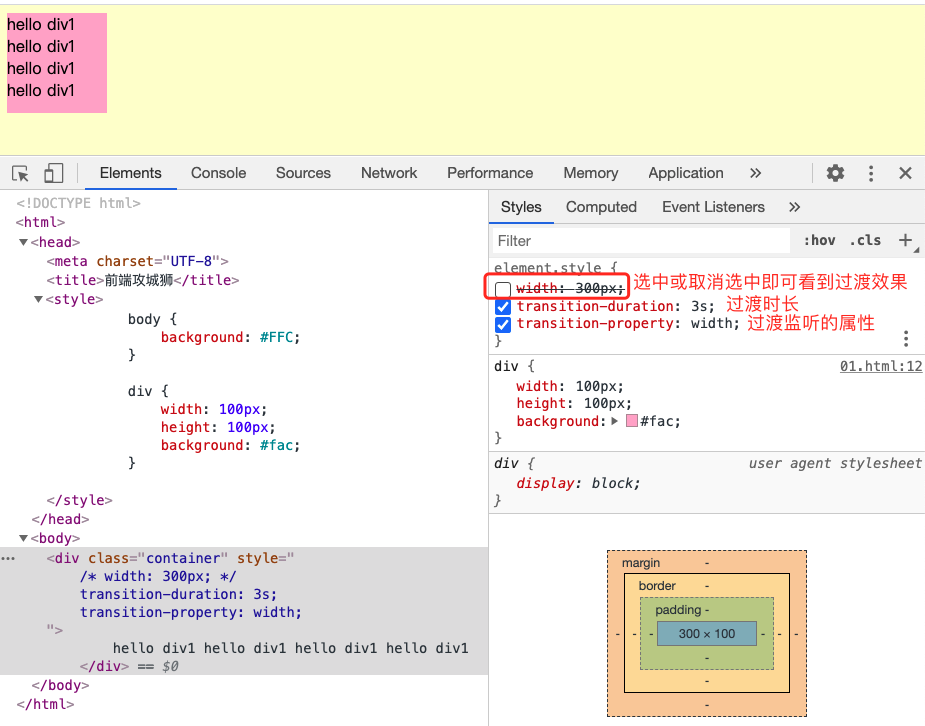

```css
element.style {
    width: 300px;
    background-color: #0ff;
    /* 当 width 或 background-color 变化时都可以触发过渡*/
    transition-property: width,background-color;
    /* 宽度过渡时长为 3s, 背景色过渡时长为 5s ; 如果只设置一个值，则表示多个过渡都使用该值。*/
    transition-duration: 3s,5s;
   }
```

### 5.4.2 可添加过渡效果的 css 属性

```html
<head>
    <meta charset="UTF-8" />
    <title>前端攻城狮</title>
    <style>
        body {
            background: #FFC;
        }
        
        div {
            width: 100px;
            height: 100px;
            background: rgb(22, 146, 22);
            display: inline-block;
            font-size: 15px;
            color: white;
            margin: 20px;
            padding: 10px;
            border: 4px solid red;
        }
    </style>
</head>

<body>
    <div class="container">
        hello div1 hello div1 hello div1 hello div1
    </div>
</body>
```

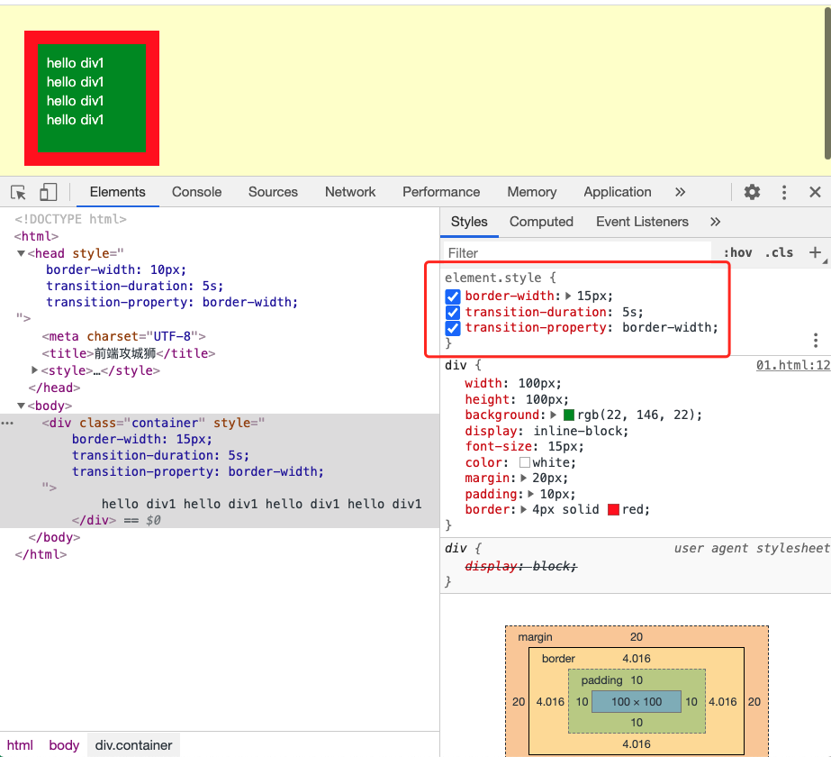


[参考链接：css-transitions-1](https://www.w3.org/TR/css-transitions-1/#animatable-properties)

[可执行过渡动画的属性(CSS animated properties) 如下：](https://developer.mozilla.org/zh-CN/docs/Web/CSS/CSS_animated_properties)

```html
-moz-outline-radius
-moz-outline-radius-bottomleft
-moz-outline-radius-bottomright
-moz-outline-radius-topleft
-moz-outline-radius-topright
-webkit-text-fill-color
-webkit-text-stroke
-webkit-text-stroke-color
all
backdrop-filter
background
background-color
background-position
background-size
border
border-bottom
border-bottom-color
border-bottom-left-radius
border-bottom-right-radius
border-bottom-width
border-color
border-end-end-radius
border-end-start-radius
border-left
border-left-color
border-left-width
border-radius
border-right
border-right-color
border-right-width
border-start-end-radius
border-start-start-radius
border-top
border-top-color
border-top-left-radius
border-top-right-radius
border-top-width
border-width
bottom
box-shadow
caret-color
clip
clip-path
color
column-count
column-gap
column-rule
column-rule-color
column-rule-width
column-width
columns
filter
flex
flex-basis
flex-grow
flex-shrink
font
font-size
font-size-adjust
font-stretch
font-variation-settings
font-weight
gap
grid-column-gap
grid-gap
grid-row-gap
grid-template-columns
grid-template-rows
height
inset
inset-block
inset-block-end
inset-block-start
inset-inline
inset-inline-end
inset-inline-start
left
letter-spacing
line-clamp
line-height
margin
margin-bottom
margin-left
margin-right
margin-top
mask
mask-border
mask-position
mask-size
max-height
max-lines
max-width
min-height
min-width
object-position
offset
offset-anchor
offset-distance
offset-path
offset-position
offset-rotate
opacity
order
outline
outline-color
outline-offset
outline-width
padding
padding-bottom
padding-left
padding-right
padding-top
perspective
perspective-origin
right
rotate
row-gap
scale
scroll-margin
scroll-margin-block
scroll-margin-block-end
scroll-margin-block-start
scroll-margin-bottom
scroll-margin-inline
scroll-margin-inline-end
scroll-margin-inline-start
scroll-margin-left
scroll-margin-right
scroll-margin-top
scroll-padding
scroll-padding-block
scroll-padding-block-end
scroll-padding-block-start
scroll-padding-bottom
scroll-padding-inline
scroll-padding-inline-end
scroll-padding-inline-start
scroll-padding-left
scroll-padding-right
scroll-padding-top
scroll-snap-coordinate
scroll-snap-destination
scrollbar-color
shape-image-threshold
shape-margin
shape-outside
tab-size
text-decoration
text-decoration-color
text-emphasis
text-emphasis-color
text-indent
text-shadow
top
transform
transform-origin
translate
vertical-align
visibility
width
word-spacing
z-index
zoom
```

### 5.4.3 `transition-xx` 属性介绍

#### 5.4.3.1 `transition-property` 过渡属性

[参考链接：transition-property](https://developer.mozilla.org/zh-CN/docs/Web/CSS/transition-property)

`transition-property` 用于指定应用过渡属性的名称。

```css
/* Keyword values */
transition-property: none;
transition-property: all;
transition-property: test_05;
transition-property: -specific;
transition-property: sliding-vertically;

transition-property: test1;
transition-property: test1, animation4;
transition-property: all, height, all;
transition-property: all, -moz-specific, sliding;

/* Global values */
transition-property: inherit;
transition-property: initial;
transition-property: unset;
```

* `none` 没有过渡动画。
* `all` 所有可被动画的属性都表现出过渡动画。
* `IDENT` 属性名称。由小写字母 a 到 z，数字 0 到 9，下划线 `_` 和破折号 `-`。第一个非破折号字符不能是数字。同时，不能以两个破折号开头。

#### 5.4.3.2 `transition-duration` 过渡时长

[参考链接：transition-duration](https://developer.mozilla.org/zh-CN/docs/Web/CSS/transition-duration)

`transition-duration` 属性以**秒或毫秒**为单位指定过渡动画所需的时间。默认值为 0s ，表示不出现过渡动画。

可以指定多个时长，每个时长会被应用到由 `transition-property` 指定的对应属性上。如果指定的时长个数小于属性个数，那么时长列表会重复。如果时长列表更长，那么该列表会被裁减。两种情况下，属性列表都保持不变。注意，时长不能指定为负值。

```html
/* <time> 值 */
transition-duration: 6s;
transition-duration: 120ms;
transition-duration: 1s, 15s;
transition-duration: 10s, 30s, 230ms;

/* 全局值 */
transition-duration: inherit;
transition-duration: initial;
transition-duration: unset;
```

#### 5.4.3.3 `transition-delay` 延时执行过渡

[参考链接：transition-delay](https://developer.mozilla.org/zh-CN/docs/Web/CSS/transition-delay)

`transition-delay` 属性规定了在过渡效果开始作用之前需要等待的时间。

值以秒（s）或毫秒（ms）为单位，表明动画过渡效果将在何时开始。

取值为正时会延迟一段时间来响应过渡效果；取值为负时会导致过渡立即开始。

可以指定多个延迟时间，每个延迟将会分别作用于你所指定的相符合的css属性（`transition-property`）

```css
/* <time>?值 */
transition-delay: 3s;
transition-delay: 2s, 4ms;

/* 全局变量 */
transition-delay: inherit;
transition-delay: initial;
transition-delay: unset;
```

#### 5.4.3.4 `transition-timing-function` 过渡时间函数

> 可以理解为 Android 动画系统中的 “插值器”

[参考链接：transition-timing-function](https://developer.mozilla.org/zh-CN/docs/Web/CSS/transition-timing-function)

CSS 属性受到 [`transition effect`](https://developer.mozilla.org/en-US/docs/Web/CSS/CSS_Transitions/Using_CSS_transitions) 的影响，会产生不断变化的中间值，而 CSS `transition-timing-function` 属性用来描述这个中间值是怎样计算的。实质上，通过这个函数会建立一条加速度曲线，因此在整个transition 变化过程中，变化速度可以不断改变。

这条加速度曲线被 [`<timing-function>`](https://developer.mozilla.org/zh-CN/docs/Web/CSS/timing-function) 所定义，之后作用到每个 CSS 属性的过渡. 

你可以规定多个 timing function ,通过使用 [`transition-property`](https://developer.mozilla.org/zh-CN/docs/Web/CSS/transition-property) 属性，可以根据主列表 (transition property 的列表) 给每个 CSS 属性应用相应的 timing function. 

如果 timing function 的个数比主列表中数量少，缺少的值被设置为初始值（ease） 。如果 timing function 比主列表要多，timing function 函数列表会被截断至合适的大小。这两种情况下声明的 CSS 属性都是有效的。

* 语法规则:

```css
Formal syntax: <timing-function>#
where 
<timing-function> = linear | <cubic-bezier-timing-function> | <step-timing-function>

where 
<cubic-bezier-timing-function> = ease | ease-in | ease-out | ease-in-out | cubic-bezier(<number>, <number>, <number>, <number>)
<step-timing-function> = step-start | step-end | steps(<integer>[, <step-position>]?)

where 
<step-position> = jump-start | jump-end | jump-none | jump-both | start | end
```

* 示例

```css
/* 默认取值，慢-快-慢，但速度比 ease-in-out 快 */
transition-timing-function: ease
/* 先慢然后逐渐加速 */
transition-timing-function: ease-in
/* 先快然后逐渐变慢 */
transition-timing-function: ease-out
/* 慢-快-慢 */
transition-timing-function: ease-in-out
/* 匀速 */
transition-timing-function: linear
/* 贝塞尔曲线 */
transition-timing-function: cubic-bezier(0.1, 0.7, 1.0, 0.1)
transition-timing-function: step-start
transition-timing-function: step-end
transition-timing-function: steps(4, end)

transition-timing-function: ease, step-start, cubic-bezier(0.1, 0.7, 1.0, 0.1)

transition-timing-function: inherit
```

#### 5.4.3.5 transition

[参考链接:](https://developer.mozilla.org/zh-CN/docs/Web/CSS/transition)

transition CSS 属性是 transition-property，transition-duration，transition-timing-function 和 transition-delay 的一个[简写属性](https://developer.mozilla.org/en-US/docs/Web/CSS/Shorthand_properties)。

```css
/* Apply to 1 property */
/* property name | duration */
transition: margin-right 4s;

/* property name | duration | delay */
transition: margin-right 4s 1s;

/* property name | duration | timing function */
transition: margin-right 4s ease-in-out;

/* property name | duration | timing function | delay */
transition: margin-right 4s ease-in-out 1s;

/* Apply to 2 properties */
transition: margin-right 4s linear 1s, color 1s;

/* Apply to all changed properties */
transition: all 0.5s ease-out;
/* 所有可过渡的属性都在 1s 后执行过渡，过渡时长 4s */
transition: 4s 1s;

/* Global values */
transition: inherit;
transition: initial;
transition: unset;
```

transition 属性为一个或多个 CSS 属性指定过渡效果，多个属性之间用逗号进行分隔。

* 标准语法

```css
transition: <property> <duration> <timing-function> <delay>;
```

```css
<single-transition>#
where 
<single-transition> = [ none | <single-transition-property> ] || <time> || <timing-function> || <time>

where 
<single-transition-property> = all | <custom-ident>
<timing-function> = linear | <cubic-bezier-timing-function> | <step-timing-function>

where 
<cubic-bezier-timing-function> = ease | ease-in | ease-out | ease-in-out | cubic-bezier(<number <a href="/zh-CN/docs/CSS/Value_definition_syntax#Brackets" title="Brackets: enclose several entities, combinators, and multipliers to transform them as a single component">[0,1]>, <number>, <number <a href="/zh-CN/docs/CSS/Value_definition_syntax#Brackets" title="Brackets: enclose several entities, combinators, and multipliers to transform them as a single component">[0,1]>, <number>)
<step-timing-function> = step-start | step-end | steps(<integer>[, <step-position>]?)

where 
<step-position> = jump-start | jump-end | jump-none | jump-both | start | end
```

[相关参考 Using CSS transitions](https://developer.mozilla.org/en-US/docs/Web/CSS/CSS_Transitions/Using_CSS_transitions#When_property_value_lists_are_of_different_lengths)

* transition 和 transform 配合使用

```css
element.style {
    transform: scale(1.5) rotate(45deg);
    transition: transform 5s linear 2s;
}
```

## 5.5 CSS3 animation

transition 和 animation 都可以实现视图元素变化过程中的过渡效果。但 transition 是单一的变化，animation 则是一系列的变化。

[参考链接：](https://developer.mozilla.org/zh-CN/docs/Web/CSS/animation)

### 5.5.1 animation 示例

#### 5.5.1.1 定义关键帧

使用 animation 时，需要先定义一系列的 UI 状态，即关键帧。

示例代码

```css
@keyframes bounce{
    0%{
        left: 0;
        top: 0;
    }

    50%{
        left: 200px;
        top: 200px;
    }

    100%{
        left: 400px;
        top: 400px;
    }
}
```

在定义时，

* 使用关键字 `@keyframes` , 其中包含的每一项都称为 **关键帧**。**关键帧**内部定义了该关键帧所应用的样式。
* `x%` 表示动画在执行过程中的时长百分比。0% 表示动画的起始时刻，100% 表示动画的终止时刻。
* `bounce` 表示该关键帧效果的名字，可以根据需求自定义

#### 5.5.1.2 应用关键帧

##### 5.5.1.2.1 通过 chrome 调试工具查看关键帧效果

基础代码：

```html
<head>
    <meta charset="UTF-8" />
    <title>前端攻城狮</title>
    <style>
        body {
            background: #FFC;
        }
        
        .box {
            width: 1200px;
            height: 300px;
            margin: 0 auto;
            background-color: #eeeeee;
            position: relative;
        }
        
        .ball {
            width: 100px;
            height: 100px;
            background: blue;
            position: absolute;
        }
        
        @keyframes bounce {
            0% {
                left: 0;
                top: 0;
            }
            50% {
                left: 200px;
                top: 200px;
            }
            100% {
                left: 400px;
                top: 0px;
            }
        }
    </style>
</head>

<body>
    <div class="box">
        <div class="ball"></div>
    </div>
</body>
```

应用关键帧并查看效果：

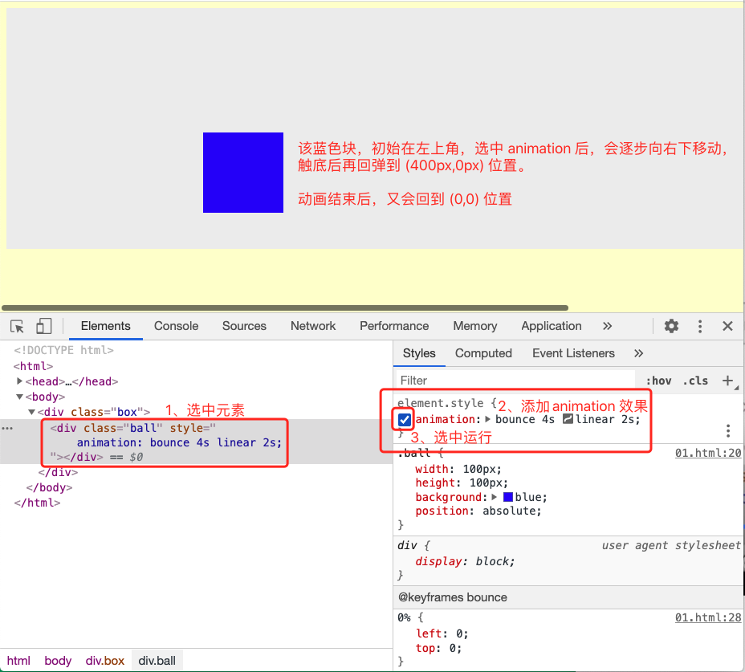

在上图中，有 `animation: bounce 4s linear 2s;` 属性设置，其取值依次为：动画效果名称（即关键帧名称）、动画时长、动画插值器（即时间函数)、延时时间。

##### 5.5.1.2.2 与用户交互时触发关键帧

下列代码实现的效果是：当鼠标悬停在 `.box` 区域时，就会让其中的 `.ball` 触发动画效果。

```html
<head>
    <meta charset="UTF-8" />
    <title>前端攻城狮</title>
    <style>
        body {
            background: #FFC;
        }
        
        .box {
            width: 1200px;
            height: 300px;
            margin: 0 auto;
            background-color: #eeeeee;
            position: relative;
        }
        
        .ball {
            width: 100px;
            height: 100px;
            background: blue;
            position: absolute;
        }
        
        @keyframes bounce {
            0% {
                left: 0;
                top: 0;
            }
            50% {
                left: 200px;
                top: 200px;
            }
            100% {
                left: 400px;
                top: 0px;
            }
        }
        
        .box:hover .ball {
            /* 当光标悬停在 .box 区域时，让 .ball 触发动画效果  */
            animation: bounce 5s linear 1s;
        }
    </style>
</head>

<body>
    <div class="box">
        <div class="ball"></div>
    </div>
</body>
```

上述代码中，`.box::hover .ball { }` 的内容还可以写成下面的样子：

```css
.box:hover .ball {
     /* 当光标悬停在 .box 区域时，让 .ball 触发动画效果  */
     /* animation: bounce 5s linear 1s; */
     animation-name: bounce;
     animation-duration: 5s;
     animation-timing-function: linear;
     animation-delay: 1s;
}
```

### 5.5.2 animation 属性解析

实际上，CSS animation 属性是 `animation-name`，`animation-duration`, `animation-timing-function`，`animation-delay`，`animation-iteration-count`，`animation-direction`，`animation-fill-mode` 和 `animation-play-state` 属性的一个简写属性形式。

[点击查看更详细的属性解析](https://developer.mozilla.org/zh-CN/docs/Web/CSS/animation)