## 8.1 DOM 编程

DOM--文档对象模型，是针对 HTML 和 XML  文档的一个 API（应用程序编程接口）。它描绘了一个层次化的节点树，允许开发人员添加、移除和修改页面的某一部分。

### 8.1.1 DOM 基础

#### 8.1.1.1 节点层级

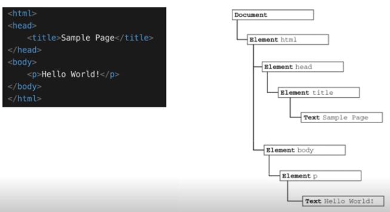

* Document 节点
* Element 节点（元素节点）
* Text 节点（文本节点）

#### 8.1.1.2 节点类型

节点类型及其对应的值：（括号中的数值为类型对应的值）

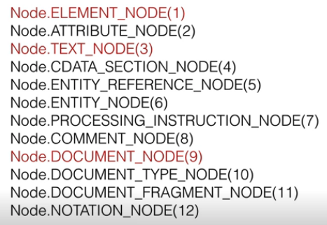

#### 8.1.1.3 判断元素节点

```javascript
// 如果是 1 表示是 Element 节点（元素节点）
if (someNode.nodeType == 1) {
    // 获取节点名称——即元素名称（html标签名称）
    value = someNode.nodeName;
}
```

#### 8.1.1.4 节点关系

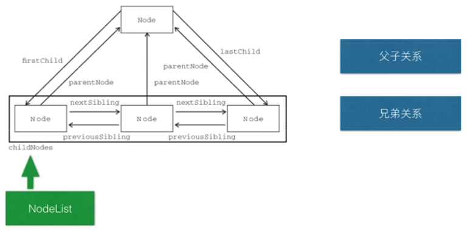

#### 8.1.1.5 NodeList

访问 NodeList 中的节点：

```javascript
//方式1
someNode.childNodes[0];
//方式2
someNode.childNodes.item(1);

// 将 NodeList 转换成数组
var arrayOfNodes = Array.prototype.slice.call(someNode.childNodes, 0);
```

上述代码中转换成数组的方式也适用于 Arguments : `Array.prototype.slice.call(arguments, 0);`


### 8.1.2 Document 节点

#### 8.1.2.1 Document 节点特征

* nodeType 的值为 `9`
* nodeName 的值为 `#document`
* nodeValue 的值为 `null`
* parentNode 的值为 `null`
* ownerDocument 的值为 `null`
* 其子节点可能是一个 DocumentType（最多一个）、Element（最多一个）、ProcessingInstruction 或 Comment


#### 8.1.2.2 Document 节点

```html
<html>
	<body>
	</body>
</html>
```

在 html 中 `<html>` 元素是 document 的唯一子节点。

对于上述代码，下列获取子节点的代码都会返回 true:

```javascript
var html = document.documentElement;

alert(html === document.childNodes[0]);
alert(html === document.firstChild);
```

#### 8.1.2.3 Document 节点属性

属性|作用
---|---
document.title | 文档标题（页面标题）
document.referrer | 获取来源页面的 URL（从哪个页面进入当前页面的），可以判断页面是否被盗链
document.domain | 获取域名
document.URL | 获取当前页面完整的 URL

### 8.1.3 DOM 元素节点

#### 8.1.3.1 DOM 元素节点默认属性

```html
<div id="someDiv" class="cls" title="text" lang="en" dir="ltr"></div>
```

* `element.id` // 在上述代码中取到的值为 someDiv
* `element.className` // cls
* `element.title`  // text
* `element.lang` // en
* `element.dir`  // ltr

#### 8.1.3.2 访问自定义属性

```html
< div id="someDiv" class="cls"  title="text"  lang="en" dir="ltr"  myAttr="val"> < /div>
```

上面的 `myAttr` 是自定义属性。对于默认属性和自定义属性我们都可以通过 `element.getAttribute("属性名")` 来获取对应的属性值。

```javascript
element.getAttribute("id")
element.getAttribute("class")
element.getAttribute("title")
element.getAttribute("lang")
element.getAttribute("dir")
element.getAttribute("val")
```

也就是说，对于默认属性我们有两种获取属性值的方式，一种是直接通过 `element.xx` 获取，一种是通过 `element.getAttribute("xx")`

除了有 `getAttribute("xx")` , 对应的还有 `setAttribute()` 和 `removeAttribute()`

### 8.1.4 DOM 操作

#### 8.1.4.1 DOM 创建

创建 div 节点：

```javascript
document.createElement("div")
```

#### 8.1.4.2 DOM 节点添加

* 添加新节点：

```javascript
var returnedNode = someNode.appendChild(newNode);
// true
alert(returnedNode == newNode);
// true
alert(someNode.lastChild == newNode);
```

* 添加已有节点

```javascript
var returnedNode = someNode.appendChild(someNode.firstChild);
// false
alert(returnedNode == someNode.firstChild);
// true
alert(returnedNode == someNode.lastChild);
```

上述代码中 `someNode.appendChild(someNode.firstChild);` 相当于把第一个子节点挪到了最后。因为**同一个 DOM 节点不能出现在文档的不同位置**


#### 8.1.4.3 DOM 节点插入

```javascript
// 插入后成为最后一个子节点
returnedNode = someNode.insertBefore(newNode, null);
// true
alert(newNode == someNode.lashChild);

// 插入后成为第一个子节点
var returnedNode2 = someNode.insertBefore(newNode, someNode.firstChild);
// true
alert(returnedNode2 == newNode);
// true
alert(newNode == someNode.firstChild);

// 插入到最后一个子节点的前面
returnedNode3 = someNode.insertBefore(newNode, someNode.lashChild);
// true
alert(newNode == someNode.childNodes[someNode.childNodes.length - 2]);
```

#### 8.1.4.4 DOM 节点替换

```javascript
// 替换第一个子节点
var returnedNode = someNode.replaceChild(newNode, someNode.firstChild);
//替换最后一个子节点
var returnedNode2 = someNode.replaceChild(newNode, someNode.lastChild);
```

#### 8.1.4.5 DOM 节点删除

```javascript
// 移除第一个子节点
var formerFirstChild = someNode.removeChild(someNode.firstChild);
// 移除最后一个子节点
var formerLastChild = someNode.removeChild(someNode.lastChild);
```

#### 8.1.4.6 DOM 节点克隆

```html
<ul>
    <li>item1</li>
    <li>item2</li>
    <li>item3</li>
</ul>
```

```javascript
// 深克隆——克隆全部子节点
var deepList = myList.cloneNode(true);
// 浅克隆——只克隆当前节点，不克隆子节点
var shallowList = myList.cloneNode(false);
```

#### 8.1.4.7 DOM 节点的高效访问

* innerHTML
* outerHTML

```html
<ul>
    <li>List item 0</li>
    <li>List item 1</li>
    <li>List item 2</li>
    ...
    <li>List item 9</li>
</ul>
```

创建包含多个 li 元素的 ul 元素

```javascript
for (var x = 0; x < 10; x++) {
    var li = document.createElement("li");
    li.innerHTML = "List item " + x;
    listNode.appendChild(li);
}
```

上面这种方式每创建一个 li 元素就通过 `listNode.appendChild(li);` 追加到视图，这样导致的问题就是每次追加都会刷新视图，效率不高。可以使用下面的方式：

```javascript
var html = "";
for (var x = 0; x < 10; x++) {
    html += "<li> List item " + x + "</li>";
}
listNode.innerHTML = html;
```

上述代码中先创建好对应的 html 结构语句，然后一次性追加到父节点中。

> outerHTML 的使用需要参考原书进行补充

#### 8.1.4.8 DOM 节点的高效访问2

* DocumentFragment

```javascript
var frag = document.createDocumentFragment();
for (var x = 0; x < 10;x++) { 
    var li = document.createElement("li");
    li.innerHTML = "List item " + x;
    frag.appendChild(li);
}
listNode.appendChild(frag);
```

#### 8.1.4.9 innerHTML 和 DocumentFragment 的对比

```html
<ul>
    <li>List item -1</li>
    <li>List item 0</li>
    <li>List item 1</li>
    <li>List item 2</li>
    ...
    <li>List item 9</li>
</ul>
```

在已有 `<li>List item -1</li>` 的前提下，再向其中追加后面的节点。

> 下面的代码仅是 for 循环中的核心部分，完整代码可参考前两个小节的内容。

```javascript
// 使用 innerHTML 的方式
listNode.innerHTML += html;

// documentFragment的方式
listNode.appendChild(frag);
```

`+=` 方式会改变挂在到 li 上的事件。而 documentFragment 的方式则不会修改事件。

### 8.1.5 DOM 查找

即 DOM 元素的查找

#### 8.1.5.1 普通方法

* `document.getElementById` //理论上来说不应该会有 id 重复的元素，如果有，则返回第一个
* `document.getElementsByTagName` 


#### 8.1.5.2 特殊集合

* `document.anchors`
* `document.forms`
* `document.images`
* `document.links`


```javascript

```

#### 8.1.5.3 querySelector

```javascript
// 获取 body 元素
var body = document.querySelector("body");
// 获取 id 为 myDiv 的元素
var myDiv = document.querySelector("#myDiv");
// 获取类名为 selected 的第一个元素
var selected = document.querySelector(".selected");
// 获取类名为 button 的第一个图像元素
var img = document.querySelector("img.button");
```
#### 8.1.5.4 querySelectorAll

返回一个 NodeList 

```javascript
// 获取 myDiv 中所有的 em 元素(类似于 getElementsByTagName("em"))
var ems = document.getElementById("myDiv").querySelectorAll("em");
// 获取类名为 selected 的所有元素
var selecteds = document.querySelectorAll(".selected");
// 获取所有 p 元素中的 strong 元素
var strongs = document.querySelectorAll("p strong");
```


### 8.1.6 DOM 级别

* DOM1 定义了 HTML 和 XML 文档的底层结构，前面几个小节的内容都是 DOM 1 中的。
* DOM2 和 DOM3 扩展了 DOM1 ，引入了更多的交互能力，也支持了更高级的 XML 特性。

以下内容基于 DOM2 和 DOM3

#### 8.1.6.1 样式处理

任何支持 style 特性的 HTML 元素在 JavaScript 中都有一个对应的 style 属性。该 style 对象是 `CssStyleDeclaration` 的实例，包含着通过 HTML 的 style 特性指定的所有样式信息，但不包含与外部样式表或嵌入样式表经层叠而来的样式。

常见的 CSS 属性及其在 style 对象中对应的属性名称：

CSS属性|JavaScript属性
---|---
`background-image` | `style.backgroundImage`
`color` | `style.color`
`display`| `style.display`
`font-family` | `style.fontFamily`

注意：

* 如果 CSS 属性名中有中划线，则使用 JS 中的 style 属性访问时，需要将其转换成驼峰格式
* CSS 中的 float 属性在 JS 中是保留字，DOM2 规定在 JS 中使用 `cssFloat` 替代，Firefox、Safari、Opera、Chrome 都支持该属性，但 IE 支持的则是 `styleFloat` 

通过 JS 的 style 对象为元素设置相关属性：

```javascript
var myDiv = document.getElementById("myDiv");
// 改变背景色
myDiv.style.backgroundColor = "red";
// 设置宽高信息
myDiv.style.width = "100px";
myDiv.style.height = "100px";
// 设置边框
myDiv.style.border = "1px solid black";
```

获取通过 HTML 中的 style 设置的属性值：

```html
<div id="myDiv" style="background-color:blue;width:10px;height:25px"></div>
```

```javascript
alert(myDiv.style.backgroundColor);
alert(myDiv.style.width);
alert(myDiv.style.height);
```

#### 8.1.6.2 计算样式

虽然 style 对象能够提供支持 style 特性的任何元素的样式信息，但它不包含那些从其他样式表层叠而来并且影响到当前元素的样式信息。

DOM2 增强了 `document.defaultView` ，提供了 `getComputedStyle()` 方法。该方法接收两个参数：需要计算样式的元素和一个伪元素字符串（例如：`:after`），如果不需要伪元素信息，那么第二个参数可以为 null 。

`getComputedStyle()` 返回一个 `CSSStyleDeclaration` 对象（与 style 属性的类型相同），其中包含当前元素的所有计算的样式。

示例如下：

```html
<!DOCTYPE html>
<html>

<head>
    <title>ComputedStyle</title>
    <style type="text/css">
        #myDiv {
            background-color: blue;
            width: 100px;
            height: 200px;
        }
    </style>
</head>
<body>
    <div id="myDiv" style="background-color: red; border: 1px solid black;"></div>
</body>

</html>
``` 

```javascript
var myDiv = document.getElementById("myDiv");
var computedStyle = document.defaultView.getComputedStyle(myDiv, null);

// red
alert(computedStyle.backgroundColor);
// 100px
alert(computedStyle.width);
// 200px
alert(computedStyle.height);
// 部分浏览器中会返回 1px solid black
alert(computedStyle.border);
```
### 8.1.7 元素大小

#### 8.1.7.1 偏移

元素的偏移量包括元素在屏幕上占用的所有可见的空间。

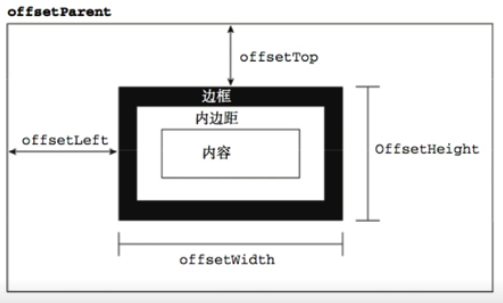

通过上图中的四个重要属性可以的得到元素的偏移量：

属性名称|含义
---|---
`offsetHeight` | 元素在垂直方向上占用的空间大小，以像素为单位。包括元素的高度、（可见的）水平滚动条的高度、上边框高度和下边框高度。
`offsetWidth` | 元素在水平方向上占用的空间大小，以像素为单位。包括元素的宽度、（可见的）垂直滚动条的宽度、左边框和右边框的宽度。
`offsetLeft` | 元素的左外边框到包含元素的左内边框之间的像素距离
`offsetTop` | 元素的上外边框到包含元素的上内边框之间的像素距离

```javascript

```

#### 8.1.7.2 客户区大小

元素的客户区大小（client dimension）指的是元素内容及其内边距所占据的空间大小。

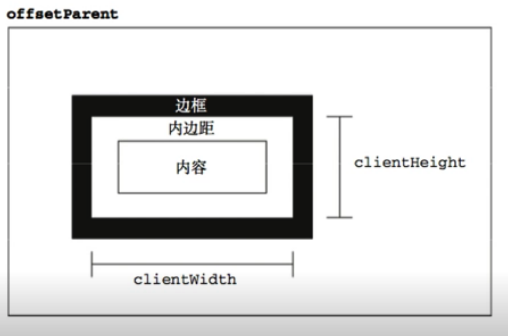

属性名|含义
---|---
`clientWidth` | 元素内容区宽度加上左右内边距宽度
`clientHeight` | 元素内容区高度加上上下内边距高度

```javascript

```

#### 8.1.7.3 滚动大小

滚动大小（scroll dimension）指的是包含滚动内容的元素的大小。

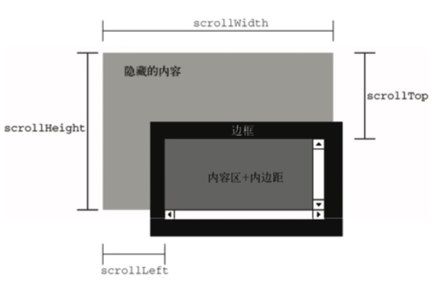

属性|含义
---|---
`scrollHeight` | 在没有滚动条的情况下，元素内容的总高度
`scrollWidth` | 在没有滚动条的情况下，元素内容的总宽度 
`scrollLeft` | 被隐藏在内容区域左侧的像素数，通过设置该属性可以改变元素的滚动位置 
`scrollTop` | 被隐藏在内容区域上方的像素数，通过设置该属性可以改变元素的滚动位置  

```javascript

```

#### 8.1.7.4 确定元素大小

IE、FireFox3+、Safari4+、Opera 9.5 及 Chrome 为每个元素都提供了一个 `getBoundingClientRect()` 方法。该方法会返回一个矩形对象，包含四个属性：left、top、right、bottom。这些属性指定了元素在页面中相对于视口（浏览器的可见区域）的位置。

注意：IE8 及更早版本认为文档的左上角坐标是 `(2,2)`, 而 IE9 及其他浏览器则将 `(0,0)` 作为起点坐标。

```javascript

```

#### 8.1.7.5 图片懒加载示例

以上讲述的元素大小内容在以下场景中会有较频繁的使用：

* 图片懒加载问题

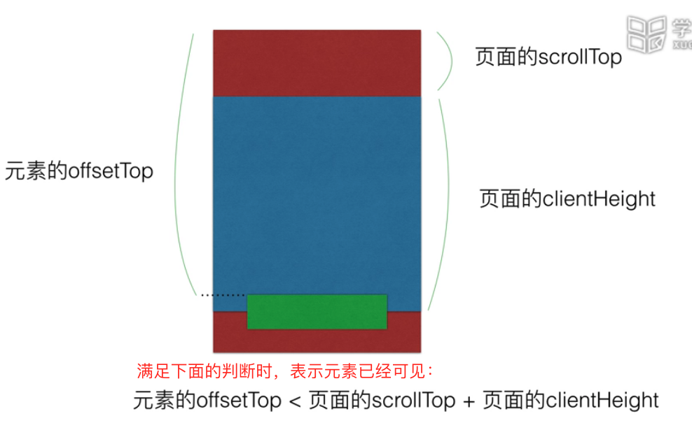

未做懒加载的情况：

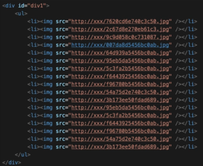

上图中直接定义图片，这样页面显示的时候会比较消耗流量，客户体验不好，而且会存在性能问题。

使用懒加载时需要先使用 `data-src` 替代 `src`:

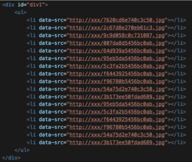

然后通过如下代码加载图片：

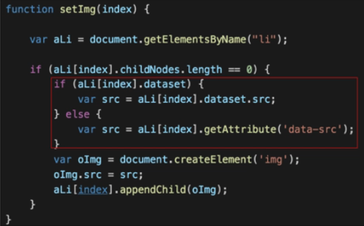

获取元素距离页面顶部的距离：

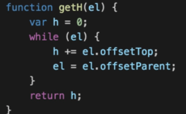

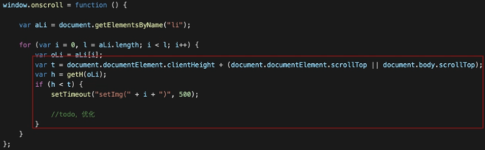


## 8.2 事件

JS 与 HTML 之间的交互时通过事件实现的。事件就是文档或浏览器窗口中发生的一些特定的交互瞬间。

### 8.2.1 事件流

**事件流**用来判断页面中的哪一部分拥有某个特定的事件，它描述的是从页面中接收事件的顺序。

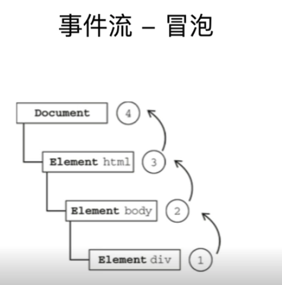

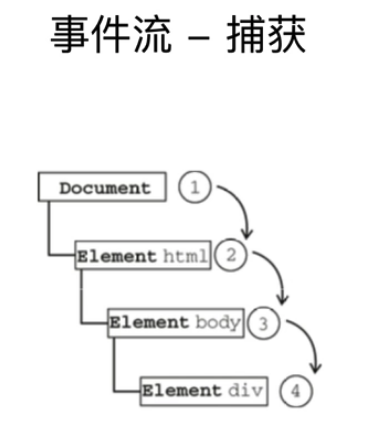

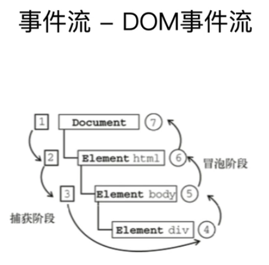

DOM 事件流是对冒泡事件流和捕获事件流的整合。

### 8.2.2 事件处理

事件就是用户或浏览器自身执行的某种动作。如 click、load、mouseover 都是事件的名称，响应某个事件的函数就叫做事件处理程序（或事件侦听器）。

事件处理程序的名字以 `on` 开头，因此 click 事件对应的处理程序为 `onclick`，load 事件对应的处理程序为 `onload`。

#### 8.2.2.1 HTML 事件处理程序

```html
// 单击按钮后显示弹窗
<input type="button" value="Click me" onclick="alert('Clicked')"/>
```

```html
<script type="text/javascript">
    function showMessage() {
        alert("Hello World");
    }
</script>
// 单击按钮时调用我们自定义的函数——显示弹窗
<input type="button" value="Click me" onclick="showMessage()" />
```

#### 8.2.2.2 DOM0 级事件处理程序

每个元素（包括 window 和 document）都有自己的事件处理属性，这些属性通常全小写，如 `onclick`，将这种属性的值设置为一个函数，就相当于指定了事件对应的处理程序。

```javascript
var btn = document.getElementById("myBtn");
btn.onclick = function () { 
    alert("clicked");
};
```

使用 DOM0 级方法指定的事件处理程序被认为是元素的方法，所以，该事件处理陈谷是在元素的作用域中运行的。也就是说，程序中的 this 引用当前元素。如：

```javascript
var btn = document.getElementById("myBtn");
btn.onclick = function () {
    // 展示：myBtn
    alert(this.id);
};
```

也可以删除通过 DOM0 级方法指定的事件处理程序，只要按照如下方式将对应的事件处理程序属性值设置为 null 即可：

```javascript
// 删除事件处理程序
btn.onclick = null;
```


#### 8.2.2.3 DOM2 级事件处理程序

```javascript
var btn = document.getElementById("myBtn");
btn.addEventListener("click", function () { 
    alert(this.id);
},false);
```

上面添加的事件处理程序也是依附于元素的作用域中。

使用 DOM2 级方法添加事件处理程序的主要好处是可以添加多个事件处理程序：

```javascript
var btn = document.getElementById("myBtn");
btn.addEventListener("click", function () {
    alert(this.id);
}, false);
btn.addEventListener("click", function () {
    alert("Hello world!");
}, false);
```

上述代码中添加的事件会按照它们添加的顺序执行，所以，会先显示 id， 然后显示 "Hello world!"。

通过 `addEventListener()` 方式添加的事件处理程序只能通过 `removeEventListener()` 来移除。移除时传入的参数与添加时使用的参数相同。也就是说，上面代码中添加的匿名函数处理程序无法被删除。正确的删除方式如下：

```javascript
var btn = document.getElementById("myBtn");
var handler = function () {
    alert(this.id);
};
btn.addEventListener("click", handler, false);
btn.removeEventListener("click", handler, false);
```

#### 8.2.2.4 IE 事件处理程序

IE 浏览器中实现了与 DOM 中类似的两个方法：`attachEvent()`，`detachEvent()`。这两个方法接收相同的两个参数：事件处理程序名称、事件处理程序对应的函数。

```javascript
var btn = document.getElementById("myBtn");
btn.attachEvent("onclick", function () { 
    alert("Clicked");
});
```

注意：上述代码中 `attachEven` 接收的第一个参数是 **onclick**。

在 IE 中使用 `attachEven` 与使用 DOM0 级方法的主要区别在于事件处理程序的作用域：

* **在使用 DOM0 级方法的情况下，事件处理程序会在其所属元素的作用域内运行**。
* **在使用 `attachEven` 方法时，时间处理程序会在全局作用域中运行，也就是说 `this` 为 `window`**

```javascript
var btn = document.getElementById("myBtn");
btn.attachEvent("onclick", function () { 
    // true
    alert(this==window);
});
```

`attachEvent()` 也可以为以一个元素添加多个事件处理程序：

```javascript
var btn = document.getElementById("myBtn");
btn.attachEvent("onclick", function () {
    // true
    alert(this == window);
});
btn.attachEvent("onclick", function () {
    alert("HelloWorld");
});
```

与 DOM 方法不同的是，**通过 `attachEvent()` 添加的事件会倒序触发，即后添加的先执行。**所以，上述代码中，会先显示 `HelooWorld`，然后再显示 `true`。

与 DOM2 中的 ` removeEventListener ` 相同，`detachEvent()` 时也要传入相同的参数。

```javascript
var btn = document.getElementById("myBtn");
var handler = function () { 
    alert("HelloWorld");
};
btn.attachEvent("onclick",handler);
btn.detachEvent("onclick",handler);
```

#### 8.2.2.5  事件处理的作用域

```html
<!--能显示 hello-->
<div title="hello" onclick="alert(this.title)">Show Title HTML </div>
<!--无法显示：undefined，因为 showTitle 中的 this 指向 window-->
<div title="hello" onclick="showTitle()">Show Title HTML Handler </div>
<!--显示 hello-->
<div title="hello" id="titleDiv"">Show Title DOM0 </div>
<!--显示 hello-->
<div title="hello" id="titleDiv2"">Show Title DOM2 </div>

<script type="text/javascript">
    function showTitle() {
        alert(this.title);
    }
    var targetDiv = document.getElementById("titleDiv");
    targetDiv.onclick = function() {
        alert(this.title);
    };

    var targetDiv2 = document.getElementById("titleDiv2");
    targetDiv2.addEventListener("click", function() {
        alert(this.title);
    }, false);
</script>
```

#### 8.2.2.6 跨浏览器的事件处理程序

封装后的跨浏览器的事件处理程序如下：

```javascript
var EventUtil = {
    addHandler: function (element, type, handler) { 
        if (element.addEventListener) {
            element.addEventListener(type, handler, false);
        } else if (element.attachEvent) {
            element.attachEvent("on"+type,handler);
        } else {
            element("on"+type)=handler;
         }
    },
    removeHandler: function (element,type,handler) { 
        if (element.removeEventListener) {
            element.removeEventListener(type,handler,false);
        } else if (element.detachEvent) {
            element.detachEvent("on"+type,handler);
        } else { 
            element("on" + type) = null;
        }
    }
};
```

使用方式如下：

```javascript
var btn = document.getElementById("myBtn");
var handler = function () { 
    alert("Clicked");
}
EventUtil.addHandler(btn, "click", handler);
EventUtil.removeHandler(btn,"click",handler);
```

### 8.2.3 事件对象

#### 8.2.3.1 DOM 中的事件对象

##### 8.2.3.1.1 event

兼容 DOM 的浏览器会将一个 event 对象传入到事件处理程序中。无论指定时间处理程序时使用什么方法（DOM0 级或 DOM2 级），都会传入 event 对象。

```javascript
var btn = document.getElementById("myBtn");
btn.onclick = function (event) { 
    // 显示 click
    alert(event.type);
};
btn.addEventListener("click", function (evnent) { 
    // 显示 click
    alert(event.type);
},false);
```

```html
<input type="button" value="Click me" onclick="alert(event.type)"/>
```

event 对象包含与创建它的特定事件有关的属性和方法。触发的事件类型不一样，可用的属性和方法也不一样。但所有事件都会有下表列出的成员：

属性/方法 | 类型 | 读/写 | 说明
---|---|---|---
eventPhase | Integer | 只读 | 调用事件处理程序的阶段：1-捕获阶段，2-处于目标，3-冒泡阶段
bubbles | Boolean | 只读 | 表明事件是否冒泡
stopImmediatePropagation() | Function | 只读 | 取消事件的进一步捕获或冒泡，同时阻止任何事件处理程序被调用（DOM3级事件中新增）
stopPropagation() | Function | 只读 | 取消事件的进一步捕获或冒泡，如果 bubbles 为 true，可以使用该方法
target | Element | 只读 | 事件的目标
currentTarget | Element | 只读 | 当前正在执行事件处理程序的元素
cancelable | Boolean | 只读 | 表明是否可以取消事件的默认行为
defaultPrevented | Boolean | 只读 | 为 true 表名已经调用了 `preventDefault()`——DOM3 级事件中新增
preventDefault() | Function | 只读 | 取消事件的默认行为。如果 cancelable 为 true，则可以使用该方法
detail | Integer | 只读 | 与事件相关的细节信息
trusted | Boolean | 只读 | 为 true 表示事件是浏览器生成的，为 false 表示事件是由开发人员通过 JavaScript 创建的 （DOM3 级事件中新增）
type | String | 只读 | 被触发的事件的类型
view | AbstractView | 只读 | 与事件关联的抽象视图。等同于发生事件的 window 对象。


##### 8.2.3.1.2 target 和 currentTarget

在事件处理程序的内部，对象 this 始终等于 currentTarget 的值，而 target 则只包含事件的实际目标。

如果直接将事件处理程序指定给了目标元素，则 this 、currentTarget 和 target 包含相同的值。如下：

```javascript
var btn = document.getElementById("myBtn");
btn.onclick = function (event) { 
	// true
    alert(event.currentTarget === this);
    // true
    alert(event.target === this);
};
```

如果事件处理程序存在于按钮的父节点中（例如 document.body），那么这些值是不同的。如下：

```javascript
document.body.onclick = function (evnet) {
    // true
    alert(event.currentTarget === document.body);
    // true
    alert(event.target === document.getElementById("myBtn"));
    // true
    alert(this === document.body);
};
```

在上述代码中，单击例子中的按钮时，this 和 currentTarget 都等于 document.body, 因为事件处理程序时注册到该元素上的。但 target 确等于元素按钮，因为它是 click 事件的真正目标。由于按钮上没有注册事件的处理程序，结果 click 事件就会冒泡到 `document.body` 中。


##### 8.2.3.1.3 type

在需要通过一个函数处理多个事件时，可以使用 type 属性，如：

```javascript

var btn = document.getElementById("myBtn");
var handler = function (event) {
    switch (event.type) { 
        case "click":
            alert("Clicked");
            break;
        case "mouseover":
            event.target.style.backgroundColor = "red";
            break;
        case "mouseout":
            event.target.style.backgroundColor = "";
            break;
    }
};
btn.onclick = handler;
btn.onmouseover = handler;
btn.onmouseout = handler;
```


##### 8.2.3.1.4 `prevnetDefalut()`

要阻止特定事件的默认行为，可以使用 `prevnetDefalut()` 。

例如，链接的默认行为就是在被单击时会导航到其 href 特性指定的 URL，如果我们想阻止这一默认行为，则可以参考如下示例：

```javascript
var link = document.getElementById("myLink");
link.onclick = function (event) { 
    event.preventDefault();
}
```

注意：只有 `cancelable` 属性设置为 true 的事件，才可以使用 `preventDefault()` 来取消其默认行为。


##### 8.2.3.1.5 `stopPropagation()`

`stopPropagation()` 方法用于立即停止事件在 DOM 层次中的传递，即阻止事件的捕获或冒泡。

例如，直接添加到一个按钮的事件处理程序可以调用 `stopPropagation()`，从而避免触发注册在 `document.body` 上的事件处理程序，如下：

```javascript
 var btn = document.getElementById("myBtn");
    btn.onclick = function(event) {
        alert("Btn Clicked");
        event.stopPropagation();
    }
    document.body.onclick = function(event) {
        alert("Body clicked");
    }
```

##### 8.2.3.1.6 eventPhase

事件对象的 eventPhase 属性可以用来确定事件当前正位于事件流的那个阶段。

eventPhase取值 | 事件流阶段
---|---
1 | 在捕获阶段调用事件处理程序
2 | 事件处理程序处于目标对象上
3 | 冒泡阶段调用事件处理程序。

注意: 虽然 “处于目标” 发生在冒泡额极端，但 eventPhase 仍然一直等于 2.

```javascript
var btn = document.getElementById("myBtn");

btn.onclick = function(event) {
    // 2
    alert(event.eventPhase);
}
document.body.onclick = function(event) {
    // 3
    alert(event.eventPhase);
}
document.body.addEventListener("click", function (event) {
    // 1
    alert(event.eventPhase);
}, true);
```

上述代码中，单击按钮时，首先会执行在捕获阶段触发的添加到 `document.body` 中的事件，接着会触发在按钮上注册的事件，最后处理在冒泡阶段执行的添加到 `document.body` 中的事件。

当 eventPhase 等于 2 时，this、target、currentTarget 始终都是相等的。


#### 8.2.3.2 IE 中的事件对象

##### 8.2.3.2.1 event

与访问 DOM 中的 event 对象不同，要访问 IE 中的 event 对象有几种不同的方式，具体取决于指定事件处理程序的方法。

在使用 DOM0 级方法添加事件处理程序时，event 对象作为 window 对象的一个属性存在，如下：

```javascript
var btn = document.getElementById("myBtn");
btn.onclick = function () { 
    var event = window.event;
    // click
    alert(event.type)
}
```

如果事件处理程序是使用 `attachEvent()` 添加的，那么就会有一个 event 对象作为参数被传入事件处理程序函数中，如下：

```javascript
var btn = document.getElementById("myBtn");
btn.attachEvent("onclick", function (event) {
    // click
    alert(event.type);
});
```

在使用 `attachEvent()` 的情况下，也可以通过 window 对象来访问 event 对象，就像使用 DOM0 级方法一样。

如果是通过 HTML 特性指定的事件处理程序，那么还可以通过名为 event 的变量来访问 event 对象（与 DOM 中的事件模型相同）。如下：

```javascript
<input type="button" value="Click me" onclick="alert(event.type)" />
```

IE 的 event 对象同样也包含与创建它的事件相关的属性和方法。其中很多属性和方法都有对应的或者相关的 DOM 属性和方法。与 DOM 的 event 对象一样，这些属性和方法也会因为事件类型的不同而不同，但所有事件对象都会包含下表所列的属性和方法。

属性/方法 | 类型 | 读/写 | 说明
---|---|---|---
cancelBubble | Boolean | 读/写 | 默认为 false , 设置为 true 之后就可以取消事件冒泡（与 DOM 中的 stopPropagation() 方法的作用相同）
returnValue | Boolean | 读/写 | 默认值为 true , 设置为 false 之后就可以取消事件的默认行为（与 DOM 中的 preventDefalut() 方法的作用相同）
srcElement | Element | 只读 | 事件的目标（与 DOM 中的 target 属性相同）
type | String | 只读 | 被触发的事件的类型。

##### 8.2.3.2.2 `srcElement`

因为事件处理程序的作用域是根据指定它的方式来确定的，所以不能认为 this 会始终等于事件目标。所以，最好还是使用 `event.srcElement` 比较保险。如下：


```javascript
var btn = document.getElementById("myBtn");

btn.onclick = function () { 
    // true
    alert(window.event.srcElement === this);
}

btn.attachEvent("onclick", function (event) { 
	// false
    alert(event.srcElement === this);
});
```

##### 8.2.3.2.3 returnValue

returnValue 属性相当于 DOM 中的 `preventDefault()`, 它们的作用都是取消给定事件的默认行为。只要将 returnValue 设置为  false ,就可以阻止其默认行为，如下：

```javascript
var link = document.getElementById("myLink");
link.onclick = function () { 
    // 禁用默认超链接事件
    window.event.returnValue = false;
}
```

上述代码达到了阻止默认事件的目的，但与 DOM 不同的是，没有办法确定事件是否能被取消。

##### 8.2.3.2.4 cancelBubble

cancelBubble 属性与 DOM 中的 stopPropagation() 方法作用相同，都是用来停止事件冒泡。

由于 IE 不支持事件捕获，所以只能取消事件冒泡。但 DOM  中的 `stopPropagation()` 可以同时取消事件捕获和冒泡。

```javascript
var link = document.getElementById("myLink");
link.onclick = function () {
    alert("clicked1");
    // 阻止事件冒泡
    window.event.cancelBubble = true;
};

document.body.onclick = function () { 
    alert("body Clicked");
};
```

#### 8.2.3.3 跨浏览器的事件对象

参考原书 13.3.3 

### 8.2.4 事件类型

DOM3 级事件中规定了如下几类事件

事件类型 | 含义
---|---
`UI (User Interface,用户界面)事件` | 当用户与页面上的元素交互时触发
焦点事件 | 元素焦点发生变化时触发
鼠标事件 | 用户通过鼠标在界面上进行操作时触发
滚轮事件 | 使用鼠标滚轮或类似设备时触发
文本事件 | 在文档中输入文本时触发
键盘事件 | 用户通过键盘在页面上执行操作时触发
合成事件 | 当为 IME（Input Method Editor，输入法编辑器）输入字符时触发
变动（mutation ）事件 | 当底层 DOM 结构发生变化时触发

各事件的详细描述参考原书 13.4   

### 8.2.5 事件代理

参考原书 13.5 


## 8.3 JSON 和服务端通信

### 8.3.1 JSON

JSON 是一种数据格式，XML 是一种编程语言。

#### 8.3.1.1 JSON 可以表示的值

JSON 可以表示的值的类型包括：简单值（Null、Boolean、Number、String）、对象、数组。

> JSON 不能表示简单值中的 undefined

#### 8.3.1.2 JSON 数据格式

* 字符串——需要用双引号括起来

```json
"HelloWorld"
```

* 对象——属性名也需要用双引号括起来

```json
{
	"name":"zhangsan",
	"age":23
}
```

#### 8.3.1.3 JSON 序列化 

##### 8.3.1.3.1 序列化

* 使用 `JSON.stringify(对象名);` 来实现序列化

```javascript
var book = {
    title: "JavaScript",
    authors: ["zhangsan"],
    edition: 3,
    year: 2020
};

var jsonText = JSON.stringify(book);
// {"title":"JavaScript","authors":["zhangsan"],"edition":3,"year":2020}
console.info(jsonText);
```

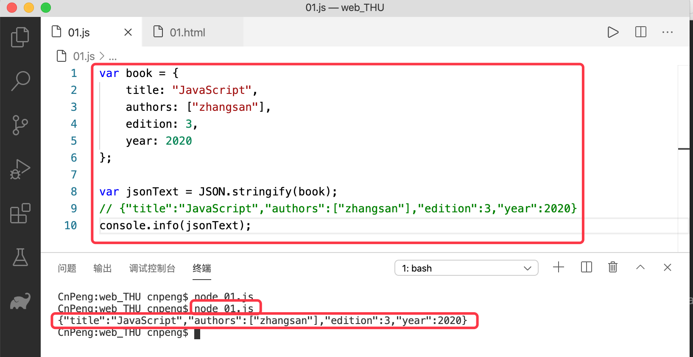

##### 8.3.1.3.2 序列化时进行过滤

* `JSON.stringify(对象名, ["需要保留的属性1", "需要保留的属性2"])`

```javascript
var book = {
    title: "JavaScript",
    authors: ["zhangsan"],
    edition: 3,
    year: 2020
};

// {"title":"JavaScript","edition":3}
var jsonText = JSON.stringify(book, ["title", "edition"]);
console.info(jsonText);
```

上述代码表示，在序列化时，仅序列化指定的属性。

* 使用函数进行序列化过滤

```javascript
var book = {
    title: "JavaScript",
    authors: ["zhangsan"],
    edition: 3,
    year: 2020
};

var jsonText = JSON.stringify(book, function(key, value) {
    switch (key) {
        case "authors":
            return value.join(".");
        case "year":
            return 5050;
        case "edition":
        	// undefined 的属性不会被序列化到 JSON 中
            return undefined;
        default:
            return value;
    }
});
// {"title":"JavaScript","authors":"zhangsan","year":5050}
console.info(jsonText);
``` 

使用上述方式可以过滤或改写被序列化的属性值。

##### 8.3.1.3.3 对序列化后的字符串进行格式化

```javascript
var book = {
    title: "JavaScript",
    authors: ["zhangsan"],
    edition: 3,
    year: 2020
};

// 第一个参数是被格式化的对象，第二个参数表示过滤规则，第三个表示格式化时缩进字符数量或字符规则
var jsonText = JSON.stringify(book, null, 4);
console.info(jsonText);
```

格式化之后，输出的 JSON 字符串不再是单行文本，而是格式清晰的一种文本样式，如下图：

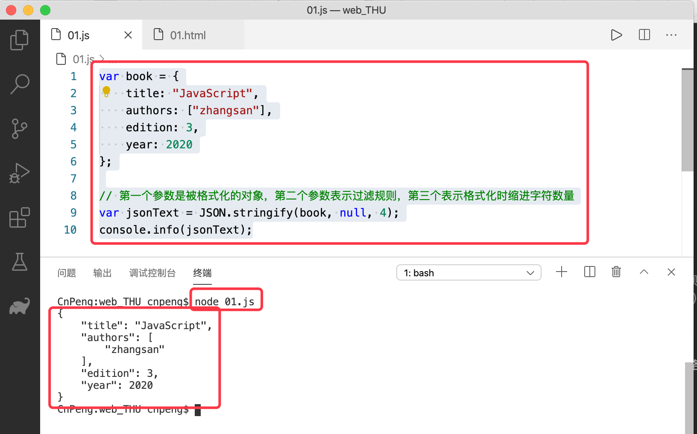

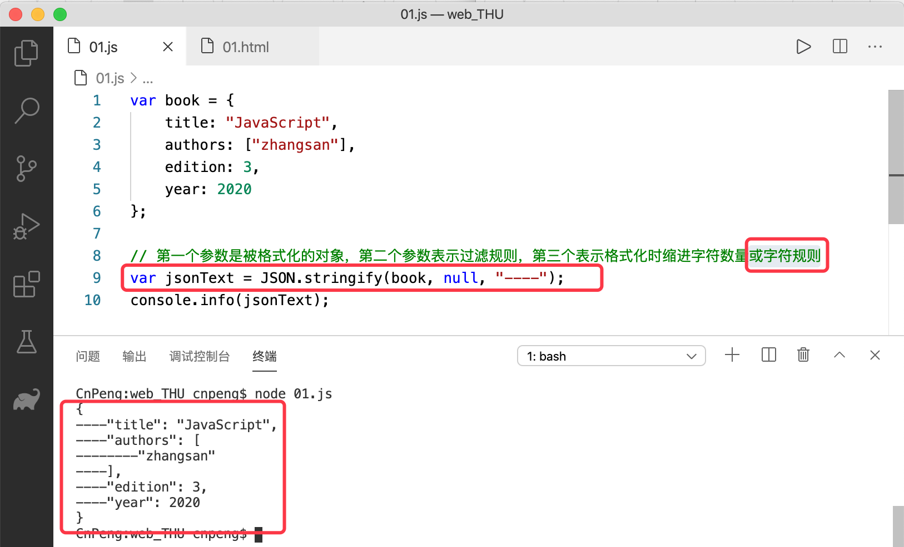

##### 8.3.1.3.4 toJSON

toJSON() 用于指定序列化时得到的内容。

```javascript
var book = {
    "title": "JavaScript",
    "authors": ["zhangsan"],
    edition: 3,
    year: 2020,

    toJSON: function() {
        return this.title;
    }
};
var jsonText = JSON.stringify(book);
// "JavaScript"
console.info(jsonText);
```

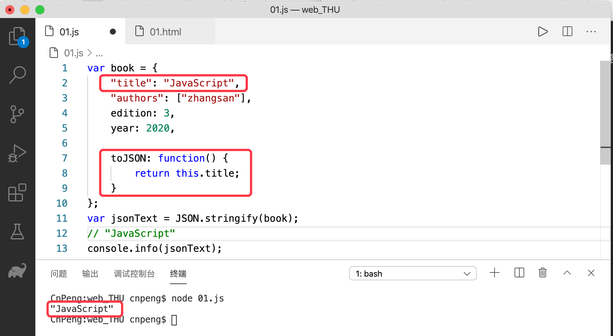

**JSON 序列化过程中先去寻找 `toJSON` ，然后调用过滤规则，最后才执行格式化。**

#### 8.3.1.4 JSON 解析

使用 `JSON.parse()` 进行解析。

```javascript
var book = {
    "title": "JavaScript",
    "authors": ["zhangsan"],
    edition: 3,
    year: 2020,
    // 注意 Date 的使用，此处这样序列化会得到 "releaseDate":"2020-08-23T16:00:00.000Z"}
    releaseDate: new Date(2020, 7, 24)
};
var jsonText = JSON.stringify(book);
console.info(jsonText);

var bookCopy = JSON.parse(jsonText, function(key, value) {
    // releaseDate 序列化之后得到的是一个日期字符串，此处是把它再还原成 Date 对象 
    if (key == "releaseDate") {
        return new Date(value);
    } else {
        return value;
    }
});

console.info(bookCopy.releaseDate.getFullYear());
```

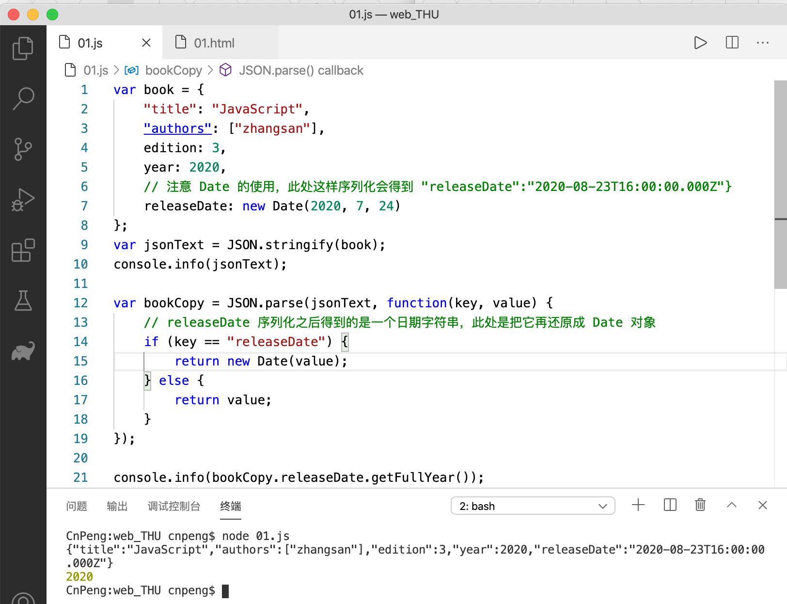
 

### 8.3.2 AJAX

JSON 通常用于服务端和客户端数据通信的载体。

AJAX 全称 `Asynchronous Javascript And XML`，即 `异步 JavaScript 和 XML`。可以实现在用户不刷新页面的前提下就能以异步的方式从服务端请求额外的数据，并将获取的数据进行局部更新从而展示给用户。也就是说，AJAX 是一种通信和渲染方式。

#### 8.3.2.1 XMLHttpRequest

Ajax 技术的核心是 `XMLHttpRequest` 对象，简称 `XHR`。也就是说，浏览器通过 XHR 对象可以以异步的方式从浏览器获取新数据，然后再通过 DOM  将新数据插入到页面中。

> 虽然 XMLHttpRequest 名字中包含 XML ，但 Ajax 通信与数据格式无关，所以，其中传递的数据不一定是 XML.

##### 8.3.2.1.1 XHR 的用法

###### 8.3.2.1.1.1 构建 XMLHttpRequest 请求对象：

```javascript
var xhr = new XMLHttpRequest();
```

###### 8.3.2.1.1.2 open()

在使用 XHR 对象时，要调用的第一个方法是 `open()` ，它接收三个参数:

* 请求类型 （get、post 等）
* 请求地址（相对地址或绝对地址）
* 是否异步发送，true——同步执行，false——异步执行。（同步会阻塞后续操作，异步则不会）

```javascript
var xhr = new XMLHttpRequest();
xhr.open("get","example.text",false);
```

###### 8.3.2.1.1.3 send()

`send()` 表示发送请求，接收一个参数，即要发送给服务端的请求数据。如果不需要通过请求主体发送数据，则必须传入 `null`.

```javascript
var xhr = new XMLHttpRequest();
xhr.open("get", "example.text", false);
xhr.send(null);
```

###### 8.3.2.1.1.4 填充属性

请求发送并且收到响应后，响应的数据会自动填充 XHR 对象的属性，相关的属性介绍如下：

属性 | 说明
---|---
responseText | 作为响应主体被返回的文本
responseXML | 如果响应的内容类型是 `text/xml` 或 `application/xml` 那么该属性中将保存包含响应数据的 XML DOM 文档。
status | Http 响应状态
statusText | Http 状态说明

```javascript
var xhr = new XMLHttpRequest();
xhr.open("get", "example.text", false);
xhr.send(null);

if ((xhr.status >= 200 && xhr.status < 300) || xhr.status == 304) {
    alert(xhr.responseText);
} else {
    alert("请求失败：" + xhr.status);
}
```

###### 8.3.2.1.1.5 readyState

在发送异步请求时，需要通过 readyState 判断发送操作是否已经达成。

readyState 表示请求/响应过程的当前活动阶段，其取值如下：

取值|说明
---|---
0 | 未初始化。即尚未调用 open() 方法 
1 | 启动。已经调用了 open(）但还没有调用 send() 
2 | 发送。已经调用了 send() 但尚未收到服务端的响应
3 | 接收。已经接收到部分响应
4 | 完成。已经接收到全部响应数据，且可以在客户端使用了

每当 readyState 发生变化时，都会触发一次 `readyStateChange` 事件。可以利用该事件来检测每次变化后的 readyState 的值。通常我们只关心 `readyState == 4` 的阶段，因此此时已经接收到服务端的响应。

注意，必须在调用 `open()` 之前就指定 `readyStateChange ` 事件，只有这样才能确保跨浏览器的兼容性。示例如下:

```javascript
var xhr = new XMLHttpRequest();
xhr.onreadystatechange = function () {
    if (this.readyState == 4) {
        if ((xhr.status >= 200 && xhr.status < 300) || xhr.status == 304) {
            alert(xhr.responseText);
        } else {
            alert("请求失败："+xhr.status);
        }
    }
};

xhr.open("get", "example.text", false);
xhr.send(null);
```

###### 8.3.2.1.1.6 abort()

在接收到响应之前还可以调用 `abort()` 方法来取消异步请求，如下：

```javascript
xhr.abort();
```  

调用这个方法之后，XHR 对象会停止触发事件，而且也不再允许访问与响应有关的对象属性。在终止请求之后，还应该对 XHR 对象进行解引用操作——由于内存原因，不建议重用 XHR 对象。

##### 8.3.2.1.2 XMLHttpRequest 的 Header

###### 8.3.2.1.2.1 Heaer 信息 

每个 Http 请求和响应都会带有相应的头部信息。默认情况下，在发送 XHR 请求的同时，会发送下列头部信息：

头信息标识|含义
---|---
`Accept` | 浏览器能够处理的内容类型
`Accept-Charset` | 浏览器能够显示的字符集 
`Accept-Encoding` | 浏览器能够处理的压缩编码 
`Accept-Language`| 浏览器当前设置的语言
`Connection`| 浏览器与服务器之间连接的类型
`Cookie`| 当前页面设置的任何 Cookie
`Host`| 发出请求的页面所在的域
`Referer`| 发出请求的页面的 URI。 ( HTTP 规范中将该字段写错了，应该是 `referrer`——推荐人，上线人。`referer`——参考，引用)
`User-Agent`| 浏览器的用户代理字符串

虽然不同浏览器实际发送的头部信息会有所不同，但以上列出的基本上是所有浏览器都会发送的。

###### 8.3.2.1.2.2 发送时设置 Heaer 信息——`setRequestHeader()`

使用 `setRequestHeader()` 方法可以设置自定义的请求头部信息。该方法接收两个参数：头部字段的名称和头部字段的值。要成功发送请求头信息，**必须在调用 `open()` 方法之后且调用 `send()` 方法之前调用 `setRequestHeader()`**。如下:

```javascript
var xhr = new XMLHttpRequest();
xhr.onreadystatechange = function() {
    if (this.readyState == 4) {
        if ((xhr.status >= 200 && xhr.status < 300) || xhr.status == 304) {
            alert(xhr.responseText);
        } else {
            alert("请求失败：" + xhr.status);
        }
    }
};

xhr.open("get", "example.php", true);
xhr.setRequestHeader("MyHeader","myValue");
xhr.send(null);
```

###### 8.3.2.1.2.3 获取响应中的 Heaer 信息

调用 XHR  对象的 `getResponseHeader()` 方法并传入头部字段名称可以取得相应的响应头部信息。

调用 XHR 对象的 `getAllResponseHeaders()` 方法则可以取得一个包含所有头部信息的长字符串。

```javascript
var myHeader = xhr.getResponseHeader("MyHeader");
var allHeaders = xhr.getAllResponseHeaders();
```

##### 8.3.2.1.3 XMLHttpRequest 的 GET

GET 是最常见的请求类型，用户向服务器查询某些信息。可以将查询字符串参数追加到 URL 的末尾。

对于 XHR ，传入 `open()` 方法的带有查询字符串的 URL 必须经过正确的编码。也就是说，查询字符串中每个参数的名称和值都必须使用 `encodeURIComponent()` 进行编码，然后才能放到 URL 的末尾。而且多个键值对之间都必须使用 `&` 分割。

```javascript
xhr.open("get", "example.php?name1=value1&name2=value2", true);
```

下面的示例是向现有 URL 的末尾添加查询字符串参数：

```javascript
function addURLParam(url, name, value) { 
    url += (url.indexof("?") == -1 ? "?" : "&");
    url += encodeURIComponent(name) + "=" + encodeURIComponent(value);
    return url;
}
```

上述代码调用示例如下：

```javascript
var url = "example.php";
url = addURLParam(url, "name", "张三");
url = addURLParam(url, "book", "JavaScript");

xhr.open("get",url,true);
```

##### 8.3.2.1.4 XMLHttpRequest 的 POST

POST 请求通常用于向服务器发送应该被保存的数据，也就是说，POST 需要把数据作为请求的主体提交给服务器。

在 `open()` 方法中将第一个参数设置为 `"post"` 即可初始化一个 POST 请求。

```javascript
xhr.open("post", url, true);
```

发送 POST 请求的第二步就是向 `send()` 方法中传入某些数据。由于 XHR 最初的设计主要是为了处理 XML，因此可以在此传入 XML DOM 文档，传入的文档经过序列化字后将作为请求主体被提交到服务器。也可以在此传入任何想发送到服务器的字符串。

默认情况下，服务器对 POST 请求和提交 Web 表单的处理是不一样的。因此服务器端必须有程序来读取发送过来的原始数据，并从中解析出有用的数据。不过，我们可以使用 XHR 来模仿表单提交：首先将 `Content-Type` 头部信息设置为 `application/x-www-form-urlencoded` 也就是表单提交时的内容类型；然后以适当的格式创建一个字符串。


```javascript
function submitData() {
    var xhr = new XMLHttpRequest();
    xhr.onreadystatechange = function() {
        if (xhr.readyState == 4) {
            if ((xhr.status >= 200 && xhr.status < 300) || xhr.status == 304) {
                alert(xhr.responseText);
            } else {
                alert("请求失败：" + xhr.status);
            }
        }
    };

    xhr.open("post", "example.php", true);
    xhr.setRequestHeader("Content-Type", "application/x-www-form-urlencoded");
    var form = document.getElementById("user-info");
    xhr.send(serialize(form));
}
```

上述函数可以将 ID 为 `user-info` 的表单中的数据序列化之后发送给服务器。


#### 8.3.2.2 XMLHttpRequest 2 

XMLHttpRequest 1 仅把已有的 XHR 对象的实现细节描述了出来。而 XMLHttpRequest 2 则进一步发展的 XHR。并非所有的浏览器都完整的 XMLHttpRequest 2 的规范，但所有浏览器都实现了它规定的部分内容。

##### 8.3.2.2.1 FormData

现代 Web 应用中频繁使用的一项功能就是表单数据的序列化，XMLHttpRequest 2 为此定义了 FormData 类型。

下面的示例代码中创建了一个 FormData  对象，并向其中添加了一些数据:

```javascript
var data = new FormData();
data.append("name", "张三");
``` 

或者也可以使用如下方式：将表单元素的数据传入到 FormData 的构造函数中。

```javascript
var data2 = new FormData(document.forms[0]);
``` 

创建了 FromData 实例之后，就可以直接将他传给 XHR 的 send() 方法，如下：

```javascript
var xhr = new XMLHttpRequest();
xhr.onreadystatechange = function () {
    if (xhr.readyState == 4) {
        if ((xhr.status >= 200 && xhr.status < 300) || xhr.status == 304) {
            alert(xhr.responseText);
        } else { 
            alert("请求失败："+xhr.status);
        }
    }
};

xhr.open("post", "example.php", true);
var form = document.getElementById("user-info");
xhr.send(new FormData(form));
``` 

使用 FormData 的方便之处在于：不必在 XHR 的请求头中明确设置使用表单格式。XHR 对象能够识别传入的输入类型是  FormData 的实例，并配置适当的头部信息。

##### 8.3.2.2.2 超时设定

IE 中有效，参考原书：21.2.2

##### 8.3.2.2.3 overrideMimeType()

FireFox 中有效，参考原书 21.2.3

##### 8.3.2.2.4 进度事件

Progress Events 规范是 W3C 的一个工作草案，定义了与客户端服务器通信有关的事件。有如下六个进度事件：

事件|说明
---|---
loadstart | 在接收到响应数据的第一个字节时触发
progress | 在接收到响应期间持续不断的触发
error | 在请求发生错误时触发
abort | 在因为调用 `abort()` 方法而终止连接时触发
load | 在接收到完整的响应数据时触发
loadend | 在通信完成或者触发 error,abort 或 load 事件后触发。

每个请求都从触发 loadstart 开始，接下来时一个或多个 progress 事件，然后触发 error、abort 或 load 事件中的一个，最后以触发 loadend 结束。

###### 8.3.2.2.4.1 load 事件

```javascript
var xhr = new XMLHttpRequest();
xhr.onload = function() {
    if ((xhr.status >= 200 && xhr.status < 300) || xhr.status == 304) {
        alert(xhr.responseText);
    } else {
        alert("请求失败：" + xhr.status);
    }
};

xhr.open("get", "example.php", true);
xhr.send(null);
```

load 事件用于替换 readystatechange 事件。只要浏览器接收到服务器的响应，不管状态如何，都会触发 load 事件，所以就不需要去检查 readyState 属性了，但我们依旧需要检查 status 去确定数据是否真的已经可用。

###### 8.3.2.2.4.2 progress 事件

progress 事件会在浏览器接收新数据期间周期性地触发。必须在调用 XHR  的 open() 之前添加 progress 事件。

progress 事件处理程序会接收到一个 event 对象，其 target 属性是 XHR 对象，但包含着三个额外的属性：`lengthComputable`、`position`、`totalSize`。各属性的含义如下：

属性|含义
---|---
lengthComputable | 表示进度信息是否可用（布尔值）
position | 表示已经接收的字节数
totalSize | 表示根据 `Content-Length` 响应头确定的预期字节数。

```javascript
var xhr = new XMLHttpRequest();
xhr.onload = function() {
    if ((xhr.status >= 200 && xhr.status < 300) || xhr.status == 304) {
        alert(xhr.responseText);
    } else {
        alert("请求失败：" + xhr.status);
    }
};

xhr.onprogress = function(event) {
    var divStatus = document.getElementById("status");
    if (event.lengthComputable) {
        divStatus.innerHTML = "已接收：" + event.position + "/" + "总大小：" + event.totalSize;
    }
};

xhr.open("get", "example.php", true);
xhr.send(null);
``` 


### 8.3.3 跨域通信

通过 XHR 实现 Ajax 通信的一个主要限制是跨域安全策略。**默认情况下，XHR 对象只能访问与包含它的页面位于同一个域中的资源**。该策略可以预防某些恶意行为，但是，实现合理的跨域请求对于开发某些浏览器应用程序也是至关重要的。

#### 8.3.3.1 CORS

##### 8.3.3.1.1 CORS 介绍

`CORS（Cross-Origin Resource Sharing，跨资源共享）` 定义了在必须访问跨源资源时，浏览器与服务器应该如何沟通。其基本思想是： **使用自定义的 HTTP 头部，让浏览器与服务器进行沟通，从而决定请求或响应是应该成功还是应该失败。**  

比如，一个简单的 GET 或 POST 请求，没有自定义头部，其主体内容是 `text/plain` 。在发送该请求时，需要给他附加一个额外的 Origin 头部，其中包含请求页面的源信息（协议、域名和端口）, 以便服务器根据该头部信息来决定是否给予响应。下面是 Origin 头部的一个示例：

```javascript
Origin: http://www.nczonline.net
```

如果服务器认为该请求可以接受，就会在 `Access-Control-Allow-Origin` 头部中返回相同的源信息（如果是公共资源，会返回 `*`）。例如：

```javascript
Access-Control-Allow-Origin:http://www.nczonline.net
```

如果没有这个头部，或者有这个头部但源信息不匹配，浏览器就会驳回该请求。正常情况下，浏览器会处理请求。注意，**请求和响应都不包含 cookie 信息。**

##### 8.3.3.1.2 XHR 跨域的限制

跨域 XHR 对象为了安全有如下限制：

* 不能使用 `setRequestHeader()` 设置自定义头部
* 不能发送和接收 `cookie`
* 调用 `getAllResponseHeaders()` 方法总会返回空字符串

##### 8.3.3.1.3 带凭据的跨域请求

默认情况下，跨源请求不提供凭据（cookie、HTTP 认证及客户端 SSL 证明等）。通过将 `withCredentials` 属性设置为 true，可以指定某个请求应该发送凭据。如下：

```javascript
xhr.withCredentials = true;
```

如果服务器接受带凭据的请求，会用下面的 HTTP 头部来响应：

```javascript
Access-Control-Allow-Credentials:true
```

如果发送的是带凭据的请求，但服务器的响应中没有包含该头部，那么浏览器就不会把响应交给 JavaScript（于是，responseText 中将是空字符串，status 的值为 0，而且会调用 onerror(）事件处理程序）。另外，服务器还可以在 Preflight 响应中发送这个 HTTP 头部，表示允许源发送带凭据的请求。


#### 8.3.3.2 JSONP

JSONP 即  `JSON with padding （填充式 JSON 或 参数式 JSON）`，是 JSON 的一种新的应用场景。JSONP 本质上就是被包含在函数调用中的 JSON，如 `callback(("name":"张三"));`

JSONP 由两部分组成：回调函数和数据。

回调函数是当响应到来时应该在页面中调用的函数。回调函数的名字一般是在请求中指定的。而数据就是传入回调函数中的 JSON 数据。下面是一个典型的 JSONP 请求：

```javascript
http://freegeoip.net/json/?callback=handleResponse
``` 

上述代码是在请求一个 JSONP 地理定位服务。通过查询字符串来指定 JSONP 服务的回调参数是很常见的，上述代码中回调函数的名称为：`handleResponse`。

JSONP 是通过动态 `<script>` 元素来使用的，使用时可以为 `src` 属性指定一个跨域 URL。这里的 `<script>` 元素与 `` 元素类似，都有能力不受限制的从其他域加载资源。因为 JSONP 是有效的 JavaScript  代码，所以在请求完成后，即在 JSONP 响应加载到页面中以后，就会立即执行。示例如下：

```javascript
function handleResponse(response) { 
    alert("You‘re at IP address:"+response.IP +",which is in :"+response.city+","+response.region_name);
}

var script = document.createElement("script");
script.src = "http://freegeoip.net/json/?callback=handleResponse";
document.body.insertBefore(script,document.body.firstChild);
``` 

上述例子通过查询地理定位服务来显示我们的 IP 地址和位置信息。

JSONP 之所以在开发人员中极为流行，是因为它简单易用。与`图像 Ping` （另一中跨域技术，参考原书 21.5.1 ）相比，它的有点在于能够直接访问响应文，支持在浏览器与服务器之间双向通信。

但是，JSONP 也有不足之处:

* JSONP 是从其他域中加载代码执行，如果其他域不安全，很可能会在响应中夹带一些恶意代码，而此时除了完全放弃 JSONP 调用之外，没有办法追究，所以，在使用非自己运维的 Web 服务时，必须保证它的安全性。
* 要确定 JSONP 请求是否失败并不容易。虽然 HTML5 给 `<script>` 元素新增了一个 onerror 事件处理程序，但浏览器对它的支持并不理想。所以，开发人员不得不使用计时器检测指定时间内是否接收到了相应。


> 更多跨域内容参考原书 21 章