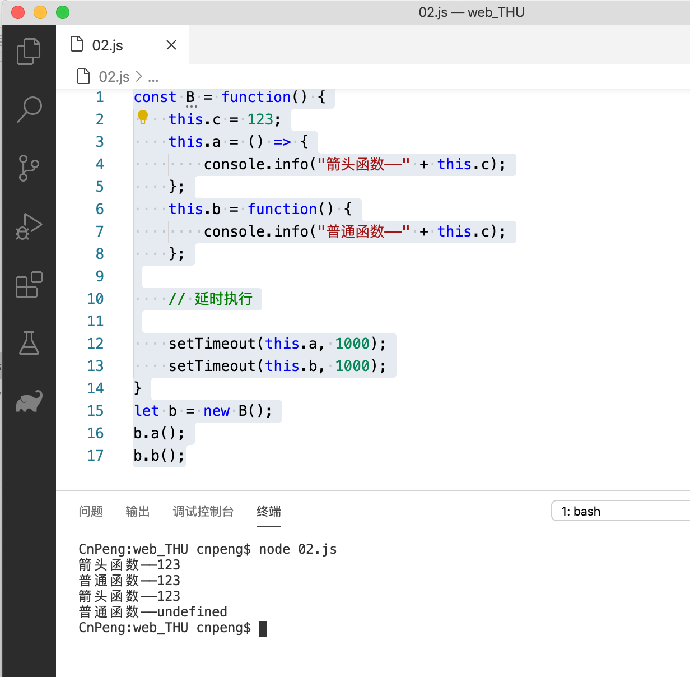
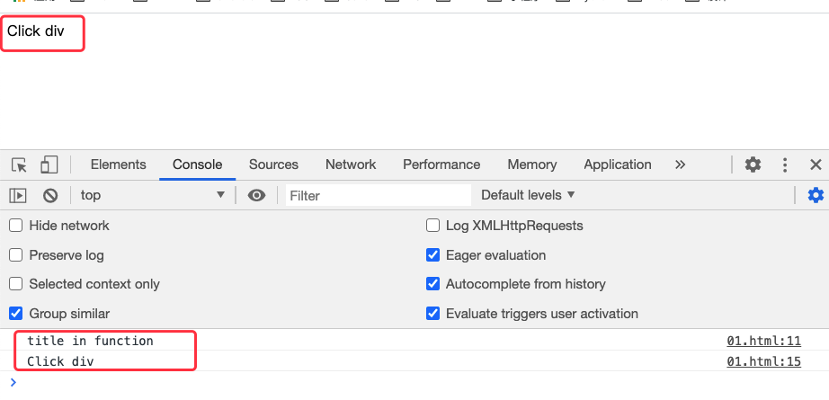
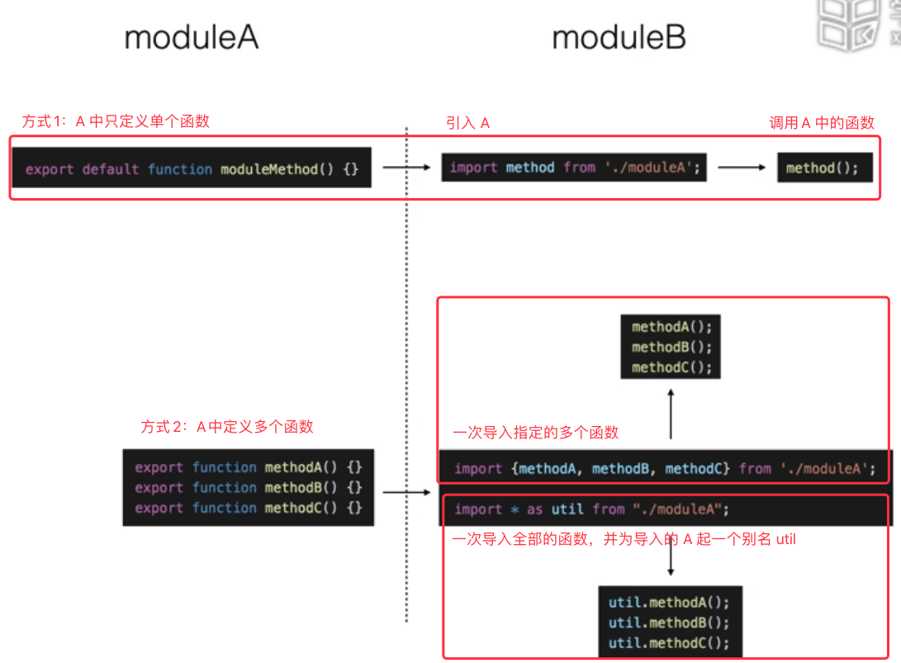
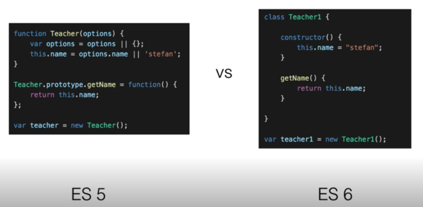

前面几章的内容都是基于 ES 5 的。 

以下内容可以参考 《ES6标准入门-第3版-阮一峰》

## 9.1 ECMAScript 6 基础

### 9.1.1 历史

ES 5 发布于 2009 年，也称为 ES 2009.

ES 6 发布于 2015 年，也称为 ES 2015.

常青浏览器（Evergreen Browsers）：IE、Chrome、FireFox、Opera、safari

### 9.1.2 环境搭建

* [node](http://nodejs.cn/)：JS  的基础运行环境
* [npm](https://www.npmjs.cn/)：三方包管理工具
* [BaBel](https://www.babeljs.cn/)：ES 转译器，将高版本中的新特性转换成低版本中兼容的代码

如何支持新的标准：

* 原生支持——[https://kangax.github.io/](https://kangax.github.io/)
* polyfill 和 shim——对新的 API 进行二次封装的三方库
* 转译器——将新标准转换为低版本支持的标准。

BaBel 的组成：

* `babelcore`——语法内容
* `babel-polyfill`——`build-in` 构建系统，包含 `transform-runtime`

BaBel 相关的其他概念：`babel presets` 和 `babel plugins`

### 9.1.3 var、let、const 

参考代码示例内容

### 9.1.4 箭头函数 `=>`

参考代码示例内容
 
### 9.1.5 代码示例

#### 9.1.5.1 BaBel 的使用

可以参考非官方的中文网站  [BaBel](https://www.babeljs.cn/)。

#### 9.1.5.2 var、let 和 const

##### 9.1.5.2.1 var 和 let 

* 示例1：let 实现块级作用域

```javascript
{
    let a = 1;
    var b = 2;
}

// 报错，a is not defined——let 可以用来声明块级变量
console.info(a);
// 2
console.info(b);
```

* 示例2：使用 let 便面遍历时数据被覆盖的问题

```javascript
var a = [];
for (var i = 0; i < 10; i++) {
    a[i] = function() {
        console.log(i);
    };
}
// 10
a[6]();

var b = [];
for (let i = 0; i < 10; i++) {
    b[i] = function() {
        console.log(i);
    };
}
// 6
b[6]();
```

* 示例3：let 没有变量提升

```javascript
// undefined —— 执行到 console.log 时会从当前 js 文件中查找是否有 var a ,如果 a 在该语句之后定义，则返回 undefined ——这就叫变量提升
console.log(a)
var a = 1;

//  b is not defined。对于 let ,如果调用是在定义之前，直接报错
console.log(b)
let b = 1;
```

* 示例4：let 和 const

```javascript
function f() {
    {
        let a; {
            // let 修饰的变量可以被修改
            a = "ok2";
            // 报错:同一个作用域内的同名变量不能二次声明
            let a = "ok3";
        }

        {
            const a = "ok";
            // 报错：const 修饰的变量不能被修改——常量
            a = "ok2";
        }
    }
}
```

#### 9.1.5.3 箭头函数 `=>`

##### 9.1.5.3.1 箭头函数基本使用 

**箭头函数只能替换函数表达式，不能替换函数声明。**因为箭头函数是匿名函数。

```javascript
// ES5 中的函数表达式
{ function(a) { return a * 2; } };

// 箭头函数的简化

{ a } => { return a * 2; }

{ a } => a * 2

a => a*2
```

##### 9.1.5.3.2 箭头函数的其他使用方式
 
* 返回对象 

```javascript
// 两层 {} 告知编译器这是一个对象；如果只使用一层 {},编译器则会把它当做函数声明
const funcObj = name => {
    { name, age: 27 }
}
```

* 参数默认值

```javascript
const addFunc = { a = 1, b = 2 } => a + b;
console.info(addFunc());
```

* 构造函数

箭头函数不能作为构造函数使用，下面的代码运行会报错：`TypeError: A is not a constructor`

```javascript
// 会报错：TypeError: A is not a constructor
const A = () => { };
new A();
```

* this

```javascript
const obj = {
    a: () => {
        // 箭头函数的 this 是在声明时指定的。此时，c 还没有初始化，所以打印 ：undefined
        console.info(this.c);
    },
    b: function () {
        // 普通函数中 this 是在函数调用时指定的。所以会打印 ：123
        console.info(this.c);
    },
     // //上述的 b:function() 可以直接简化为 b(){}
    // b() {
    //     // 普通函数中 this 是在函数调用时指定的。所以会打印 ：123
    //     console.info(this.c);
    // },

    c: 123
}

obj.a();
obj.b();
```

* this——2

```javascript
function constructorObj() {
    this.c = 234;
    this.obj = {
        a: () => {
           // 箭头函数中的 this 指向定义时外层的作用域对象
            // constructorObj { c: 234, obj: { a: [Function: a], b: [Function: b], c: 123 } }
            console.info(this);
            // 234
            console.info(this.c);
        },
        b() {
           // 普通函数中的 this 指向调用时对象的作用域
            //{ a: [Function: a], b: [Function: b], c: 123 }
            console.info(this);
            // 123
            console.info(this.c);
        },
        c: 123
    }
    this.obj.a();
    this.obj.b();
}
new constructorObj();
```
 
* this——3

```javascript
const B = function() {
    this.c = 123;
    this.a = () => {
        console.info("箭头函数——" + this.c);
    };
    this.b = function() {
        console.info("普通函数——" + this.c);
    };

    // 延时执行

    setTimeout(this.a, 1000);
    setTimeout(this.b, 1000);
}
let b = new B();
b.a();
b.b();
``` 

定时器中，普通函数的 this 指向全局作用域，箭头函数的作用域依旧是指向定义时外层作用域。所以，上述代码中的定时器方法执行时 `setTimeout(this.a, 1000);` 会得到 123，`setTimeout(this.b, 1000);` 中的 this 指向全局作用域，此时全局作用域中没有 c , 所以会得到 undefined。



* 在浏览器中的示例（以 Chrome 为例）

```javascript
<html>

<body>
    <!-- div 标签放在 script 前面，放在后面的话，getElementById 会报错 -->
    <div id="clickme" title="Click div">Click div</div>

    <script>
        const B = function() {
            this.title = "title in function";

            this.a = () => {
                console.info(this.title);
            };

            this.b = function() {
                console.info(this.title);
            };
        };

        var b = new B();
        document.getElementById("clickme").addEventListener("click", b.a);
        document.getElementById("clickme").addEventListener("click", b.b);
    </script>
</body>

</html>
```


 
 
## 9.2 模块、类和继承

### 9.2.1 module——模块

模块加载的规范：

* CommonJS
* AMD
* CMD
* UMD（是对 CommonJS 和 AMD 的结合）



项目中依赖的各个模块最终会通过打包工具整合到一起。

### 9.2.2 class——类

#### 9.2.2.1 Class 与 Prototype 对比



```javascript
// ES 5 中声明类的方式
function Teacher(options) { 
    var options = options || {};
     this.name = options.name || "李四";
}

Teacher.prototype.getName = function () {
    return this.name;
};

var teacher = new Teacher();


//ES 6 中类的声明方式
class Teacher1 {
    constructor() {
        this.name = "张三";
    }
    getName() {
        return this.name;
    }
}

var teacher1 = new Teacher1();
```


#### 9.2.2.2 深入理解类

```javascript
// ES 6 中声明类的方式
class Teacher1 {
    constructor() {
        this.name = "张三";
    }
    getName() {
        return this.name;
    }
}

var teacher1 = new Teacher1();

// function
console.info(typeof Teacher1);
// true
console.info(Teacher1.prototype.constructor == Teacher1);
```

ES 6 中还可以通过 `Object.assign(,)` 为类追加函数：

```javascript
// ES 6 中声明类的方式
class Teacher1 {
    constructor() {
        this.name = "张三";
    }
    getName() {
        return this.name;
    }
}

// 追加函数定义，这种方式和 getName() 的定义等效
Object.assign(Teacher1.prototype, {
    getName2() {
        return this.name;
    }
});

var teacher1 = new Teacher1();
console.info(teacher1.getName2());
```

#### 9.2.2.3 Object.keys

Object.keys 将传入对象中所有可以遍历的属性组织成一个数组并返回。

```javascript
// ES 6 中声明类的方式
class Teacher1 {
    constructor() {
        this.name = "张三";
    }
    getName() {
        return this.name;
    }
}
// []
console.info(Object.keys(Teacher1.prototype));


// ES 5 中声明类的方式
function Teacher(options) {
    var options = options || {};
    this.name = options.name || "李四";
}

Teacher.prototype.getName = function() {
    return this.name;
};

// [ 'getName' ]
console.info(Object.keys(Teacher.prototype));
```

### 9.2.3 Inherit——继承

通过 `extends` 关键字实现继承。

子类的构造函数中必须先调用父类构造，即 `super(...args)`, 因为子类的 this 是从父类而来的。

```javascript
class Teacher1 {
    constructor() {
        this.name = "张三";
    }
    getName() {
        return this.name;
    }
}

class PangTeacher extends Teacher1 {
    constructor(...args) {
        // 必须要声明 super 语句
        super(...args);
        this.weight = 180;
    }
}

var pangTeacher = new PangTeacher();
console.info(pangTeacher.weight);
```

### 9.2.4 代码演示

演示了模块引用和打包，打包时使用了 BaBel 和 browserify 。

> 原视频中没有讲解这两个工具怎么安装，自己尝试安装失败，暂时不做总结了。

## 9.3 ES6 高级特性

### 9.3.1 解构赋值

解构赋值 的英文全称为：`Destructuring Assignment`

* 数组的解构赋值

```javascript
var [a, b, c] = [1, 2, 3];
// 1 2 3
console.info(a, b, c);

var [a, , c] = [1, 2, 3];
// 1 3 
console.info(a, c);
```

* 对象的解构赋值

```javascript
var obj = { a: 1, b: 2 };
// 此处的变量名需要与对象中的一致，否则会报 undefined
var { a, b } = obj;
// 1 2 
console.info(a, b);
```

* 函数的解构传参

```javascript
function destructuringFunc({ a, b, c }) {
    return a + b + c;
}

// 6
console.info(destructuringFunc({ a: 1, b: 2, c: 3 }));
```

* 解构赋值中的默认值

```javascript
var [a = 1, b, c] = [undefined, 2, 3];
// 1 2 3 
console.info(a, b, c);

var obj = { a: 1, b: 2 };
var { a, b, c = 3 } = obj;
console.info(a, b, c);

function destructuringFunc({ a, b, c = 3 }) {
    return a + b + c;
}
console.info(destructuringFunc({ a: 1, b: 2 }));
```

### 9.3.2 Spread 和 Rest 

在 ES6 中 `…` 有两个含义：Spread (展开) 、Rest (收起、求余）。

#### 9.3.2.1 Spread

* 展开元素

```javascript
let x = 1;
let y = 2;
let spread = [3, 4];
// 此处 ... 表示将 spread 数组元素展开并追加为 n 的元素
let n = [x, y, ...spread];
// [ 1, 2, 3, 4 ]
console.info(n);
```

* 展开对象

```javascript
let x = 1;
let y = 2;
let spread = { a: 3, b: 4 };
// 此处 ... 表示将 spread 数组元素展开并追加为 n 的元素
let n = { x, y, ...spread };
// { x: 1, y: 2, a: 3, b: 4 }
console.info(n);
```

* 函数调用中的展开

```javascript
function spreadFunc(a, b, c) {
    // 6
    console.info(a + b + c);
}
let args = [1, 2, 3];
spreadFunc(...args);
```

#### 9.3.2.2 Rest

* 数组元素求余

```javascript
let [a, b, ...rest] = [10, 20, 30, 40, 50];
// 10
console.info(a);
// 20
console.info(b);
// [ 30, 40, 50 ]
console.log(rest);
```

* 对象元素求余

```javascript
// 同解构一样，求余时，也必须使用声明过的变量，顺序无要求。
let { a, y, ...rest } = { x: 1, y: 2, a: 3, b: 4 };
// 3
console.info(a);
// 2
console.info(y);
//{ x: 1, b: 4 }
console.log(rest);
```

上述代码中，如果我们修改代码为：`let { e, f, ...rest } = { x: 1, y: 2, a: 3, b: 4 };`  然后通过 `console.info(e);` 查看结果，此时，输出结果为 `undeifined`, 所以，我们只能使用声明过的变量。

* 函数参数中的求余

```javascript
function restFunc(a, ...rest) {
    // 1
    console.info(a);
    // [ 2, 3, 4, 5 ]
    console.info(rest);
}

restFunc(1, 2, 3, 4, 5);
```

### 9.3.3 Template

```javascript
// ES 5 中字符串拼接的写法
var name = "张三";
console.info("我叫" + name);
console.info("我叫" + name + "\n我喜欢写代码");

// ES 6 中的写法
var name1 = "李四";
// 注意，此处使用的是反单引号，即英文状态下数字1左侧的 ~ 
console.info(`我叫${name1}`);
console.info(`我叫${name1} 
我喜欢写代码`);
//打印：我叫${name1}。 使用字符串模板时，不能使用双引号，否则模板不生效。
console.info("我叫${name1}");
```


### 9.3.4 Symbol

Symbol 是 ES 6 中新引入的一种数据类型，（算是第七种数据类型）。用于声明一个唯一的值。它接收一个字符串作为参数，该参数仅用于标识 Symbol, 没有其他实际意义。

```javascript
// false. Symbol 仅用于声明唯一的变量值，所以下面二者都是唯一的，也就不相等
console.info(Symbol("a") == Symbol("a"));
```

```javascript
const bar = Symbol("bar");
const snaf = Symbol("snaf");

export default class myclass {
    // 声明公有方法
    foo(baz) {
        this[bar](baz);
    }

    // 声明私有方法。[] 通常用语声明属性或方法
    [bar](baz) {
        return this[snaf] = baz;
    }
}
```

### 9.3.5 Map 和 Set


```javascript
var set = new Set([1, 2, 3, 4, 4]);
// ... 展开操作符，输出 [ 1, 2, 3, 4 ]。set 会去重
console.info([...set]);
set.add(5);
[1, 2, 3, 4, 5]
console.info([...set]);
```

```javascript
// var a = new Map(); 可以用来声明空 Map
var a = new Map([
    ['a', 1],
    ['b', 2]
]);
// 1 2
console.info(a.get('a'), a.get('b'));
// 追加元素
a.set('c', 3);
// 3
console.info(a.get('c'));
```

## 9.4 Generator 和 Iterator

### 9.4.1 Generator

Generator 函数是一个状态机，封装了多个内部状态 

```javascript
// * 用语声明这是一个 Generator 函数
function* fibonacci() {
    let v1 = 0;
    let v2 = 1;
    while (true) {
        // let c=v1;
        // v1=v2;
        // v2=c+v2;
        // 下面这一句 解构赋值 等价于上面三句
        [v1, v2] = [v2, v1 + v2];
        // 内部不同的状态节点
        let reset = yield v1;
        if (reset) {
            v1 = 0;
            v2 = 1;
        }
    }
}

let sequence = fibonacci();
// call1 { value: 1, done: false }
console.log('call1', sequence.next());
// call2 1
console.log('call2', sequence.next().value);
// call3 2
console.log('call3', sequence.next().value);
// call4 3
console.log('call4', sequence.next().value);
// call5 1，next(true) 会触发 let reset = yield v1; 即 reset = true
console.log('call5', sequence.next(true).value);
// call6 1
console.log('call6', sequence.next().value);
// call7 2
console.log('call7', sequence.next().value);
```

### 9.4.2 Iterator

#### 9.4.2.1 Iterator

Iterator (迭代器) 是一种遍历机制。它是一种借口，为各种拜托你个的数据结构提供统一的访问机制。任何数据结构只要部署（实现）Iterator 接口（即实现 `next()=>{value: xx, done:true/false}` 方法），就可以完成遍历操作。

Iterator 的作用有三个：

* 为各种数据结构提供一个统一的、简便的访问接口
* 使得数据结构的成员能够按某种次序排列
* ES6 创造了一种新的遍历命令 `for...of` 循环，Iterator 接口主要提供 `for...of` 支持。


```javascript
function makeIterator(array) {
    var nextIndex = 0;
    return {
        next: function() {
            return nextIndex < array.length ? { value: array[nextIndex++], done: false } : { value: undefined, done: true }
        }
    };
}
// it 是一个遍历对象，本质是一个指针对象
var it = makeIterator(['a', 'b']);
// { value: 'a', done: false }
console.log(it.next());
// { value: 'b', done: false }
console.log(it.next());
// { value: undefined, done: true }
console.log(it.next());
```

#### 9.4.2.2 Iterator 对 `for...of` 的支持 

Iterator 几口的母的就是为所有数据结构提供一种统一的遍历访问机制，即 `for...of` 循环。当使用 `for...of` 循环遍历某种数据结构时，该循环会自动去寻找 Iterator 接口。

一种数据结构只要部署了 Iterator 接口，我们就称这种数据结构是“可遍历的”（iterable）。

ES 6 规定，默认的 iterator 接口部署在数据结构的 `Symbol.iterator` 属性，或者说，一个数据结构只要具备了 `Symbol.iterator` 属性，就可以认为是可以遍历的。

```javascript
let counter = 0;
const obj = {
    a: 1,
    b: 2,
    [Symbol.iterator]: () => ({
        next: () => ({
            value: 1,
            done: counter++ > 3
        })
    })
};

for (let j of obj) {
    //输出四次： obj 1 
    console.info('obj', j);
}
```

#### 9.4.2.3 Iterator 和 Generator 的配合

Generator 函数除了状态机，还是一个遍历器对象生成函数。

```javascript
class OddDouble {
    constructor(list) {
        this.list = list;
    }

    *
    [Symbol.iterator]() {
        for (let item of this.list) {
            yield item % 2 ? item * 2 : item;
        }
    }
}
let ret = [];
for (let i of new OddDouble([1, 2, 3, 4, 5, 6, 7])) {
    ret.push(i);
}
// [ 2, 2, 6, 4, 10, 6, 14 ]
console.info(ret);
```

## 9.5 异步编程


> 后面的内容实在学不动了，原视频讲的有些笼统。。。散了吧。。。。


 
 ```javascript

```

```javascript

```

```javascript

```

```javascript

```