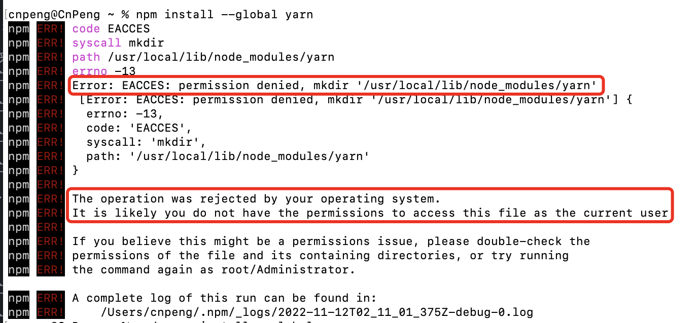
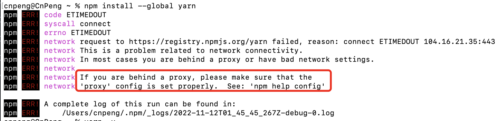

# 1. 1-node和npm安装


## 1.1. Node.js

[Node.js](https://nodejs.org/en/) 就是运行在服务端的 JavaScript。是一个基于 Chrome JavaScript 运行时建立的一个平台。

如果我们想要为自己的网页搭建服务，但又不会标准的 java 或其他语言的服务端开发，则可以使用 node.js 来实现这个服务。

>官网介绍：
>Node.js® is an open-source, cross-platform JavaScript runtime environment.
>Node.js 是一个开源的、跨平台的 js 运行时环境。


## 1.2. npm

npm 即 Node.js package manager，Node.js 包管理器。

Node.js 安装时会自动安装 npm。

Node.js 安装完成之后，可以在终端中通过如下命令确认是否安装成功，以及对应的版本：

```shell
# 查看 node 的版本
node -v

# 查看 npm 的版本
npm -v
```

## 1.3. yarn

[yarn](https://yarn.bootcss.com/) 是适用于 js 代码的依赖包管理工具。

### 1.3.1. 安装

安装 yarn 时需要先安装 npm，npm 安装成功后再通过如下命令来安装 yarn：

```shell
npm install --global yarn
```

### 1.3.2. 错误解决

#### 1.3.2.1. 没有写入权限

安装时可能会提示没有权限写入目录，如下：



此时，我们可以在命令前加上 `sudo`：

```shell
sudo npm install --global yarn
```

#### 1.3.2.2. 代理错误



先清除现有代理：

```shell
npm config rm proxy
npm config rm https-proxy
```

然后添加淘宝的镜像代理：

```shell
npm config set registry https://registry.npm.taobao.org
npm config set disturl https://npm.taobao.org/dist
```


### 1.3.3. 验证 

安装完成之后，我们可以通过如下命令确认是否安装成功，并查看版本：

```shell
yarn -version
```

