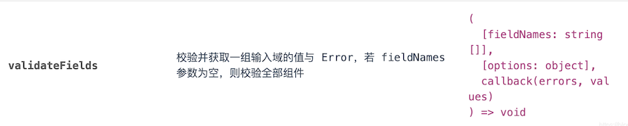
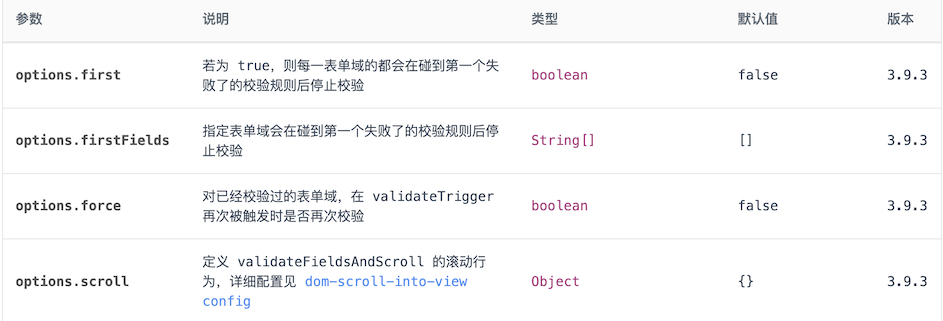

# 1. 001-form的validateFields校验指定元素

[原文](https://blog.csdn.net/qq_40657321/article/details/109363864)

参考文献：[https://3x.ant.design/components/form-cn/#components-form-demo-validate-other](https://3x.ant.design/components/form-cn/#components-form-demo-validate-other)

其实 antd form `validateFields` 有三种用法，用于不同的场景。

下图是antd关于 `validateFields` 的介绍。



## 1.1. 校验 form 所有字段

这是最常用的写法，一般在提交表单的数据时候，大多数情况用这种写法，对于所有元素的正确性进行校验，只有**全部通过校验**才能进行下一步操作，比如调接口等等。

```js
const {
  form: { validateFields },
} = this.props;
validateFields((errors, values) => {
  if(errors) return; //如果有一个校验不通过，代码将不再往下执行
  //校验通过，调接口传参
  axios.post('url',values).then((res) => {
  }).catch((err) => {
  })
});
```

## 1.2. 校验 form 指定字段

在操作的时候**对于指定元素的正确性进行校验**，如果指定字段通过校验才能进行下一步操作。

比如我有三个表单字段，我只对其中一个进行校验，就可以用下面的方法，这里会用到 validateFields 的第一个参数，**是一个数组，数组里是指定字段的名称**。

```js
const {
  form: { validateFields },
} = this.props;
 <Form >
    <Form.Item>
      {getFieldDecorator('email', {
        rules: [
          {
            type: 'email',
            message: '请输入正确的邮箱',
          },
          { required: true, message: '请输入邮箱号' },
        ],
        initialValue: ''
      })(
        <Input placeholder="请输入邮箱号" size="large" />
      )}
    </Form.Item>
    <Form.Item>
      {getFieldDecorator('password', {
        rules: [
          {
            type: 'password',
            message: '请输入密码',
          },
          { required: true, message: '请输入密码' },
        ],
        initialValue: ''
      })(
        <Input placeholder="请输入密码" size="large" />
      )}
    </Form.Item>
</Form>

// 现在 form 有邮箱和密码两个字段，只对于邮箱进行校验
form.validateFields(['email'],(err) => {
	console.log(err,'err-----')
    if(err){
      message.error('请输入正确的邮箱')
      return
    }else{
    // 邮箱校验通过以后的操作
    }
  })
```

## 1.3. 校验 form 增加 options 校验规则

在操作的时候对于元素的正确性进行校验，可以根据需求，增加以下的校验规则。

关于option的校验规则如下：



```js
const {
  form: { validateFields },
} = this.props;

// 现在form又邮箱和密码两个字段，只对于邮箱进行校验
validateFields(['field1', 'field2'], options, (errors, values) => {
  // ...
});
```


## 其他示例

```js
try {
      form.validateFields(['enterprise_id', 'desc', 'attachments'], err => {
        if (!err) {
          if (power1 === 100 && power2 === 100 && power3 === 100 && power4 === 100) {
            initiateChange(reportFormId, params).then(result => {
              this.setState({ loadingExamine: false, Approval: result });
            });
          } else {
            message.warning('请检查季度权重设置，季度总权重为100%才可以提交审核。');
            this.setState({ loadingExamine: false });
          }
        } else {
          this.setState({ loadingExamine: false });
        }
      });
    } catch (e) {
      message.warning(e);
    }
```