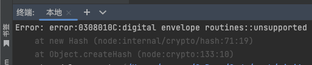
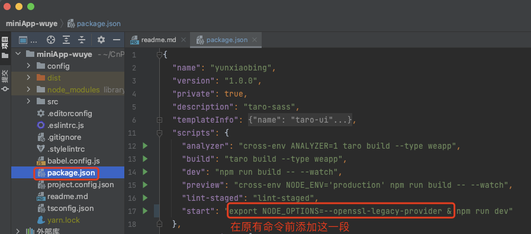
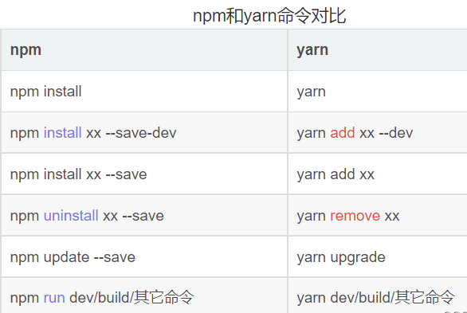

# 1. 001-npm项目启动时报错0308010C

## 1.1. 问题现象

`npm start`（或 `yarn start`）运行项目时报错：

```bash
Error: error:0308010C:digital envelope routines::unsupported’
```



## 1.2. 问题原因

 node.js V17 版本开始发布的 OpenSSL3.0 对算法和密钥的大小进行了严格的限制，可能会对生态系统造成一些影响。

在 node.js V17 以前一些可以正常运行的的应用程序升级到 V17 之后的版本就可能会抛出上述异常。


## 1.3. 解决方案

### 1.3.1. 方案1

在终端中先执行如下命令：

```bash
# macOS 中使用该命令
export NODE_OPTIONS=--openssl-legacy-provider

# windows 中使用该命令
set NODE_OPTIONS=--openssl-legacy-provider
```

然后再执行 `npm start` 或 `yarn start` 即可正常。

方式的弊端在于：**每次 `start` 前都要先执行一遍上述命令。**

### 1.3.2. 方案2

> 实测未生效。[原文链接](https://www.jianshu.com/p/fc7674e8a84d)

修改项目中的 `package.json` 文件，在 `script` 节点的 `start` 中添加命令，添加完成后如下：

```bash
"start": "export NODE_OPTIONS=--openssl-legacy-provider & npm run dev"
```



### 1.3.3. 方案3

修改环境变量，[点击查看原文](https://blog.csdn.net/weixin_44018654/article/details/123501046?spm=1001.2101.3001.6650.1&utm_medium=distribute.pc_relevant.none-task-blog-2)。实测一直提示找不到命令，已经给原博主留言，等待回复后再次确认。

### 1.3.4. 方案4

[查看原文](https://blog.csdn.net/zp357252539/article/details/122559236)

降级 node。

 [查看 nodejs 和 npm 等版本对应关系](https://nodejs.org/zh-cn/download/releases/)，选择 17 以前的版本（以 npm 8.1.2 为例，mac 系统选择后缀名为 pkg 的安装包）。

npm降低版本：

```bash
npm install npm@8.1.2 -g
```

npm 配置淘宝下载镜像:

```bash
npm config set registry "https://registry.npm.taobao.org"
```

安装 yarn ( [Yarn 中文文档](https://yarn.bootcss.com/docs/install#windows-stable) )

```bash
npm install --global yarn
```

npm 如何删除 node_modules 文件夹

```bash
npm install rimraf -g
```

先安装删除工具，然后使用删除命令

```bash
rimraf node_modules
```

## 1.4. 补充：npm 和 yarn 命令对比


