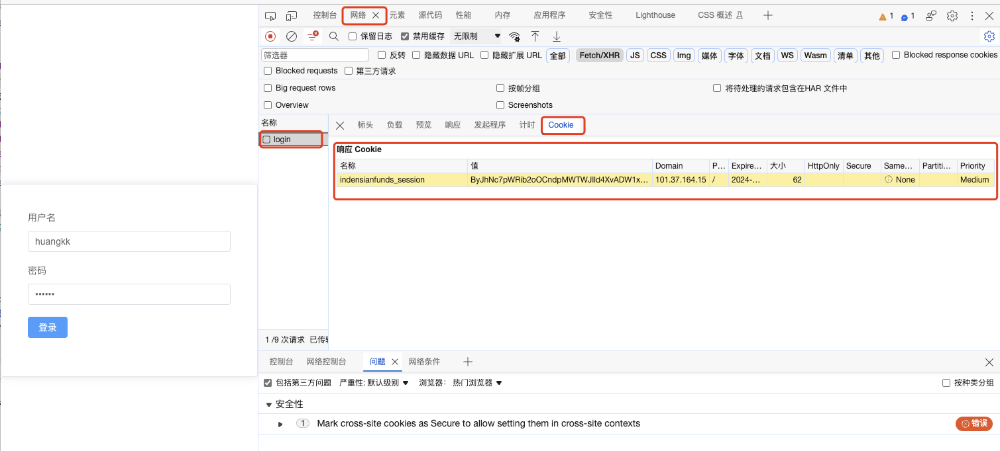
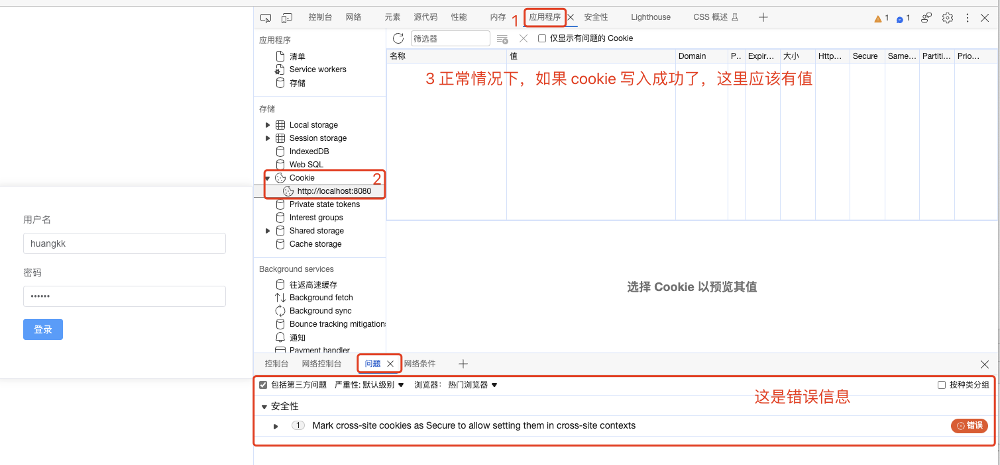
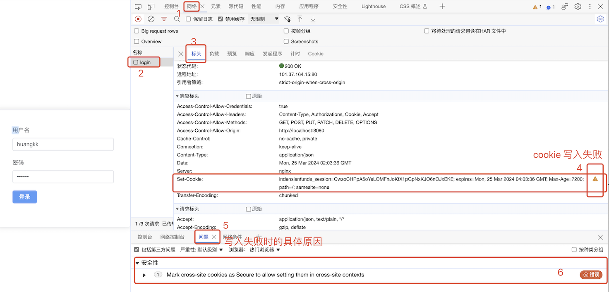
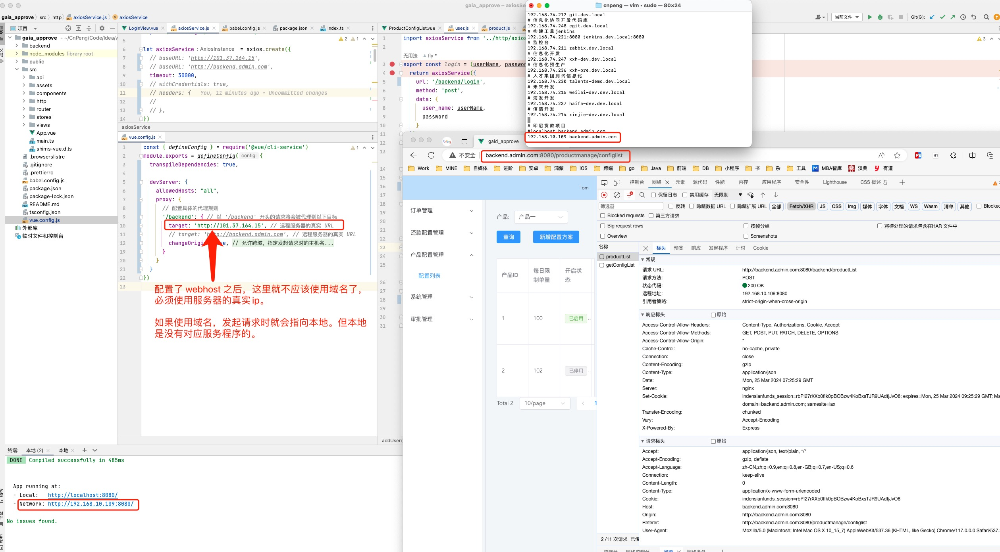
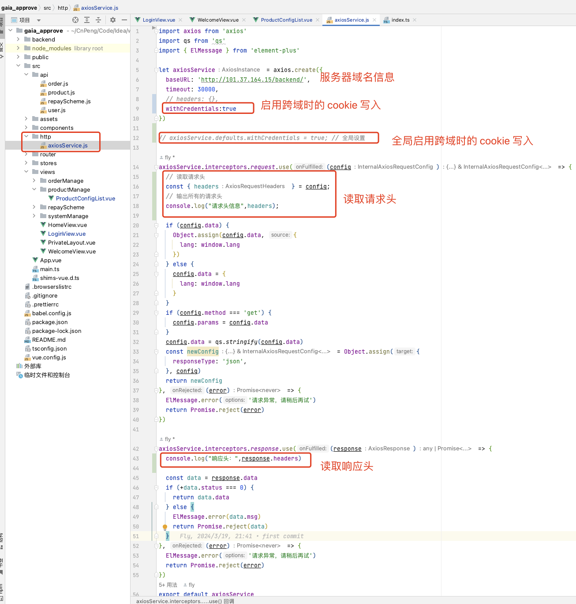

# 002-本地运行项目时解决跨域问题


## 1.1. 查看 cookie 信息


### 1.1.1. 日志查看

```js
 console.log("【document.cookie】",document.cookie)
```


### 1.1.2. 浏览器开发者工具查看-1




### 1.1.3. 浏览器开发者工具查看-2




## 1.2. 解决本地项目访问远端服务器cookie写入失败的问题

### 1.2.1. 现象

本地运行  VUE + CLI 框架 + axios 的项目时，登录界面触发登录接口之后，服务端会在请求头中返回一个 `Set-Cookie` ，正常情况下，其中的 Cookie 信息会自动写入到浏览器中。

这样，后续的接口访问就会自动携带该 Cookie , 不需要我们手动维护。但是，如果我们在开发者工具中看到下图的样子，则表示 Cookie 写入失败嘞。写入失败后，后续的接口请求中将无法携带 cookie ，从而导致后续逻辑无法正常执行。



因为是本地运行，所以运行后的访问地址为 ：`localhost:8080` 或者 `192.168.xx.xx:8080` 


### 1.2.2. 解决方案

开发阶段，项目需要在本地运行，并且访问远程服务端的接口。此时需要配置反向代理，否则会产生跨域问题，导致接口请求失败。

如果服务端在 `Set-Cookie` 中指定的 `domain` 不是 `localhost` 则配置步骤如下：

#### 1.2.2.1. 调整 axiosService.js 文件

调整 `axiosService.js` 文件中构建 axiosService 的代码，调整后如下：

```js
let axiosService = axios.create({
  // baseURL: 'http://101.37.164.15',
  // baseURL: 'http://backend.admin.com',
  timeout: 30000,
  // withCredentials: true,
  // headers: {
  // },
})
```

注意，**本地运行阶段，务必把上述代码中的 `baseURL` 注释掉，否则接口请求不通**。

发布到生产环境之后，解除注释，并根据实际情况填写 `baseURL` 的真实地址。

#### 1.2.2.2. 配置 webhost

>注意：📢  如果服务端在 `Set-Cookie` 时指定的 `domain` 为 `localhost`, 则可以省略这一步，直接修改 `vue.config.js` 中的代理配置即可。

假设本地运行项目之后，项目的访问地址为：http://192.168.10.109:8080/。

打开 `终端` ，然后输入 `sudo vim /etc/hosts` 以超管身份打开 hosts 配置文件 ，
输入该命令后会要求输入电脑超管的密码，输入并确认即可。

```bash
cnpeng@CnPeng ~ % sudo vim /etc/hosts
Password:
```

在打开的 vim 编辑视窗中在末尾添加如下内容：

```vim
# 印尼贷款项目
#localhost backend.admin.com
192.168.10.109 backend.admin.com
```

其中： `192.168.10.109` 是本地运行项目后的项目主页面访问地址，`backend.admin.com` 是通过域名访问项目主页面时的域名地址。

注意：`backend.admin.com` 需要与服务端在 `backend/login` 接口响应头里 `Set-Cookie` 指定的 `domain` 保持一致。

完成上述配置并运行项目后，我们在浏览器中访问项目主页时，就需要使用 `http://backend.admin.com:8080/login` 来访问。
注意，别落了域名后的 `8080` 端口号，该端口号就是运行项目后本地访问地址后的端口号。

#### 1.2.2.3. 配置 vue.config.js 文件

```js
const { defineConfig } = require('@vue/cli-service')
module.exports = defineConfig({
  transpileDependencies: true,

  devServer: {
    // 解决 Invalid Host header(无效的主机头) 的错误。也可以指定具体的 host 名称，allowedHosts: ['xxx.com','xxx.com']
    allowedHosts: "all",
    proxy: {
      // 配置具体的代理规则
      '/backend': { // 以 '/backend' 开头的请求将会被代理到以下目标
        target: 'http://101.37.164.15', // 远程服务器的真实 URL
        // target: 'http://backend.admin.com', // 远程服务器的真实 URL
        changeOrigin: true, // 允许跨域，指定发起请求时的主机名
      }
    }
  }
})
```

注意：

* 必须配置 `allowedHosts`, 可以指定为 `all`，也可以指定为具体的 host 数组。
* `target` 必须是远端服务器的真实地址。可以是域名也可以是ip地址。
  * 因为本地 webhost 中指定了 `backend.admin.com` 对应本地的 `192.168.10.109`，所以此处需要使用远端服务器的 ip 地址。
  * 如果此处使用了 `backend.admin.com`，请求将会转发到本机的 `192.168.10.109`，导致请求报错。

完成前述配置之后，从本地运行项目，并从浏览器中输入 `http://backend.admin.com:8080/login` 进入登录页面，点击登录之后即可正常使用 cookie ——即后续接口可以正常请求并获取到响应数据。




#### 1.2.2.4. 附：服务端配置

服务端通过 `/backend/login` 接口的响应头 `Set-Cookie` 时，需要针对 `cookie` 作如下设置：

|     配置项      |               取值               |                                                                                                                    备注                                                                                                                     |
| ------------ | ----------------------- | -------------------------------------------------------------------------------------------------------------------------------------------------------------- |
| `domain`     | `backend.admin.com` | 允许写入 cookie 的域名。浏览器中页面的域名与其不一致时，不向浏览器写入 cookie。根据实际情况填写即可。                                                                                      |
| `path`        | `/` 或 `/backend`       | 允许写入 cookie 的路由前缀，`/` 表示允许域名下的全部路由写入 cookie。根据实际情况填写即可。                                                                                                     |
| `HttpOnly` | 不要设置该属性              | cookie 是否只能通过 HTTP 协议传输。有该属性时表示仅能通过 HTTP 协议传输，没有该属性则表示可以通过 JavaScript 的 `Document.cookie` 获取并使用 cookie 信息。 |
 |`samesite`|`lax`| cookie 传递时的策略模式。<br>`lax`-只会在同站请求中发送（防止 CSRF 攻击），并且对于 `top-level navigations`（顶级导航）和 GET 请求也会发送 |

##### 1.2.2.4.1. 补充：HttpOnly说明

`Set-Cookie` 响应头中的 `HttpOnly` 标志实际上不是一个取值，而是一个**布尔标记**。它只有一个可能的设置，即**是否存在该标志**：


|         场景          |                                                                                                                                                                                                                                                     说明                                                                                                                                                                                                                                                     |
| --------------- | ----------------------------------------------------------------------------------------------------------------------------------------------------------------------------------------------------------------------------------------------------------------------------------------------------------------------------------------- |
| 存在 HttpOnly    | 当 `Set-Cookie` 响应头中包含 `HttpOnly` 标志时（例如：`Set-Cookie: example=value; HttpOnly`），浏览器会将该 cookie 标记为 `HttpOnly`。这意味着 cookie 不能通过 JavaScript 的 `Document.cookie` API 被客户端脚本（如 JavaScript）访问。设置 `HttpOnly` 的目的是增强安全性，防止 XSS（跨站脚本攻击）窃取用户的 cookie 信息。 |
| 不存在 HttpOnly | 如果 `Set-Cookie` 响应头中未包含 `HttpOnly` 标志，则表示该 cookie 不受 `HttpOnly` 特性的保护，客户端脚本可以通过 `Document.cookie` API 访问和修改这类 cookie。                                                                                                                                                                                                                                                        |

总结来说，`HttpOnly` 是一个二元属性，**要么存在，要么不存在**，它的作用在于限制 JavaScript 对特定 cookie 的访问权限，降低 XSS 攻击造成的风险。在实际应用中，对于那些敏感信息相关的 cookie，如 session ID 或认证 token，推荐设置 `HttpOnly` 标志以提高安全性。

##### 1.2.2.4.2. 补充：`samesite` 取值说明

`Set-Cookie` 响应头中的 `SameSite` 属性用于控制 cookie 在跨站请求中的行为，旨在减少 CSRF 攻击的风险。`SameSite` 属性有以下三种取值：

|取值 | 说明|
|---|---| 
| `SameSite=Strict` | 这是最严格的设置。当设置为 `Strict` 时，cookie 只会在同站请求（first-party context）中发送，也就是说，只有当请求的 URL 的协议、域名、端口与设置 cookie 的原始页面完全一致时，才会携带该 cookie。对于从其他站点（third-party context）发出的请求，包括iframe、form提交、Ajax请求等，浏览器都不会发送带有 `SameSite=Strict` 的 cookie。|
|`SameSite=Lax` | 这是一个较为宽松的设置。在 `Lax` 模式下，cookie 仍然会在同站请求中发送，但比 `Strict` 模式更灵活一些。对于 top-level navigation（顶级导航），即使是从外部网站点击链接跳转到同域名的页面，浏览器也会发送该 cookie。然而，对于跨站请求（如AJAX请求、iframe加载等），只有当请求方法为GET时，浏览器才会携带 `SameSite=Lax` 的 cookie。|
|`SameSite=None`|当设置为 `None` 时，浏览器会将该 cookie 视为可以在所有上下文中（包括同站和跨站请求）发送。但是，当 `SameSite=None` 时，为了进一步加强安全性，必须同时设置 `Secure` 属性，即 `Secure=True`，这意味着 cookie 只有在HTTPS连接上才会被发送。从 Chrome 80 开始，如果没有明确指定 `SameSite` 值，浏览器会对没有 `SameSite` 属性的 cookie 默认视为 `Lax`|

综上所述，`SameSite` 属性可以帮助开发者更好地控制 cookie 在跨域场景下的安全性，以防止不必要的跨站追踪和潜在的安全威胁。


### 1.2.3. 补充

#### 1.2.3.1. Axios 配置信息



