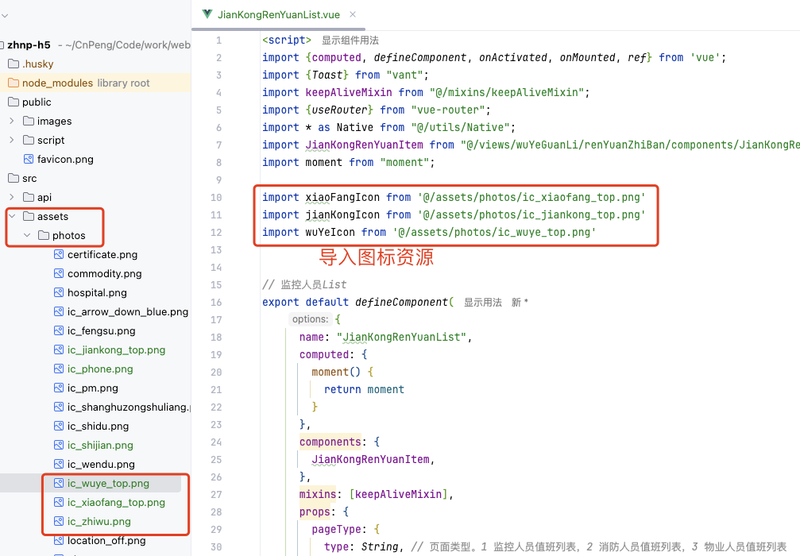
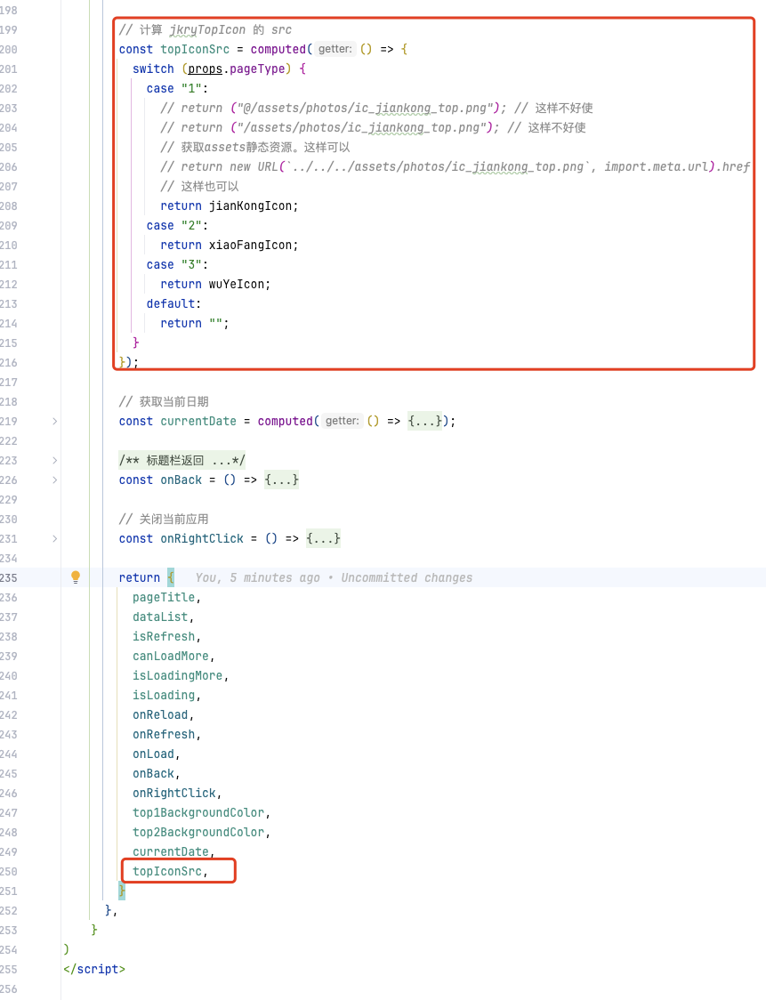
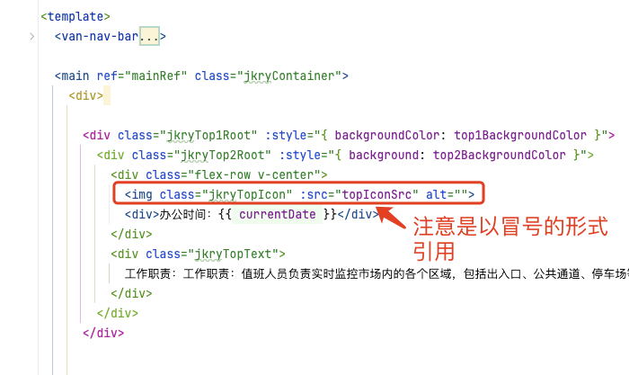
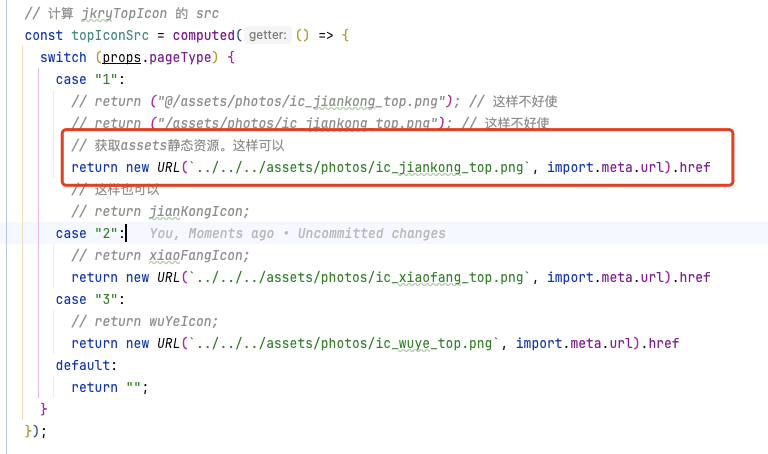

# 1. 001-基于条件动态控制img加载本地不同的图片

## 1.1. 需求：

项目基于 Vite + Vue3 构建。

基于传入的 pageType , 决定 `img` 的 `src` 属性加载本地的哪个图标。图标位于 `src/assets` 目录下。

## 1.2. 解决方案：

### 1.2.1. 方案1：

* 先导入图标资源



* 定义 computed 方法，根据 pageType 决定返回的图标资源，并将图标资源导出。



* 使用导出的资源



### 1.2.2. 方案2：

无需导入资源，直接使用图表资源的相对路径构建一个 URL 引用。`img` 组件中的使用方式与方案1一致。




```vue
return new URL(`../../../assets/photos/ic_jiankong_top.png`, import.meta.url).href
```
## 1.3. 参考

* [vue3+vite assets动态引入图片的三种方法及解决打包后图片路径错误不显示的问题](https://blog.csdn.net/weixin_44259233/article/details/143815830)