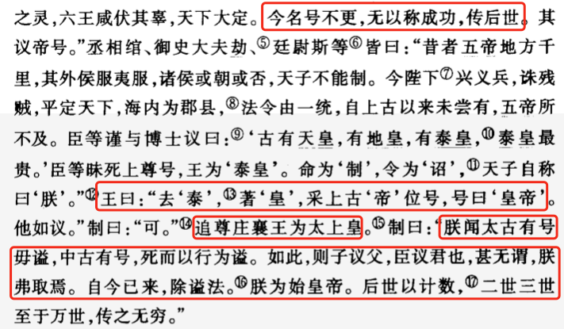

# 1. 秦

## 1.1. 皇帝

帝号 | 姓名 |  | 备注
---|---|---|-
秦始皇 | 嬴政 | 

### 1.1.1. 秦始皇

创建皇帝和太上皇称号，废弃谥号，以计数方式称呼后世皇帝。

采用郡县制，”郡置守、尉、监“，行政权和军权的分治，并对权力进行监督。

称呼平民百姓为”黔首“。

统一文字、度量衡、车轨。修建国道——驰道。

登泰山封禅（封——祭天，禅——祭地），封于泰山，祭于梁父山，是第一位史籍中有明确记载的封禅帝王。从泰山上下来时，遇到暴风雨，在树下避雨，然后封树为”五大夫“，现在泰山有”五大夫松“景点。

派遣徐福带领数千童男童女到东海访仙，求不死神药。

燕人卢生从海上求仙回来后，告知始皇帝”亡秦者胡也“。始皇帝将”胡“理解为北方胡人，所以派蒙恬率领三十万人进攻北方胡人，获取了黄河以南的土地。

派遣逃亡的犯人、上门女婿、商人攻取南方的桂林、象郡、南海（”三十三年，发诸尝逋亡人、赘婿、贾人略取陆梁地，为桂林、象郡、南海。“）——由此可见，秦时上门女婿和商人的地位极低。

齐人淳于越在秦始皇的寿宴上提议遵从古制分封子弟。李斯驳斥分封，并建议焚毁诗、书及其他诸子百家的书籍，仅允许保留医药、占卜、农事相关的书籍。秦始皇采纳了李斯的建议。

侯生和卢生觉得秦始皇做了很多坏事，不像个好皇帝，决定不再继续为其求访仙药，然后便开启了逃亡生涯；而且咸阳城内的部分儒生又发表了不利于团结的反动言论。秦始皇很生气，抓捕了四百六十多相关人员，全部坑杀。秦始皇长子扶苏曾建议从轻发落这些人，秦始皇不听，并把扶苏派到上郡监督蒙恬修筑长城。

P203

## 1.2. 太上皇

帝号/王号 | 姓名 | 获取方式 | 
---|---|---|---|---|---|---
秦庄襄王 | | 秦始皇追封 |  

### 1.2.1. 秦庄襄王

 

