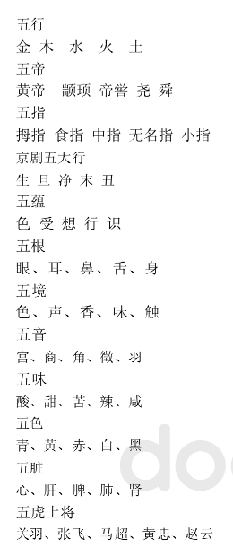

# 1. 4-五xx

“五行”、
“五星”、
“五典”、
“五谷”、
“五刑”、
“五服”、
“五气”、
“五礼”、
“五方”
“五佐神”、
“五色”、
“五耻”、
“五害”、
“五甲”、
“五事”
“五畜”
  "五菜"
  "五果"

* 五色
* 五味
* 五官
* 五行
* 五毒”，
* “五行”
* “五方五老”
* “五岳”
* “五经”
* “五绝”
* 五经

【五行】
金、木、水、火、土
【五岳】
（中岳）河南嵩山、（东岳）山东泰山、（西岳）陕西华山、（南岳）湖南衡山、（北岳）山西恒山
【五湖】
鄱阳湖（江西）、洞庭湖（湖南）、太湖（江苏）、洪泽湖（江苏）、巢湖（安徽）
【五岭】
越城岭、都庞岭、萌诸岭、骑田岭、大庾岭
【五帝】
*太皞、炎帝、黄帝、少皞、颛顼
*黄帝、颛顼、帝喾、尧、舜
*伏羲、神农、黄帝、尧、舜
*五方天帝：东方苍帝、南方赤帝、中央黄帝、西方白帝、北方黑帝
【五典】
*《诗》、《书》、《易》、《礼》、《春秋》
*父义、母慈、兄友、弟恭，子孝
【五常】
*仁、义、礼、智、信
*父义、母慈、兄友、弟恭、子孝
【五服】
*高祖、曾祖、祖父、父、自己
*天子、诸侯、卿、大夫、士（五种礼服）
*斩衰、齐衰、大功、小功、缌麻（五种丧服）
【五伦】
*君臣、父子、兄弟、夫妇、朋友
*仁、义、礼、智、信
【五经】
《诗经》、《尚书》、《礼记》、《易经》、《春秋》
【五音（五声）】
宫、商、角、徵、羽
【五乐】
琴瑟、笙竽、鼓、钟、磬（五种乐器）
【五彩（五色)】
青、黄、赤、白、黑
【五味】
*酸﹑甜﹑苦﹑辣﹑咸
*酸﹑甘﹑苦﹑辛﹑咸
【五福】
*长寿、富贵、康宁、好德、善终
*寿、富、康宁、攸好德、考终命
【五体】
筋、脉、皮、肉 、骨
【五脏】
心、肝、脾、肺、肾
【五谷】
*稻、黍、稷、麦、豆
*麻、黍、稷、麦、菽
*粳米、小豆、麦、大豆、黄黍（黄帝内经）
*大麦、小麦、稻、小豆、胡麻（佛教祭祀）
【五毒】
*石胆、丹砂、雄黄、矾石、慈石
*蝎子、蛇、壁虎、蜈蚣、蟾蜍
*贪、嗔、痴、爱、恶
*怒、恨、怨、恼、烦
*鞭、捶、灼、徽、纆
*骗、赌、帮、烟、娼
*吃、喝、嫖、赌、抽
【书法五体】
楷、行、草、隶、篆
【五伯（五霸）】
齐桓公、晋文公、秦穆公、宋襄王
、楚庄王
【五兵】
*戈、殳、戟、酋矛、夷矛（车兵）
*矛、戟、钺、楯、弓矢（步卒兵器）
*矛、戟、弓、剑、戈（步卒兵器）
【五代】
*黄帝、唐、虞、夏、殷（五个朝代）
*唐、虞、夏、商、周（五个朝代）
*梁、陈、齐、周、隋（五代十国的前五代）
*后梁、后唐、后晋、后汉、后周（五代十国的后五代）
【五德】
*温、良、恭、俭、让
*智、信、仁、勇、严
【五度】
分、寸、尺、丈、引（五种度量单位）
【五官】
*木正句芒、火正祝融、金正蓐收、水正玄冥、土正后土（传说中五行之神）
*耳、目、鼻、口、心（人体的五种器官）
【五侯】
公、侯、伯、子、男（五种诸侯爵位）
【五纪】
岁、月、日、星辰、历数
【五教】
*父义、母慈、兄友、弟恭、子孝
*小乘教、大乘始教、终教、顿教、圆教（佛教）
【五尽】
信、名、财、亲、功全丧尽称五尽
【五种礼制】
吉、凶、宾、军、嘉
【五苦】
生老病死苦、爱离别苦、怨憎会苦、求不得苦、五阴盛苦（佛教）
【五气】
寒、暑、燥、湿、风（中医)
【五刃（五戎）】
刀、剑、矛、戟、矢（兵器）
【五瑞】
圭、璧、琮、璜、璋（五种玉器，按公侯伯子男五个爵位而定）
【五胜】
水胜火、火胜金、金胜木、木胜土、土胜水
【五石】
丹砂、雄黄、白凡、曾青、慈石（道教谓五石可以炼制丹药）
【五事】
*貌、言、视、听、思（古人修身的五件事）
*道、天、地、将、法（兵中上决定胜负优劣的五种因素）
【五祀】
*禘、郊、祖、宗、报（五种祭祀）
*木正句芒、火正祝融、金正蓐收、水正玄冥、土正后土（五行之神）
*门、户、井、灶、中霤（住宅内外五种神）
【五听】
辞听、色听、气听、耳听、目听（审查案情的五种方法）
【五位】
*岁、月、日、星、辰
*东、南、西、北、中（五方之位）
*东方苍帝、南方赤帝、中央黄帝、西方白帝、北方黑帝（五方之神）
*金、木、水、火、土（指五行）
【五星】
金星、木星、水星、火星、土星
【五刑】
*墨、劓、剕、宫、大辟（史记·五帝本纪）
*甲兵、斧钺、刀锯、钻笮、鞭扑（国语·鲁语上）
*黥、劓、斩左右趾、枭首、菹其骨肉（汉书·刑法志）
*死、流、徙、杖、笞（隋书·刑法志）
【五臭】
*羶、薰、香、腥、腐（五种气味）
*薜荔、白芷、蘪芜、椒、莲（五种有气味的植物）
【五藏】
*脾、肺、肾、肝、心（人的五种脏器）
*素旦缆藏、毗奈耶藏、阿毗达磨藏、杂集藏、禁咒藏（佛教中五类经典）
【五子】
*管仲、隰朋、宁戚、宾胥无、鲍叔牙（齐国）
*由余、百里奚、蹇叔、丕豹、公孙支（秦国）
*周敦颐、程颢、程颐、张载、朱熹（宋代理学家）