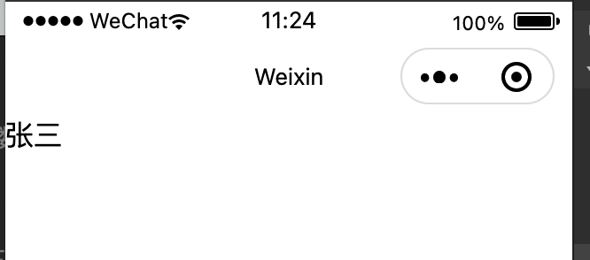
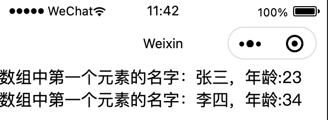
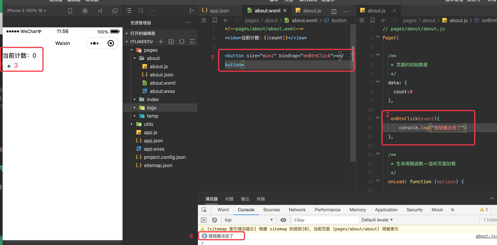

## 3.1 小程序的数据绑定

`xx.js` 文件中放置 xx 页面的逻辑和变量内容。

小程序数据绑定使用的是 `{{ }}` 双大括号语法，标准叫法为 `Mustache` 语法。

在 `xx.js` 的 `Page`-`data` 节点中定义变量

```js
Page({

  /**
   * 页面的初始数据
   */
  data: {
	name:'张三'
  }
}  
```

然后在 `xx.wxml` 页面中通过 `{{}}` 引用：

```xml
<text>{{name}}</text>
```

此时，小程序的预览界面就会显示 `张三`，如下图：



`{{}}` 还支持如下写法：

```xml
<text>我的名字：{{name}}</text>
<!--表示引用在 js 中定义的变量 age ，并将其值 + 10 -->
<text>我的年龄：{{age + 10 }}</text>
```

## 3.2 列表展示`wx:for`

xx.js 文件内容：

```js
Page({

  /**
   * 页面的初始数据
   */
  data: {
    students:[
      {id:1,name:'张三',age:13},
      {id:2,name:'李四',age:24}
    ]
  }
}
```

xx.wxml 文件内容：

```xml
<!--注意：此处使用的关键语法是 wx:for , 默认为每个条目生成一个 item 对象。其后的取值必须使用 {{}} 包裹，不包裹的话，就会把后面的值作为字符串使用。-->
<view wx:for="{{students}}">数组中第一个元素的名字：{{item.name}}，年龄:{{(item.age)+10}}</view>
```

运行结果：



## 3.3 事件监听

绑定数据时使用 `{{}}` 语法， 绑定函数不需要使用该语法。

js 文件核心内容：

```js
Page({

  /**
   * 页面的初始数据
   */
  data: {
    count:0
  },

   onBtnClick(event){
      console.log("按钮被点击了")
       this.setData({
        <!--不要直接使用 `this.data.count += 1 ` , 这种数据变更之后无法更新到界面上。-->
        count:this.data.count+1
      })
  }
}  
```

xml 文件核心内容：

```xml
<button size="mini" bindtap="onBtnClick">+</button>
```



这样点击按钮之后，界面中的数据会变，同时控制台中会打印 log。