## 8.1 Text 

[text组件](https://developers.weixin.qq.com/miniprogram/dev/component/text.html)

是行内元素，默认情况下多个 `<text></text>` 会显示在一行

```xml
<!--pages/about/about.wxml-->

<!-- 1-基本使用 -->
<text>text是行内元素</text>
<text>所以多个text不会换行，除非末尾加上换行符或用换行元素包裹，如 \\n \n\n</text>

<!-- 2-selectable 决定文本是否可以被长按选中，默认不能选中 -->
<text selectable="{{true}}">文本可以被长按选中\n</text>
<text selectable>也可以省略 selectable 后面的 mustache 语法值\n\n</text>

<!-- 3-space 决定空格大小 -->
<!-- 手写的英文空格 -->
<text>Hello world\n</text>
<!-- nbsp 等价于手写的英文空格 -->
<text space="nbsp">Hello world\n</text>
<!-- ensp 表示半个中文字符大小 -->
<text space="ensp">Hello world\n</text>
<!-- emsp 表示一个中文字符大小 -->
<text space="emsp">Hello world\n\n</text>

<!-- 4-是否对特殊字符进行解码 -->
<!-- &gt; 表示 >, 不启用解码时将直接显示 5 &gt; 3  -->
<text> 5 &gt; 3 \n</text>
<!-- 解码后展示 5>3 -->
<text decode="{{true}}"> 5 &gt; 3 \n</text>
<!-- 可以省略 mustache 语法取值 -->
<text decode> 5 &gt; 3 \n</text>
```

效果图：

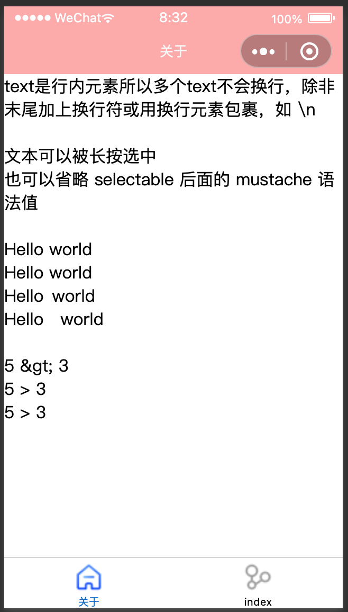


## 8.2 Button 

[Button 组件](https://developers.weixin.qq.com/miniprogram/dev/component/button.html)用于创建按钮，默认是块级元素。

```xml
<!-- 1-基本使用 -->
<!-- 按钮中默认添加了许多样式，所以默认会很大，且独占一行 -->
<button>按钮</button>

<!-- 2-size属性：mini -->
<!-- mini 按钮会启用 display:inline-block, 即变成了行内块元素 -->
<button size="mini"> mini 按钮1</button>
<button size="mini"> mini 按钮1</button>

<!-- 3-type 属性 -->
<button size="mini" type="default"> type：default 按钮</button>
<button size="mini" type="primary">type:primary 按钮</button>
<button size="mini" type="warn">type:warn 按钮</button>

<!-- 4-plain 镂空样式 -->
<button size="mini" plain> plain 按钮</button>

<!-- 5-disable 禁用，不可用,不可点击 -->
<button size="mini" disabled> disabled 按钮</button>

<!-- 6-loading 加载 -->
<button size="mini" loading> loading 按钮</button>
<button size="mini" loading="{{false}}"> 隐藏圈圈的 loading 按钮</button>

<!-- 7-hover-class 修改按下时的背景 -->
<button size="mini" hover-class="pressed"> 7-hover-class 按钮</button>

<!-- 8-open-type -->
<view>
  <button size="mini" open-type="contact" bindcontact="onContact"> 客服会话</button>
  <button size="mini" open-type="share" > 程序分享</button>
  <button size="mini" open-type="getPhoneNumber" bindgetphonenumber="onGetPhoneNum"> 获取手机号</button>
  <button size="mini" open-type="getUserInfo" bindgetuserinfo="onGetUserInfo"> 获取用户信息</button>
</view>
```

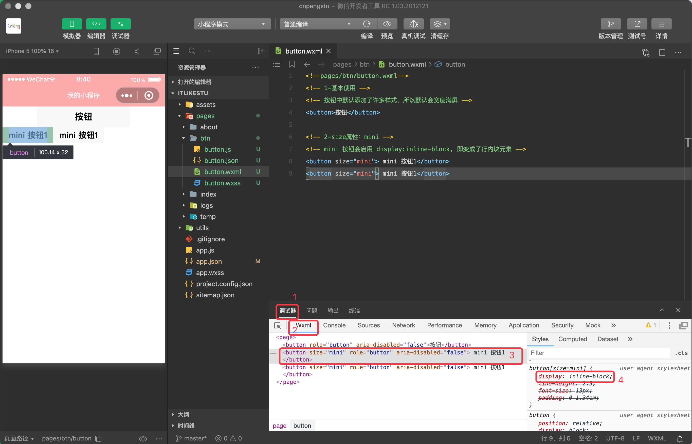

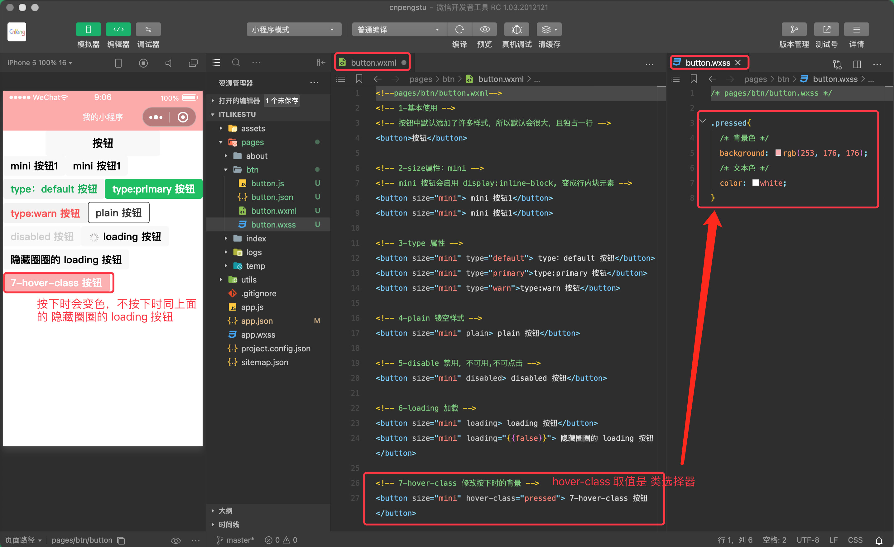

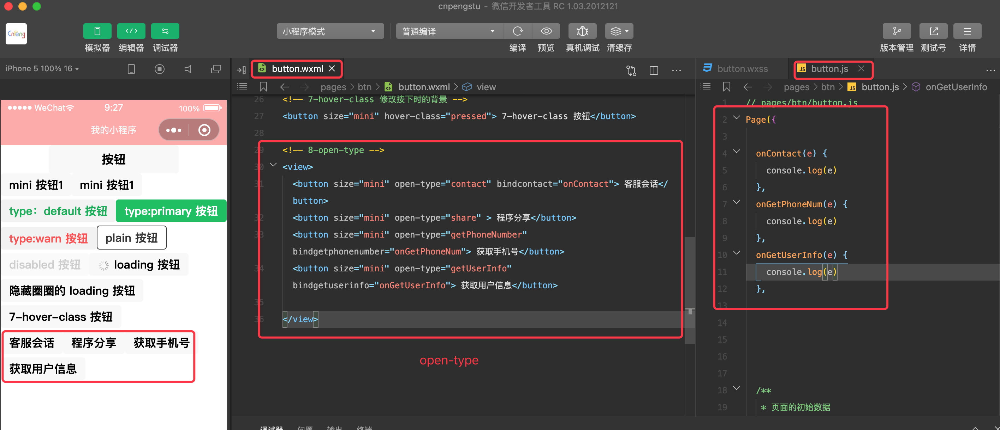

设置 `opent-type` 后，其主要区别在于点击之后出现的弹窗或者操作不一样。


## 8.3 View 

[view 组件](https://developers.weixin.qq.com/miniprogram/dev/component/view.html) ，即视图组件，是块级元素，默认独占一行，通常用作容器。类似前端的 div.

view.wxml 如下:

```xml
<!--pages/view-element/view.wxml-->
<!-- 1-基本使用 -->
<view class="box">view 是块级元素、容器, 会占满整行</view>
<view>多个 view 间不需要手动换行</view>

<!-- 2-hover-class 用户按下组件时的显示样式 -->
<view class="box1" hover-class="hover-view">2-hover-class 按下时改变样式</view>
<!-- 在按下和松开时，会有一个短暂的延时，延时过后才会变更。-->
<!--这个延时是通过 hover-start-time 和 hover-stay-time 控制的,取值 number -->
<!-- 取值 number 时，最好使用 {{}} 将值包裹起来 -->
<view class="box" hover-class="hover-view" hover-stay-time="{{800}}">2-hover-class 按下时改变样式</view>

<!-- 3-hover-stop-propagation 是否阻止本节点的祖先节点出现点击态 -->
<!-- hover-stop-propagation 默认false,点击子节点时，父节点也会变化  -->
<view class="box2" hover-class="hover-view2">
  <view class="box1" hover-class="hover-view">
    3-hover-stop-propagation
  </view>
</view>

<!-- 设置 hover-stop-propagation 后,点击子节点时，父节点无变化。但无法阻止点击父节点时，子节点响应变化  -->
<view class="box2" hover-class="hover-view2">
  <view class="box1" hover-class="hover-view" hover-stop-propagation>
    3-hover-stop-propagation
  </view>
</view>
```

view.wxss 如下：

```css
/* pages/view-element/view.wxss */
.box{
  background: red;
}

.box1{
  width: 250px;
  height: 50px;
  background:yellow;
}

.hover-view{
  background:red;
  color: white;
  font-size: 18px;
}

.box2{
  width: 300px;
  height: 80px;
  background:pink;
}

.hover-view2{
  background:black;
  color: white;
  font-size: 18px;
}
```

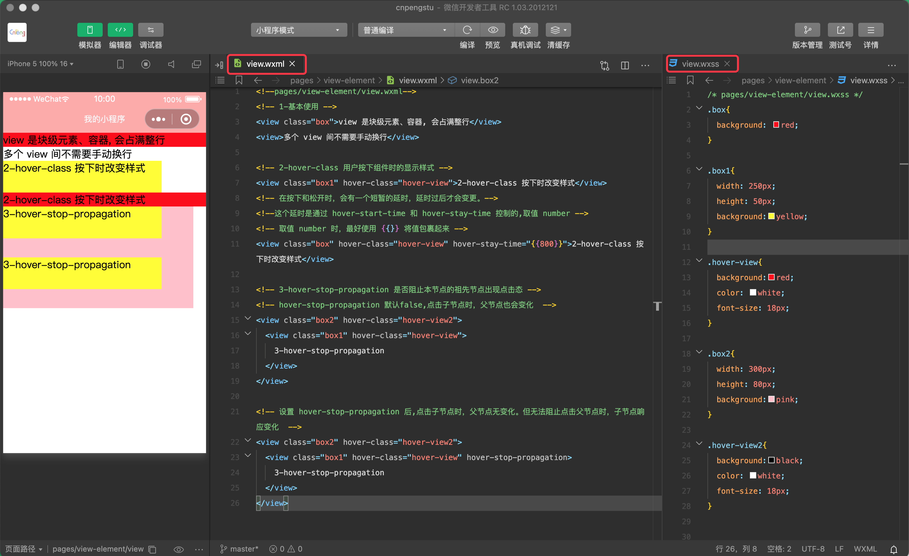


## 8.4 Image

[image 组件](https://developers.weixin.qq.com/miniprogram/dev/component/image.html)

image 组件可以自闭合，且有默认大小。是一个行内块元素。

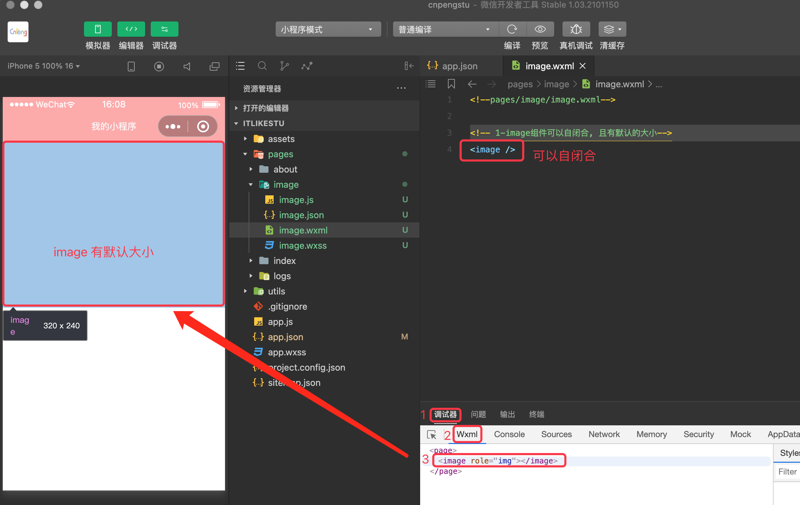

可以调用 wx 系统组件，从相册选择图片或者拍摄图片


监听图片加载状态：`bindload`

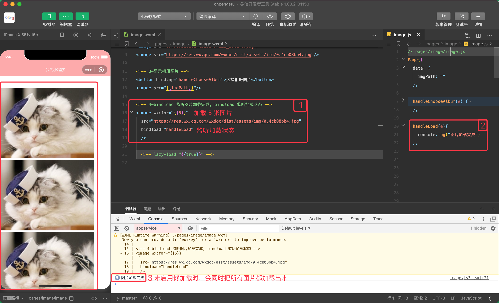

图片懒加载：`lazy-load` (实测未生效，不知道为啥。)

长按展示菜单：`show-menu-by-longpress`

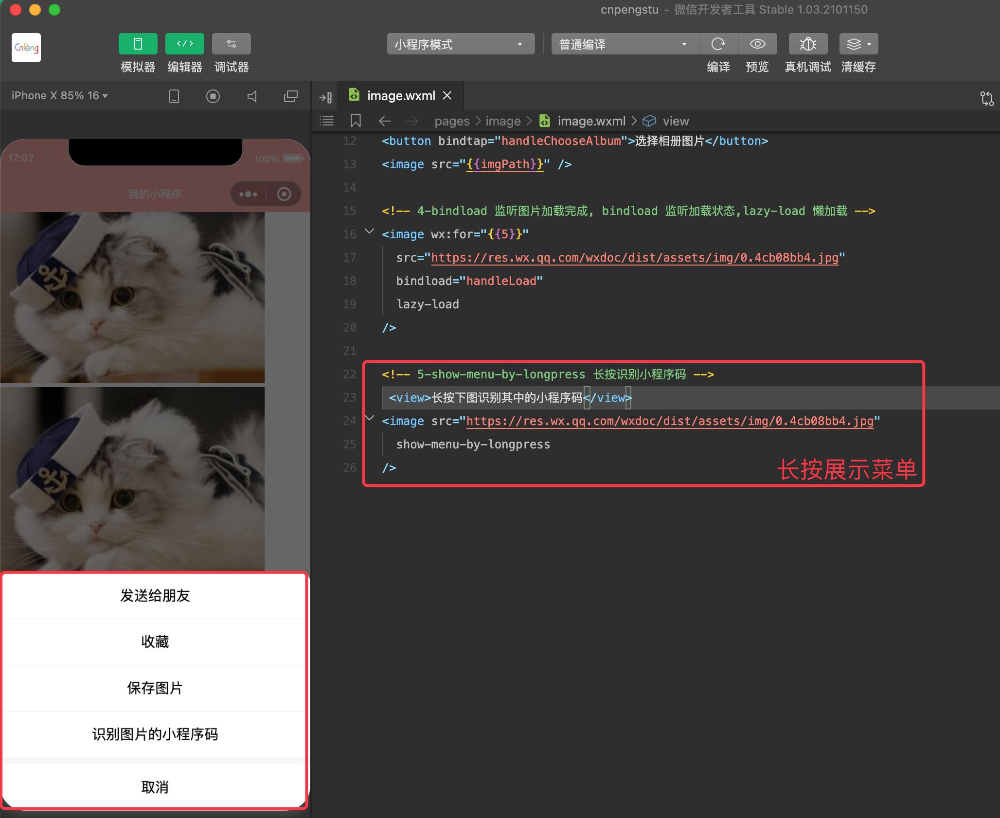

图片的 mode 属性也非常重要，可以参考 [文档中的示例和说明](https://developers.weixin.qq.com/miniprogram/dev/component/image.html)

image.wxml 内容如下:

```xml
<!--pages/image/image.wxml-->

<!-- 1-image组件可以自闭合, 且有默认的大小-->
<!-- <image /> -->

<!-- 2-支持本地图片，支持远程图片 -->
<image src="/assets/tabbar/home_active.png" />
<image src="../../assets/tabbar/home_active.png" />
<image src="https://res.wx.qq.com/wxdoc/dist/assets/img/0.4cb08bb4.jpg" />

<!-- 3-显示相册图片 -->
<button bindtap="handleChooseAlbum">选择相册图片</button>
<image src="{{imgPath}}" />

<!-- 4-bindload 监听图片加载完成, bindload 监听加载状态,lazy-load 懒加载 -->
<image wx:for="{{5}}" 
  src="https://res.wx.qq.com/wxdoc/dist/assets/img/0.4cb08bb4.jpg" 
  bindload="handleLoad" 
  lazy-load
/>

<!-- 5-show-menu-by-longpress 长按识别小程序码 -->
 <view>长按下图识别其中的小程序码</view>
<image src="https://res.wx.qq.com/wxdoc/dist/assets/img/0.4cb08bb4.jpg" 
  show-menu-by-longpress
/>

<!-- 6-mode 图片缩放模式，直接参考官方文档吧 https://developers.weixin.qq.com/miniprogram/dev/component/image.html-->
```

image.js 如下：

```js
Page({
  data: {
    imgPath: ""
  },

  handleChooseAlbum(e) {
    // 让用户从相册选择或者拍摄新图片
    wx.chooseImage({
      success:(res) =>{
        console.log(res)
        const path = res.tempFilePaths[0]
        this.setData({
          imgPath:path
        })
      }
    })
  },

  handleLoad(e){
    console.log("图片加载完成")
  }
}
```

## 8.5 Input 

[Input 组件](https://developers.weixin.qq.com/miniprogram/dev/component/input.html) 即输入框，用来接收用户输入的信息。

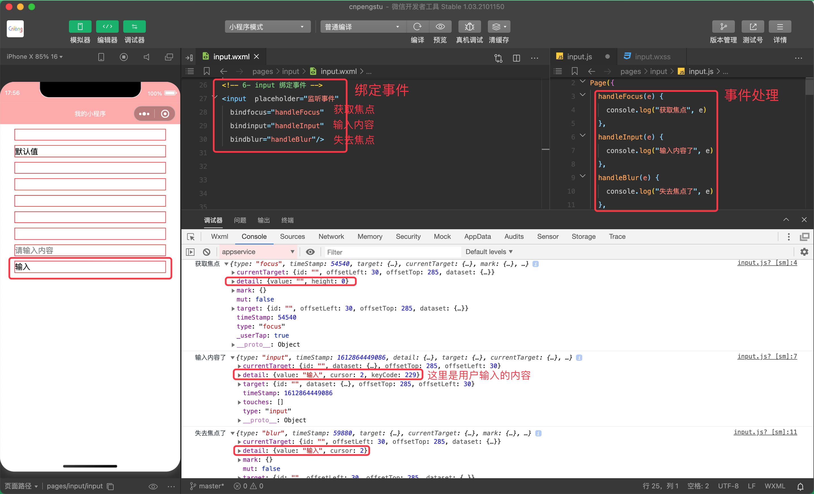

input.wxml

```xml
<!--pages/input/input.wxml-->

<!-- 1-基本使用，可以使用自闭合方式 -->
<!-- 默认透明无边框, 我们设置了 input 标签选择器，所以会增加边框和margin -->
<input/>

<!-- 2-value: 默认值 -->
<input value="默认值"/>

<!-- 3- type 决定键盘的类型. 注意，模拟器不弹出键盘，仅能从真机查看效果 -->
<!-- 文本，默认值 -->
<input type="text"/>
<!-- 数值 -->
<input type="number"/>
<!-- 身份证 -->
<input type="idcard"/>
<!-- 带小数点的数值 -->
<input type="digit"/>

<!-- 4- password 暗文输入. 以小圆点展示内容 -->
<input password/>

<!-- 5-placeholder 占位符 -->
<input placeholder="请输入内容"/>

<!-- 6- input 绑定事件 -->
<input  placeholder="监听事件" 
  bindfocus="handleFocus" 
  bindinput="handleInput" 
  bindblur="handleBlur"/>
```

input.wxss

```css
input{
    border: 1px solid red;
    margin: 10px 30px;
}
```

input.js

```js
Page({
  handleFocus(e) {
    console.log("获取焦点", e)
  },
  handleInput(e) {
    console.log("输入内容了", e)
  },
  handleBlur(e) {
    console.log("失去焦点了", e)
  }
}
```


## 8.6 ScrollView 

[scroll-view](https://developers.weixin.qq.com/miniprogram/dev/component/scroll-view.html) 可滚动视图区域。使用竖向滚动时，需要给 `scroll-view` 一个固定高度，通过 WXSS 设置 height。组件属性的长度单位默认为 px，2.4.0 起支持传入单位(rpx/px)。

通常用于实现的是局部滚动。

实现水平和垂直滚动：

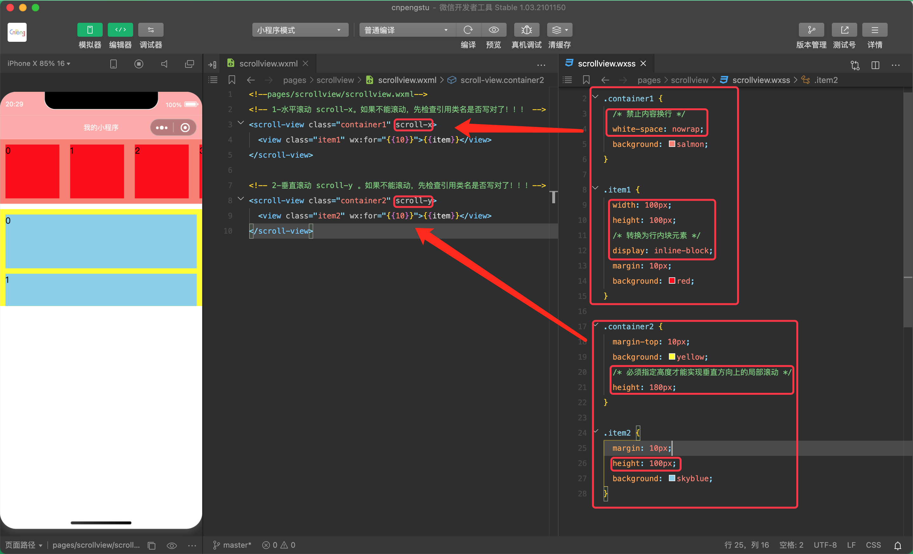

监听滚动事件：

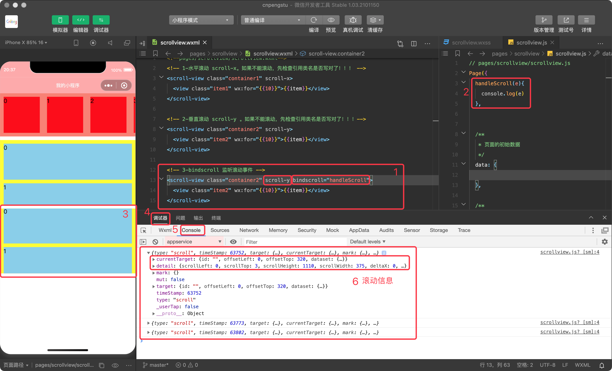


scrollview.wxml

```xml
<!--pages/scrollview/scrollview.wxml-->
<!-- 1-水平滚动 scroll-x。如果不能滚动，先检查引用类名是否写对了！！！ -->
<scroll-view class="container1" scroll-x>
  <view class="item1" wx:for="{{10}}">{{item}}</view>
</scroll-view>

<!-- 2-垂直滚动 scroll-y 。如果不能滚动，先检查引用类名是否写对了！！！-->
<scroll-view class="container2" scroll-y>
  <view class="item2" wx:for="{{10}}">{{item}}</view>
</scroll-view>

<!-- 3-bindscroll 监听滚动事件 -->
<scroll-view class="container2" scroll-y bindscroll="handleScroll">
  <view class="item2" wx:for="{{10}}">{{item}}</view>
</scroll-view>
```

scrollview.js

```js
Page({
  handleScroll(e){
    console.log(e)
  }
}  
```


scrollview.wxss

```css
.container1 {
  /* 禁止内容换行 */
  white-space: nowrap;
  background: salmon;
}

.item1 {
  width: 100px;
  height: 100px;
  /* 转换为行内块元素 */
  display: inline-block;
  margin: 10px;
  background: red;
}

.container2 {
  margin-top: 10px;
  background: yellow;
  /* 必须指定高度才能实现垂直方向上的局部滚动 */
  height: 180px;
}

.item2 {
  margin: 10px;
  height: 100px;
  background: skyblue;
}
```


## 8.7 所有组件的共同属性

所有 wxml 标签（组件）都支持的属性称之为共同属性，具体有如下属性：

属性名 | 类型 | 描述 | 注解
---|---|---|---
id | string | 组件的唯一标识 | 整个页面唯一
class | string | 组件的样式类 | 在对应的 wxss 中定义的样式类
style | string| 组件的内联样式 | 可以动态设置的内联样式
hidden | boolean | 组件是否显示 | 所有组件默认显示
`data-*` | Any | 自定义属性 | 组件上触发的事件时，会发送给事件处理函数。
`bind*` / `catch*` | EventHandler | 组件的事件 |  


