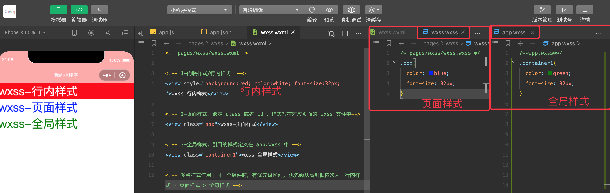
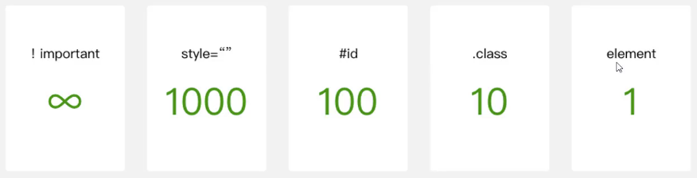
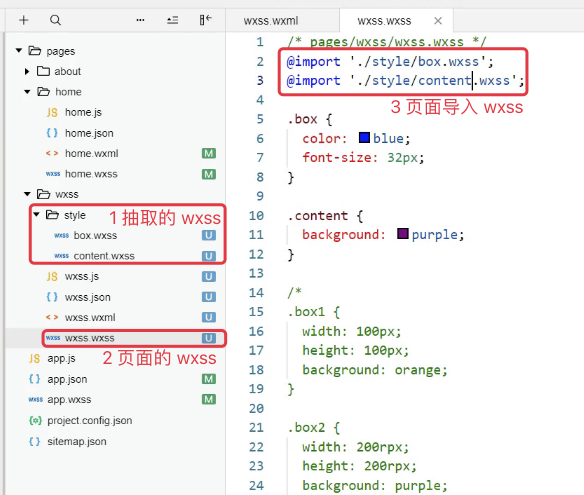

## 9.1 wxss 样式

组件在引用样式时有三种写法：



wxss.wxml

```xml
<!--pages/wxss/wxss.wxml-->

<!-- 1-内联样式/行内样式  -->
<view style="background:red; color:white; font-size:32px; ">wxss-行内样式</view>

<!-- 2-页面样式。绑定 class 或者 id ，样式写在对应页面的 wxss 文件中-->
<view class="box">wxss-页面样式</view>

<!-- 3-全局样式。引用的样式定义在 app.wxss 中 -->
<view class="container1">wxss-全局样式</view>

<!-- 多种样式作用于同一个组件时，有优先级区别, 优先级从高到低依次为：行内样式 > 页面样式 > 全句样式 -->
```

wxss.wxss

```css
.box{
  color: blue;
  font-size: 32px;
}
```

app.wxss

```css
.container1{
  color: green;
  font-size: 32px;
}
```

## 9.2 小程序支持的选择器

小程序推荐使用如下选择器。其他 css 中的选择器也支持，但可能会有兼容问题。

选择器 | 示例 | 示例描述
---|---|---
`.class` | `.intro` | 选择所有拥有 `class = "intro"` 的组件
`#id` | `#firstname` | 选择拥有 `id = "firstname"` 的组件
element | view | 选择所有 view 组件
element , element | view,checkbox | 选择所有文档的 view 组件和所有的 checkbox 组件
`::after` | `view::after` | 在 view 组件后边插入内容
`::before` | `view::before` | 在 view 组件前边插入内容   

不同选择器之间的权重：



```css
.content{
	background: red  !important;
}
```

上述代码中，`!important` 的作用是提升样式权重为无穷大（即最大）。

## 9.3 wxss的扩展-尺寸单位

`rpx`  responsive pixel , 可以根据屏幕宽度进行自适应，规定屏幕宽为 750rpx.

比如，在 iPhone6 上，屏幕宽度为 375px，共有 750 个物理像素，则 750rpx = 375px = 750物理像素。1 rpx = 0.5px = 1 物理像素。

rpx 可以用来设置宽高，也可以用来设置字体大小。


## 9.4 wxss的扩展-样式导入

在某些情况下，我们可能会将样式分布在多个 wxss 文件中，方便对样式进行管理。此时，我们就可以在页面的 wxss 中使用样式导入，从而引用被导入的 wxss 。

在 wxss 中导入其他的 wxss 样式时，使用 `@import` 关键字，其后跟需要导入的外连样式表的相对路径（或者绝对路径），用 `;` 表示导入结束。



页面和 app 的 wxss 都支持导入 wxss .

## 9.5 官方样式库

为了减少开发者样式开发的工作量，小程序官方提供了 [WeUI.wxss 基本样式库](https://github.com/Tencent/weui-wxss)

下载样式库，打开时用 `微信 web 开发者工具` 打开 `dist` 目录（请注意，是dist目录，不是整个项目）即可查看其内部实现。

如果想使用官方样式库中的部分内容，就根据需要拷贝样式库中的 wxml、wxss、js 文件到自己的项目中。


