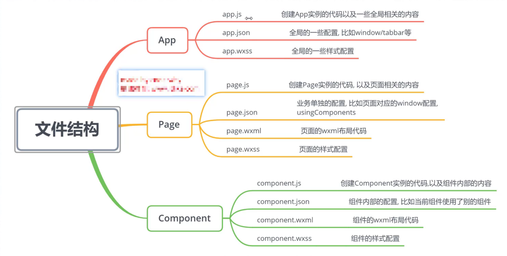
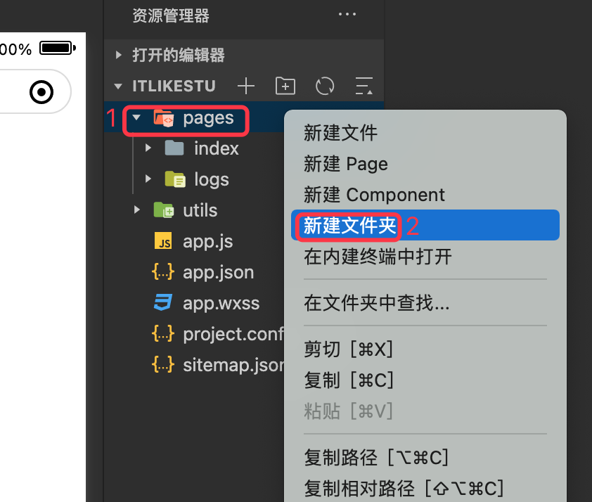
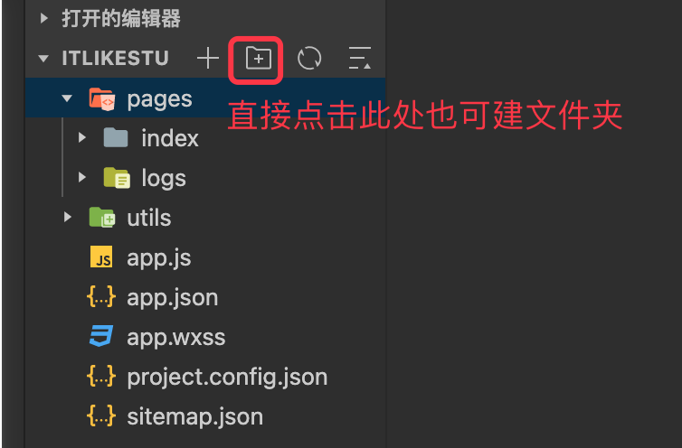
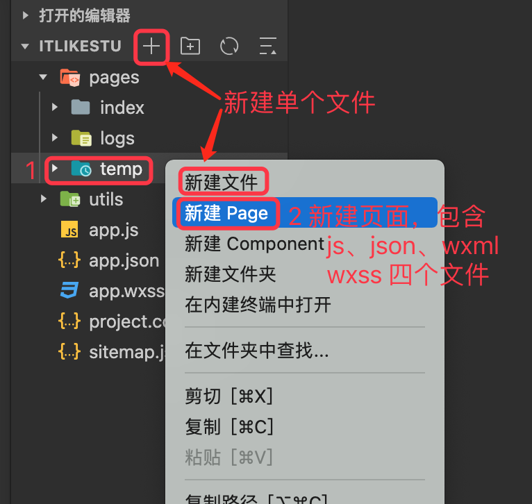

基于《 [itlike 2019小程序教程](https://www.bilibili.com/video/BV1Kt411V7rg?p=3&spm_id_from=pageDriver)》 整理

---


## 1.1 文件结构



`app.json` 是程序的入口，程序的页面需要在其中的 `pages` 节点中注册，排第一位的将作为程序首屏。

app.json 示例：

```json
{
  "pages": [
    "pages/index/index",
    "pages/logs/logs", 
    "pages/temp/temp"   
  ]
}  
```

## 1.2 新建文件(夹)

### 1.2.1 新建文件夹

方式1：



方式2：



### 1.2.2 新建页面文件

方式1：



按照上图中这种 `新建 Page` 的方式会同时创建一个页面所需的四个文件，并且会自动将该页面注册到 `app.json` 的 `pages` 中 。

方式2：

在 `app.json` 的 `pages` 节点中先声明我们将要注册和编辑的页面，然后使用 `Ctrl+S` （MAC 下为 `CMD+S`）保存。 

然后小程序的 IDE 就会自动创建我们注册的这个目录和其中的四个页面。 