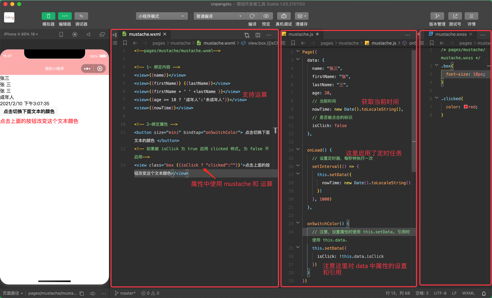
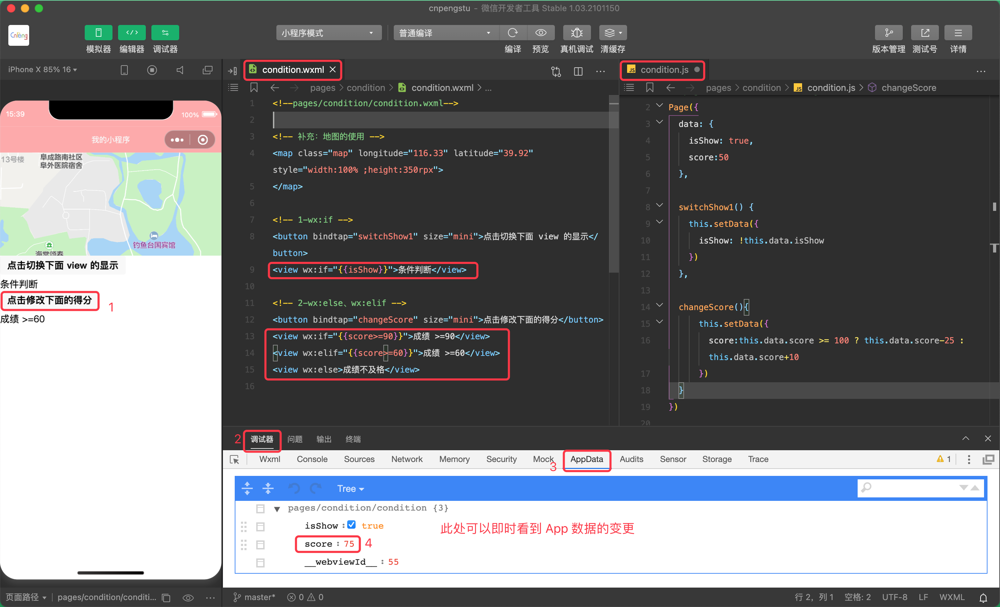
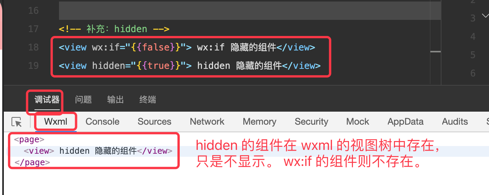
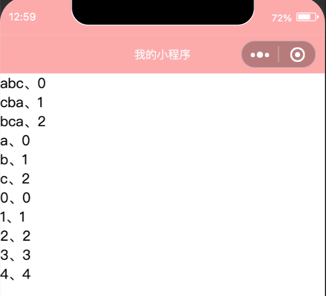
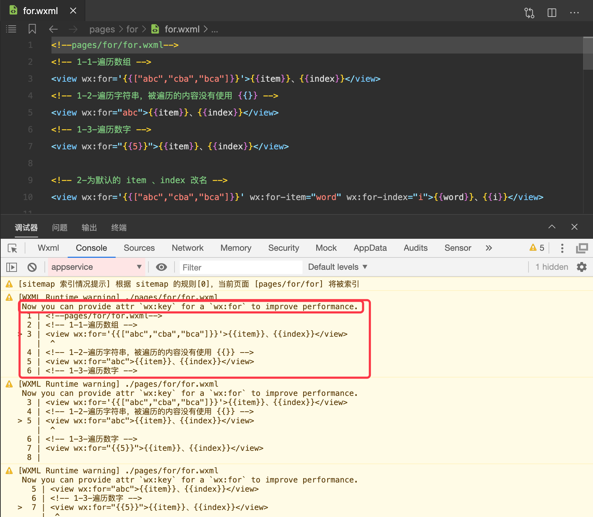
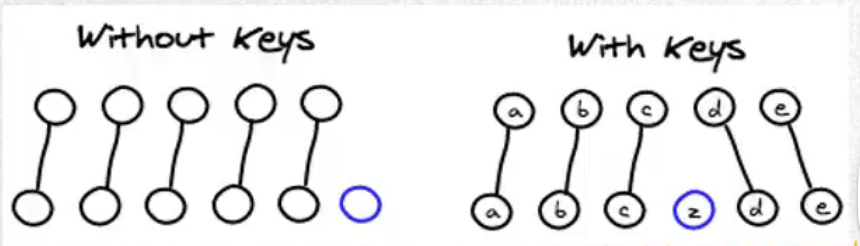
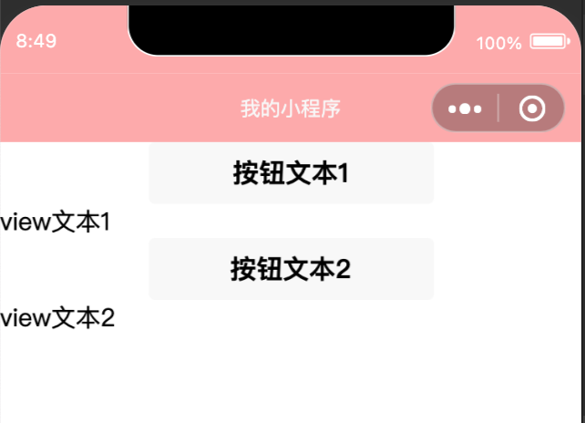
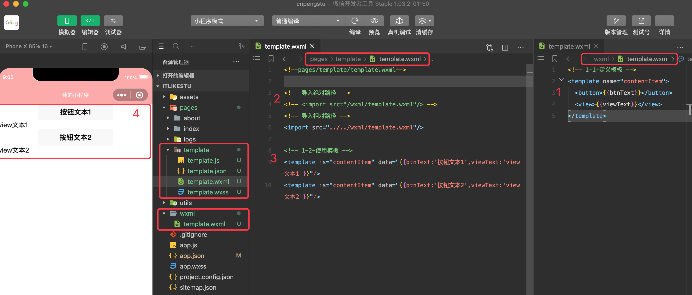

介绍 wxml 中的相关语法内容。

wxml 基本格式：

* 类似 html 代码：比如，可以写生单标签也可以写成双标签
* 必须有严格的闭合：没有闭合会导致编译报错
* 大小写敏感：class 和 Class 是不同的属性


## 10.1 `{{}}`- Mustache 语法



mustache.wxml:

```xml
<!--pages/mustache/mustache.wxml-->

<!-- 1- 绑定内容 -->
<view>{{name}}</view>
<view>{{firstName}} {{lastName}}</view>
<view>{{firstName + ' ' +lastName }}</view>
<view>{{age >= 18 ? '成年人':'未成年人'}}</view>
<view>{{nowTime}}</view>

<!-- 2-绑定属性 -->
<button size="mini" bindtap="onSwitchColor"> 点击切换下面文本的颜色 </button>
<!-- 如果被 isClick 为 true 启用 clicked 样式, 为 false 不启用-->
<view class='box {{isClick ? "clicked":""}}'>点击上面的按钮改变这个文本颜色</view>
```

mustache.js

```js
// pages/mustache/mustache.js
Page({
  data: {
    name: "张三",
    firstName: "张",
    lastName: "三",
    age: 20,
    // 当前时间
    nowTime: new Date().toLocaleString(),
    // 是否被点击的标识
    isClick: false
  },

  onLoad() {
    // 设置定时器，每秒钟执行一次
    setInterval(() => {
      this.setData({
        nowTime: new Date().toLocaleString()
      })
    }, 1000)
  },

  onSwitchColor() {
    // 注意，设置属性时使用 this.setData, 引用时使用 this.data.
    this.setData({
      isClick: !this.data.isClick
    })
  }
})
```

mustache.wxss:

```css
/* pages/mustache/mustache.wxss */
.box{
  font-size: 18px;
}

.clicked{
  color: red;
}
```

## 10.2 条件/逻辑判断

包括 `wx:if`、`wx:elif`、`wx:else` . 当条件结果为 true 时显示组件，false 不显示组件。

### 10.2.1 条件判断



condition.wxml:

```xml
<!--pages/condition/condition.wxml-->

<!-- 补充：地图的使用 -->
<map class="map" longitude="116.33" latitude="39.92" style="width:100% ;height:350rpx">
</map>

<!-- 1-wx:if -->
<button bindtap="switchShow1" size="mini">点击切换下面 view 的显示</button>
<view wx:if="{{isShow}}">条件判断</view>

<!-- 2-wx:else、wx:elif -->
<button bindtap="changeScore" size="mini">点击修改下面的得分</button>
<view wx:if="{{score>=90}}">成绩 >=90</view>
<view wx:elif="{{score>=60}}">成绩 >=60</view>
<view wx:else>成绩不及格</view>
```

condition.js:

```js
// pages/condition/condition.js
Page({
  data: {
    isShow: true,
    score:50
  },

  switchShow1() {
    this.setData({
      isShow: !this.data.isShow
    })
  },

  changeScore(){
      this.setData({
        score:this.data.score >= 100 ? this.data.score-25 : this.data.score+10
      })
  }
})
```

### 10.2.2 hidden 属性

hidden 是所有组件都默认拥有的属性，true 隐藏，false 显示。

`wx:if` 和 `hidden` 都可以实现组件的显示和隐藏。区别主要在于隐藏时的状态：

* hidden 隐藏组件时，组件依然在 xml 中存储，只是没有渲染出来。
* `wx:if` 隐藏组件时，xml 中就不会添加该组件




## 10.3 列表渲染 

### 10.3.1 `wx:for`

```xml
<!--pages/for/for.wxml-->
<!-- 1-1-遍历数组 -->
<view wx:for='{{["abc","cba","bca"]}}'>{{item}}、{{index}}</view>
<!-- 1-2-遍历字符串，被遍历的内容没有使用 {{}} -->
<view wx:for="abc">{{item}}、{{index}}</view>
<!-- 1-3-遍历数字 -->
<view wx:for="{{5}}">{{item}}、{{index}}</view>
```





### 10.3.2 block 标签

在某些情况下，我们需要使用 `wx:if` 或 `wx:for` 时，可能需要包裹一组组件标签，当我们需要对这一组组件标签仅想整体的操作时，就可以使用 `block` 标签。

`<block></block>` 并不是一个组件，仅是一个包装元素用的标签，不会再页面中做任何渲染，只接受控制属性——如 `wx:if`、`wx:for`

```xml
<block wx:if="{{isShow}}">
  <button>按钮1-block</button>
  <button>按钮1-block</button>
  <text>文本1-block</text>
</block>
```

在不使用 block 时，也可以使用下面的方式实现对一组组件的控制：

```xml
<view wx:if="{{isShow}}">
  <button>按钮1</button>
  <button>按钮1</button>
  <text>文本1</text>
</view>
```

但是，`block` 不是一个组件，仅是一个特殊的标签，所以性能上会比 `view` 包裹的方式高。

### 10.3.3 为默认的 item 和 index 改名

在 `wx:for` 循环时，会默认生成 `item` 和 `index` 。但是，如果产生了嵌套（多层遍历）时，就有必要对 `item` 和 `index` 进行重命名，如下： 

```xml
<!-- 2-为默认的 item 、index 改名 -->
<view wx:for='{{["abc","cba","bca"]}}' wx:for-item="word" wx:for-index="i">{{word}}、{{i}}</view>

<!-- 二维数组 -->
<block wx:for='{{[[1,2,3],[4,5,6],[7,8,9]]}}'>
    <block wx:for="{{item}}" wx:for-item="num" wx:for-index="i">
        <view>{{num}}</view>
    </block>
</block>
```

注意：改名时，名字中不要用中划线。

### 10.3.4 `wx:key`

我们在使用 `wx:for` 时，在控制台会报出如下错误信息：



提示说，我们要设置 `wx:key` 从而提升性能——主要提升的是小程序底层的虚拟 DOM 的性能。

未使用 key 时，所有数据和视图都会发生变化；使用 key 之后，只有发生变化的数据才会更新对应的视图



key 必须是能对数据进行唯一标识的内容。


## 10.4 模板

### 10.4.1 模板的基本使用

wxml 提供模板（template），可以在模板中定义代码片段，在不同的地方调用。（这是 wxml 代码复用的一种机制）。使用 `name` 属性作为模板的名字，然后在 `<template/>` 节点中定义代码片段。

模板中包裹的内容在被使用前，是不会进行任何渲染的。

定义并使用模板（示例是在 wxml 中定义并使用）：

```xml
<!-- 1-1-定义模板 -->
<template name="contentItem">
  <button>{{btnText}}</button>
  <view>{{viewText}}</view>
</template>

<!-- 1-2-使用模板 -->
<template is="contentItem" data="{{btnText:'按钮文本1',viewText:'view文本1'}}"/>
<template is="contentItem" data="{{btnText:'按钮文本2',viewText:'view文本2'}}"/>
```

效果如下：



### 10.4.2 import 导入模板

将模板内容抽取到公共的 wxml 文件中，然后使用方导入该文件并使用——导入时支持相对路径和绝对路径。主要用于导入模板内容。



定义模板：

```xml
<!-- 1-1-定义模板 -->
<template name="contentItem">
  <button>{{btnText}}</button>
  <view>{{viewText}}</view>
</template>
```

导入并使用：

```xml
<!-- 导入绝对路径 -->
<!-- <import src="/wxml/template.wxml"/> -->
<!-- 导入相对路径 -->
<import src="../../wxml/template.wxml"/>

<!-- 1-2-使用模板 -->
<template is="contentItem" data="{{btnText:'按钮文本1',viewText:'view文本1'}}"/>
<template is="contentItem" data="{{btnText:'按钮文本2',viewText:'view文本2'}}"/>
```

模板不能循环导入：即不能 A 中导入 B，B 中又导入 A .

### 10.4.3 include 引入

include 可以将目标文件中除了 `<template/>`、`<wxs/>` 外的整个代码引入，相当于是**拷贝**到 include 位置。

include 支持嵌套引入，引入方式同 import——支持相对路径和绝对路径。


