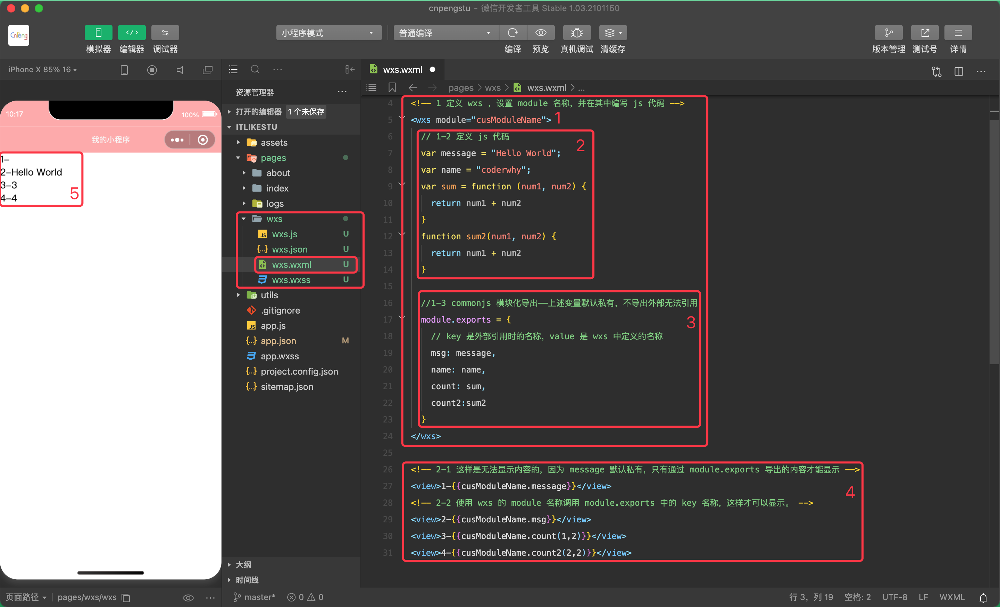
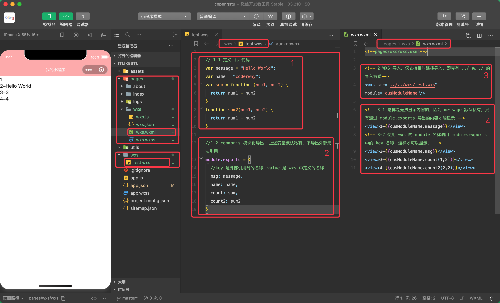
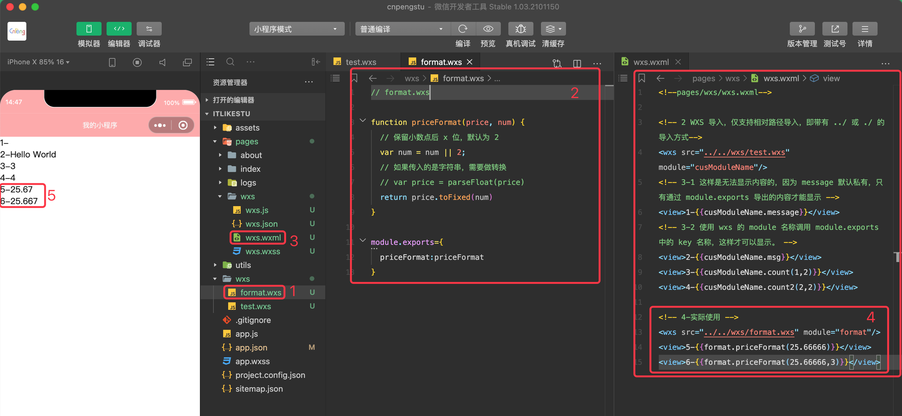

WXS（WeiXin Script）是小程序的一套脚本语言，有自己的语法，结合 WXML，可以构建出页面的结构。`WXS != JavaScript`

由于在 WXML 中无法直接调用 Page 或 Component 中定义的事件绑定以外的函数，但在某些情况下，我们又希望使用函数来处理 WXML 中的数据（类似 Vue 中的过滤器），所以微信官方就推出了 WXS。

## 11.1 WXS 的限制和特点

* WXS 的运行环境和其他 JavaScript 代码是隔离的，WXS 中不能调用其他 JavaScript 文件中定义的函数，也不能调用小程序提供的  API。
* WXS 函数不能作为组件的事件回调
* 由于运行环境的差异，在 iOS 设备上小程序内的 WXS 会比 JavaScript 代码快 2~20 倍，在 Android 设备上二者运行效率无差异。


## 11.2 WXS 基本使用

为 `<wxs></wxs>` 标签设置 module 名称，并在节点中定义 js 代码内容，然后将内容通过 `module.exports` 导出（设置成 public），之后外部就可以通过 `module 名称` 调用导出的内容。

```xml
<!--pages/wxs/wxs.wxml-->

<!-- WXS 的定义方式 -->
<!-- 1 定义 wxs ，设置 module 名称，并在其中编写 js 代码 -->
<wxs module="cusModuleName">
  // 1-2 定义 js 代码
  var message = "Hello World";
  var name = "coderwhy";
  var sum = function (num1, num2) {
    return num1 + num2
  }

  function sum2(num1, num2) {
    return num1 + num2
  }

  //1-3 commonjs 模块化导出——上述变量默认私有，不导出外部无法引用
  module.exports = {
    // key 是外部引用时的名称，value 是 wxs 中定义的名称
    msg: message,
    name: name,
    count: sum,
    count2:sum2
  }
</wxs>


<!-- 2-1 这样是无法显示内容的，因为 message 默认私有，只有通过 module.exports 导出的内容才能显示 -->
<view>1-{{cusModuleName.message}}</view>
<!-- 2-2 使用 wxs 的 module 名称调用 module.exports 中的 key 名称，这样才可以显示。 -->
<view>2-{{cusModuleName.msg}}</view>
<view>3-{{cusModuleName.count(1,2)}}</view>
<view>4-{{cusModuleName.count2(2,2)}}</view>
```



## 11.3 导入 wxs 

通常情况下，会单独定义一个 wxs 文件夹，其中定义 wxs 文件。使用方通过 `<wxs src="">` 导入这些文件，导入时必须通过 `module` 设置名称，并且**仅支持相对路径的导入**。



```js
// wxs/test.wxs

// 1-1 定义 js 代码
var message = "Hello World";
var name = "coderwhy";
var sum = function (num1, num2) {
  return num1 + num2
}
function sum2(num1, num2) {
  return num1 + num2
}

//1-2 commonjs 模块化导出——上述变量默认私有，不导出外部无法引用
module.exports = {
  //key 是外部引用时的名称，value 是 wxs 中定义的名称
  msg: message,
  name: name,
  count: sum,
  count2: sum2
}
```

```xml
<!--pages/wxs/wxs.wxml-->

<!-- 2 WXS 导入，仅支持相对路径导入，即带有 ../ 或 ./ 的导入方式-->
<wxs src="../../wxs/test.wxs" module="cusModuleName"/>

<!-- 3-1 这样是无法显示内容的，因为 message 默认私有，只有通过 module.exports 导出的内容才能显示 -->
<view>1-{{cusModuleName.message}}</view>
<!-- 3-2 使用 wxs 的 module 名称调用 module.exports 中的 key 名称，这样才可以显示。 -->
<view>2-{{cusModuleName.msg}}</view>
<view>3-{{cusModuleName.count(1,2)}}</view>
<view>4-{{cusModuleName.count2(2,2)}}</view>
```

## 11.4 WXS 实际应用



```js
// format.wxs

function priceFormat(price, num) {
  // 保留小数点后 x 位，默认为 2 
  var num = num || 2;
  // 如果传入的是字符串，需要做转换
  // var price = parseFloat(price)
  return price.toFixed(num)
}


module.exports={
  priceFormat:priceFormat
}
```

```xml
<!--pages/wxs/wxs.wxml-->

<!-- 2 WXS 导入，仅支持相对路径导入，即带有 ../ 或 ./ 的导入方式-->
<wxs src="../../wxs/test.wxs" module="cusModuleName"/>
<!-- 3-1 这样是无法显示内容的，因为 message 默认私有，只有通过 module.exports 导出的内容才能显示 -->
<view>1-{{cusModuleName.message}}</view>
<!-- 3-2 使用 wxs 的 module 名称调用 module.exports 中的 key 名称，这样才可以显示。 -->
<view>2-{{cusModuleName.msg}}</view>
<view>3-{{cusModuleName.count(1,2)}}</view>
<view>4-{{cusModuleName.count2(2,2)}}</view>

<!-- 4-实际使用 -->
<wxs src="../../wxs/format.wxs" module="format"/>
<view>5-{{format.priceFormat(25.66666)}}</view>
<view>6-{{format.priceFormat(25.66666,3)}}</view>
```
