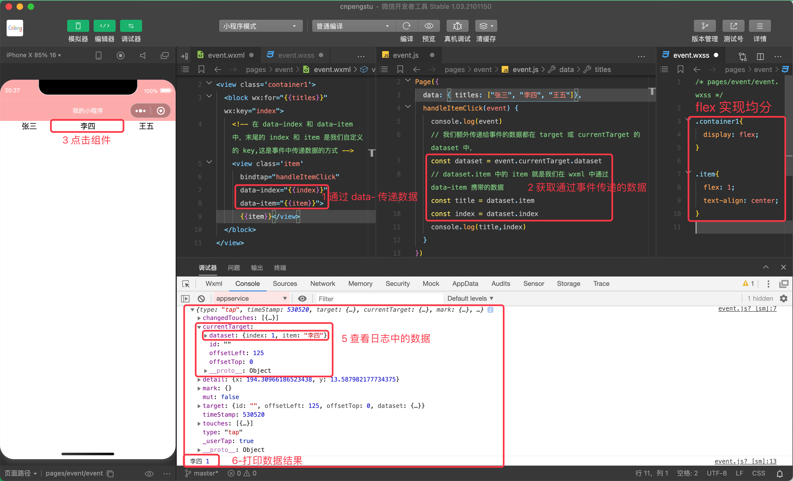
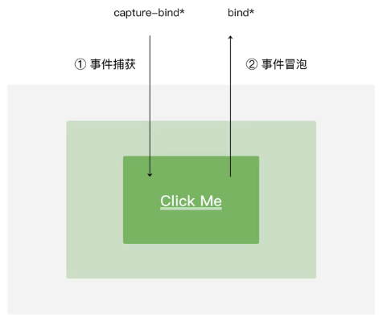
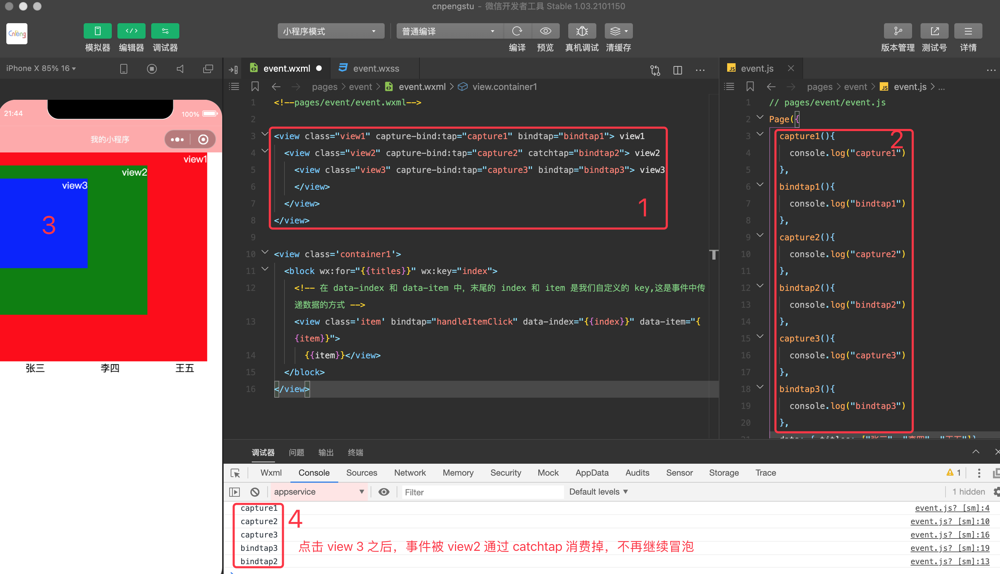

[事件的官方文档](https://developers.weixin.qq.com/miniprogram/dev/framework/view/wxml/event.html)

小程序需要经常和用户进行各种交互，比如，点击界面上的某个按钮或者区域，比如滑动了某个区域；这些交互都会产生各种各样的事件。

通过 `bind` 或 `catch` 属性可以将事件绑定到组件上，然后在该页面对应的 Page 构造器（`.js` 文件）中定义对应的事件处理函数，如果没有对应的函数，触发事件时会报错。当用户和组件产生交互后，就会触发绑定的事件，并调用事件函数，该函数将会受到一个事件对象-event.

## 1. 12.1 事件类型

分为通用事件和特有事件。

* 通用事件：

类型|含义
---|---
touchstart | 手指触摸动作开始
touchmove | 触摸后移动
touchcancel | 手指触摸动作被打断，如来电提醒，弹窗等
touchend | 手指触摸动作结束
tap | 触摸后马上离开
longpress | 手指触摸后，超过 350 毫秒才离开。如果指定了事件回调函数并处罚了该事件， tap 事件将不会被触发
longtap | 手指触摸后，超过 350 毫秒才离开（推荐使用 longpress 事件代替）

* 特有事件

如：`input` 有 bindinput、bindblur、bindfocus 等；`scroll-view` 有 bindscrolltowpper、bindscrolltolower

## 2. 12.2 事件对象

事件对象中包含如下几种类别的属性：

* `BaseEvent` 基础事件对象属性列表：

属性|类型|说明	
---|---|---
type | String	| 事件类型	
timeStamp | Integer | 事件生成时的时间戳	
target | Object | 当前被点击组件的一些属性值集合（组件被点击之后，可能会通过事件冒泡传递给 currentTarget)	
currentTarget | Object | 当前触发事件的组件的一些属性值集合	
mark | Object | 事件标记数据	

* `CustomEvent` 自定义事件对象属性列表（继承 BaseEvent）：

属性|类型|说明
---|---|---
detail | Object | 额外的信息

* `TouchEvent` 触摸事件对象属性列表（继承 `BaseEvent`）：

属性 | 类型 | 说明
---|---|---
touches | Array | 触摸事件，**当前停留在屏幕中的触摸点信息的数组**
changedTouches	 | Array | 触摸事件，**当前发生变化的触摸点信息的数组**

特殊事件： canvas 中的触摸事件不可冒泡，所以没有 currentTarget。

## 3. 12.3 事件的参数传递

```xml
<!--pages/event/event.wxml-->
<view class='container1'>
  <block wx:for="{{titles}}" wx:key="index">
    <!-- 在 data-index 和 data-item 中，末尾的 index 和 item 是我们自定义的 key,这是事件中传递数据的方式 -->
    <view class='item' bindtap="handleItemClick" data-index="{{index}}" data-item="{{item}}">{{item}}</view>
  </block>
</view>
```


```js
// pages/event/event.js

Page({
  data: {
    titles: ["张三", "李四", "王五"]
  },
  handleItemClick(event) {
    console.log(event)
    // 我们额外传递给事件的数据都在 target 或 currentTarget 的 dataset 中，
    const dataset = event.currentTarget.dataset
    // dataset.item 中的 item 就是我们在 wxml 中通过 data-item 携带的数据
    const title = dataset.item
    const index = dataset.index
    console.log(title,index)
  }
})
```

```css
/* pages/event/event.wxss */

.container1{
  display: flex;
}

.item{
  flex: 1;
  text-align: center;
}
```



## 4. 12.4 捕获和传递事件



* `capture-bind:tap = "xxx"` 用 xxx 函数来监听事件的捕获。
* `bindtap = "xxx"` 监听事件，并将事件继续传递下去。
* `capture-catch:tap = "xxx"` 捕获事件并终止传递。 


