## 1. 创建自定义组件

自定义组件由 json、wxml、wxss、js 四个文件组成，我们通常是在根目录下创建一个文件夹——components，在该文件夹中存放我们自定义的公共组件。

自定义组件的步骤：

* 现在 json 文件中进行自定义组件声明——`"component": true,`
* 在 wxml 中编写自定义组件的模板内容
* 在 wxss 中编写自定义组件的样式
* 在 js 文件中定义数据和组件内部的相关逻辑
* 在使用方的 json 文件中引用自定义组件——"引用自定义组件时的标签名":"自定义组件的绝对路径或相对路径"
* 在使用方的 wxml 文件中，通过上一步定义的标签名引用自定义组件。


* `my-cpn.json`

```json
{
  "component": true,
  "usingComponents": {}
}
```

* `my-cpn.wxml`

```xml
<!--components/my-cpn/my-cpn.wxml-->
<view class="title">{{title}}</view>
<view class="content">{{content}}</view>
```

* `my-cpn.wxss`

```css
/* components/my-cpn/my-cpn.wxss */
.title{
  font-size: 40rpx;
  font-weight: 700;
}

.content{
  font-size: 30rpx;
}
```

* `my-cpn.js`

```js
// components/my-cpn/my-cpn.js
Component({
  data: {
    title:"标题",
    content:"内容"
  },

  /**
   * 组件的属性列表
   */
  properties: {

  },


  /**
   * 组件的方法列表
   */
  methods: {

  }
})
```

* `about.json`

```json
{
  "usingComponents": {
    "my-cpn": "/components/my-cpn/my-cpn"
  }
}
```

* `about.wxml`

```xml
<!--pages/about/about.wxml-->

<!-- 使用自定义组件 -->
<my-cpn></my-cpn>
```

## 2. 自定义组件的细节和注意事项

* 因为 wxml 节点标签名只能是**小写字母、中划线和下划线**的组合，所以自定义组件的标签名也只能包含这些字符。
* 自定义组件中也可以引用其他的自定义组件，引用方法类似于页面引用自定义组件的方式（使用 usingComponents 字段）
* 自定义组件和页面所在的项目根目录名不能以 `wx-` 为前缀，否则会报错。
* 如果在 `app.json` 的 `usingComponents` 中声明了某个组件，那么所有页面和组件都可以直接使用该组件。

## 3. 组件和页面样式的细节

外部样式指引用组件的页面的样式。

### 3.1. 组件内样式对外部样式的影响

* 组件内的 class 样式仅对组件 wxml 内的节点生效，对于引用组件的 page 页面不会生效。
* 组件内不能使用 **id 选择器、属性选择器、标签选择器**

### 3.2. 外部样式对组件内样式的影响

* 外部使用 class 的样式只对外部 wxml 的 class 生效，对自定义组件不生效
* 外部使用了 id 选择器、属性选择器不会自定义组件产生影响
* **外部使用的标签选择器会对自定义组件产生影响**

通过前两节可知：组件内的 class 样式和组件外的 class 样式，默认是有隔离效果的。为了防止样式的错乱，官方不推荐使用 id、属性、标签选择器。

### 3.3. 如何让 class 样式可以互相影响

在自定义组件的 js 文件的 `Components` 对象中，可以配置 `options` 节点，该节点中有一个 `styleIsolation`——隔离属性。该属性有三个取值：

* `isolated` ：表示启用样式隔离，自定义组件和页面内的 class 样式不会相互影响。—— 默认取值。
* `apply-shared`：表示页面 wxss 样式将影响到自定义组件，但自定义组件的样式不会影响页面。
* `shared`：表示自定义组件和页面内的样式互相影响。

[官方文档：组件模板和样式](https://developers.weixin.qq.com/miniprogram/dev/framework/custom-component/wxml-wxss.html)

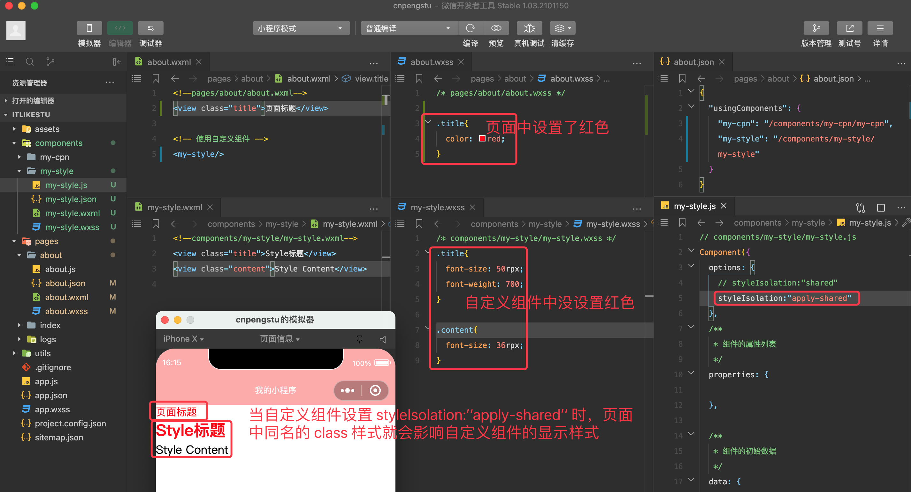


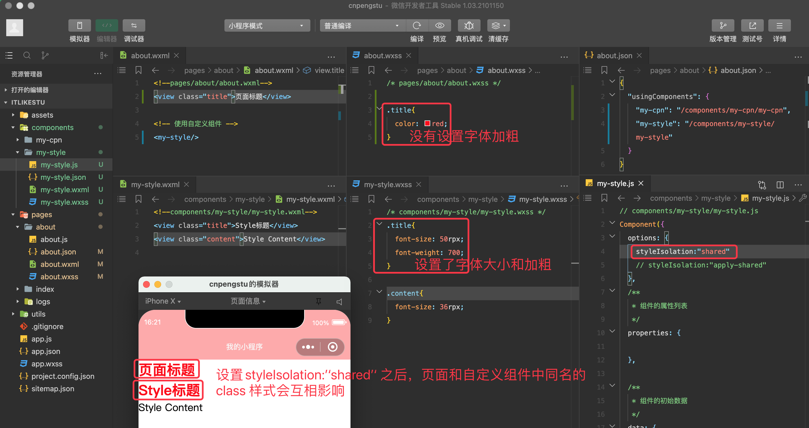

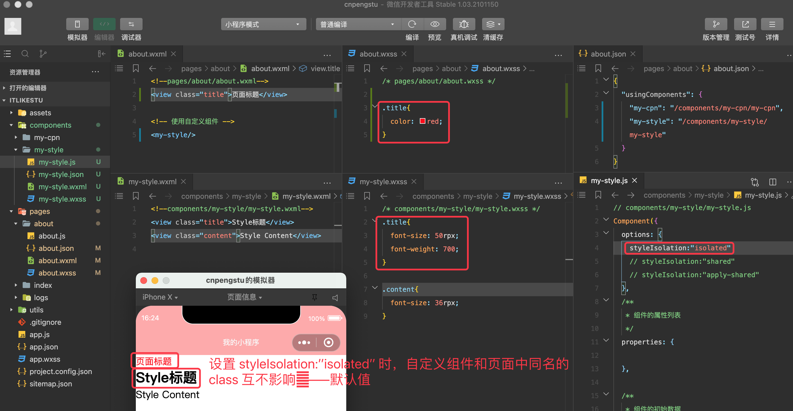


## 4. 组件和页面通信

即组件和页面之间互相传递数据。

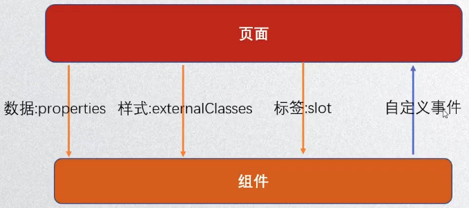

### 4.1. 向组件传递数据-properties


* `my-prop`.wxml

```xml
<!--components/my-prop/my-prop.wxml-->
<view class="title">{{title}}</view>
<view class="content">组件内容</view>
```

* `my-prop.js`

```js
// components/my-prop/my-prop.js
Component({
  properties: {
    //方式1： 属性名称:属性类型，组件的wxml中可以引用该属性。页面通过该属性传递数据给组件
    // title: String

    //方式2： 属性名称
    title: {
      // 属性类型
      type: String,
      // 属性默认值
      value: "默认标题",
      // 属性变化的监听
      observer: function (newVal, oldVal) {
        console.log(newVal, oldVal)
      }
    }
  }
})
```

* `my-prop.wxss`

```css
/* components/my-prop/my-prop.wxss */
.title{
  font-size: 50rpx;
  font-weight: 700;
}

.content{
  font-size: 36rpx;
}
```

* about.json

```json
{
  "usingComponents": {
    "my-prop": "/components/my-prop/my-prop"
  }
}
```

* about.wxml

```xml
<!--pages/about/about.wxml-->
<!-- 使用自定义组件 -->
<my-prop title="标题1"/>
<my-prop title="标题2"/>
<my-prop/>
```

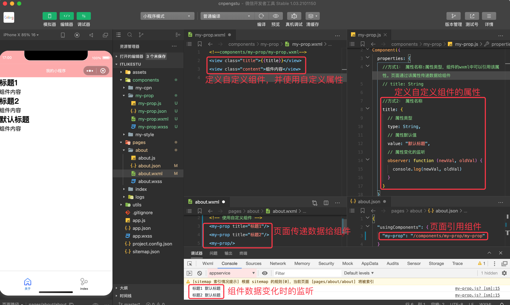

### 4.2. 向组件传递样式-externalClasses

* `my-prop.wxml`

```xml
<!--components/my-prop/my-prop.wxml-->
<view class="title titleclass">{{title}}</view>
<view class="content">组件内容</view>
```

* `my-prop.js`

```js
Component({
  externalClasses: ["titleclass"]
})
```

* about.json

```json
{
  "usingComponents": {
    "my-prop": "/components/my-prop/my-prop"
  }
}
```

* about.wxml

```xml
<!--pages/about/about.wxml-->
<!-- 使用自定义组件 -->
<my-prop title="标题1" titleclass="red"/>
<my-prop title="标题2" titleclass="green"/>
<my-prop titleclass="normal"/>
```

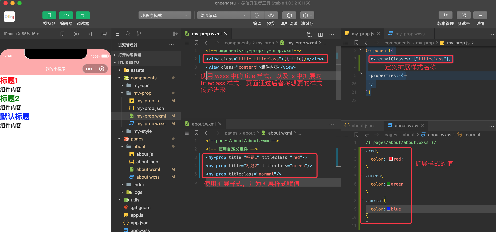

### 4.3. 组件向页面传递事件-triggerEvent(,,)

* `my-event.wxml`

```xml
<!--components/my-event/my-event.wxml-->
<button bindtap="handleIncrement">+1</button>
```
* `my-event.js`

```js
// components/my-event/my-event.js
Component({
  methods: {
    // 事件函数
    handleIncrement() {
      console.log("自定义组件被点击了")
      // 将事件发射给外部的组件使用方，对方监听的函数名为 increment
      this.triggerEvent("increment", {name:"张三",age:18}, {})
    }
  }
})
```

* about.json

```
{
  "usingComponents": {
    "my-event": "/components/my-event/my-event"
  }
}
```

* about.wxml

```xml
<!--pages/about/about.wxml-->
<!-- 使用自定义组件 -->
<my-event bind:increment="onIncrement"/>
<view>当前计数：{{counter}}</view>
```

* about.js

```js
// pages/about/about.js
Page({
  data: {
    counter: 0
  },
  onIncrement(event) {
    console.log("页面监听到自定义组件被点击了")
    this.setData({
      counter: this.data.counter + 1
    })
    // 读取组件中携带的附加数据
    var externalName = event.detail.name
    console.log(externalName)

    console.log(event)
  }
})
```

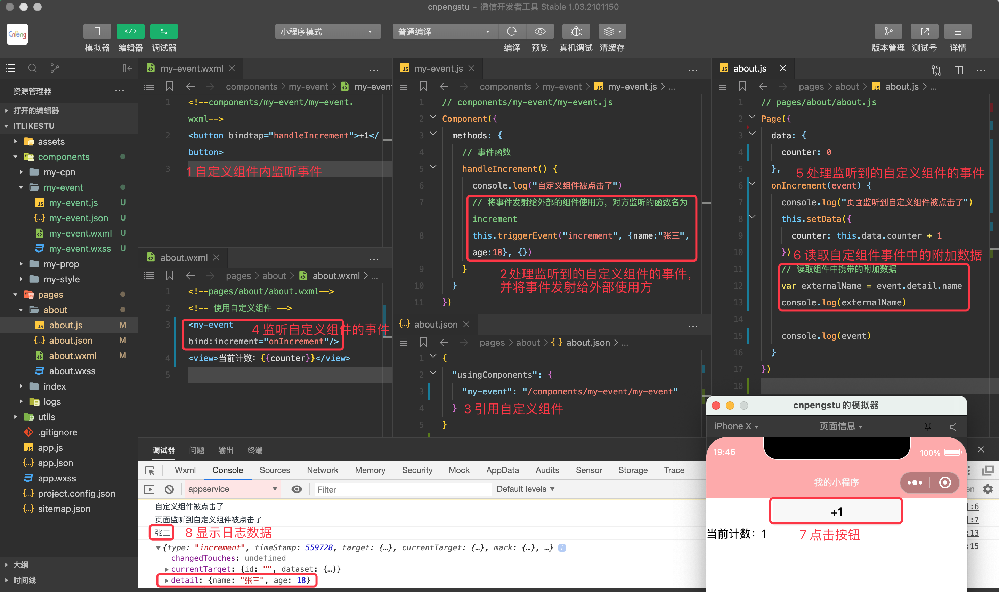

## 5. 自定义组件练习-`tab-control`

[点击查看原视频](https://www.bilibili.com/video/BV1Kt411V7rg?p=41)

* `w-tab-control.wxml`

```xml
<!--components/w-tab-control/w-tab-control.wxml-->
<!--components/w-tab-control/w-tab-control.wxml-->
<view class="tab-control">
  <block wx:for="{{titles}}" wx:key="index">
    <!-- data-index 表示额外携带的数据，取数据时关键字为 index -->
    <view class="tab-item {{currentIndex == index ?'active':''}}" bindtap="onItemClick" data-index="{{index}}">
      <text class="{{currentIndex == index ?'activetext':''}}">{{item}}</text>
    </view>
  </block>

</view>
```

* `w-tab-control.js`

```js
// components/w-tab-control/w-tab-control.js
Component({
  properties: {
      titles:{
        type:Array,
        value:[]
      }
  },

  data: {
    currentIndex:0
  },

  methods: {
    // 组件的事件
    onItemClick(event){
      // 1 读取点击事件中携带的附加数据
      const index = event.currentTarget.dataset.index
      this.setData({
        currentIndex:index
      })

      // 2 将组件的事件和数据暴露给页面
      this.triggerEvent("tab-item-click",{index:index,title:this.properties.titles[index]},{})
    }
  }
})
```

* `w-tab-control.wxss`

```css
/* components/w-tab-control/w-tab-control.wxss */
.tab-control{
  display: flex;
  height: 88rpx;
  /* line-height 和 height 等高，实现内容垂直居中 */
  line-height: 88rpx;
  /* background-color: #ffc; */
}

.tab-item{
  flex: 1;
  text-align: center;
}

.active{
  color: red;
}

/* 给应用了 active 样式组件中 text 组件应用该样式 */
.activetext{
  /* 边线属性，高度6rpx 实心 红色 */
  border-bottom: 6rpx solid red;
  /* 设置 text组件 的 padding, 左右 20rpx 上下 16rpx */
  padding: 20rpx 16rpx;
}
```

进过上述三个文件定义好自定义组件之后，在 about 页面中引用该组件，具体如下：

* about.json

```json
{
  "usingComponents": {
    "tab-control": "/components/w-tab-control/w-tab-control"
  }
}
```

* about.xml

```xml
<!--pages/about/about.wxml-->
<tab-control titles="{{['张三','李四','王五']}}" bind:tab-item-click="handleItemClick"></tab-control>
```

* about.js

```js
// pages/about/about.js
Page({
  handleItemClick(event){
    // 获取组件的事件中暴露出来的数据
    const itemIndex = event.detail.index 
    const itemTitle = event.detail.title
    console.log(itemIndex,itemTitle)
    console.log(event)
  }
})
```

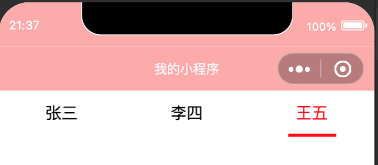


## 6. 获取组件对象-selectComponent()

* `my-select.wxml`

```xml
<!--components/my-select/my-select.wxml-->
<view>组件内的计数 {{count}}</view>
```

* `my-select.js`

```
// components/my-select/my-select.js
Component({
  data: {
    count:0
  },
  methods: {
    incrementCount(num){
      console.log("触发内部")
      this.setData({
        count:this.data.count + num
      })
    }
  }
})
```

* about.json

```json
{
  "usingComponents": {
    "my-select":"/components/my-select/my-select"
  }
}
```

* about.xml

```xml
<!--pages/about/about.wxml-->
<button bindtap="onViewClick1" size="mini">点击修改组件1 内的数据</button>
<my-select  class="select1"></my-select>

<button bindtap="onViewClick2" size="mini">点击修改组件2 内的数据</button>
<my-select id="select2"></my-select>
```

* about.js

```js
// pages/about/about.js
Page({
  onViewClick1(event) {
    // 通过类名找到组件对象——不推荐
    const select1 = this.selectComponent(".select1")
    // 直接修改数据 —— 不推荐
    select1.setData({ 
      count: select1.data.count += 1
    })
  },
  onViewClick2(event) {
    // 通过 id 找到组件对象——推荐使用这种
    const select2 = this.selectComponent("#select2")
    select2.incrementCount(20)
  }
})
```


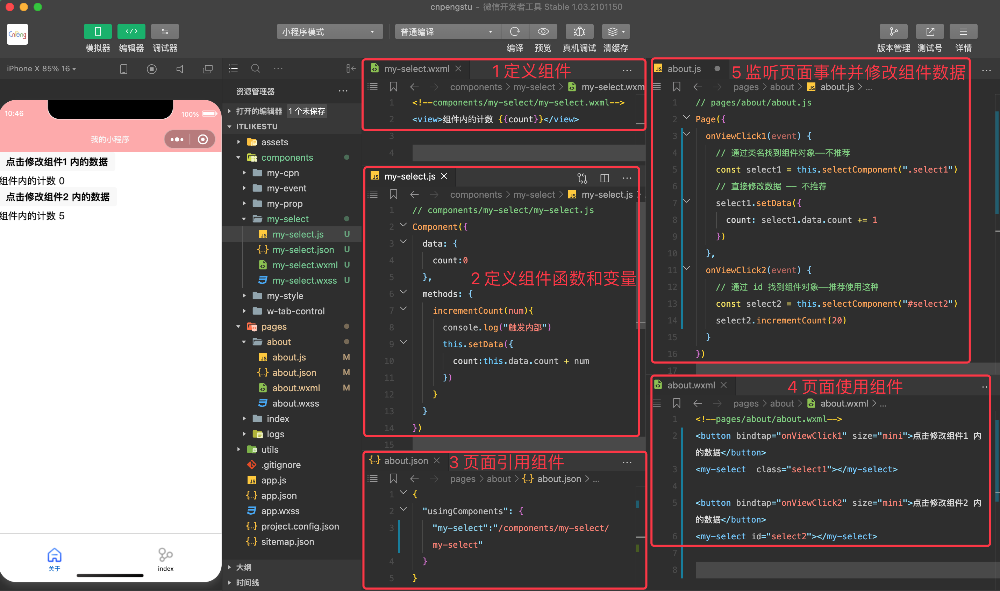

## 7. slot 的使用

### 7.1. 单 slot 使用

* `my-slot.wxml`

```xml
<!--components/my-slot/my-slot.wxml-->
<view>这是组件顶部信息</view>
<!-- 预留插槽-slot，由使用方动态填充内容 -->
<slot></slot>
<view>这是组件底部信息</view>
```

* `about.json`

```json
{
  "usingComponents": {
    "my-slot":"/components/my-slot/my-slot"
  }
}
```

* about.wxml

```xml
<!--pages/about/about.wxml-->
<my-slot>
  <view>动态插入的内容</view>
  <button size="mini">动态插入的按钮</button>
</my-slot>
<view>------分割线------</view>
<my-slot>
  <image src="https://res.wx.qq.com/wxdoc/dist/assets/img/map.dd86f5e2.jpg" mode="aspectFit"/>
  <!-- 横向滑块，默认进度 60  -->
  <slider value="60"></slider>
</my-slot>
```

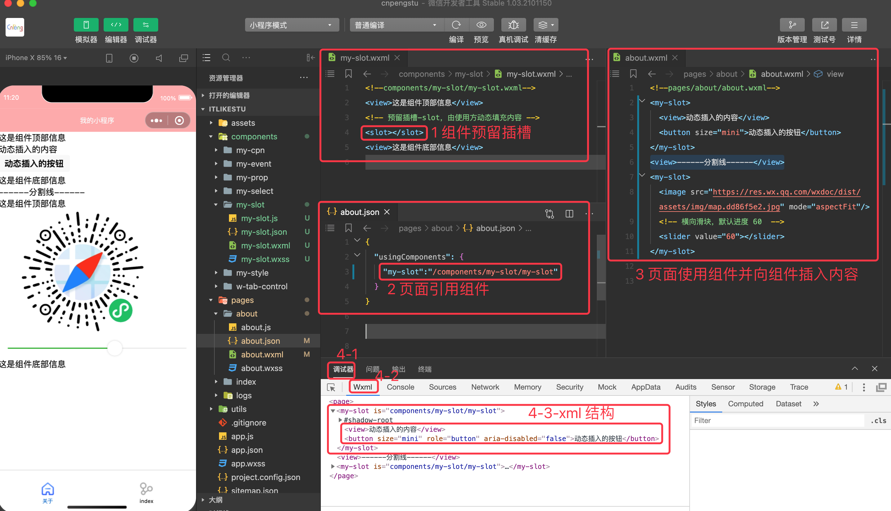

### 7.2. 多 slot 使用

* `my-slots.wxml`

```xml
<!--components/my-slots/my-slots.wxml-->
<view>组件头部内容</view>
<!-- 预留多插槽,并为插槽命名 -->
<slot name="slot1"></slot>
<slot name="slot2"></slot>
<slot name="slot3"></slot>
<view>组件尾部内容</view>
```

* `my-slots.js`

```js
// components/my-slots/my-slots.js
Component({
  options:{
    // 启用多插槽。不设置的话不显示添加的内容
    multipleSlots:true
  }
})
```

* about.json

```
{
  "usingComponents": {
    "my-slots":"/components/my-slots/my-slots"
  }
}
```

* about.wxml

```xml
<!--pages/about/about.wxml-->
<my-slots>
  <view slot="slot3">动态插入的内容</view>
  <button slot="slot1" size="mini">动态插入的按钮</button>
  <slider slot="slot2" value="50" />
</my-slots>
```

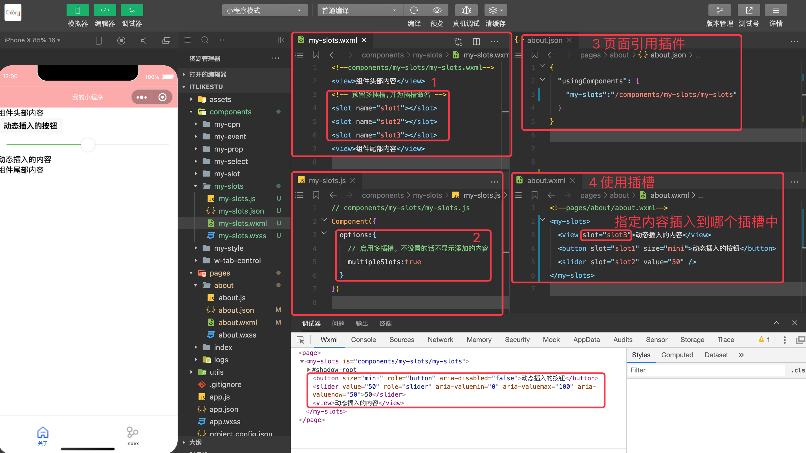


## 8. Component 构造器

即自定义组件时，对应 js 文件中的 `Component` 节点。该节点中可以配置如下子节点和内容：

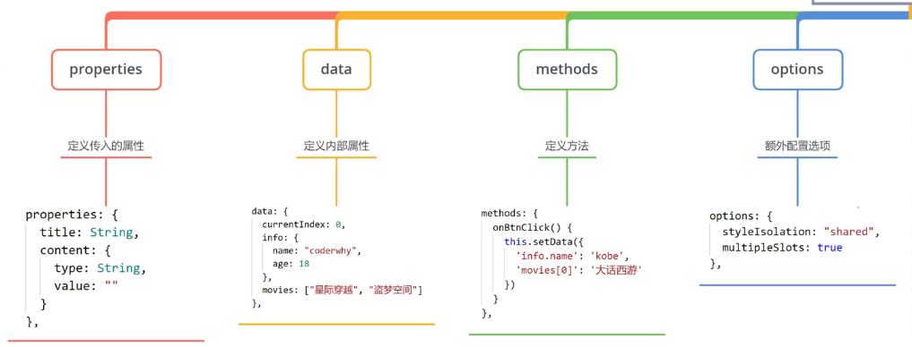

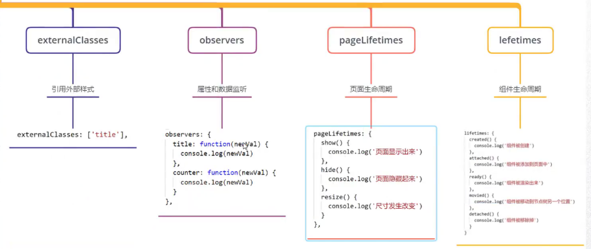

在上面两个图中，properties、data、methods、options、externalClasses 前面都有相应的示例。

### 8.1. observers

监听 properties/data 中属性值的改变，监听时仅能获取到新值。

```
// components/my-slots/my-slots.js
Component({
  data: {
    count: 0
  },
  // 监听 properties/data 中属性值的改变
  observers: {
    // 监听 data 中 count 属性值的变化，仅能获取到 newValue
    count:function(newVal){
      console.log(newVal)
    }
  }
})
```

### 8.2. pageLifetimes

用于监听组件所在页面生命周期

```js
// components/my-slots/my-slots.js
Component({
  // 监听所在页面声明周期的变化 
  pageLifetimes: {
    show() {
      console.log("组件所在页面展示了")
    },
    hide() {
      console.log("组件所在页面隐藏了")
    },
    resize() {
      console.log("组件所在页面尺寸变更了")
    }
  }
})
```


### 8.3. lifetimes

用于监听组件本身的生命周期

```js
// components/my-slots/my-slots.js
Component({
  // 监听组件本身生命周期发生的变化
  lifetimes: {
    created() {
      console.log("组件创建了了")
    },
    attached() {
      console.log("组件添加到页面/其他组件中")
    },
    ready() {
      console.log("组件旋绕出来了")
    },
    moved() {
      console.log("组件被移动到其他父节点了")
    },
    detached() {
      console.log("组件被移除了")
    }
  }
})
```


