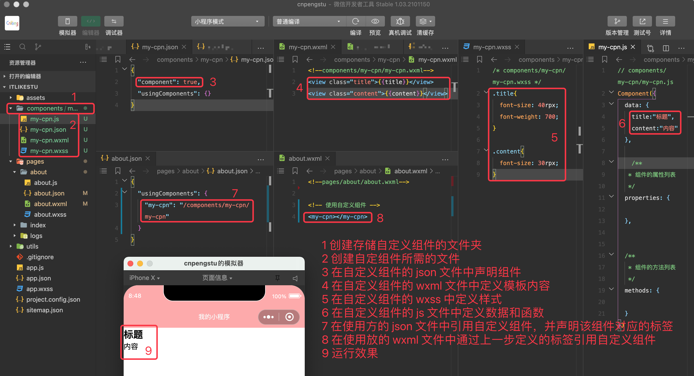

## 13.1 创建自定义组件

自定义组件由 json、wxml、wxss、js 四个文件组成，我们通常是在根目录下创建一个文件夹——components，在该文件夹中存放我们自定义的公共组件。

自定义组件的步骤：

* 现在 json 文件中进行自定义组件声明——`"component": true,`
* 在 wxml 中编写自定义组件的模板内容
* 在 wxss 中编写自定义组件的样式
* 在 js 文件中定义数据和组件内部的相关逻辑
* 在使用方的 json 文件中引用自定义组件——"引用自定义组件时的标签名":"自定义组件的绝对路径或相对路径"
* 在使用方的 wxml 文件中，通过上一步定义的标签名引用自定义组件。



* `my-cpn.json`

```json
{
  "component": true,
  "usingComponents": {}
}
```

* `my-cpn.wxml`

```xml
<!--components/my-cpn/my-cpn.wxml-->
<view class="title">{{title}}</view>
<view class="content">{{content}}</view>
```

* `my-cpn.wxss`

```css
/* components/my-cpn/my-cpn.wxss */
.title{
  font-size: 40rpx;
  font-weight: 700;
}

.content{
  font-size: 30rpx;
}
```

* `my-cpn.js`

```js
// components/my-cpn/my-cpn.js
Component({
  data: {
    title:"标题",
    content:"内容"
  },

  /**
   * 组件的属性列表
   */
  properties: {

  },


  /**
   * 组件的方法列表
   */
  methods: {

  }
})
```

* `about.json`

```json
{
  "usingComponents": {
    "my-cpn": "/components/my-cpn/my-cpn"
  }
}
```

* `about.wxml`

```xml
<!--pages/about/about.wxml-->

<!-- 使用自定义组件 -->
<my-cpn></my-cpn>
```

## 13.2 自定义组件的细节和注意事项

