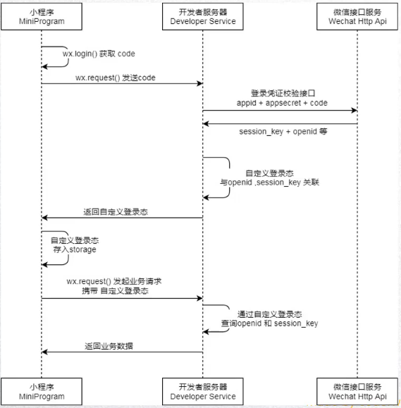
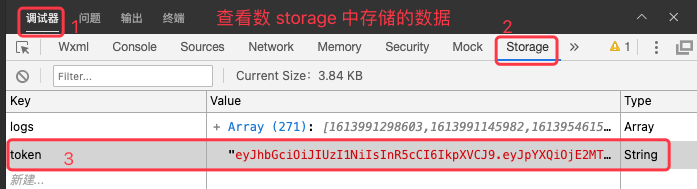

## 1. 小程序登录流程


### 1.1. 客户端的操作

客户端操作的内容主要有如下四项：

* 调用 wx.login 获取 code
* 调用 wx.request 发送 code 到我们自己的服务器（我们自己的服务器会返回一个登录态的标识，比如 token）
* 将登录态的标识 token 进行存储，以便下次使用
* 请求需要登录态标识的接口时，携带 token


### 1.2. 完整的操作流程：




## 2. 代码演练

```js
// app.js
const TOKEN = "token"

App({
  globalData: {
    token: '',
    userInfo: null
  },

  onLaunch() {
    // 1 取出本地 storage 中的 token
    const token = wx.getStorageSync(TOKEN)
    // 2 判断 token 是否有值 
    if (token && token.length) {
      // 3 检查 token 是否有效
      this.checkToken(token)
    } else {
      // 4 没有token 执行登录逻辑
      this.login()
    }
  },

  // 检查令牌
  checkToken(token) {
    console.log(token)
    wx.request({
      url: 'http://123.107.32.32:3000/auth',
      method: 'post',
      header: {
        token
      },
      success: (res) => {
        if (!res.data.errCode) {
          console.log("token有效")
          this.globalData.token = token
        } else {
          this.login()
        }
      },
      fail: function (err) {
        console.log(err)
      }
    })
  },

  // 登录
  login() {
    wx.login({
      success: res => {
        // 读取 wx 返回的 code 的，有效期为 5 分钟.
        const code = res.code
        // 发送 code 到自己的后台后台换取 token 或 openId, sessionKey, unionId
        wx.request({
          url: 'http://123.207.32.32:3000/login',
          method: 'post',
          data: {
            code
          },
          success: (res) => {
            console.log(res)
            // 取出服务端返回的 token
            const token = res.data.token
            // 存储到全局变量中
            this.globalData.token = token
            // 存储到 storage 中
            wx.setStorageSync(TOKEN, token)
          }
        })
      }
    })
  },

  getUserInfo() {
    // 获取用户信息
    wx.getSetting({
      success: res => {
        if (res.authSetting['scope.userInfo']) {
          // 已经授权，可以直接调用 getUserInfo 获取头像昵称，不会弹框
          wx.getUserInfo({
            success: res => {
              // 可以将 res 发送给后台解码出 unionId
              this.globalData.userInfo = res.userInfo
              // 由于 getUserInfo 是网络请求，可能会在 Page.onLoad 之后才返回
              // 所以此处加入 callback 以防止这种情况
              if (this.userInfoReadyCallback) {
                this.userInfoReadyCallback(res)
              }
            }
          })
        }
      }
    })
  }
})
```




