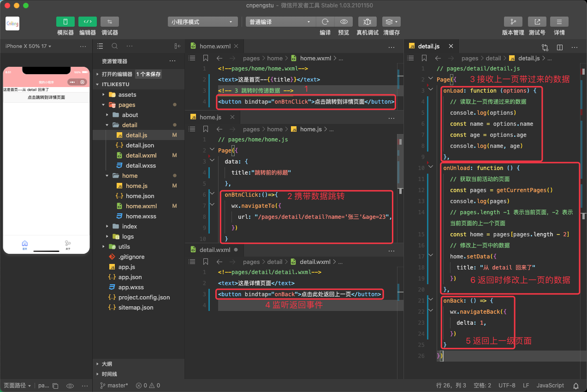

实现界面跳转有两种方式：通过 navigator 组件 和 通过 wx 的 api 跳转


## 1. navigator 组件实现跳转

### 1.1. 属性介绍

[navigator api 文档](https://developers.weixin.qq.com/miniprogram/dev/component/navigator.html)

navigator 组件主要用于实现界面的跳转，其常用属性如下：

属性 | 类型 | 默认值	 | 必填 | 说明
---|---|---|---|---
target | string | self | 否 | 在哪个目标上发生跳转，默认当前小程序-self。如果跳转到其他小程序，则传递 miniProgram
url | string |  | 否 | 当前小程序内的跳转链接
open-type  | string	 | navigate | 否 | 跳转方式
delta | number | 1	 | 否	 | 当 open-type 为 'navigateBack' 时有效，表示回退的层数
app-id | string |  | 否 | 当target="miniProgram"时有效，要打开的小程序 appId
path	 | string	 |  | 否 | 当target="miniProgram"时有效，打开的页面路径，如果为空则打开首页
extra-data | object	 |  | 否 | 当target="miniProgram"时有效，需要传递给目标小程序的数据，[目标小程序可在 App.onLaunch()，App.onShow() 中获取到这份数据](https://developers.weixin.qq.com/miniprogram/dev/framework/app-service/app.html)。


其中 `open-type`有如下取值：

值 | 说明	
---|---
navigate	 | 对应 wx.navigateTo 或 wx.navigateToMiniProgram 的功能。是默认取值，新页面左上角会有返回按钮
redirect	 | 对应 wx.redirectTo 的功能, 跳转到应用内的某个页面, 并关闭当前页面，新页面左上角将没有返回按钮。但不允许跳转到 tabbar 页面，且不能返回（不是压栈操作）
switchTab | 对应 wx.switchTab 的功能, 跳转到 tabBar 页面，并关闭其他所有非 tabBar 页面（需要在 tabBar 中定义）
reLaunch	 | 对应 wx.reLaunch 的功能。关闭所有页面，打开应用中某个页面（直接展示某个页面，并且可以跳转到 tabBar 页面）
navigateBack | 对应 wx.navigateBack 的功能	
exit	 | 退出小程序，target="miniProgram"时生效

### 1.2. 基本使用

* app.json

```json
{
  "pages": [
    "pages/home/home",
    "pages/about/about",
    "pages/detail/detail",
    "pages/index/index",
    "pages/logs/logs"
  ],

  "tabBar": {
    "selectedColor": "#0066cc",
    "list": [{
      "pagePath": "pages/home/home",
      "text": "首页",
      "iconPath": "assets/tabbar/home.png",
      "selectedIconPath": "assets/tabbar/home_active.png"
    }, {
      "pagePath": "pages/about/about",
      "text": "关于",
      "iconPath": "assets/tabbar/share.png",
      "selectedIconPath": "assets/tabbar/share_active.png"
    }]
  },

  "window": {
    "navigationBarBackgroundColor": "#faa",
    "navigationBarTitleText": "我的小程序",
    "navigationBarTextStyle": "white"
  }
}
```

* home.wxml

```xml
<!--pages/home/home.wxml-->
<text>这是首页</text>

<!-- 1 navigator 实现页面跳转 -->
<navigator url="/pages/detail/detail">点击跳转到详情 detail 页面</navigator>

<!-- 2 navigator 的 opentype 属性 -->
<!-- 2-1-跳转到详情 -->
<navigator url="/pages/detail/detail" open-type="redirect">点击打开 detail 页面，并关闭当前页面</navigator>
<!-- 2-2-跳转到 tab 页面，url 也必须是 tabBar 中设置的一个页面的 url -->
<navigator url="/pages/about/about" open-type="switchTab">点击切换到另外的 TAB 页签</navigator>
```

* detail.wxml

```xml
<!--pages/detail/detail.wxml-->
<text>这是详情页面</text>
<navigator open-type="navigateBack">点击此处返回上一页</navigator>
<navigator url="/pages/index/index">点击打开 index 页面</navigator>
```

* index.xml

```xml
<!--index.wxml-->

<!-- delta 的取值指定了向上回退几级 -->
<navigator open-type="navigateBack" delta="2">点击向上回退 2 级</navigator>
```

目录结构：


### 1.3. 跳转时传递数据

在页面间跳转时，如果需要传递数据，需要遵从如下规则：

* 首页 -> 详情页：使用 URL 中的 query 字段
* 详情页 -> 首页：在详情页面内部拿到首页的页面对象，直接修改数据


* home.wxml

```xml
<!--pages/home/home.wxml-->
<text>这是首页--{{title}}</text>
<!-- 3 跳转时传递数据 -->
<navigator url="/pages/detail/detail?name='张三'&age=23">点击跳转到详情页面</navigator>
```

* home.js

```js
// pages/home/home.js
Page({
  data: {
    title:"跳转前的标题"
  }
})
```

* detail.wxml

```xml
<!--pages/detail/detail.wxml-->
<text>这是详情页面</text>
<navigator open-type="navigateBack">点击此处返回上一页</navigator>
```

* detail.js

```js
// pages/detail/detail.js
Page({
  onLoad: function (options) {
    // 读取上一页传递过来的数据
    console.log(options)
    const name = options.name
    const age = options.age
    console.log(name, age)
  },

  onUnload: function () {
    // 获取当前活动的页面
    const pages = getCurrentPages()
    console.log(pages)
    // pages.length -1 表示当前页面，-2 表示当前页面的上一个页面
    const home = pages[pages.length - 2]
    // 修改上一页中的数据
    home.setData({
      title: "从 detail 回来了"
    })
  }
})
```


## 2. 通过 wx 的 api 实现跳转

某些情况下，我们希望用户点击某个 button 或者 view 时就实现跳转，此时我们就需要监听 button 或者 view，然后通过如下 API 实现跳转或返回：

* `wx.navigateTo(url[,])`
* `wx.navigateBack([delta])`

示例如下：

* home.wxml

```xml
<!--pages/home/home.wxml-->
<text>这是首页--{{title}}</text>
<!-- 3 跳转时传递数据 -->
<button bindtap="onBtnClick">点击跳转到详情页面</button>
```

* home.js

```js
// pages/home/home.js
Page({
  data: {
    title:"跳转前的标题"
  },
  onBtnClick:()=>{
    wx.navigateTo({
      url: "/pages/detail/detail?name='张三'&age=23",
    })
  }
})
```

* detail.wxml

```xml
<!--pages/detail/detail.wxml-->
<text>这是详情页面</text>
<button bindtap="onBack">点击此处返回上一页</button>
```

* detail.js

```js
// pages/detail/detail.js
Page({
  onLoad: function (options) {
    // 读取上一页传递过来的数据
    console.log(options)
    const name = options.name
    const age = options.age
    console.log(name, age)
  },
  onUnload: function () {
    // 获取当前活动的页面
    const pages = getCurrentPages()
    console.log(pages)
    // pages.length -1 表示当前页面，-2 表示当前页面的上一个页面
    const home = pages[pages.length - 2]
    // 修改上一页中的数据
    home.setData({
      title: "从 detail 回来了"
    })
  },
  onBack: () => {
    wx.navigateBack({
      delta: 1,
    })
  }
})
```




