[点击查看原视频教师编写的《项目实战-小程序商城》在 github 的完整源码](https://github.com/coderwhy/HYMiniMall)

最终实现效果示意图：


## 1. 页面和目录结构

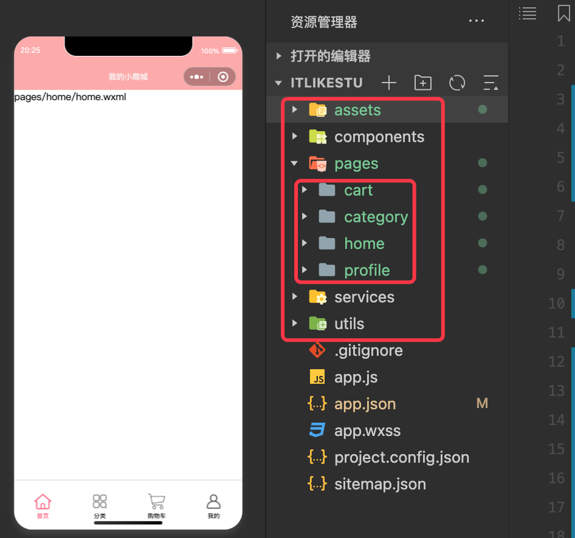


如上图，我们重点是先创建目录，然后编辑 `app.json` 文件代码：

```json
{
  "pages": [
    "pages/home/home",
    "pages/category/category",
    "pages/cart/cart",
    "pages/profile/profile"
  ],

  "tabBar": {
    "selectedColor": "#ff5777",
    "list": [{
      "pagePath": "pages/home/home",
      "text": "首页",
      "iconPath": "assets/images/tabbar/home.png",
      "selectedIconPath": "assets/images/tabbar/home_active.png"
    }, {
      "pagePath": "pages/category/category",
      "text": "分类",
      "iconPath": "assets/images/tabbar/category.png",
      "selectedIconPath": "assets/images/tabbar/category_active.png"
    }, {
      "pagePath": "pages/cart/cart",
      "text": "购物车",
      "iconPath": "assets/images/tabbar/cart.png",
      "selectedIconPath": "assets/images/tabbar/cart_active.png"
    }, {
      "pagePath": "pages/profile/profile",
      "text": "我的",
      "iconPath": "assets/images/tabbar/profile.png",
      "selectedIconPath": "assets/images/tabbar/profile_active.png"
    }]
  },

  "window": {
    "navigationBarBackgroundColor": "#ff5777",
    "navigationBarTitleText": "我的小商城",
    "navigationBarTextStyle": "white"
  },
  "style": "v2",
  "sitemapLocation": "sitemap.json"
}
```

## 2. 个性化 tab 页标题

取消 app.json 的 window 节点中配置的 `"navigationBarTitleText": ""`。而是在每个 tab 页面的 json 文件中配置 `"navigationBarTitleText": ""`，这样即可为不同的 tab 页面展示不同的标题。

* app.json 中的核心代码：

```json
{
  "window": {
    "navigationBarBackgroundColor": "#faa",
    "navigationBarTextStyle": "white"
  }
}
```

* home.json 中的核心代码

```json
{
  "usingComponents": {},
  "navigationBarTitleText": "首页"
}
```

其他 tab 页面的标题配置参考 home.json 


## 3. 请求轮播和推荐数据

在请求数据时，可能会出现 `不在以下 request 合法域名列表中` 的错误，可以按照下图解决：

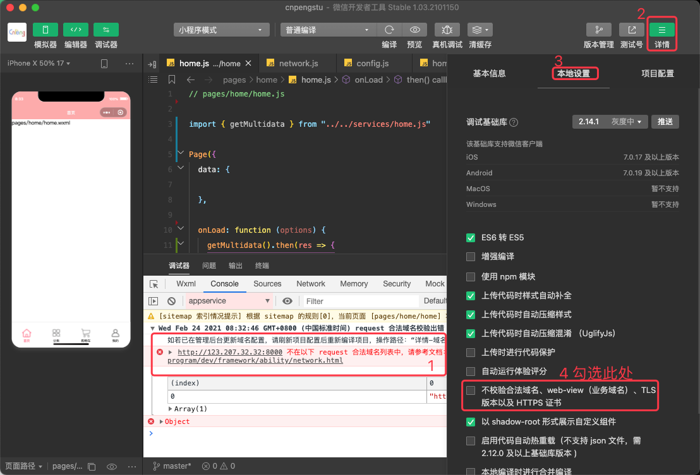


### 3.1. 定义 config.js

在 services 目录下创建 config.js 文件 在该文件中定义并导出 `BASE_URL` ，具体如下：

```js
const BASE_URL = "http://123.207.32.32:8000/"

export {
  BASE_URL
}
```

### 3.2. 定义 network.js

在 services 目录下创建 network.js 文件，在其中对基础网络请求进行 Promise 包装，具体如下：

```js
// 导入定义在 config.js 中的 BASE_URL
import {
  BASE_URL
} from "./config.js"

// 以这种方式导出，外部可以自定义函数名称
export default function (options) {
  return new Promise((reslove, reject) => {
    wx.request({
      url: BASE_URL + options.url,
      method: options.method || "get",
      data: options.data || {},
      success: reslove,
      fail: reject
    })
  })
}
```

### 3.3. 定义 home.js

在 services 目录下创建 home.js 文件，该文件仅处理 home 页面对应的网络请求，具体如下：

```js
// 导入定义在 network.js 中的匿名函数，并在此为其命名为 request
import request from "./network.js"

// 这种方式导出，引用方不能改变函数名称
export function getMultidata(){
  return request({
    url:"/home/multidata"
  })
}
```

### 3.4. 在页面的 js 文件中触发请求

在 home 页面对应的 `home.js` 文件中，导入并调用我们在 `services/home.js` 文件中定义的网络请求函数，请求成功之后，将数据存储到本地内存中（即 setData）。具体如下：


```js
// pages/home/home.js
// 导入定义在 ../../services/home.js 中的网络请求函数，必须使用相对路径导入
import { getMultidata } from "../../services/home.js"

Page({
  data: {
    banners: [],
    recommends: []
  },

  onLoad: function (options) {
    // 触发网络请求 .then 是 Promise 写法，我们的网络请求使用 Promise 进行了包装
    getMultidata().then(res => {
      console.log(res)
      const banners = res.data.data.banner.list
      const recommends = res.data.data.recommend.list

      this.setData({
        // 完整写法是 banners:banners ,由于 key 和 value 一致，所以可以简写为一个
        banners,
        recommends
      })
    })
  }
})
```

目录结构和数据请求结果如下：

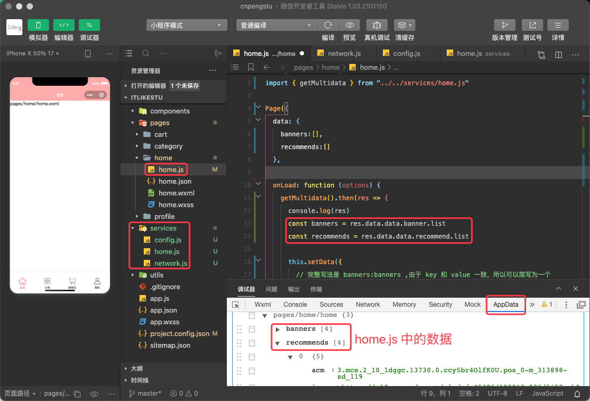


## 4. 实现轮播视图

[《Swipper官方 API 文档》](https://developers.weixin.qq.com/miniprogram/dev/component/swiper.html)

[《swipper-item 官方 API 文档》](https://developers.weixin.qq.com/miniprogram/dev/component/swiper-item.html)

### 4.1. 自定义 swipper 组件

在 components 目录下创建 `c-swipper` 目录，在其中创建 `c-swipper` 组件，然后编辑相关代码：

* `c-swipper.wxml`

```xml
<!--components/c-swipper.wxml-->
<swiper class="swipper" circular indicator-dots autoplay interval="2500" indicator-active-color="#ff5777">
  <block wx:for="{{list}}" wx:key="index">
    <swiper-item class="swipper-item">
      <image src="{{item.image}}" mode="widthFix"></image>
    </swiper-item>
  </block>
</swiper>

```

* `c-swipper.js`

```js
// components/c-swipper.js
Component({
  properties: {
    // 定义 c-swipper 的属性
    list:{
      type:Array,
      value:[]
    }
  }
})
```

### 4.2. 使用自定义 swipper

* home.json

```json
{
  "usingComponents": {
    "c-swipper":"/components/c-swipper/c-swipper"
  },
  "navigationBarTitleText": "首页"
}
```

* home.wxml

```xml
<!--pages/home/home.wxml-->
<c-swipper list="{{banners}}"></c-swipper>
```
### 4.3. 机型适配

经过前面几步，我们基本实现了轮播图效果——有指示器，有自动轮播，如下图：


但是，我们会发现，轮播图右侧有一片空白，这是机型适配的问题，我们按照下面代码设置 `image` 组件的 width 为 100% 即可解决该问题。具体如下：

* `c-recommend.wxss`

```css
/* components/c-swipper.wxss */
.swiper-item image{
  width: 100%;
}
```

设置完成之后，得到的效果如下：


## 5. 展示推荐数据

### 5.1. 定义推荐视图组件

在 pages/home 目录中创建 childCpns 目录，该目录存放仅用户 home 页面的组件。我们在该目录下新建 `c-recommend` 目录，并在其中编辑内容，如下：

* `c-recommend.wxml`

```xml
<!--pages/home/childCpns/c-recommend/c-recommend.wxml-->
<view class="recommend">
  <block wx:for="{{list}}" wx:key="index">
    <view class="recommend-item">
      <image src="{{item.image}}"></image>
      <view>{{item.title}}</view>
    </view>
  </block>
</view>
```

* `c-recommend.js`

```js
// pages/home/childCpns/c-recommend/c-recommend.js
Component({
  properties: {
    list:{
      type:Array,
      value:[]
    }
  }
})
```

* `c-recommend.wxss`

```css
/* pages/home/childCpns/c-recommend/c-recommend.wxss */

.recommend{
  display: flex;
  margin-top: 40rpx;
  /* 底部padding */
  padding-bottom: 40rpx;
  /* 设置底部边线样式 */
  border-bottom: 16rpx solid #eee;
}

.recommend-item{
  flex: 1;
  /* 对组件中的文本和图片都生效 */
  text-align: center;
}

.recommend-item image{
  width: 160rpx;
  height: 160rpx;
}

.recommend-item view{
  margin-top: 10rpx;
  font-size: 28rpx;
}
```

### 5.2. 引用推荐视图组件

在 home 中引用推荐视图组件，

* home.json

```json
{
  "usingComponents": {
    "c-swipper":"/components/c-swipper/c-swipper",
    "c-recommend":"./childCpns/c-recommend/c-recommend"
  },
  "navigationBarTitleText": "首页"
}
```

* home.wxml

```xml
<!--pages/home/home.wxml-->
<!-- 1 顶部swipper -->
<c-swipper list="{{banners}}"></c-swipper>
<!-- 2 推荐数据 -->
<c-recommend list="{{recommends}}"></c-recommend>
```

效果如下：


## 6. 本周流行视图

### 6.1. 定义流行视图组件

在 pages/home/childCpns 目录中新建 `c-popular` 目录，用来存放在 home 页面使用的本周流行视图组件，并编辑内容，具体如下：

* `c-popular.wxml`

```xml
<!--pages/home/childCpns/c-popular/c-popular.wxml-->
<view class="popular">
  <image src="/assets/images/home/popular.jpg" mode="width"></image>
</view>
```

* `c-popular.wxss`

```css
/* pages/home/childCpns/c-popular/c-popular.wxss */
.popular image{
  width: 100%;
}
```

### 6.2. 引用流行视图组件

* home.json

```json
{
  "usingComponents": {
    "c-swipper":"/components/c-swipper/c-swipper",
    "c-recommend":"./childCpns/c-recommend/c-recommend",
    "c-popular":"./childCpns/c-popular/c-popular"
  },
  "navigationBarTitleText": "首页"
}
```

* home.wxml

```xml
<!--pages/home/home.wxml-->
<!-- 1 顶部swipper -->
<c-swipper list="{{banners}}"></c-swipper>
<!-- 2 推荐数据 -->
<c-recommend list="{{recommends}}"></c-recommend>
<!-- 3 本周流行 -->
<c-popular/>
```

运行效果如下：


## 7. `tab-controller` 组件

### 7.1. 定义 `c-tab-controller` 组件

在 components 目录中新建 `c-tab-controller` 目录，用来存储适用于全局的 `c-tab-controller` 组件

* `c-tab-controller.wxml`

```xml
<!--components/c-tab-controller/c-tab-controller.wxml-->
<view class="tab-control">
  <block wx:for="{{titles}}" wx:key="index">
    <view class="tab-item  {{currentIndex == index ? 'active':''}}" bindtap="onItemClick" data-index="{{index}}">
      <text class="{{currentIndex == index ? 'activetext':''}}">{{item}}</text>
    </view>
  </block>
</view>
```

* `c-tab-controller.js`

```js
// components/c-tab-controller/c-tab-controller.js
Component({
  properties: {
    titles: {
      type: Array,
      value: []
    }
  },
  data: {
    currentIndex: 0
  },
  methods: {
    onItemClick(event) {
      console.log(event)
      // 1 读取点击事件中携带的附加数据
      const currentIndex = event.currentTarget.dataset.index
      this.setData({
        currentIndex
      })

      // 2 将组件的事件和数据暴露给页面, tab-item-click 表示引用方需要监听的 tab 点击事件名称
      this.triggerEvent("tab-item-click",{index:currentIndex,title:this.properties.titles[currentIndex]},{})
    }
  }
})
```

* `c-tab-controller.wxss`

```css
/* components/c-tab-controller/c-tab-controller.wxss */
.tab-control {
  display: flex;
  height: 88rpx;
  /* line-height 和 height 等高，实现内容垂直居中 */
  line-height: 88rpx;
}

.tab-item {
  flex: 1;
  text-align: center;
}

.active{
  color:#ff5777
}

.activetext {
  /* 设置 text组件 的 padding, 上下 10rpx 左右 20rpx */
  padding: 10rpx 20rpx;
  border-bottom: 6rpx solid #ff5777;
}
```

### 7.2. 引用 `c-tab-controller` 组件

* home.json

```json
{
  "usingComponents": {
    "c-swipper":"/components/c-swipper/c-swipper",
    "c-recommend":"./childCpns/c-recommend/c-recommend",
    "c-popular":"./childCpns/c-popular/c-popular",
    "c-tab-controller":"/components/c-tab-controller/c-tab-controller"
  },
  "navigationBarTitleText": "首页"
}
```

* home.wxml

```xml
<!--pages/home/home.wxml-->
<!-- 1 顶部swipper -->
<c-swipper list="{{banners}}"></c-swipper>
<!-- 2 推荐数据 -->
<c-recommend list="{{recommends}}"></c-recommend>
<!-- 3 本周流行 -->
<c-popular/>
<!-- 4 tab-controller. 取值中的 titles 是在 home.js 的 data 节点中定义的字段 -->
<c-tab-controller titles="{{titles}}"></c-tab-controller>
```

* home.js

```js
// pages/home/home.js
// 导入定义在 ../../services/home.js 中的网络请求函数，必须使用相对路径导入
import { getMultidata } from "../../services/home.js"

Page({
  data: {
    banners: [],
    recommends: [],
    titles: ["流行", "新款", "精选"]
  },
  // tab 被点击了
  onTabClick(event) {
    console.log(event)
    const index = event.detail.index
    const title = event.detail.title
  }
  ,
  onLoad: function (options) {
    // 触发网络请求 .then 是 Promise 写法，我们的网络请求使用 Promise 进行了包装
    getMultidata().then(res => {
      console.log(res)
      const banners = res.data.data.banner.list
      const recommends = res.data.data.recommend.list

      this.setData({
        // 完整写法是 banners:banners ,由于 key 和 value 一致，所以可以简写为一个
        banners,
        recommends
      })
    })
  }
})
```

运行效果如下图：

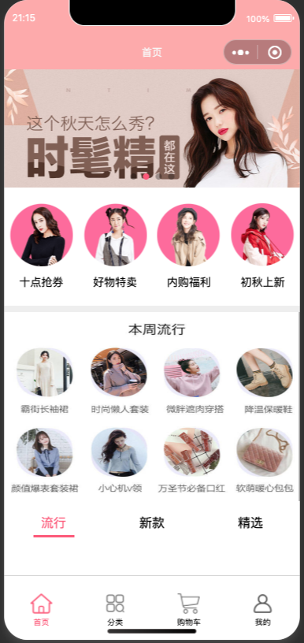


## 8. 请求首页商品数据

>因原视频中详情和其他内容的接口无法使用，所以，使用 [https://wanandroid.com/index](https://wanandroid.com/blog/show/2) 中的开发 API 替代。
>后续的代码中，页签使用的是 [2.1 体系数据 https://www.wanandroid.com/tree/json](https://wanandroid.com/blog/show/2) 中的 AndroidStudio、Gradle、官方发布。然后调用 [2.2 知识体系下的文章 https://www.wanandroid.com/article/list/0/json?cid=60](https://wanandroid.com/blog/show/2) 查询对应页签的数据。

根目录下新建 common 目录，其中定义 const.js 存储全局通用的常量，如下：

* const.js

```js
// 标签名称
export const AS = 'AndroidStudio';
export const GRADLE = 'gradle';
export const OFFICIAL = 'official';

// 标签对应的id
export const AS_ID = 60;
export const GRADLE_ID = 169;
export const OFFICIAL_ID = 269;
```

在 services/home.js 中添加用于请求列表数据的函数：

* home.js 

```js
// 导入定义在 network.js 中的匿名函数，并在此为其命名为 request
import request from "./network.js"

// 请求商品列表数据
export function getProduct(typeID, page) {
  return request({
    // ${} 为 js 中的占位符，使用占位符时，外层需要使用反引号
    url: `https://www.wanandroid.com/article/list/${page}/json`,
    data: {
      cid: typeID
    }
  })
}

// ---------下面这些代码是请求 banner 和 recommend 数据的------------
// 这种方式导出，引用方不能改变函数名称
// 请求banner 和 推荐数据
export function getMultidata() {
  return request({
    url: "http://123.207.32.32:8000/home/multidata"
  })
}
```

在 pages/home/home.js 中使用 services 中定义的列表内容请求函数：

* pages/home/home.js

```js
// pages/home/home.js
// 导入定义在 ../../services/home.js 中的网络请求函数，必须使用相对路径导入
import { getMultidata, getProduct } from "../../services/home.js"
import { AS, GRADLE, OFFICIAL, AS_ID, GRADLE_ID, OFFICIAL_ID, BACK_TOP_POSITION } from "../../common/const"

const types = [{ type: AS, id: AS }, { type: GRADLE, id: GRADLE }, { type: OFFICIAL, id: OFFICIAL_ID }]

Page({
  data: {
    banners: [],
    recommends: [],
    titles: [AS, GRADLE, OFFICIAL],
    currentType: AS,
    goods: {
      // 注意此处 key 的写法
      [AS]: { page: 0, list: [], id: AS_ID },
      [GRADLE]: { page: 0, list: [], id: GRADLE_ID },
      [OFFICIAL]: { page: 0, list: [], id: OFFICIAL_ID },
    }
  },

  onLoad: function (options) {
    this._getMultidata(),
      this._getProduct(AS)
  },

  // tab 被点击了
  onTabClick(event) {
    console.log(event)
    // 点击之后改变 currentType
    const index = event.detail.index
    const currentType = types[index].type
    this.setData({
      index,
      currentType
    })
  },

  // 请求列表数据
  _getProduct(type) {
    const page = this.data.goods[type].page + 1
    const typeID = this.data.goods[type].id
    getProduct(typeID, page).then(res => {
      console.log(res)
      // 1 读取数据
      const list = res.data.data.datas;

      // 2 临时取出数据
      const goods = this.data.goods;
      // ...list 表示解构，push 表示将数据追加调用方
      goods[type].list.push(...list);
      goods[type].page += 1;

      // 3 更新本地数据
      this.setData({
        goods
      })
    })
  },

  // 请求banner 和 推荐数据
  _getMultidata() {
    // 触发网络请求 .then 是 Promise 写法，我们的网络请求使用 Promise 进行了包装
    getMultidata().then(res => {
      console.log(res)
      const banners = res.data.data.banner.list
      const recommends = res.data.data.recommend.list

      this.setData({
        // 完整写法是 banners:banners ,由于 key 和 value 一致，所以可以简写为一个
        banners,
        recommends
      })
    })
  },
})
```

上面的代码中，难点和重点是获取到列表数据之后，如果更新到本地的 goods 对象中。


## 9. 展示首页商品数据


### 9.1. 包装条目组件

在根目录下的 components 中新建 `c-goods-item` 目录，其中新建 `c-goods-item` 组件，并编辑相关代码：

定义布局文件：

* `c-goods-item.wxml`

```xml
<!--components/c-goods-item/c-goods-item.wxml-->
<view class="goods-item">
  <image class="image" src="{{(item.id % 2 != 0 )? 'https://s2.ax1x.com/2019/02/28/k7CSBV.png':'https://wanandroid.com/resources/image/pc/default_project_img.jpg'}}" mode="widthFix"></image>
  <view class="desc-info">
    <view class="title">{{item.title}}</view>
    <view class = "info">
      <text class="author">{{item.author}}</text>

      <!-- 网络图也可以 -->
      <!-- <image class="icon" src="https://wanandroid.com/resources/image/pc/default_project_img.jpg"/> -->
      <image class="icon" src="/assets/images/common/favor.png"/>
      <text class="good-id">{{item.id}}</text>
    </view>

  </view>
</view>
```

在对应的 js 文件中定义要用到的 item 属性：

* `c-goods-item.js` 

```js
// components/c-goods-item/c-goods-item.js
Component({
  //  组件的属性列表
  properties: {
      item:{
        type:Object,
        value:{}
      }
  }
})
```

定义样式：

* `c-goods-item.wxss` 

```css
/* components/c-goods-item/c-goods-item.wxss */
.goods-item {
  /* 内容居中 */
  text-align: center;
  color: #333;
  /* padding-bottom: 85rpx; */
  padding-top: 15rpx;
}

.image {
  /* 图片宽度 100% */
  width: 100%;
  /* 图片圆角 */
  border-radius: 10rpx;
}

.desc-info {
  left: 0;
  right: 0;
  bottom: 5rpx;
}

.title {
  white-space: nowrap;
  /* 内容超宽不显示。末尾生硬结束，没有省略号标识*/
  overflow: hidden;
  /* 内容末尾追加省略号。 */
  text-overflow: ellipsis;
  font-size: 28rpx;
}

.info{
  font-size: 26rpx;
}

.info .author{
  color: #ff5777;
}

.info .icon{
  width: 30rpx;
  height: 30rpx;
  padding: 0 6rpx 0 10rpx;
  /* 相对位置 */
  top: 6rpx;
  /* 不设置的话上面的 top 不生效 */
  position: relative;
}
```


### 9.2. 使用条目组件

修改 home.json 文件，引用自定义的条目组件

* home.json

```json
{
  "usingComponents": {
    "c-swipper": "/components/c-swipper/c-swipper",
    "c-tab-controller": "/components/c-tab-controller/c-tab-controller",
    "c-goods-item": "/components/c-goods-item/c-goods-item",

    "c-recommend": "./childCpns/c-recommend/c-recommend",
    "c-popular": "./childCpns/c-popular/c-popular"

  },
  "navigationBarTitleText": "首页"
}
```

在 home.wxml 中使用自定义组件：

* home.wxml

```xml
<!--pages/home/home.wxml-->
<!-- 1 顶部swipper -->
<c-swipper list="{{banners}}"></c-swipper>
<!-- 2 推荐数据 -->
<c-recommend list="{{recommends}}"></c-recommend>
<!-- 3 本周流行 -->
<c-popular />
<!-- 4 tab-controller -->
<c-tab-controller titles="{{titles}}" bind:tab-item-click="onTabClick"></c-tab-controller>

<!-- 5 内容列表数据 -->
<view class="goods">
  <!-- 遍历并将数据内容传递给条目组件 -->
  <block wx:for="{{goods[currentType].list}}" wx:key="index">
    <c-goods-item item="{{item}}" class="item"></c-goods-item>
  </block>
</view>
```

定义 home.wxss 中的样式：

```css
.goods{
  display: flex;
  /* 让 flex 内容换行 */
  flex-wrap: wrap;
  /* 均分剩余空间——剩余空间包裹内容 */
  justify-content: space-around;
  padding: 8rpx;
}

.goods > .item{
  /* 条目宽度占屏幕宽度的 47% */
  width: 47%;
} 
```


目录结构和运行效果如下：

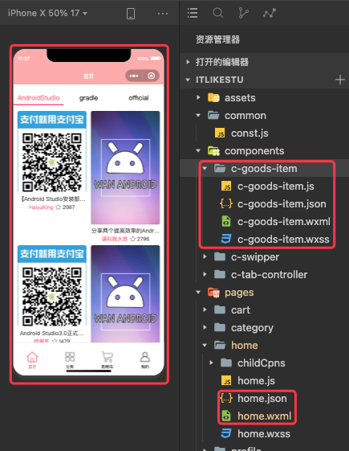

### 9.3. 界面优化

在上一小节的图中我们发现，文本内容会紧跟在图片下方，如果图片较短，那么就可能会出现大片空白的情况：


所以需要通过如下内容进行优化：

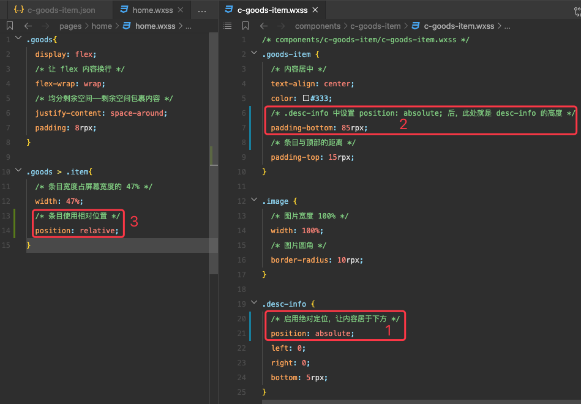

优化后的效果如下：

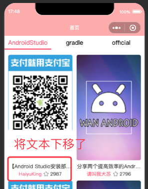


### 9.4. 抽取列表整体组件 

在 components 目录下新建 `c-goods` 目录，并在其中新建 `c-goods` 组件。下面的代码中的主要内容都已经存在了，此处做的只是从 home 中移动到组件中。

定义 wxml 文件：

* `c-goods.wxml`

```xml
<!--components/c-goods/c-goods.wxml-->
<view class="goods">
  <!-- 遍历并将数据内容传递给条目组件 -->
  <block wx:for="{{goods}}" wx:key="index">
    <c-goods-item item="{{item}}" class="item"></c-goods-item>
  </block>
</view>
```

在 js 文件中定义属性：

* `c-goods.js`

```js
// components/c-goods/c-goods.js
Component({
  properties: {
      goods:{
        type:Array,
        value:[]
      }
  }
})
```

在 json 文件中引用 `c-goods-item` 组件：

* `c-goods.json`

```json
{
  "component": true,
  "usingComponents": {
    "c-goods-item": "/components/c-goods-item/c-goods-item"
  }
}
```

定义 css 样式内容：

* `c-goods.wxss`

```wxss
/* components/c-goods/c-goods.wxss */
.goods{
  display: flex;
  /* 让 flex 内容换行 */
  flex-wrap: wrap;
  /* 均分剩余空间——剩余空间包裹内容 */
  justify-content: space-around;
  padding: 8rpx;
}

.goods > .item{
  /* 条目宽度占屏幕宽度的 47% */
  width: 47%;
  /* 条目使用相对位置 */
  position: relative;
}
```

运行效果和前一步中的效果一致，此处仅是将内容抽取成了组件。

## 10. 上拉加载更多

在 pages/home.js 中监听 `onReachBottom()` 函数，该函数表示界面已经滚动到底部了，此时，我们再次调用加载列表的函数，并传递 data 中定义的 currentType 即可：

```js
Page({
  // 其他代码内容省略。。。

 // 系统回调--滚动到底部了
  onReachBottom() {
    console.log("页面滚动底部了")
    this._getProduct(this.data.currentType)
  }
})
```

## 11. 首页的回到顶部

### 11.1. 定义组件

在 components 目录中新建 `c-back-top` 目录，其中存放回到顶部的组件，具体如下：

编辑布局文件，其中放置一个 image 使用本地图片：

* `c-back-top.wxml`

```xml
<!--components/c-back-top/c-back-top.wxml-->
<view class="back-top" bindtap="onClick">
  <image src="/assets/images/common/top.png"></image>
</view>
```

定义样式，确定展示位置和展示大小：

* `c-back-top.wxss`

```css
/* components/c-back-top/c-back-top.wxss */
.back-top{
  /* 修正位置，让组件显示在上层，且距离右侧、底部各 10rpx */
  position:fixed;
  right: 10rpx;
  bottom: 10rpx;
}

.back-top image{
  /* 控制图片的大小 */
  width: 90rpx;
  height: 90rpx;
}
```

在 js 文件中处理点击监听，调用 `wx.pageScrollTo({scrollTop:0})` 回到页面顶端：

* `c-back-top.js`

```js
// components/c-back-top/c-back-top.js
Component({
  methods: {
    // 监听点击事件
    onClick(event) {
      // 滚动到页面最顶端
      wx.pageScrollTo({
        scrollTop: 0
      })
    }
  }
})
```

### 11.2. 页面中引用

在 home.json 文件中引用组件：

* home.json

```js
{
  "usingComponents": {
    "c-swipper": "/components/c-swipper/c-swipper",
    "c-tab-controller": "/components/c-tab-controller/c-tab-controller",
    "c-goods":"/components/c-goods/c-goods",
    "c-back-top":"/components/c-back-top/c-back-top",

    "c-recommend": "./childCpns/c-recommend/c-recommend",
    "c-popular": "./childCpns/c-popular/c-popular"

  },
  "navigationBarTitleText": "首页"
}
```

* home.wxml 中使用组件

```xml
<!--pages/home/home.wxml-->
<!-- 1 顶部swipper -->
<c-swipper list="{{banners}}"></c-swipper>
<!-- 2 推荐数据 -->
<c-recommend list="{{recommends}}"></c-recommend>
<!-- 3 本周流行 -->
<c-popular />
<!-- 4 tab-controller -->
<c-tab-controller titles="{{titles}}" bind:tab-item-click="onTabClick"></c-tab-controller>
<!-- 5 内容列表数据 -->
<c-goods goods="{{goods[currentType].list}}" />

<!-- 6 回到顶部 -->
<c-back-top/>
```

运行效果如下：

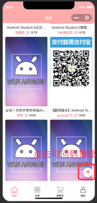


### 11.3. 控制按钮的展示时机

当页面滚动到一定位置时显示或者隐藏右下角的按钮。

在 home.wxml 中使用 wx:if 控制组件的显示和隐藏，核心内容如下：

```xml
<!-- hidden 对自定义组件无效 -->
<c-back-top wx:if="{{showBackTop}}"/>
```

然后在 home.js 中定义 showBackTop 变量，并监听页面滚动事件，当滚动到一定距离之后，改变 showBackTop 的值：

* home.js

```js
// pages/home/home.js
// 导入定义在 ../../services/home.js 中的网络请求函数，必须使用相对路径导入
import { getMultidata, getProduct } from "../../services/home.js"
import { AS, GRADLE, OFFICIAL, AS_ID, GRADLE_ID, OFFICIAL_ID, BACK_TOP_POSITION } from "../../common/const"

const types = [{ type: AS, id: AS }, { type: GRADLE, id: GRADLE }, { type: OFFICIAL, id: OFFICIAL_ID }]

Page({

  onPageScroll(options) {
    console.log(options)
    // BACK_TOP_POSITION 是之前在 common/const.js 中定义的常量，取值为 1000
    const flag = options.scrollTop >= BACK_TOP_POSITION
    if(flag != this.data.showBackTop){
      this.setData({
        showBackTop:flag
      })
    }

    // // 注意，小程序官方不推荐在 scroll 中频繁调用 setData ——因为 setData 会刷新界面。
    // const scrollTop = options.scrollTop
    // this.setData({
    //   showBackTop: scrollTop >= BACK_TOP_POSITION
    // })
  }

   // 其他内容省略
})
```

通过上述代码的控制，就可以实现滚动到指定位置展示或者隐藏按钮的操作。

## 12. `tab-control` 置顶悬浮

### 12.1. 实现原理

监听滚动，当滚动到指定位置时，让 `tab-control` 脱离标准流。

我们先给 `tab-control` 设置 `position:fixed` 样式，让其脱离标准流：

```xml
<c-tab-controller titles="{{titles}}" bind:tab-item-click="onTabClick" class="fixed"></c-tab-controller>
```

```js
.fixed{
  background: #fff;
  /* 设置如下内容之后，tab 将会悬浮在页面顶部，而不再列表中了 */
  position: fixed;
  top: 0;
  left: 0;
  right: 0;
}
```

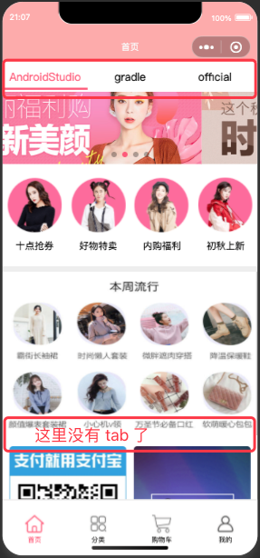

按照上述代码设置，当列表滚动时，列表的条目会遮盖 `tab-control`, 如下：

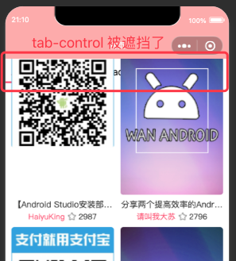

我们需要在样式中添加 `z-index:1` 解决该问题，具体如下:

```js
.fixed{
  background: #fff;
  /* 设置如下内容之后，tab 将会悬浮在页面顶部，而不再列表中了 */
  position: fixed;
  top: 0;
  left: 0;
  right: 0;
  /* 如果不加这个，在 tab-control 之后添加到视图的内容在滚动时会遮盖 tab-control */
  z-index: 1; 
}
```

### 12.2. 实现悬浮

基于前一小节的原理，我们只需要动态的根据滚动位置控制 `tab-control` 是否应用 `.fiexd` 样式即可。但是，这样设置的话，在触发样式切换时，内容列表会有一个跳动效果。我们可以通过 `调试器`-`AppData` 中来模拟样式切换的效果。

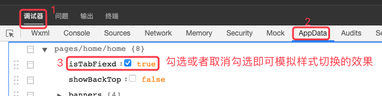

为了避免这个跳动效果，我们就需要另一个 `tab-control` 来占位，这个新的 `tab-control` 默认隐藏，当需要展示 `fixed` 样式时再显示。这样就可以实现顶部悬浮且没有跳动效果。

```xml
<!-- 4 tab-controller -->
<c-tab-controller titles="{{titles}}" bind:tab-item-click="onTabClick" class="{{isTabFiexd ? 'fixed':''}}"/>
<c-tab-controller titles="{{titles}}" bind:tab-item-click="onTabClick" wx:if="{{isTabFiexd}}"/>
```

### 12.3. 根据滚动位置改变 isTabFiexd

#### 12.3.1. 获取顶部距离的原理

我们可以通过如下代码获取到指定 id 的组件距离顶部的距离：

```js
 onShow:function(options){
    // 获取 id 为 tab-control 的组件的 rect 信息。末尾的 exec() 必须添加，否则读取不到 rect
    wx.createSelectorQuery().select('#tab-control').boundingClientRect(rect=>{
      console.log("-------",rect)
    }).exec()
  },
```

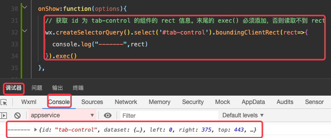

但是，图片是异步加载的，所以在 `onShow` 回调被触发时可能会出现先把指定 id 的组件加载出来了，但是该组件前面的图片还没有加载出来。等图片加载出来之后，指定 id 的组件的 rect 信息也就变了，

我们也可以通过定时器延时获取其 top ，但这样并不能保证准确：

```js
  onShow: function (options) {
    setTimeout(() => {
      // 获取 id 为 tab-control 的组件的 rect 信息。末尾的 exec() 必须添加，否则读取不到 rect
      wx.createSelectorQuery().select('#tab-control').boundingClientRect(rect => {
        console.log("-------", rect)
      }).exec()
    }, 1000)
  }
```

所以，理想的状态应该是在影响该组件布局的视图都加载完之后再去获取 top 距离。

#### 12.3.2. 监听图片加载

在当前项目的首页中，swipper 的高度是最先确定的，本周流行的图片是本地的，所以，只有推荐数据中的图片可能会影响 `tab-control` 的布局，因此，我们只要监听到推荐数据中的图片加载完成之后，就可以去获取 top 距离了。

在 image 组件中，通过 `bindload` 监听可以获知图片加载完成。

* `c-recommend.xml`

```xml
<!--pages/home/childCpns/c-recommend/c-recommend.wxml-->
<view class="recommend">
  <block wx:for="{{list}}" wx:key="index">
    <view class="recommend-item">
      <image src="{{item.image}}" bindload="onLoadOver"></image>
      <view>{{item.title}}</view>
    </view>
  </block>
</view>

```

* `c-recommend.js`

```js
// pages/home/childCpns/c-recommend/c-recommend.js
Component({
  data: {
    isLoadOver: false
  },
  properties: {
    list: {
      type: Array,
      value: []
    }
  },
  methods: {
    onLoadOver() {
      console.log("图片加载完成了")
      // 此处只监听一次即可，有一个图片加载完成，就可以确定其高度了
      if (!this.data.isLoadOver) {
        // 改变内存中的数据——不需要改变视图时可以直接 = ，需要改变视图时必须 setData
        this.data.isLoadOver = true
        // 对外暴露事件
        this.triggerEvent("imageLoaded")
      }
    }
  }
})
```

### 12.4. 实现悬浮

在 home.xml 中监听 `c-recommend.js` 中暴露出来的图片加载完成的事件——`imageLoaded`


```xml
<!-- 2 推荐数据 -->
<c-recommend list="{{recommends}}" bind:imageLoaded="onImgLoaded"/>
```

然后在 home.js 中实现 `onImgLoaded` 函数, 在其中执行获取 tab 顶部距离的操作：

```js
onImgLoaded(event) {
    // 获取 id 为 tab-control 的组件的 rect 信息。末尾的 exec() 必须添加，否则读取不到 rect
    wx.createSelectorQuery().select('#tab-control').boundingClientRect(rect => {
      console.log("-------", rect)
      this.data.tabTop = rect.top
    }).exec()
  },
```

上述代码中，将 top 存储到了 data 节点中的 tabTop 字段中，接下来，我们就需要监听滚动，当滚动距离大于或等于 tabTop 时修改 isTabFixed 的值。如下：

```js

  onPageScroll(options) {
    console.log(options)

    // 控制是否展示 fiex 样式的 tab
    const flag2 = options.scrollTop >= this.data.tabTop
    if (flag2 != this.data.isTabFiexd) {
      this.setData({
        isTabFiexd: flag2
      })
    }
  },
```

home.js 中的完整代码为：

```js
// pages/home/home.js
// 导入定义在 ../../services/home.js 中的网络请求函数，必须使用相对路径导入
import { getMultidata, getProduct } from "../../services/home.js"
import { AS, GRADLE, OFFICIAL, AS_ID, GRADLE_ID, OFFICIAL_ID, BACK_TOP_POSITION } from "../../common/const"

const types = [{ type: AS, id: AS }, { type: GRADLE, id: GRADLE }, { type: OFFICIAL, id: OFFICIAL_ID }]

Page({
  data: {
    tabTop: 0,
    isTabFiexd: false,
    showBackTop: false,
    banners: [],
    recommends: [],
    titles: [AS, GRADLE, OFFICIAL],
    currentType: AS,
    goods: {
      [AS]: { page: 0, list: [], id: AS_ID },
      [GRADLE]: { page: 0, list: [], id: GRADLE_ID },
      [OFFICIAL]: { page: 0, list: [], id: OFFICIAL_ID },
    }
  },
  // -------------系统回调----------------
  onLoad: function (options) {
    this._getMultidata()
    this._getProduct(AS)
    this._getProduct(GRADLE)
    this._getProduct(OFFICIAL)
  },
  // 系统回调--滚动到底部了
  onReachBottom() {
    console.log("页面滚动底部了")
    this._getProduct(this.data.currentType)
  },

  onPageScroll(options) {
    console.log(options)
    const flag = options.scrollTop >= BACK_TOP_POSITION
    if (flag != this.data.showBackTop) {
      this.setData({
        showBackTop: flag
      })
    }

    // // 注意，小程序官方不推荐在 scroll 中频繁调用 setData ——因为 setData 会刷新界面。
    // const scrollTop = options.scrollTop
    // this.setData({
    //   showBackTop: scrollTop >= BACK_TOP_POSITION
    // })

    // 控制是否展示 fiex 样式的 tab
    const flag2 = options.scrollTop >= this.data.tabTop
    if (flag2 != this.data.isTabFiexd) {
      this.setData({
        isTabFiexd: flag2
      })
    }
  },

  // -------------事件监听----------------
  // tab 被点击了
  onTabClick(event) {
    console.log(event)
    // 点击之后改变 currentType
    const index = event.detail.index
    const currentType = types[index].type
    this.setData({
      index,
      currentType
    })
  },

  onImgLoaded(event) {
    // 获取 id 为 tab-control 的组件的 rect 信息。末尾的 exec() 必须添加，否则读取不到 rect
    wx.createSelectorQuery().select('#tab-control').boundingClientRect(rect => {
      console.log("-------", rect)
      this.data.tabTop = rect.top
    }).exec()
  },

  // ------------网络请求---------------
  // 请求列表数据
  _getProduct(type) {
    const page = this.data.goods[type].page + 1
    const typeID = this.data.goods[type].id
    getProduct(typeID, page).then(res => {
      console.log(res)
      // 1 读取数据
      const list = res.data.data.datas;

      // 2 临时取出数据
      const goods = this.data.goods;
      // ...list 表示解构，push 表示将数据追加调用方
      goods[type].list.push(...list);
      goods[type].page += 1;

      // 3 更新本地数据
      this.setData({
        goods
      })
    })
  },

  // 请求banner 和 推荐数据
  _getMultidata() {
    // 触发网络请求 .then 是 Promise 写法，我们的网络请求使用 Promise 进行了包装
    getMultidata().then(res => {
      console.log(res)
      const banners = res.data.data.banner.list
      const recommends = res.data.data.recommend.list

      this.setData({
        // 完整写法是 banners:banners ,由于 key 和 value 一致，所以可以简写为一个
        banners,
        recommends
      })
    })
  },
})
```


基于上面的代码，我们就可以实现 `tab-control` 的顶部悬浮效果了：

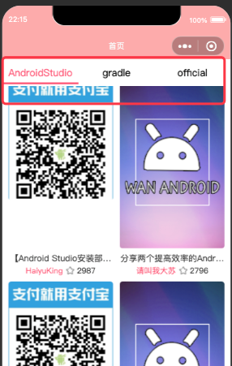


至此，首页实现完成。

