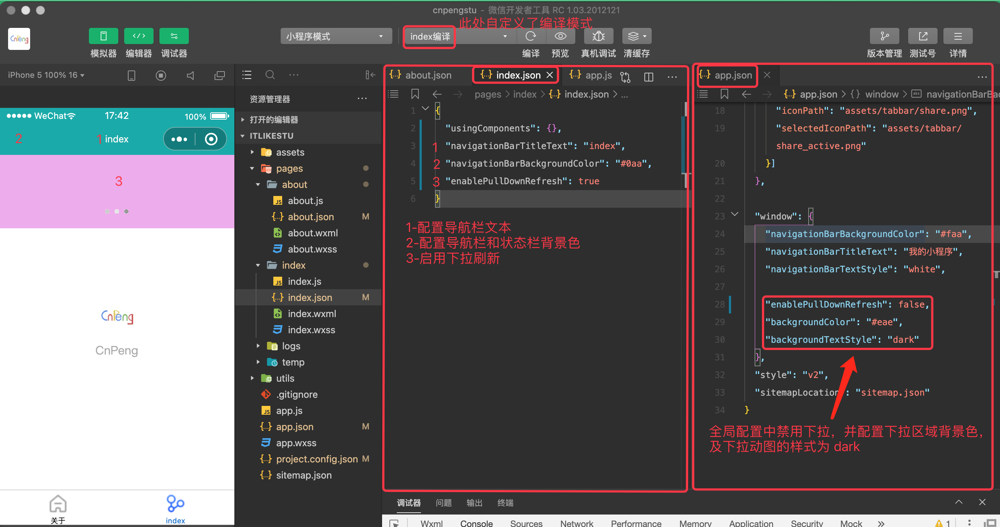

基于以下内容整理：

* [《小程序的架构和配置-1》](https://www.bilibili.com/video/BV1Kt411V7rg?p=7)
* [《小程序的架构和配置-1》](https://www.bilibili.com/video/BV1Kt411V7rg?p=8)
* [《小程序的架构和配置-1》](https://www.bilibili.com/video/BV1Kt411V7rg?p=9)


---

## 5.1 配置

小程序的很多开发需求都是通过**配置文件**来实现。这样可以提高开发效率且能保证小程序的基础风格一致。

配置文件的类型如下：

配置文件名称|说明
---|---
[project.config.json](https://developers.weixin.qq.com/miniprogram/dev/devtools/projectconfig.html) | 项目配置文件，如项目名称、appid 等
[sitemap.json](https://developers.weixin.qq.com/miniprogram/dev/framework/sitemap.html) | 小程序内搜索相关的配置
[app.json](https://developers.weixin.qq.com/miniprogram/dev/framework/config.html#%E5%85%A8%E5%B1%80%E9%85%8D%E7%BD%AE) | 全局配置
[page.json](https://developers.weixin.qq.com/miniprogram/dev/framework/config.html#%E9%A1%B5%E9%9D%A2%E9%85%8D%E7%BD%AE) | 页面配置

前两种很少需要修改。

### 5.1.1 `project.config.json`

`project.config.json` 对应的是 "详情" 中的配置内容，修改时通常从 "详情" 配置面板中修改 。该文件存在的意义是方便不同电脑之间环境配置的同步。更换电脑时，直接拷贝该文件，这样新电脑就具备了旧电脑的环境信息。


### 5.1.2 `sitemap.json`

`sitemap.json`  的作用是配置我们的程序是否可以让用户通过微信搜索查找到我们的程序或程序内的内容。默认允许所有页面内容允许被搜索到。

### 5.1.3 `app.json`

[app.json](https://developers.weixin.qq.com/miniprogram/dev/framework/config.html#%E5%85%A8%E5%B1%80%E9%85%8D%E7%BD%AE)，应用的全局配置。

最常用的三个配置项

属性|类型|是否必须|描述
---|---|---|---
pages | string[] | 是 | 页面路径列表，小程序中的所有页面都必须在此处配置
window | Object | 否 | 全局的默认窗口表现
tabBar | Object | 否 | 底部 tab 栏的表现

window 相关的设置：


注意：下拉刷新的内容在此处设置的话，所有页面都将具备下拉功能。我们通常是在需要下拉功能的页面的 json 文件中配置。

tabBar 的相关设置：


补充：代码格式化的快捷键-`alt+shift+F` ，window 和 mac 一致。

### 5.1.4 `page.json`

[page.json](https://developers.weixin.qq.com/miniprogram/dev/framework/config.html#%E9%A1%B5%E9%9D%A2%E9%85%8D%E7%BD%AE) 单个页面的配置项。每个页面都有自己的配置文件。

#### 5.1.4.1 页面配置



#### 5.1.4.2 自定义编译模式

我们在 app.json 中指定了小程序首页为 about 页面：

```json
{
  "pages": [
    "pages/about/about",
    "pages/index/index",
    "pages/logs/logs"
  ]
}  
```

所以，默认情况下， 我们修改完代码内容并点击 `ctrl+s` 保存内容之后，IDE 的预览界面就会跳转到 `about` 页面。如果我们想保存之后直接展示 `index` 页面, 就可以通过自定义编译模式实现。主要步骤如下：


## 5.2 小程序的双线程模型

**微信客户端**是小程序的宿主。宿主提供了执行小程序的各种文件：wxml 文件、js 文件、wxss 文件。并为小程序提供了**双线程模型**。


WXML 模板和 WXSS 样式运行与渲染层，渲染层使用 WebView 线程渲染（一个程序有多个页面，会使用多个 WebView 的线程）。

JS 脚本（app.js、xxPage.js）运行于逻辑层，逻辑层使用 JsCore 运行 JS 脚本。

这两个线程都会经由微信客户端（Native）进行中转交互。

### 5.2.1 界面渲染过程-wxml 和 DOM 树

wxml 等价于一棵 DOM 树，也可以使用一个 JS 对象来模拟（虚拟 DOM）：


上图中，左上角的嵌套 view 可以使用右侧的树形结构表示，而右侧的树形结构又可以使用左下角的 JS 对象来表示。

### 5.2.2 界面渲染过程-初始化渲染

WXML 可以先转成 JS 对象，再渲染出真正的 DOM 树。


上图中，左上角是 wxml 文件内容，左下角是对应的 js 文件，两者会转成中间的 js 对象，js 对象会转成 DOM， 最终在最右侧渲染。

### 5.2.3 界面渲染过程-数据变化


通过 setData 把 msg 数据从 "Hello World" 变成 "Goodbye":

* 产生的 JS 对象对应的节点就会发生变化
* 此时可以对比前后两个 JS 对象，得到变化的部分
* 然后把这个差异应用到原来的 DOM 树上

从而大袋更新 UI 的目的，这就是 **数据驱动** 的原理。

### 5.2.4 界面渲染的整体流程总结

* 在渲染层，宿主环境会把 WXML 转化成对应的 JS 对象
* 将 JS 对象再次转成真实 DOM 树，交由渲染层线程渲染
* 数据变化时，逻辑层提供最新的变化数据，JS 对象发生变化就会触发 diff 算法对比
* 将最新变化的内容反映到真实的 DOM 树中，更新 UI。

