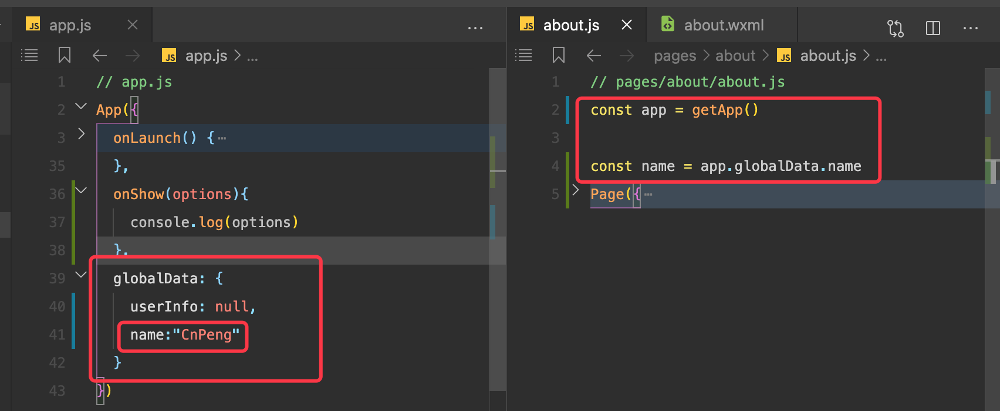

## 1. 6.1 小程序的启动流程

了解小程序的启动流程之后，就知道了代码的执行顺序：


## 2. 6.2 小程序生命周期

[《小程序的生命周期》](https://developers.weixin.qq.com/miniprogram/dev/reference/api/App.html)中主要的周期有：

* `onLaunch(Object object)`

小程序**初始化完成时触发，全局只触发一次**。参数也可以使用 `wx.getLaunchOptionsSync` 获取。

参数：与 `wx.getLaunchOptionsSync` 一致

* `onShow(Object object)`

小程序启动，或从后台进入前台显示时触发。也可以使用 `wx.onAppShow` 绑定监听。

参数：与 `wx.onAppShow` 一致

* `onHide()`

小程序从前台进入后台时触发。也可以使用 `wx.onAppHide` 绑定监听。

* `onError(String error)`

小程序发生脚本错误或 API 调用报错时触发。也可以使用 `wx.onError` 绑定监听。

参数：与 `wx.onError` 一致

小程序的生命周期函数在 `app.js` 文件的 App 节点中声明和使用。

## 3. 6.2 注册小程序实例

即启动流程中的 `注册 App()` .

每个小程序都需要再 `app.js` 中调用 App 方法注册小程序实例。
 
 

在注册实例时，我们通常可以做以下事情：

* 判断小程序的进入场景
* 监听生命周期函数，在生命周期中执行对应的业务逻辑，比如在某个生命周期函数中获取微信用户的信息。
* 因为 `App()` 实例只有一个，并且时全局共享的（单例对象）。所以我们可以将一些共享数据放在其中的 `globaldata` 节点中。

[小程序后台存活时间、启动场景分类](https://developers.weixin.qq.com/miniprogram/dev/framework/runtime/operating-mechanism.html)

### 3.1. 6.2.1 如何确定场景？

在 `onLaunch` 和 `onShow` 生命周期回调函数中，会有 `options` 参数，其中有 `sence` 值


在上图中，获取到 sence 对应的代码之后，就可以根据 [小程序启动场景分类](https://developers.weixin.qq.com/miniprogram/dev/framework/runtime/operating-mechanism.html) 的说明获知是如何打开小程序的。

`onLaunch` 中也可以增加 options 并做场景判断。

### 3.2. 6.2.2 监听生命周期

监听生命周期之后，可以做一些必要的处理。

比如在 onLaunch 或 onShow 中获取用户信息。

```js
App({
  onLaunch() {
    // 展示本地存储能力
    const logs = wx.getStorageSync('logs') || []
    logs.unshift(Date.now())
    wx.setStorageSync('logs', logs)

    // 登录
    wx.login({
      success: res => {
        // 发送 res.code 到后台换取 openId, sessionKey, unionId
      }
    })
    // 获取用户信息
    wx.getSetting({
      success: res => {
        if (res.authSetting['scope.userInfo']) {
          // 已经授权，可以直接调用 getUserInfo 获取头像昵称，不会弹框
          wx.getUserInfo({
            success: res => {
              // 可以将 res 发送给后台解码出 unionId
              this.globalData.userInfo = res.userInfo

              // 由于 getUserInfo 是网络请求，可能会在 Page.onLoad 之后才返回
              // 所以此处加入 callback 以防止这种情况
              if (this.userInfoReadyCallback) {
                this.userInfoReadyCallback(res)
              }
            }
          })
        }
      }
    })
  }
}  
```

### 3.3. 6.2.3 获取用户信息的几种方式：

方式1：

* `wx.getUserInfo`

方式2：

* button 组件中，将 `open-type` 改成 `getUserInfo`，并且绑定 `bindgetuserinfo` 这个事件函数去获取信息。(这种方式必须由用户触发按钮的点击)


方式3：

使用 [`open-data`](https://developers.weixin.qq.com/miniprogram/dev/component/open-data.html) 组件。这种方式仅做展示，无法传递给我们自己的函数。


### 3.4. 6.2.4 注册实例时定义全局变量


