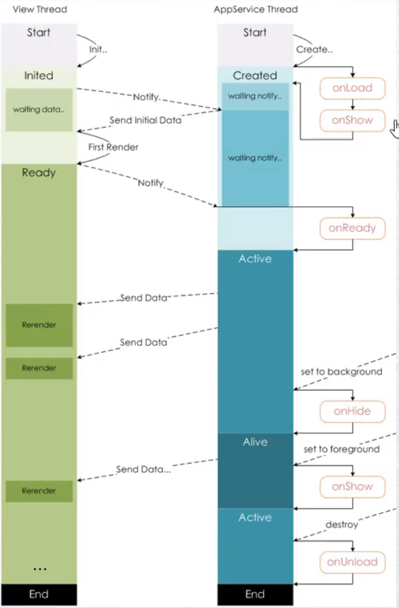

小程序中的每个页面都有一个对应的 js 文件，在小程序初始化过程中，会调用其中的 `Page()` 实现该页面实例的注册。

在注册页面实例时，我们可以做以下事情:

* 在生命周期函数中发送网络请求，从服务器获取数据
* 初始化一些数据，以方便被 wxml 引用展示
* 监听 wxml 中相关的事件


js 函数的两种写法：

```js
<!--方式1-->
onLaunch:function(){

}

<!--方式2-->
onLaunch(){

}
```

## 7.1 页面生命周期

[页面生命周期回调](https://developers.weixin.qq.com/miniprogram/dev/reference/api/Page.html)

函数 | 类型 | 说明
---|---|---
onLoad	| function | 生命周期回调—监听页面加载
onShow	 | function | 生命周期回调—监听页面显示
onReady | function | 生命周期回调—监听页面初次渲染完成
onHide	| function | 生命周期回调—监听页面隐藏
onUnload | function | 生命周期回调—监听页面卸载

页面展示时，生命周期函数会依次执行 `onLoad`、`onShow`、`onReady`。`onReady` 仅在初次渲染完成时执行。

某个页面被销毁时，会触发 `onUnload`.



如上图，页面在渲染时会使用两个线程，这就是双线程渲染模型。`View Thread` 负责页面渲染，`AppService Thread` 负责监听和数据处理，为 `View Thread` 提供数据。


## 7.2 初始化数据

通常是在 onLoad 中发送网络请求，获取页面展示所需的数据。

注意：在请求数据时，如果不使用 `=>` 箭头函数，就需要按照如下写法。

```js

Page({
  data: {
    list: []
  },

  const that = this;
  wx.request({
    url: `xxxx`,
    success: function (res) {
      const data = res.data.data.list;
        //此处不能用 this，this 指向的不再是 page 对象
        that.setData({
          list: data
        })
    }
  })
})
```

箭头函数写法：

```js

Page({
  data: {
    list: []
  },

  wx.request({
    url: `xxxx`,
    success: (res)=> {
      const data = res.data.data.list;
      	  // 在使用 => 箭头函数时，其中的 this 会指向正确的对象，此处会指向 Page 实例
        this.setData({
          list: data
        })
    }
  })
})
```


## 7.3 监听 wxml 中的事件

在 wxml 的组件中注册的事件需要在 js 文件中定义对应的方法，这样当用户触发 wxml 中的事件后就会调用 js 中对应的方法

## 7.4 其他事件监听

如页面滚动，上拉和下拉等事件。

函数 | 类型 | 说明
---|---|---
onPullDownRefresh	| function | 监听用户下拉动作
onReachBottom	| function | 页面上拉触底事件的处理函数
onShareAppMessage	| function | 用户点击右上角转发
onShareTimeline	| function | 用户点击右上角转发到朋友圈
onAddToFavorites | function | 用户点击右上角收藏
onPageScroll | function | 页面滚动触发事件的处理函数
onResize | function | 页面尺寸改变时触发，详见 响应显示区域变化
onTabItemTap | function	| 当前是 tab 页时，点击 tab 时触发


