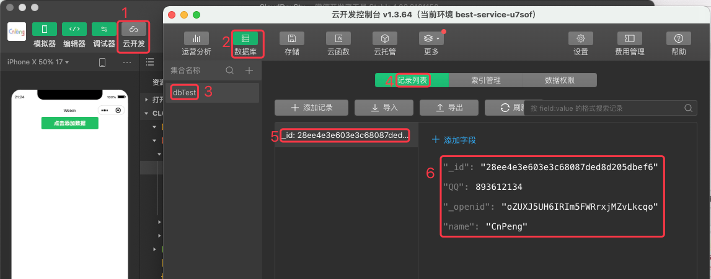
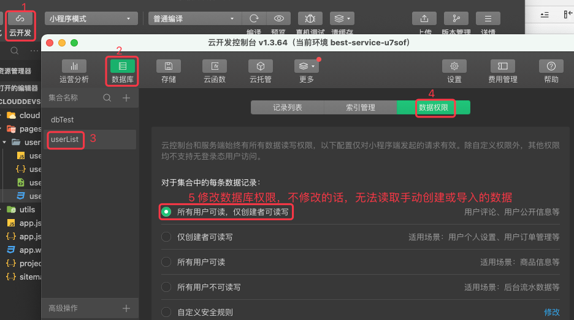
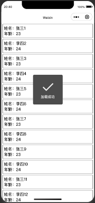
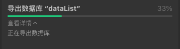
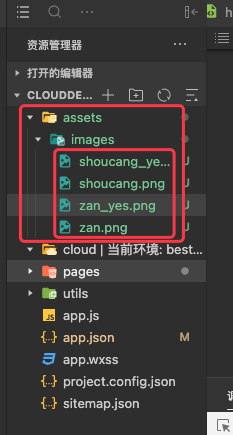

# 1. 云开发

基于 B站 [小程序云开发 ](https://www.bilibili.com/video/BV1pE411C7Ca?p=5&spm_id_from=pageDriver) 和 [云开发官方文档](https://developers.weixin.qq.com/miniprogram/dev/wxcloud/guide/database/init.html)补充整理


小程序云开发主要包含：云数据库、云函数、云存储、云调用

## 1.1. 开发准备

参考文章：[微信官方文档-小程序开发指南](https://developers.weixin.qq.com/miniprogram/dev/framework/quickstart/getstart.html#申请帐号)

### 1.1.1. 注册小程序账号

先在[小程序注册页面](https://mp.weixin.qq.com/wxopen/waregister?action=step1) 注册小程序


注册小程序之后，从 [小程序管理端](https://mp.weixin.qq.com/) 的 `设置`——`基本设置`——`账号信息` 中可以查看 APPID (即小程序 ID).


或者，也可以从 `开发`——`开发管理`——`开发设置`——`开发者ID` 中查看 APPID，如下：


### 1.1.2. 安装开发者工具

点击下载 [微信开发者工具](https://developers.weixin.qq.com/miniprogram/dev/devtools/download.html)

### 1.1.3. 新建项目


上图中，选择 `不适用云服务`，如果选择前者的话，会自动创建很多内容，大部分都是多余的。

### 1.1.4. 开通云开发服务


点击上图中的 `云开发` 按钮进入云开发的管理界面，如果没有开通，会展示如下页面：


点击其中的 `开通` 即可。


### 1.1.5. 云服务管理界面

开通成功之后，则会打开云开发管理界面。如下：


在 `设置` 中可以相关设置信息，其中 `环境设置`——`环境ID` 在后面需要配置到项目中。


### 1.1.6. 项目中初始化云服务

#### 1.1.6.1. 配置云函数目录

先在 project.config.json 中添加 `"cloudfunctionRoot":"cloud",` 指定云函数的存储目录为 cloud ，然后在项目根目录下新建一个名称为 cloud 的目录，创建完成之后，该目录右下角会有一个小云朵的标识。如下图：


#### 1.1.6.2. 配置云函数环境

在 app.json 中配置云开发 env , 其中用到的 env 的取值就是在云开发的管理界面中的 云开发环境ID。具体如下图：


```json
 wx.cloud.init({
      env:"stu-5g1a6gc25544f200"
    })
```

## 1.2. 云数据库的增删改查

[官方文档](https://developers.weixin.qq.com/miniprogram/dev/wxcloud/guide/database/init.html)

先创建一个云数据库，步骤如下：

* 打开云开发管理界面


* 创建一个数据库


### 1.2.1. 增

先新建一个 db 页面，并将其作为启动页面，如下：


#### 1.2.1.1. 新增固定数据 

然后在 db.xml 文件中添加一个按钮，并监听其点击事件：

```xml
<!--pages/db/db.wxml-->
<view>
  <button bindtap="onAddClick" type="primary">点击添加数据</button>
</view>
```

在 db.js 文件中实现监听函数 `onAddClick` ：

```js
// pages/db/db.js
// 1 获取名称为 dbTest 的数据库对象
const DB = wx.cloud.database().collection("dbTest")

Page({
  onAddClick(event) {
    console.log("添加按钮被点击了")
    // 2 向数据库中添加数据
    DB.add({
      data: {
        name: "CnPeng",
        QQ: 893612134
      },
      success(res){
        console.log("添加成功",res)
      },
      fail(res){
        console.log("添加失败",res)
      }
    })
  }
})
```

编辑完上面的 wxml 和 js 文件之后，直接快键键 ctrl + s （ MAC 下使用  cmd + s ） 保存项目，会看到如下界面：


点击上图中的绿色按钮，会在控制台看到如下输出：


上图表示我们的数据已经添加成功了，那么我们打开云开发管理页面，查看一下数据，如下：



#### 1.2.1.2. 新增动态数据

修改 db.wxml 文件，新增两个输入框，并监听器输入事件：

```wxml
<!--pages/db/db.wxml-->
<view>
  <input placeholder="请输入 name: " bindinput="setName"></input>
  <input placeholder="请输入 QQ :" bindinput="setQQ"></input>
  <button bindtap="onAddClick" type="primary">点击添加数据</button>
</view>
```

在 db.js 文件中监听输入框的事件：

```js
// pages/db/db.js
// 1 获取名称为 dbTest 的数据库对象
const DB = wx.cloud.database().collection("dbTest")
Page({
  data: {
    // 定义两个字段，用来接收输入框输入的内容  
    name: "",
    qq: ""
  },
  setName(res) {
    console.log("输入了 name:", res)
    this.data.name = res.detail.value
  },
  setQQ(res) {
    console.log("输入了 QQ：", res)
    this.data.qq = res.detail.value
  },
  
  onAddClick(event) {
    console.log("添加按钮被点击了")
    // 2 向数据库中添加数据
    DB.add({
      data: {
        name: this.data.name,
        QQ: this.data.qq
      },
      success(res) {
        console.log("添加成功", res)
      },
      fail(res) {
        console.log("添加失败", res)
      }
    })
  }
})
```

编辑完成之后，保存修改，然后在输入框中输入内容，就会随之在调试器中看到输入的结果：


输入完成之后，点击按钮就会看到如下效果：


此时，再查看数据库, 数据已经成功插入：


### 1.2.2. 查

#### 1.2.2.1. 基本查询

[查询 API 文档](https://developers.weixin.qq.com/miniprogram/dev/wxcloud/guide/database/read.html)

在 db.wxml 文件中，新增查询按钮并监听其点击事件:

```xml
<!--pages/db/db.wxml-->
<view>
  <input placeholder="请输入 name: " bindinput="setName"></input>
  <input placeholder="请输入 QQ :" bindinput="setQQ"></input>
  <button bindtap="onAddClick" type="primary">点击添加数据</button>
 
  <button bindtap="onReferClick" type="primary">点击查询数据</button>
</view>
```

在 db.js 中 实现查询按钮的监听函数：

```js
// pages/db/db.js
// 1 获取名称为 dbTest 的数据库对象
const DB = wx.cloud.database().collection("dbTest")
Page({
  data: {
    name: "",
    qq: ""
  },
  setName(res) {
    console.log("输入了 name:", res)
    this.data.name = res.detail.value
  },
  setQQ(res) {
    console.log("输入了 QQ：", res)
    this.data.qq = res.detail.value
  },
  onAddClick(event) {
    console.log("添加按钮被点击了")
    // 2 向数据库中添加数据
    DB.add({
      data: {
        name: this.data.name,
        QQ: this.data.qq
      },
      success(res) {
        console.log("添加成功", res)
      },
      fail(res) {
        console.log("添加失败", res)
      }
    })
  },
  onReferClick(event) {
    DB.get({
      success(res) {
        console.log("数据查询成功：", res)
      },
      fail(res) {
        console.log("数据查询失败：", res)
      },
    })
  }
})
```

运行之后，效果如下：


#### 1.2.2.2. 限定条件的查询


[查询-比较操作符文档](https://developers.weixin.qq.com/miniprogram/dev/wxcloud/reference-sdk-api/database/command/Command.eq.html)

```js
const db = cloud.database()
const _ = db.command
return await db.collection("infos").where({
    // 查 hot >1 的数据,文档地址：https://developers.weixin.qq.com/miniprogram/dev/wxcloud/reference-sdk-api/database/command/Command.eq.html
    hot: _.gt(1)
}).get()
```


### 1.2.3. 删

修改 db.wxml 文件, 新增一个删除按钮和输入框：

```xml
<!--pages/db/db.wxml-->
<view>
  <input placeholder="请输入 name: " bindinput="setName"></input>
  <input placeholder="请输入 QQ :" bindinput="setQQ"></input>
  <button bindtap="onAddClick" type="primary">点击添加数据</button>
 
  <button bindtap="onReferClick" type="primary">点击查询数据</button>

  <input placeholder="填写要删除的数据id：" bindinput="setDelID"></input>
  <button bindtap="onDelClick" type="primary">点击删除数据</button>
</view>
```

修改 db.js 文件，新增与删除相关的变量和监听函数：

```js
// pages/db/db.js
// 1 获取名称为 dbTest 的数据库对象
const DB = wx.cloud.database().collection("dbTest")
Page({
  data: {
    name: "",
    qq: "",
    delID: ""
  },

  // --------删除数据----------------
  setDelID(res) {
    console.log("输入的内容：", res)
    const delID = res.detail.value
    // 注意，delID 前后不能带引号
    this.data.delID = delID
  },
  onDelClick(event) {
    DB.doc(this.data.delID).remove({
      success(res){
        console.log("删除成功",res)
      },
      fail(res){
        console.log("删除失败",res)
      }
    })
  },

  // -------添加数据----------------
  setName(res) {
    console.log("输入了 name:", res)
    this.data.name = res.detail.value
  },
  setQQ(res) {
    console.log("输入了 QQ：", res)
    this.data.qq = res.detail.value
  },
  onAddClick(event) {
    console.log("添加按钮被点击了")
    // 2 向数据库中添加数据
    DB.add({
      data: {
        name: this.data.name,
        QQ: this.data.qq
      },
      success(res) {
        console.log("添加成功", res)
      },
      fail(res) {
        console.log("添加失败", res)
      }
    })
  },
  // -------插叙数据--------------------
  onReferClick(event) {
    DB.get({
      success(res) {
        console.log("数据查询成功：", res)
      },
      fail(res) {
        console.log("数据查询失败：", res)
      },
    })
  }
})
```

然后从数据库中复制一个 id 粘贴到输入框中，然后点击删除按钮即可删除数据。


### 1.2.4. 更新

修改 db.wxml 文件，新增更新相关的组件：

```xml
<!--pages/db/db.wxml-->
<view>
  <!-- 添加数据 -->
  <input placeholder="请输入 name: " bindinput="setName"></input>
  <input placeholder="请输入 QQ :" bindinput="setQQ"></input>
  <button bindtap="onAddClick" type="primary">点击添加数据</button>

  <!-- 查询数据 -->
  <button bindtap="onReferClick" type="primary">点击查询数据</button>

  <!-- 删除数据 -->
  <input placeholder="填写要删除的数据id：" bindinput="setDelID"></input>
  <button bindtap="onDelClick" type="primary">点击删除数据</button>

  <!-- 更新数据 -->
  <input placeholder="填写要更新的id：" bindinput="setUpdateID"></input>
  <input placeholder="填写要更新的 name:" bindinput="setUpdateName"/>
  <button bindtap="onUpdateClick" type="primary">点击更新数据</button>
</view>
```

修改 db.js 文件，定义变量，监听相应的函数：

```js
// pages/db/db.js
// 1 获取名称为 dbTest 的数据库对象
const DB = wx.cloud.database().collection("dbTest")

// 可以在 page 外面定义
let updateName = ""
let updateID = ""
Page({
  data: {
    name: "",
    qq: "",
    delID: ""
  },
  // --------更新数据----------------
  setUpdateID(res) {
    updateID = res.detail.value
  },
  setUpdateName(res) {
    updateName = res.detail.value
  },
  onUpdateClick(event) {
    console.log("要更新的内容",updateID,updateName)
    DB.doc(updateID).update({
      data: {
        name: updateName
      },
      success(res) {
        console.log("更新成功", res)
      },
      fail(res) {
        console.log("更新失败", res)
      }
    })
  },
  // --------删除数据----------------
  setDelID(res) {
    console.log("输入的内容：", res)
    const delID = res.detail.value
    // 注意，delID 前后不能带引号
    this.data.delID = delID
  },
  onDelClick(event) {
    DB.doc(this.data.delID).remove({
      success(res) {
        console.log("删除成功", res)
      },
      fail(res) {
        console.log("删除失败", res)
      }
    })
  },
  // -------添加数据----------------
  setName(res) {
    console.log("输入了 name:", res)
    this.data.name = res.detail.value
  },
  setQQ(res) {
    console.log("输入了 QQ：", res)
    this.data.qq = res.detail.value
  },
  onAddClick(event) {
    console.log("添加按钮被点击了")
    // 2 向数据库中添加数据
    DB.add({
      data: {
        name: this.data.name,
        QQ: this.data.qq
      },
      success(res) {
        console.log("添加成功", res)
      },
      fail(res) {
        console.log("添加失败", res)
      }
    })
  },
  // -------插叙数据--------------------
  onReferClick(event) {
    DB.get({
      success(res) {
        console.log("数据查询成功：", res)
      },
      fail(res) {
        console.log("数据查询失败：", res)
      },
    })
  }
})
```


## 1.3. 云函数

[云函数官方文档](https://developers.weixin.qq.com/miniprogram/dev/wxcloud/guide/functions.html)

按下图的方式可以切换云环境：


### 1.3.1. 同过云函数实现加法

#### 1.3.1.1. 创建云函数

按照下图方式创建云函数：


输入函数名称之后，会自动创建三个文件，并自动上传到云函数库中，如下图：


云函数部署成功：


我们打开自动创建的 index.js 文件，如下图：


#### 1.3.1.2. 修改云函数主体

修改 cloud/add/index.js 的函数主体：

```js
// 云函数入口文件
const cloud = require('wx-server-sdk')

cloud.init()

// 云函数入口函数
exports.main = async (event, context) => {
  // 云函数中的参数都是通过 event 传递
  let a = event.a;
  let b = event.b;
  return a+b;
}
```

修改完成后，按照下图方式，右击 add 目录，然后选择：上传并部署。具体如下：


出现下图的样子表示更新成功：


**云函数的任何变更都需要同步到云端。**

#### 1.3.1.3. 调用云函数

修改项目根目录下的 app.json 文件，在其中新增一个 `"pages/add/add", ` 页面：

```js
{
  "pages":[
    "pages/add/add",
    "pages/db/db",
    "pages/index/index",
    "pages/logs/logs"
  ],
  "window":{
    "backgroundTextStyle":"light",
    "navigationBarBackgroundColor": "#fff",
    "navigationBarTitleText": "Weixin",
    "navigationBarTextStyle":"black"
  },
  "style": "v2",
  "sitemapLocation": "sitemap.json"
}
```

在新创建的 pages/add/add/wxml 文件中新增一个按钮，并监听其点击事件：

```xml
<!--pages/add/add.wxml-->
<button bindtap="onAddClick" type="primary">点击调用云函数-add 求和</button>
```

在 pages/add/add.js 中实现 onAddClick 函数：

```js
// pages/add/add.js
Page({
  onAddClick(event) {
    wx.cloud.callFunction({
      // 云函数名称
      name: "add",
      data: {
        // 云函数中接收的参数
        a: 3,
        b: 4
      },
      success(res) {
        console.log("调用云函数求和成功：", res)
      },
      fail(res) {
        console.log("调用云函数求和失败：", res)
      }
    })
  }
})
```

运行效果如下：


### 1.3.2. 使用云函数获取用户的 openID 

#### 1.3.2.1. 创建云函数

新建云函数：


命名为 getOpenID , 然后等待自动上传。

微信开发者工具自动创建的 cloud/getOpenID/index.js 文件中默认创建的函数体中就包含了获取 openID 的操作，如下：

```js
// 云函数入口文件
const cloud = require('wx-server-sdk')

cloud.init()

// 云函数入口函数
exports.main = async (event, context) => {
  const wxContext = cloud.getWXContext()

  return {
    event,
    openid: wxContext.OPENID,
    appid: wxContext.APPID,
    unionid: wxContext.UNIONID,
  }
}
```

#### 1.3.2.2. 调用云函数

在项目根目录的 app.json 文件中，新增 `"pages/openid/openid",` 页面，并将其作为首页：


然后在 openid.wxml 文件中新增按钮，并监听其点击事件：

```xml
<!--pages/openid/openid.wxml-->
<button bindtap="onGetOpenID" type="primary">点击获取 openID </button>
```

在 openid.js 中实现监听函数：

```js
// pages/openid/openid.js
Page({
  onGetOpenID(event){
    // .then 和 .catch 是 promise 写法
    wx.cloud.callFunction({
      // 云函数名称
      name:"getOpenID",
    }).then(res=>{
      console.log("云函数调用成功：",res)
    }).catch(err=>{
      console.log("云函数调用失败：",err)
    })
  }
})
```

运行结果如下：


此时我们可以在云开发运行分析中查看访问人员信息：


### 1.3.3. 云函数获取云数据库中的数据

#### 1.3.3.1. 为什么需要使用云函数获取云数据库中的数据

虽然直接调用云数据库的 API 可以获取其中的数据，但是，借助云函数获取数据会有如下优点：

* 通过云函数获取云数据库中的数据时可以突破 20 条的限制（直接访问云数据库时每次仅能获取 20 条数据）
* 通过云函数获取云数据库中的数据时可以不受权限控制的限制（直接通过云数据库 API 获取数据时，只能获取自己添加的数据，当前用户无法操作通过导入或者别人添加的数据）
* 云函数可以实现更多的其他功能。


#### 1.3.3.2. 通过云数据库 API 获取数据的数据

修改 app.json 文件，新增 `"pages/db2/db2",` 页面，如下：


在 db2.wxml 文件中新增按钮，并监听其点击事件：

```xml
<!--pages/db2/db2.wxml-->
<button bindtap="onGetClick1" type="primary">使用云数据库 API 直接获取数据</button>
```

在 db2.js 文件中编辑函数：

```js
// pages/db2/db2.js
Page({
  onGetClick1(event) {
    wx.cloud.database().collection("dbTest").get({
    }).then(res => {
      console.log("获取数据成功1：",res)
    }).catch(err => {
      console.log("获取数据失败1：",err)
    })
  },
})
```


如果我们修改数据库中的读写权限，也可以实现读取其他人获取其他方式创建的数据：


修改权限之后的运行结果：


#### 1.3.3.3. 通过云函数获取云数据库中的数据

新增 `getCloudData` 云函数：


然后修改云函数目录下的 index.js 文件：

```js
// 云函数入口文件
const cloud = require('wx-server-sdk')

cloud.init()

// 云函数入口函数
exports.main = async (event, context) => {
  // 从云数据库中的 dbTest 表中读取数据
  return cloud.database().collection("dbTest").get()
}
```

修改完成之后，重新部署：


修改 pages/db2/db2.wxml ，新增按钮并监听其点击事件：

```xml
<!--pages/db2/db2.wxml-->
<button bindtap="onGetClick1" type="primary">使用云数据库 API 直接获取数据</button>

<button bindtap="onGetClick2" type="primary">使用云函数获取云数据库中的数据</button>
```

然后在 db2.js 中实现 `onGetClick2` 函数，如下：

```js
// pages/db2/db2.js
Page({
  // 直接调用云数据库 API 获取数据
  onGetClick1(event) {
    wx.cloud.database().collection("dbTest").get({
    }).then(res => {
      console.log("获取数据成功1：",res)
    }).catch(err => {
      console.log("获取数据失败1：",err)
    })
  },

  // 调用云函数获取云数据库中的数据
  onGetClick2(event) { 
    wx.cloud.callFunction({
      name:"getCloudData",
    }).then(res=>{
      console.log("获取云数据库中的数据成功：",res)
    }).catch(err=>{
      console.log("获取云数据库中的数据失败",err)
    })
  },
})
```

运行结果如下：


在上图中，我们可以看到，通过云函数获取云数据库中的数据时，默认就获取了全部数据。

## 1.4. 云存储

[云存储的官方文档](https://developers.weixin.qq.com/miniprogram/dev/wxcloud/guide/storage.html)


### 1.4.1. 上传图片并展示

#### 1.4.1.1. 上传

[上传文件的 ＡＰＩ](https://developers.weixin.qq.com/miniprogram/dev/wxcloud/guide/storage/api.html)

[选择图片的官方文档](https://developers.weixin.qq.com/miniprogram/dev/api/media/image/wx.chooseImage.html)

修改 app.json 文件，新增 storage 页面, 如下：


在 storage.wxml 中新增按钮，并监听其点击事件：

```xml
<!--pages/storage/storage.wxml-->
<button bindtap="onBtnClick" type="primary">点击上传文件</button>
```

在 storage.js 中监听点击事件：

```js
// pages/storage/storage.js
Page({
  onBtnClick(event) {
    wx.chooseImage({
      count: 1,
      sizeType: ['original', 'compressed'],
      sourceType: ['album', 'camera']
    }).then(res => {
      console.log("获取图片成功了，", res)
      const filePath = res.tempFilePaths[0]
      this.uploadFile(filePath)
    }).catch(err => {
      console.log("选取图片失败了")
    })
  },

  uploadFile(path) {
    wx.cloud.uploadFile({
      cloudPath: "上传的文件名称.png",
      filePath: path,
    }).then(res => {
      console.log("上传成功", res)
    }).catch(err => {
      console.log("上传失败")
    })
  }
})
```

运行程序之后，点击按钮，会先出现下图的弹窗：


选择图片之后，我们会看到如下日志信息：


图片上传成功后，会看到下面的日志信息：


在云开发的管理平台中可以看到我们刚上传的图片内容：


#### 1.4.1.2. 展示云存储中的图片


修改 storage.wxml 文件，新增一个 image 组件用来显示图片:

```xml
<!--pages/storage/storage.wxml-->
<button bindtap="onBtnClick" type="primary">点击上传文件</button>

<image src="{{imageUrl}}" mode="widthFix"></image>
```

修改 storage.js 文件，新增 imageUrl 字段，用来存储上传成功后响应回来的 fileID 字段：

```js
// pages/storage/storage.js
Page({
  data: {
    imageUrl: ""
  },
  onBtnClick(event) {
    wx.chooseImage({
      count: 1,
      sizeType: ['original', 'compressed'],
      sourceType: ['album', 'camera']
    }).then(res => {
      console.log("获取图片成功了，", res)
      const filePath = res.tempFilePaths[0]
      this.uploadFile(filePath)
    }).catch(err => {
      console.log("选取图片失败了")
    })
  },

  uploadFile(path) {
    wx.cloud.uploadFile({
      // 使用时间戳.png 作为在云存储的中文件名称
      cloudPath: new Date().getTime() + ".png",
      // 文件在本地的路径地址
      filePath: path,
    }).then(res => {
      console.log("上传成功", res)
      this.setData({
        imageUrl: res.fileID
      })
    }).catch(err => {
      console.log("上传失败")
    })
  }
})
```

通过如上的改造，我们上传完图片之后，就会随之显示在界面中：


需要注意：

**上传文件时，cloudPath 如果是固定的，那么返回的 fileID 不会变更，此时，image 中的图片也不会更新。**

### 1.4.2. 视频文件的上传和展示

[选择视频的官方文档](https://developers.weixin.qq.com/miniprogram/dev/api/media/video/wx.chooseVideo.html)

[Video 组件的 API](https://developers.weixin.qq.com/miniprogram/dev/component/video.html)

在 app.json 文件中新增一个 video 页面，如下：


然后在 video.wxml 文件中定义一个按钮和一个 video 组件，如下：

```xml
<!--pages/video/video.wxml-->
<button bindtap="onBtnClick" type="primary">点击上传视频</button>
<video src="{{videoUrl}}" class="video"></video>
```

在 video.wxss 文件中定义 video 类样式：

```css
/* pages/video/video.wxss */
.video{
  width: 750rpx;
  margin-top: 15rpx;
  margin-bottom: 5rpx;
}
```

在 video.js 中定义点击和上传事件：

```js
// pages/video/video.js
Page({
  data:{
    videoUrl:""
  },

  onBtnClick(event) {
    wx.chooseVideo({
      camera: 'back',
      sourceType: ['camera', 'album'],
      maxDuration: 60 // 时长，单位秒, 不能超过60，超过 60 会报错
    }).then(res => {
      console.log("视频选择成功", res)
      this.uploadVideo(res.tempFilePath)
    }).catch(err => {
      console.log("视频选择失败", err)
    })
  },

  uploadVideo(path) {
    const timeStamp = new Date().getTime()
    const index = path.lastIndexOf(".")
    const cloudFileName = timeStamp + path.substring(index)
    wx.cloud.uploadFile({
      cloudPath: cloudFileName,
      filePath: path,
    }).then(res => {
      console.log("视频上传成功", res)
      this.setData({
        videoUrl:res.fileID
      })
    }).catch(err => {
      console.log("视频上传失败", err)
    })
  }
})
```

当我们选择视频之后，会看到如下日志：


视频上传成功之后会看到如下日志：


界面显示效果如下：


点击上图中的播放按钮即可播放。

### 1.4.3. excel 文件的上传和显示

[选择文件的 API 文档](https://developers.weixin.qq.com/miniprogram/dev/api/media/image/wx.chooseMessageFile.html)

真机中选择文件时，仅能选择聊天记录中文件内容。

#### 1.4.3.1. 上传文件

修改 app.json 文件，其中新增 excel 页面：


修改 excel.wxml 文件，增加按钮:

```xml
<!--pages/excel/excel.wxml-->
<button bindtap="onBtnClick" type="primary">点击上传文件</button>
```

修改 js 文件，实现选择和上传事件：

```js
// pages/excel/excel.js
Page({
  data: {
    filePath: ""
  },
  onBtnClick(event) {
    wx.chooseMessageFile({
      count: 1,
      type: 'all',
    }).then(res => {
      console.log("文件选择成功", res)
      this.uploadFile(res.tempFiles[0].path, res.tempFiles[0].name)
    }).catch(err => {
      console.log("文件选择失败", err)
    })
  },
  uploadFile(path, name) {
    const cloudName = new Date().getTime() + name
    wx.cloud.uploadFile({
      cloudPath: cloudName,
      filePath: path,
    }).then(res => {
      console.log("文件上传成功", res)
    }).catch(err => {
      console.log("文件上传失败", err)
    })
  }
})
```

#### 1.4.3.2. 下载并打开文件

[下载云存储文件的 API](https://developers.weixin.qq.com/miniprogram/dev/wxcloud/guide/storage/api.html)

[打开文件的 API](https://developers.weixin.qq.com/miniprogram/dev/api/file/wx.openDocument.html)

在 excle.wxml 中新增下载按钮，并监听其事件：

```xml
<!--pages/excel/excel.wxml-->
<button bindtap="onBtnClick" type="primary">点击上传文件</button>

<button bindtap="onDownloadClick" type="primary">下载并打开文件</button>
```

在 excel.js 中增加下载和打开的函数内容：

```js
// pages/excel/excel.js
Page({
  data: {
    filePath: ""
  },
  onBtnClick(event) {
    // 选择文件
    wx.chooseMessageFile({
      count: 1,
      type: 'all',
    }).then(res => {
      console.log("文件选择成功", res)
      this.uploadFile(res.tempFiles[0].path, res.tempFiles[0].name)
    }).catch(err => {
      console.log("文件选择失败", err)
    })
  },
  uploadFile(path, name) {
    const cloudName = new Date().getTime() + name
    // 上传文件
    wx.cloud.uploadFile({
      cloudPath: cloudName,
      filePath: path,
    }).then(res => {
      console.log("文件上传成功", res)
      this.setData({
        filePath: res.fileID
      })
    }).catch(err => {
      console.log("文件上传失败", err)
    })
  },

  onDownloadClick(event) {
    // 下载文件
    wx.cloud.downloadFile({
      fileID: this.data.filePath
    }).then(res => {
      console.log("文件下载成功", res)
      this.openDoc(res.tempFilePath)
    }).catch(err => {
      console.log("文件下载失败", err)
    })
  },

  openDoc(path) {
    // 打开文件
    wx.openDocument({
      filePath: path,
    }).then(res => {
      console.log("文件打开成功", res)
    }).catch(err => {
      console.log("文件打开失败", err)
    })
  }
})
```

文件下载成功的日志：


文件打开成功的日志：


在打开文件时，会调用已经存在的能够打开文件的对应软件去打开。也有可能会打开失败，失败时的日志如下：


## 1.5. 仿朋友圈-列表展示

[列表渲染的 API 文档](https://developers.weixin.qq.com/miniprogram/dev/reference/wxml/list.html)

### 1.5.1. 添加并展示云数据库数据

#### 1.5.1.1. 初始化项目

新建项目，删除默认创建的 pages 目录下的 log 和 index 目录，并创建和 pages 平级的目录 cloud , 然后将该目录设置为 `cloudfunctionRoot`:


#### 1.5.1.2. 初始化数据

创建数据库并新增两条数据


修改数据库权限，不修改的话，默认只能读取当前用户添加的数据，而且无法读取手动添加或者导入的数据：



#### 1.5.1.3. 获取并展示数据

在 pages/userlist/userlist.wxml 中编辑视图，如下：

```xml
<!--pages/userlist/userlist.wxml-->
<view wx:for="{{userList}}" wx:key="index" class="viewItem">
  <view>姓名：{{item.name}}</view>
  <view>年龄：{{item.age}}</view>
</view>
```

在 pages/userlist/userlist.wxss 中编辑 viewItem 类样式：

```css
/* pages/userlist/userlist.wxss */
.viewItem{
  border: 1rpx solid grey;
  margin: 10rpx;
  padding:10rpx
}
```

在 pages/userlist/userlist.js 中定义变量及函数：

```js
// pages/userlist/userlist.js
Page({
  data: {
    userList: []
  },

  onLoad: function (options) {
    wx.cloud.database().collection("userList")
      .get()
      .then(res => {
        console.log("获取到数据成功：", res)
        this.setData({
          userList: res.data
        })
      }).catch(err => {
        console.log("获取数据失败：", err)
      })
  },
})
```

运行程序之后，展示效果如下：


### 1.5.2. 数据的导出和导入

#### 1.5.2.1. 导出数据

导出数据：


选择导出格式和导出位置：


正在导出：


编辑导出的数据:


#### 1.5.2.2. 导入数据


导入中：


查看导入的数据：


为了后续演示的方便，我们删除一开始手动添加的前两条数据，仅保留后续导入的数据：


然后右击选择删除条目：


确认删除：


### 1.5.3. 单次20条数据的限制

#### 1.5.3.1. 直接访问数据库单次20条的限制

基于上一小节导入的数据，我们重新编译项目（Windows 下 Ctrl+S 或 Mac 下的 Cmd+S 都可以快速编译），会发现，单次仅能展示 20 条数据，如下：


#### 1.5.3.2. 云函数访问数据库突破限制

云函数单次可以获取 100 条数据。

新增云函数，并编辑函数内容：


index.js 中的内容如下：

```js
// 云函数入口文件
const cloud = require('wx-server-sdk')

cloud.init()

// 云函数入口函数
exports.main = async (event, context) => {
  // 获取云数据库中的数据
  return cloud.database().collection("userList").get()
}
```

注意：

* 云函数中可以不用加 wx 前缀
* 云函数修改完成之后，必须执行`上传并部署`

修改 userlist.js 文件中的 onLoad 函数：

```js
// pages/userlist/userlist.js
Page({
  data: {
    userList: []
  },

  onLoad: function (options) {
    // 调用云函数
    wx.cloud.callFunction({
      name:"getData",
    }).then(res=>{
      console.log("获取数据成功了",res)
      this.setData({
        userList:res.result.data
      })
    }).catch(err=>{
      console.log("获取数据失败了",err)
    })

    // 未使用云函数时单次仅能获取 20 条数据
    // wx.cloud.database().collection("userList")
    //   .get()
    //   .then(res => {
    //     console.log("获取到数据成功：", res)
    //     this.setData({
    //       userList: res.data
    //     })
    //   }).catch(err => {
    //     console.log("获取数据失败：", err)
    //   })
  },
})
```

运行后的日志文件如下：


界面中的内容如下：


### 1.5.4. 加载下一页数据

[skip 的 API 文档](https://developers.weixin.qq.com/miniprogram/dev/wxcloud/reference-sdk-api/database/collection/Collection.skip.html)

[limit 的 API 文档](https://developers.weixin.qq.com/miniprogram/dev/wxcloud/reference-sdk-api/database/collection/Collection.limit.html)

skip 表示跳过前 x 条数据，limit 限制单次加载数量。

`list1.contact(list2)` 表示将 list2 中的数据追加到 list1 中。

修改 index.js 文件，修改后如下：

```js
// pages/userlist/userlist.js
Page({
  data: {
    userList: []
  },

  onLoad: function (options) {
    // 未使用云函数时单次仅能获取 20 条数据
    this.getDataList()
  },

  // 触及底部的监听
  onReachBottom(options) {
    console.log("到达页面底部了。。。")
    this.getDataList()
  },

  // 获取数据库中的数据——未使用云函数时单次仅能获取20条数据
  getDataList() {
    wx.cloud.database().collection("userList")
      .limit(15)  // 限制单次加载 15 条
      .skip(this.data.userList.length) // 跳过前 x 条数据
      .get()
      .then(res => {
        console.log("获取到数据成功：", res)
        this.setData({
          userList: this.data.userList.concat(res.data)
        })
      }).catch(err => {
        console.log("获取数据失败：", err)
      })
  },

  // 调用云函数获取数据库的数据——单次获取最大100条
  getDataListByCloudFunction() {
    wx.cloud.callFunction({
      name: "getData",
    }).then(res => {
      console.log("获取数据成功了", res)
      this.setData({
        userList: res.result.data
      })
    }).catch(err => {
      console.log("获取数据失败了", err)
    })
  }
})
```

运行日志如下：


### 1.5.5. 加载提示

展示加载进度使用 `wx.showLoading()`，隐藏弹窗使用 `wx.hideLoading`。展示 Toast 使用 `wx.showToast()`

使用下面的代码可以获取到云数据库中的数据总量：

```js
wx.cloud.database().collection("userList").count().then(res => {
      const count = res.total
}      
```

修改 index.js 中的代码如下：

```js
// pages/userlist/userlist.js
const DB = wx.cloud.database().collection("userList")

Page({
  data: {
    userList: [],
    dataCount: 0
  },

  onLoad: function (options) {
    // 未使用云函数时单次仅能获取 20 条数据
    this.getDataList()
  },

  // 触及底部的监听
  onReachBottom(options) {
    console.log("到达页面底部了。。。")
    this.getDataList()
  },

  // 获取数据库中的数据——未使用云函数时单次仅能获取20条数据
  getDataList() {
    wx.showLoading({
      title: '加载中...',
    })

    const listLength = this.data.userList.length
    DB.count().then(res => {
      const count = res.total
      console.log("加载数据——", count, listLength)
      if (count <= listLength) {
        wx.showToast({
          title: '没有更多数据了',
        })
      } else {
        DB.limit(15)  // 限制单次加载 15 条
          .skip(listLength) // 跳过前 x 条数据
          .get()
          .then(res => {
            console.log("获取到数据成功：", res)
            this.setData({
              userList: this.data.userList.concat(res.data)
            })
            wx.hideLoading()
            wx.showToast({
              title: '加载成功',
            })
          }).catch(err => {
            console.log("获取数据失败：", err)
            wx.hideLoading()
            wx.showToast({
              title: '加载失败',
              icon: null
            })
          })
      }
    })
  },

  // 调用云函数获取数据库的数据——单次获取最大100条
  getDataListByCloudFunction() {
    wx.cloud.callFunction({
      name: "getData",
    }).then(res => {
      console.log("获取数据成功了", res)
      this.setData({
        userList: res.result.data
      })
    }).catch(err => {
      console.log("获取数据失败了", err)
    })
  }
})
```

数据加载成功的运行效果：



没有更过数据时的运行效果：


## 1.6. 仿朋友圈-点赞和收藏

[阿里巴巴矢量图标库](https://www.iconfont.cn/search/index?searchType=icon&q=点赞&page=1&fromCollection=1&fills=&tag=)

### 1.6.1. 初始化项目

新建项目并初始化云函数目录和云函数环境，然后删除默认添加的 pages/index 和 pages/logs 页面，新增 pages/home 页面，然后继续后面的操作。

从 [阿里巴巴矢量图标库](https://www.iconfont.cn/search/index?searchType=icon&q=点赞&page=1&fromCollection=1&fills=&tag=) 下载收藏和点赞按钮。


然后在项目根目录新建 assets/images 目录，并将图片复制到该目录下：


### 1.6.2. 点赞和收藏基本逻辑

修改 home.wxml, 新增两个 image 组件：

```xml
<!--pages/home/home.wxml-->
<image class="image" src="{{favoriteIcon}}" bindtap="onFavotriteClick"></image>
<image class="image" src="{{goodIcon}}" bindtap="onGoodClick"></image>
```

编辑 home.wxss 样式，控制 image 组件的显示样式：

```css
/* pages/home/home.wxss */
.image{
  width: 130rpx;
  height: 130rpx;
  margin: 20rpx;
}
```

在 home.js 中添加事件监听：

```js
// pages/home/home.js
let isFavorite = false  // 不在页面中直接显示的内容可以定义在 Page 外
let isGood = false

Page({
  data: {
    favoriteIcon: "../../assets/images/shoucang.png",
    goodIcon:"../../assets/images/zan.png"
  },

  onFavotriteClick(event) {
    isFavorite = !isFavorite
    this.setData({
      favoriteIcon: isFavorite ? "../../assets/images/shoucang_yes.png" : "../../assets/images/shoucang.png"
    })
  },

  onGoodClick(event){
    isGood = !isGood
    this.setData({
      goodIcon:isGood?"../../assets/images/zan_yes.png" : "../../assets/images/zan.png"
    })
  }
})
```

运行效果如下：


## 1.7. 仿朋友圈-列表和详情

### 1.7.1. 创建模拟数据

#### 1.7.1.1. 创建新的数据库


为数据库添加记录：


添加记录：


#### 1.7.1.2. 导出数据


导出数据 2：


正在导出：



#### 1.7.1.3. 导入数据

从导出目录找到文件，然后新增数据：


导入数据1 :


导入数据 2 ：


正在导入：


导入完成：


导入完成后，数据如下：


然后修改数据库权限：


删除初始时手动创建的数据（不删也可以）：


### 1.7.2. 列表展示数据

新建 home 页面，并编辑页面内容：

home.wxml

```xml
<!--pages/home/home.wxml-->
<block wx:for="{{dataList}}" wx:key="index">
  <view class="itemRoot" bindtap="onViewClick" data-id="{{item._id}}">
    <view>{{item.title}}</view>
    <view>{{item.content}}</view>
  </view>
</block>
```

home.wxss

```css
/* pages/home/home.wxss */
.itemRoot{
  border: 1rpx solid grey;
  margin: 10rpx;
  padding: 10rpx;
  border-radius: 10rpx;
}
```

home.js

```js
// pages/home/home.js
Page({
  data: {
    dataList:[]
  },
  onLoad: function (options) {
    this.getDataList()
  },

  getDataList(){
    wx.cloud.database().collection("dataList")
    .get()
    .then(res=>{
      console.log("数据获取成功",res)
      this.setData({
        dataList:res.data
      })
    })
    .catch(err=>{
      console.log("数据获取失败",err)
    })
  },

  onViewClick(event){
    console.log("被点击了",event)
    console.log("获取点击事件传递的数据-id：",event.currentTarget.dataset.id)
  }
})
```

界面展示效果：


日志信息：


### 1.7.3. 展示详情页面

#### 1.7.3.1. 导入图片资源

在项目根目录下新建 `assets/images` 目录，并将下载好的图片资源导入其中：



#### 1.7.3.2. 新建 detail 页面


#### 1.7.3.3. 从 home 携带 id 跳转到 detail 


核心代码块如下：

```js

  onViewClick(event) {
    console.log("被点击了", event)
    const detailID = event.currentTarget.dataset.id
    console.log("获取点击事件传递的数据-id：", detailID)
    wx.navigateTo({
      url: '/pages/detail/detail?id=' + detailID
    })
  }
})
```

#### 1.7.3.4. 编辑 detail 页面代码

detail.wxml 代码如下：

```xml
<!--pages/detail/detail.wxml-->

<view>{{item.title}}</view>
<view>{{item.content}}</view>
<image src="{{goodIcon}}" class="image" bindtap="onGoodClick"></image>
<image src="{{favoriteIcon}}" class="image" bindtap="onFavoriteClick"></image>
```

detail.wxss 代码如下：

```css
/* pages/detail/detail.wxss */
.image{
  width: 160rpx;
  height: 160rpx;
}
```

detail.js 中的代码如下：

```js
// pages/detail/detail.js
let isFavorite = false
let isGood = false

Page({
  data: {
    item: {},
    favoriteIcon: "",
    goodIcon: "",
  },

  onLoad: function (options) {
    console.log("详情页面：", options)
    const detailID = options.id
    this.getDetail(detailID)
  },

  getDetail(id) {
    // 查找指定 id 的数据
    wx.cloud.database().collection("dataList").doc(id)
      .get()
      .then(res => {
        console.log("获取详情成功：", res)
        isFavorite = res.data.favorite
        isGood = res.data.good
        this.setData({
          item: res.data,
          favoriteIcon: res.data.favorite ? "../../assets/images/shoucang_yes.png" : "../../assets/images/shoucang.png",
          goodIcon: res.data.good ? "../../assets/images/zan_yes.png" : "../../assets/images/zan.png"
        })
      })
      .catch(err => {
        console.log("获取详情失败", err)
      })
  },

  onFavoriteClick(event) {
    isFavorite = !isFavorite
    this.setData({
      favoriteIcon: isFavorite ? "../../assets/images/shoucang_yes.png" : "../../assets/images/shoucang.png"
    })
  },
  onGoodClick(event) {
    isGood = !isGood
    this.setData({
      goodIcon: isGood ? "../../assets/images/zan_yes.png" : "../../assets/images/zan.png"
    })
  }
})
```

详情页展示效果如下：


### 1.7.4. 补充：自定义编译条件

默认情况下，我们点击编译或者保存时的编译都是跳转到在 `app.json` 中第一个声明页面，我们可以通过如下设置，指定编译后打开的页面：


通过上述设置，编译后就会打开 detail 页面，并携带 id 给页面, 如下图：


### 1.7.5. 将点赞和收藏状态同步到数据库

#### 1.7.5.1. 使用普通数据库操作更新

detail.js

```js
// pages/detail/detail.js
let isFavorite = false
let isGood = false

Page({
  data: {
    item: {},
    favoriteIcon: "",
    goodIcon: "",
    detailID: ""
  },

  onLoad: function (options) {
    console.log("详情页面：", options)
    const detailID = options.id
    this.setData({
      detailID // 因为 data 中的字段名和此处的变量字段名一致，所以可以简写
    })
    this.getDetail(detailID)
  },

  getDetail(id) {
    // 查找指定 id 的数据
    wx.cloud.database().collection("dataList").doc(id)
      .get()
      .then(res => {
        console.log("获取详情成功：", res)
        isFavorite = res.data.favorite
        isGood = res.data.good
        this.setData({
          item: res.data,
          favoriteIcon: res.data.favorite ? "../../assets/images/shoucang_yes.png" : "../../assets/images/shoucang.png",
          goodIcon: res.data.good ? "../../assets/images/zan_yes.png" : "../../assets/images/zan.png"
        })
      })
      .catch(err => {
        console.log("获取详情失败", err)
      })
  },

  onFavoriteClick(event) {
    isFavorite = !isFavorite
    this.setData({
      favoriteIcon: isFavorite ? "../../assets/images/shoucang_yes.png" : "../../assets/images/shoucang.png"
    })
    this.updateFavorite()
  },
  
  onGoodClick(event) {
    isGood = !isGood
    this.setData({
      goodIcon: isGood ? "../../assets/images/zan_yes.png" : "../../assets/images/zan.png"
    })
    this.updateGood()
  },

  // 直接更新不生效——因为数据是导入的，默认只能更新自己创建的数据。
  updateGood( ) {
    wx.cloud.database().collection("dataList")
      .doc(this.data.detailID)
      .update({
        data: {
          good: isGood
        }
      })
      .then(res => {
        // 虽然提示成功，但是云数据库中的数据并没有更新
        console.log("更新数据成功", res)
      })
      .catch(err => {
        console.log("更新数据失败：", err)
      })
  },

  // 直接更新不生效——因为数据是导入的，默认只能更新自己创建的数据。
  updateFavorite( ) {
    wx.cloud.database().collection("dataList")
      .doc(this.data.detailID)
      .update({
        data: {
          favorite: isFavorite
        }
      })
      .then(res => {
        // 虽然提示成功，但是云数据库中的数据并没有更新
        console.log("更新数据成功", res)
      })
      .catch(err => {
        console.log("更新数据失败：", err)
      })
  },
```

虽然返回更新成功了，但从日志可以看到，生效数量为 0：


因为，通过普通的数据库更新函数仅能更新自己创建的内容，然而，目前数据库中的数据都是我们手动导入的，所以，更新生效数量为 0

#### 1.7.5.2. 使用云函数更新


云函数完整内容如下：

```js
// 云函数入口文件
const cloud = require('wx-server-sdk')

cloud.init()

// 云函数入口函数
exports.main = async (event, context) => {
  const detailID = event.id
  const keyName = event.key
  if (keyName == "good") {
    // return await 表示等待执行完毕
    return await cloud.database().collection("dataList")
      .doc(detailID)
      .update({
        data: {
          good: event.value
        }
      })
  } else {
    // return await 表示等待执行完毕
    return await cloud.database().collection("dataList")
      .doc(detailID)
      .update({
        data: {
          favorite: event.value
        }
      })
  }
}
```

调用云函数：

```js
// pages/detail/detail.js
let isFavorite = false
let isGood = false

Page({
  data: {
    item: {},
    favoriteIcon: "",
    goodIcon: "",
    detailID: ""
  },

  onLoad: function (options) {
    console.log("详情页面：", options)
    const detailID = options.id
    this.setData({
      detailID // 因为 data 中的字段名和此处的变量字段名一致，所以可以简写
    })
    this.getDetail(detailID)
  },

  getDetail(id) {
    // 查找指定 id 的数据
    wx.cloud.database().collection("dataList").doc(id)
      .get()
      .then(res => {
        console.log("获取详情成功：", res)
        isFavorite = res.data.favorite
        isGood = res.data.good
        this.setData({
          item: res.data,
          favoriteIcon: res.data.favorite ? "../../assets/images/shoucang_yes.png" : "../../assets/images/shoucang.png",
          goodIcon: res.data.good ? "../../assets/images/zan_yes.png" : "../../assets/images/zan.png"
        })
      })
      .catch(err => {
        console.log("获取详情失败", err)
      })
  },

  onFavoriteClick(event) {
    isFavorite = !isFavorite
    this.setData({
      favoriteIcon: isFavorite ? "../../assets/images/shoucang_yes.png" : "../../assets/images/shoucang.png"
    })
    // this.updateFavorite()
    this.updateByCloudFunction("favorite",isFavorite)
  },
  onGoodClick(event) {
    isGood = !isGood
    this.setData({
      goodIcon: isGood ? "../../assets/images/zan_yes.png" : "../../assets/images/zan.png"
    })
    // this.updateGood()
    this.updateByCloudFunction("good",isGood)
  },

  // 直接更新不生效——因为数据是导入的，默认只能更新自己创建的数据。
  updateGood( ) {
    wx.cloud.database().collection("dataList")
      .doc(this.data.detailID)
      .update({
        data: {
          good: isGood
        }
      })
      .then(res => {
        // 虽然提示成功，但是云数据库中的数据并没有更新
        console.log("更新数据成功", res)
      })
      .catch(err => {
        console.log("更新数据失败：", err)
      })
  },

  // 直接更新不生效——因为数据是导入的，默认只能更新自己创建的数据。
  updateFavorite( ) {
    wx.cloud.database().collection("dataList")
      .doc(this.data.detailID)
      .update({
        data: {
          favorite: isFavorite
        }
      })
      .then(res => {
        // 虽然提示成功，但是云数据库中的数据并没有更新
        console.log("更新数据成功", res)
      })
      .catch(err => {
        console.log("更新数据失败：", err)
      })
  },

  // 通过云函数更新数据内容
  updateByCloudFunction(key,value){
    wx.cloud.callFunction({
      name:"updateDB",
      data:{
        key:key,
        value:value,
        id:this.data.detailID
      }
    })
    .then(res=>{
      console.log("云函数更新成功",res)
    })
    .catch(err=>{
      console.log("云函数更新失败：",err)
    })
  }
})
```

当我们点击界面中的 “收藏”图标时，其运行日志如下：


数据库中（数据库中导入数据时都是 false ）如下：


#### 1.7.5.3. 补充：Db or Table not exist


解决方案是：在初始化云函数时使用动态环境，如下：


## 1.8. 仿朋友圈-展示评论

### 1.8.1. 添加模拟数据


### 1.8.2. 展示评论内容

detail.wxml

```xml
<!--pages/detail/detail.wxml-->
<view>{{item.title}}</view>
<view>{{item.content}}</view>
<image src="{{goodIcon}}" class="image" bindtap="onGoodClick"></image>
<image src="{{favoriteIcon}}" class="image" bindtap="onFavoriteClick"></image>

<view class="commentTitle">评论内容：</view>
<block wx:for="{{commentArr}}" wx:key="index">
  <view class="commentItem">
    <text>{{item.userName}}:</text>
    <text>{{item.comment}}</text>
  </view>
</block>
```

编辑样式表：

detail.wxss

```css
/* pages/detail/detail.wxss */
.image {
  width: 160rpx;
  height: 160rpx;
}

.commentTitle {
  font-size: 44rpx;
  margin: 20rpx;
}

.commentItem{
  border-bottom: 1rpx solid grey;
  margin-left: 30rpx;
  margin-right: 30rpx;
  margin-top: 20rpx;
}
```

编辑 js 内容，定义数组变量接收请求回来的评论数据：


### 1.8.3. 添加评论

在 detail.wxml 中添加输入框和按钮：


核心代码如下：

```xml
<input placeholder="请输入评论内容" bindinput="onInput" value="{{inputContent}}"></input>
<button type="primary" bindtap="onSubmit">提交评论</button>
```

在 detail.js 中新增样式：


核心代码如下：

```js
/* 标签选择器，也叫元素选择器 */
input{
  margin: 30rpx;
  padding: 10rpx;
  border: 1rpx solid lightgray;
}
```

编辑 js 中的事件和属性：新增 inputContent 接收输入的内容，并增加输入监听和点击监听：


输入监听和点击监听的核心代码如下：

```js

  // 监听输入的内容
  onInput(opts) {
    console.log("输入的内容：", opts)
    this.setData({
      inputContent: opts.detail.value
    })
  },

  // 点击了提交按钮
  onSubmit(event) {
    let newComment = {}
    newComment.userName = "CnPeng"
    newComment.comment = this.data.inputContent

    const tempArr = this.data.commentArr
    tempArr.push(newComment)

    this.setData({
      commentArr: tempArr,
      inputContent: ""
    })
  }
```

运行效果如下：


### 1.8.4. 同步新评论到云数据库

在 updateDB 云函数的 index.js 中编辑云函数：将原先的 if/else 语句改为 switch 语句，并新增更新评论的逻辑


具体代码如下：

```js
// 云函数入口文件
const cloud = require('wx-server-sdk')
cloud.init()

const DataListDB = cloud.database().collection("dataList")

// 云函数入口函数
exports.main = async (event, context) => {
  const detailID = event.id
  const keyName = event.key

  switch (keyName) {
    case "good":
      // return await 表示等待执行完毕
      return await DataListDB.doc(detailID)
        .update({
          data: {
            good: event.value
          }
        })
    case "favorite":
      // return await 表示等待执行完毕
      return await DataListDB.doc(detailID)
        .update({
          data: {
            favorite: event.value
          }
        })
    case "comment":
      // 更新数据库中的评论
      return await DataListDB.doc(detailID)
        .update({
          data: {
            comments: event.value
          }
        })
    default:
      break;
  }
}
```

云函数更新之后，务必同步修改到云端：


在 detail.js 中调用云函数同步评论数据到云数据库：


运行日志如下：


数据库中的数据：


运行界面效果如下：


## 1.9. 叫号/排号系统

基本需求：

* 每人可以叫多个号（即过号重取）
* 叫号的起始号码每天重置
* 可能会有多台机器同时触发叫号动作


### 1.9.1. 单机叫号

新建项目并初始化云函数目录和云函数环境，然后删除默认添加的 pages/index 和 pages/logs 页面，新增 pages/home 页面，然后继续后面的操作。

添加一个空的数据库：


编辑 home.wxml 文件内容：

```xml
<!--pages/home/home.wxml-->
<button type="primary" bindtap="onCallNum">叫号/排号</button>

<text>您当前的号码是：{{curNum}}</text>
```

编辑 home.js 文件，实现监听函数：

```js
// pages/home/home.js
const DB = wx.cloud.database().collection("callNum")

Page({
  data: {
    curNum: 0
  },

  // 触发了叫号操作 
  onCallNum(event) {
    const dateStr = this.getDateStr()
    DB.where({
      date: dateStr  // 添加日期字符串对数据进行过滤
    }).count().then(res => {
      console.log("获取今日已有号码成功", res)
      const preNum = res.total
      this.addNumToCloudDB(dateStr, preNum)
    }).catch(err => {
      console.log("获取今日已有数据失败：", err)
    })
  },

  // 将当前用户的序号添加到云数据库
  addNumToCloudDB(dateStr, preNum) {
    const tempNum = preNum + 1
    DB.add({
      data: {
        date: dateStr,
        num: tempNum
      }
    }).then(res => {
      console.log("数据创建成功：", res)
      this.setData({
        curNum: tempNum
      })
    }).catch(err => {
      console.log("数据创建失败", err)
    })
  },

  // 获取日期字符串
  getDateStr() {
    const dateObj = new Date()
    const year = dateObj.getFullYear()
    const month = dateObj.getMonth() + 1
    const dayInMonth = dateObj.getDate()
    const dayInWeek = dateObj.getDay()

    console.log("日期字符串：", year + "-" + month + "-" + dayInMonth)
    return year + "-" + month + "-" + dayInMonth
  }
})
```

初次添加时的运行效果：


运行日志如下：


数据库内容：


### 1.9.2. 多机叫号

#### 1.9.2.1. 单机叫号的问题

手动在数据库中插入一条数据：


我们再运行单机叫号程序，会得到如下日志信息：


我们再看下数据库：


因为云数据库的函数中默认只能操作自己创建的数据，数据库中的第二条数据不是当前用户创建的，所以，得到的 total 依旧是 1，所以会插入一条 num 为 2 的数据。

解决方案就是通过云函数来绕过数据库的权限控制。

我们先在数据库中右击删除刚才添加的那条错误数据，然后执行后续操作，删除之后，数据库内容如下：


#### 1.9.2.2. 云函数实现多机叫号

新建云函数，并编辑其内容：

```js
// 云函数入口文件
const cloud = require('wx-server-sdk')

cloud.init()

// 云函数入口函数
exports.main = async (event, context) => {
  // 注意，DB 可以抽取，但只能在该 async 函数中，如果抽取到该函数外，就会报错：-404011 cloud function execution error
  const DB = cloud.database().collection("callNum")
  switch (event.keyName) {
    case "getCount":
      const result =  DB.where({
        date: event.dateStr
      }).count()

      console.log("云函数调用结果：", result)
      return result
    default:
      break
  }
}
```

**注意：**

* 在上述函数中 DB 可以抽取，但只能在该 async 函数中，如果抽取到该函数外，就会报错：-404011 cloud function execution error
* 云函数编辑完成之后，不要忘记部署并上传，否则，云函数不生效

然后修改 home.js 文件中的代码：

```js
// pages/home/home.js
const DB = wx.cloud.database().collection("callNum")

Page({
  data: {
    curNum: 0
  },

  // 触发了叫号操作 
  onCallNum(event) {
    // this.singleThreadCallNum()
    this.multiThreadCallNum()
  },

  // 多机版叫号
  multiThreadCallNum() {
    const dateStr = this.getDateStr()
    wx.cloud.callFunction({
      name: "callNum",
      data: {
        keyName: "getCount",
        dateStr: dateStr
      }
    }).then(res => {
      console.log("云函数获取count成功：", res)
      const preNum = res.result.total
      this.addNumToCloudDB(dateStr, preNum)
    }).catch(err => {
      console.log("云函数获取count失败：", err)
    })
  },

  // 单机版叫号
  singleThreadCallNum() {
    const dateStr = this.getDateStr()
    DB.where({
      date: dateStr
    }).count().then(res => {
      console.log("获取今日已有号码成功", res)
      const preNum = res.total
      this.addNumToCloudDB(dateStr, preNum)
    }).catch(err => {
      console.log("获取今日已有数据失败：", err)
    })
  },

  // 将当前用户的序号添加到云数据库
  addNumToCloudDB(dateStr, preNum) {
    const tempNum = preNum + 1
    DB.add({
      data: {
        date: dateStr,
        num: tempNum
      }
    }).then(res => {
      console.log("数据创建成功：", res)
      this.setData({
        curNum: tempNum
      })
    }).catch(err => {
      console.log("数据创建失败", err)
    })
  },

  // 获取日期字符串
  getDateStr() {
    const dateObj = new Date()
    const year = dateObj.getFullYear()
    const month = dateObj.getMonth() + 1
    const dayInMonth = dateObj.getDate()
    const dayInWeek = dateObj.getDay()

    console.log("日期字符串：", year + "-" + month + "-" + dayInMonth)
    return year + "-" + month + "-" + dayInMonth
  }
})
```

此时，我们再点击叫号按钮，会得到如下日志：


我们看到，能取到正确的 total 了（在 《单机叫号的问题》小节中，我们已经手动把最后那条错误数据删除了，所以，），此时界面上的效果如下：


云数据库中的数据如下：


## 1.10. 小程序发送短信验证码

因目前手上没有企业账号，所以，暂未对该示例进行整理。

原视频地址：[https://www.bilibili.com/video/BV1pE411C7Ca?p=53](https://www.bilibili.com/video/BV1pE411C7Ca?p=53)

官方文档地址：[点击查看 sendSms 官方文档](https://developers.weixin.qq.com/miniprogram/dev/api-backend/open-api/cloudbase/cloudbase.sendSms.html)
