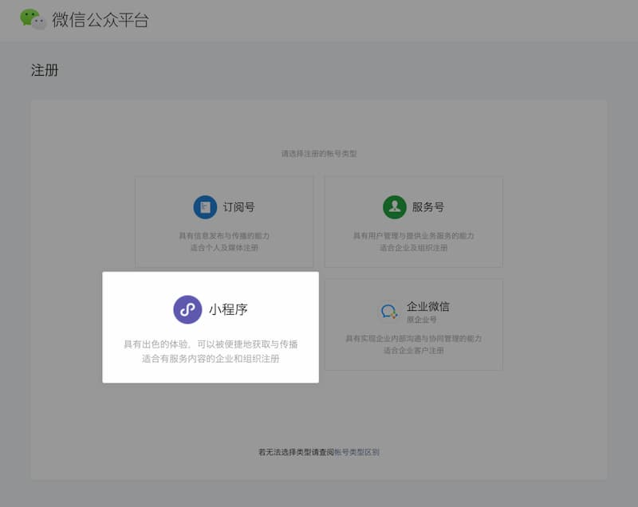
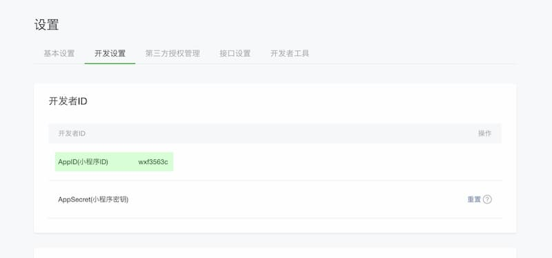
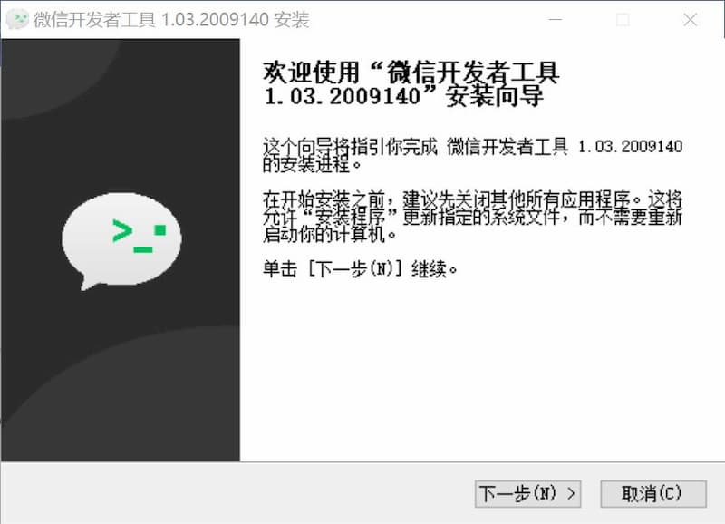
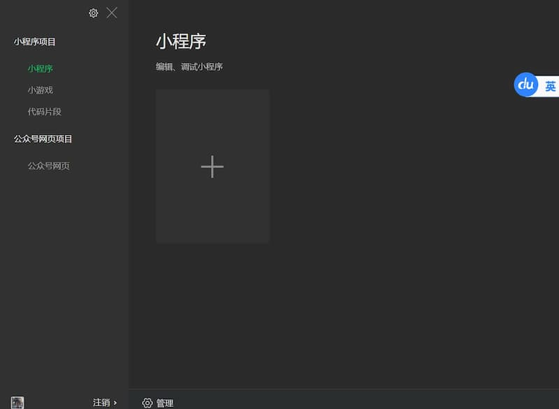
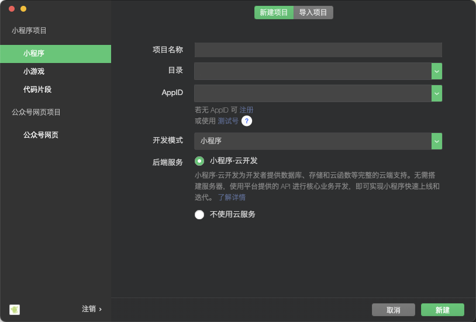
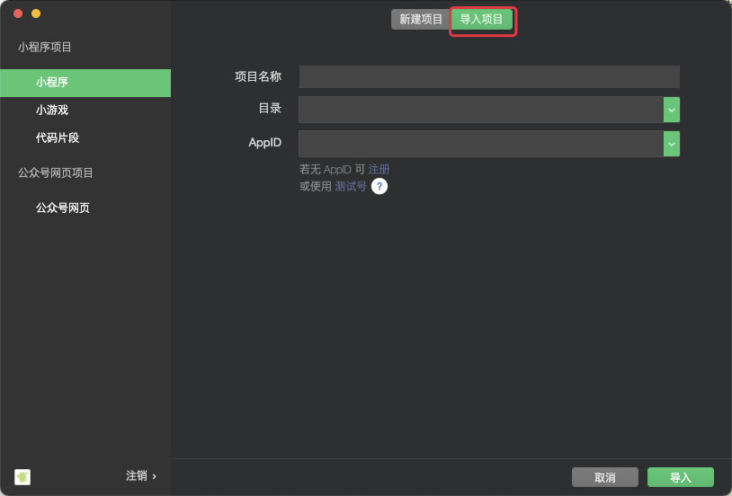
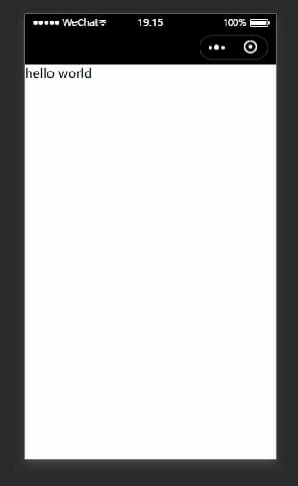
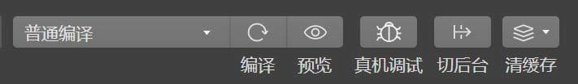
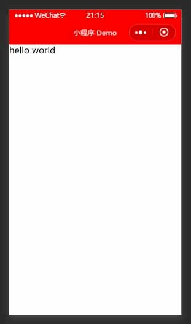
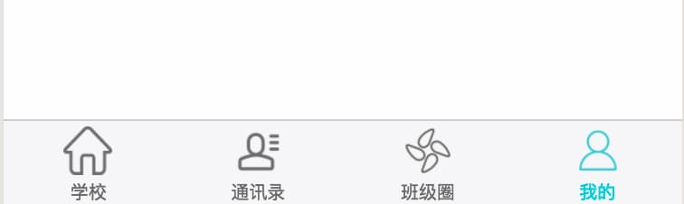

[原文：《微信小程序入门教程之一：初次上手》](http://www.ruanyifeng.com/blog/2020/10/wechat-miniprogram-tutorial-part-one.html)


所有示例的完整代码，都可以从 [GitHub 的代码仓库](https://github.com/ruanyf/wechat-miniprogram-demos) 下载。

## 1.1 小程序是什么？

学习小程序之前，先简单说一下，它到底是什么。

字面上讲，小程序就是微信里面的应用程序，外部代码通过小程序这种形式，在微信这个手机 App 里面运行。

但是，更准确的说法是， **小程序可以视为只能用微信打开和浏览的网站**。 小程序和网页的技术模型是一样的，用到的 `JavaScript` 语言和 `CSS` 样式也是一样的，只是网页的 `HTML` 标签被稍微修改成了 `WXML` 标签。所以，小程序页面本质上就是网页。

小程序的特殊之处在于，虽然是网页，但是它不支持浏览器，所有浏览器的 API 都不能使用，只能用微信提供的 API`。这也是为什么小程序只能用微信打开的原因，因为底层全变了。

## 1.2 小程序的优势

小程序最大的优势，就是它基于微信。

微信 App 的功能（比如拍照、扫描、支付等等），小程序大部分都能使用。微信提供了各种封装好的 API，开发者不用自己实现，也不用考虑 iOS 和安卓的平台差异，只要一行代码就可以调用。

而且，开发者也不用考虑用户的注册和登录，直接使用微信的注册和登录，微信的用户自动成为你的用户。

## 1.3 知识准备

由于小程序基于网页技术，所以学习之前，最好懂一点网页开发。具体来说，下面两方面的知识是必需的。

* `JavaScript` 语言：懂基本语法，会写简单的 JS 脚本程序。

* `CSS` 样式：理解如何使用 CSS 控制网页元素的外观。

此外，虽然 `HTML` 标签和浏览器 API 不是必备知识，但是了解浏览器怎么渲染网页，对于理解小程序模型有很大的帮助。

总的来说，先学网页开发，再学小程序，是比较合理的学习途径，而且网页开发的资料比较多，遇到问题容易查到解决方法。但是，网页开发要学的东西太多，不是短期能掌握的，如果想快速上手，先学小程序，遇到不懂的地方再去查资料，也未尝不可。

## 1.4 开发准备

小程序开发的第一步，是去 [微信公众平台注册](https://mp.weixin.qq.com/)，申请一个 AppID，这是免费的。






申请完成以后，你会得到一个 `AppID（小程序编号`） 和 `AppSecret（小程序密钥）`，后面都会用到。

然后，下载微信提供的 [小程序开发工具](https://developers.weixin.qq.com/miniprogram/dev/devtools/download.html)。这个工具是必需的，因为只有它才能运行和调试小程序源码。

开发者工具支持 Windows 和 MacOS 两个平台。我装的是 Windows （64位）的版本，这个教程的内容也是基于该版本的，但是 MacOS 版本的操作应该是完全一样的。



安装好打开这个软件，会要求你使用微信扫描二维码登录。


登录后，进入新建项目的页面，可以新建不同的项目，默认是新建小程序项目。



点击右侧的 `+` 号，就跳出了新建小程序的页面。



如果直接新建小程序，会生成一个完整的项目脚手架。对于初学者来说，这样反而不利于掌握各个文件的作用。更好的学习方法是，自己从头手写每一行代码，然后切换到 `导入项目` 的选项，将其导入到开发者工具。



导入时，需要给小程序起一个名字，并且填写项目代码所在的目录，以及前面申请的 `AppID`。


## 1.5  hello world 示例

下面，就请大家动手，跟着写一个最简单的小程序，只要五分钟就能完成。

### 1.5.1 创建项目目录

第一步，新建一个小程序的项目目录。名字可以随便起，这里称为 `wechat-miniprogram-demo`。

你可以在资源管理器里面，新建目录。如果熟悉命令行操作，也可以打开 Windows Terminal（没有的话，需要安装），在里面执行下面的命令，新建并进入该目录。

```
> mkdir wechat-miniprogram-demo
> cd wechat-miniprogram-demo
```

### 1.5.2 `app.js`

第二步，在该目录里面，新建一个脚本文件 `app.js`。这个脚本 **用于对整个小程序进行初始化**。

`app.js` 内容只有一行代码。

```js
App({});
```

上面代码中，

* `App()`由小程序原生提供，它是一个函数，**表示新建一个小程序实例**。
* `App()` 的参数是一个配置对象，用于设置小程序实例的行为属性。

这个例子不需要任何配置，所以使用空对象即可。


### 1.5.3 `app.json`

第三步，新建一个配置文件 `app.json`，**记录项目的一些静态配置**。

`app.json` 采用 `JSON` 格式。

> JSON 是基于 JavaScript 语言的一种数据交换格式，只有五条语法规则，非常简单，不熟悉 JSON 的同学可以参考[这篇教程](https://wangdoc.com/javascript/stdlib/json.html#json-%E6%A0%BC%E5%BC%8F)。

`app.json` 文件的内容，至少**必须有一个 `pages` 属性，指明小程序包含哪些页面**。

```json
{
  "pages": [
    "pages/home/home"
  ]
}
```

上面代码中，`pages` 属性是一个数组，数组的每一项就是一个页面。这个示例中，小程序只有一个页面，所以数组只有一项 `pages/home/home`。

`pages/home/home` 是一个三层的文件路径：

* 所有页面都放在 `pages` 子目录里面。
* 每个页面有一个自己的目录，这里是 `pages` 下面的 `home` 子目录，表示这个页面叫做 `home` 。页面的名字可以随便起，只要对应的目录确实存在即可。
* 小程序会加载页面目录 `pages/home` 里面的 `home.js` 文件。**此处的加载路径为 `pages/home/home`, 其中省略了 `.js` 后缀名，这个后缀名必须省略，否则页面加载会异常**。`home.js`这个脚本的文件名也可以随便起，但是习惯上跟页面目录同名。

### 1.5.4 子目录和子脚本

第四步，新建 `pages/home`子目录。

```
$ mkdir -p pages/home
```

然后，在这个目录里面新建一个脚本文件 `home.js` 。该文件的内容如下。

```js
Page({});
```

上面代码中，

* `Page()` 由小程序原生提供，它是一个函数，**用于初始化一个页面实例**。
* 它的参数是一个配置对象，用于**设置当前页面的行为属性**。

这里是一个空对象，表示不设置任何属性。

### 1.5.5 `.wxml`

第五步，在 `pages/home` 目录新建一个 `home.wxml` 文件。`WXML` 是微信页面标签语言，类似于 HTML 语言，用于描述小程序的页面。

`home.wxml`的内容很简单，就写一行 `hello world`。

```wxml
hello world
```

到这一步，就算基本完成了。

现在，打开小程序开发工具，导入项目目录 `wechat-miniprogram-demo`。如果一切正常，就可以在开发者工具里面，看到运行结果了。




点击工具栏的 `预览` 或 `真机调试` 按钮，还可以在你的手机上面，查看真机运行结果。



这个示例的完整代码，可以到[代码仓库查看](https://github.com/ruanyf/wechat-miniprogram-demos/tree/master/demos/01.hello-world)。

## 1.6 `WXML` 标签语言

上一节的 `home.wxml` 文件，只写了最简单的一行 `hello world` 。实际开发中，不会这样写，而是要加上各种标签，以便后面添加样式和效果。

小程序的 `WXML` 语言提供各种页面标签。下面，对 `home.wxml` 改造一下，加上两个最常用的标签。

```xml
<view>
  <text>hello world</text>
</view>
```

上面的代码用到了两个标签：`<view>` 和 `<text>` 。

* `<view>` 标签表示一个区块，用于跟其他区块分隔，类似 HTML 语言的 `<div>` 标签。
* `<text>` 表示一段行内文本，类似于 HTML 语言的 `<span>` 标签，**多个 `<text>` 标签之间不会产生分行**。

注意，**每个标签都是成对使用，需要有闭合标记，即标签名前加斜杠表示闭合**，比如 `<view>` 的闭合标记是 `</view>`。如果缺少闭合标记，小程序编译时会报错。

由于我们还没有为页面添加任何样式，所以页面的渲染效果跟上一节是一样的。后面添加样式时，大家就可以看到标签的巨大作用。

## 1.7 小程序的项目结构

总结一下，这个示例一共有 4 个文件，项目结构如下。

```
|- app.json
|- app.js
|- pages
   |- home
      |- home.wxml
      |- home.js
```

这就是最简单、最基本的小程序结构。所有的小程序项目都是这个结构，在上面不断添加其他内容。

这个结构分成两层：

* 描述整体程序的顶层 app 脚本，
* 以及描述各个页面的 page 脚本。

## 1.8 项目配置文件 `app.json`

顶层的 `app.json` 文件用于整个项目的配置，对于所有页面都有效。

除了前面提到的必需的 `pages` 属性，`app.json` 文件还有一个 [`window` 属性](https://developers.weixin.qq.com/miniprogram/dev/reference/configuration/app.html#window)，用来设置小程序的窗口。`window` 属性的值是一个对象，其中有三个属性很常用。

* `navigationBarBackgroundColor`：导航栏的颜色，默认为 `#000000`（黑色）。
* `navigationBarTextStyle` ：导航栏的文字颜色，只支持 black（黑色）或 white（白色），默认为 white。
* `navigationBarTitleText`：导航栏的文字，默认为空。

下面，改一下前面的 `app.json`，加入 `window` 属性。

```json
{
  "pages": [
    "pages/home/home"
  ],
  "window": {
    "navigationBarBackgroundColor": "#ff0000",
    "navigationBarTextStyle": "white",
    "navigationBarTitleText": "小程序 Demo"     
  }
}
```

上面代码中，`window` 属性设置导航栏的背景颜色为红色（`#ff0000`），文本颜色为白色（white），标题文字为 "小程序 Demo"。

开发者工具导入项目代码，就可以看到导航栏变掉了。



这个示例的完整代码，可以到 [代码仓库](https://github.com/ruanyf/wechat-miniprogram-demos/tree/master/demos/02.app-json) 查看。

除了窗口的样式，很多小程序的顶部或尾部，还有选项栏，可以切换到不同的选项卡。



这个选项栏，也是在 `app.json` 里面设置，使用 [`tabBar` 属性](https://developers.weixin.qq.com/miniprogram/dev/reference/configuration/app.html#tabBar)，这里就不展开了。

如果你看到了结尾，说明真的对小程序开发非常感兴趣。今天就讲到这里，[下一篇教程](http://www.ruanyifeng.com/blog/2020/10/wechat-miniprogram-tutorial-part-two.html)将讲解如何设置基本的页面样式，做出用户界面 UI。

