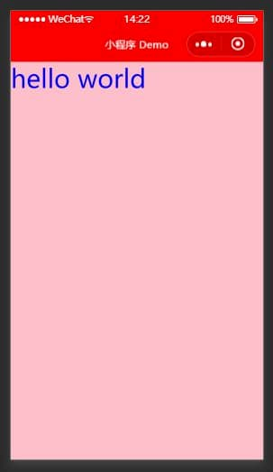
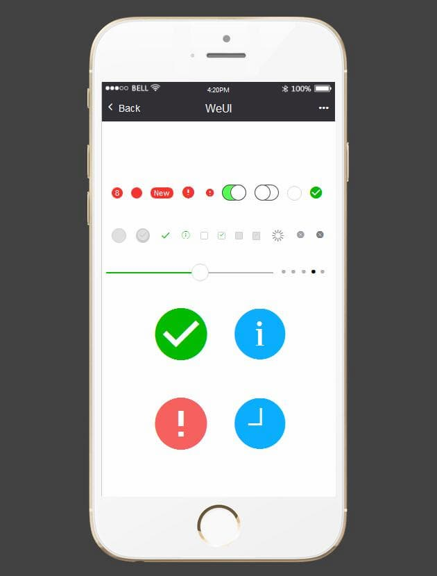
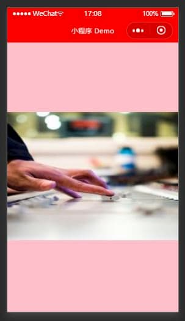

[原文：《微信小程序入门教程之二：页面样式》](http://www.ruanyifeng.com/blog/2020/10/wechat-miniprogram-tutorial-part-two.html)

相关文章：

* [1-初次上手.md](1-初次上手.md)

所有示例的完整代码，都可以从 [GitHub 的代码仓库] (https://github.com/ruanyf/wechat-miniprogram-demos) 下载。

## 2.1 总体样式-`app.wxss`

微信小程序允许在顶层放置一个 `app.wxss` 文件，里面采用 CSS 语法设置页面样式。这个文件的设置，**对所有页面都有效。**

注意，小程序虽然使用 CSS 样式，但是样式文件的后缀名一律要写成 `.wxss`。

打开上一篇教程的示例，在项目顶层新建一个 `app.wxss` 文件，内容如下。

```css
page {
  background-color: pink;
}

text {
  font-size: 24pt;
  color: blue;
}
```

上面代码将整个页面的背景色设为粉红，然后将 `<text>` 标签的字体大小设为 24 磅，字体颜色设为蓝色。

开发者工具导入代码之后，得到了下面的渲染结果。




可以看到，页面的背景色变成粉红，文本字体变大了，字体颜色变成了蓝色。

实际开发中，直接对 `<text>` 标签设置样式，会影响到所有的文本。一般不这样用，而是通过 `class` 属性区分不同类型的文本，然后再对每种 `class` 设置样式。

打开 `pages/home/home.wxml` 文件，把页面代码改成下面这样。

```xml
<view>
  <text class="title">hello world</text>
</view>
```

上面代码中，我们为 `<text>` 标签加上了一个 `class` 属性，值为 `title`。

然后，将顶层的 `app.wxss` 文件改掉，不再直接对 `<text>` 设置样式，改成对 `class` 设置样式。

```css
page {
  background-color: pink;
}

.title {
  font-size: 24pt;
  color: blue;
}
```

上面代码中，样式设置在 `class` 上面（`.title`），这样就可以让不同的 `class` 呈现不同的样式。修改之后，页面的渲染结果并不会有变化。

这个示例的完整代码，可以到 [代码仓库](https://github.com/ruanyf/wechat-miniprogram-demos/tree/master/demos/03.css) 查看。

## 2.2 Flex 布局

各种页面元素的位置关系，称为布局（layout），小程序官方推荐使用 `Flex` 布局。不熟悉这种布局的同学，可以看看的[《Flex 布局教程》](http://www.ruanyifeng.com/blog/2015/07/flex-grammar.html)。

下面演示如何通过 `Flex` 布局，将上面示例的文本放置到页面中央。

首先，在 `pages/home` 目录里面，新建一个 `home.wxss` 文件，这个文件设置的样式，只对 `home `页面生效。这是因为每个页面通常有不一样的布局，所以页面布局一般不写在全局的 `app.wxss` 里面。

然后，`home.wxss`文件写入下面的内容。

```css
page {
  height: 100%;
  width: 750rpx;
  display: flex;
  justify-content: center;
  align-items: center;
}
```

开发者工具导入项目代码，页面渲染结果如下。


下面解释一下上面这段 WXSS 代码，还是很简单的。

* `height: 100%;`：页面高度为整个屏幕高度。

* `width: 750rpx;`：页面宽度为整个屏幕宽度。

**注意**，这里单位是 `rpx`，而不是 `px`。`rpx` 是小程序为适应不同宽度的手机屏幕，而发明的一种长度单位。**不管什么手机屏幕，宽度一律为 `750rpx`**。它的好处是换算简单，如果一个元素的宽度是页面的一半，只要写成 `width: 375rpx` ;即可。

* `display: flex;`：整个页面（page）采用 Flex 布局。

* `justify-content: center;`：页面的一级子元素（这个示例是 `<view>`）水平居中。

* `align-items: center;`：页面的一级子元素（这个示例是 `<view>`）垂直居中。一个元素同时水平居中和垂直中央，就相当于处在页面的中央了。

这个示例的完整代码，可以到 [代码仓库](https://github.com/ruanyf/wechat-miniprogram-demos/tree/master/demos/04.flex)查看。

## 2.3 WeUI

如果页面的所有样式都自己写，还是挺麻烦的，也没有这个必要。腾讯封装了一套 UI 框架 [WeUI](https://github.com/Tencent/weui)，可以拿来用。

手机访问 [weui.io](https://weui.io/)，可以看到这套 UI 框架的效果。



这一节就来看看，怎么使用这个框架的 [小程序版本 WeUI-WXSS](https://github.com/Tencent/weui-wxss/)，为我们的页面加上官方的样式。

首先，进入它的 [GitHub 仓库](https://github.com/Tencent/weui-wxss/)，在 `dist/style` 目录下面，找到 `weui.wxss` 这个文件，将源码全部复制到你的 `app.wxss` 文件的头部。

然后，将 `page/home/home.wxml` 文件改成下面这样。

```xml
<view>
  <button class="weui-btn weui-btn_primary">
    主操作
  </button>
  <button class="weui-btn weui-btn_primary weui-btn_loading">
  	 <!-- 这一行显示正在加载的菊花图 -->
    <i class="weui-loading"></i>
    正在加载
  </button>
  <button class="weui-btn weui-btn_primary weui-btn_disabled">
    禁止点击
  </button>
  <button class="weui-btn weui-btn_default">次要按钮</button>
</view>
```

开发者工具导入项目代码，页面渲染结果如下。


可以看到，加入 `WeUI` 框架以后，只要为按钮添加不同的 `class`，就能自动出现框架提供的样式。你可以根据需要，为页面选择不同的按钮。

这个示例中，`<button>` 元素使用了下面的 `class`。

* `weui-btn`：按钮样式的基类
* `weui-btn_primary`：主按钮的样式。如果是次要按钮，就使用 `weui-btn_default`。
* `weui-btn_loading`：按钮点击后，操作正在进行中的样式。该类内部需要**用 `<i>` 元素表示正在加载的图标**。
* `weui-btn_disabled`：按钮禁止点击的样式。

`WeUI` 提供了大量的元素样式，[完整的清单可以查看这里](https://github.com/Tencent/weui-wxss)。

这个示例的完整代码，可以到 [代码仓库](https://github.com/ruanyf/wechat-miniprogram-demos/tree/master/demos/05.weui)查看。

## 2.4 加入图片

美观的页面不能光有文字，还必须有图片。小程序的 `<image>` 组件就用来加载图片。

打开 `home.wxml` 文件，将其改为如下代码。

```xml
<view>
  <image src="https://picsum.photos/200"></image>
</view>
```

开发者工具加载项目代码，页面的渲染结果如下，可以显示图片了。



`<image>` 组件有 [很多属性](https://developers.weixin.qq.com/miniprogram/dev/component/image.html)，比如可以通过 `style` 属性指定样式。

```xml
<view>
  <image
    src="https://picsum.photos/200"
    style="height: 375rpx; width: 375rpx;"
  ></image>
</view>
```

默认情况下，图片会占满整个容器的宽度（这个例子是 `<view>` 的宽度），上面代码通过 `style` 属性指定图片的高度和宽度（占据页面宽度的一半），渲染结果如下。


当然，图片样式不一定写在 `<image>` 组件里面，也可以写在 `WXSS` 样式文件里面。

这个示例的完整代码，可以到 [代码仓库](https://github.com/ruanyf/wechat-miniprogram-demos/tree/master/demos/06.image)查看。

## 2.5 图片轮播

小程序原生的 [`<swiper>` 组件](https://developers.weixin.qq.com/miniprogram/dev/component/swiper.html)可以提供图片轮播效果。


上面页面的图片上面，有三个提示点，表示一共有三张图片，可以切换显示。

它的代码很简单，只需要改一下 `home.wxml` 文件即可。

```xml
<view>
  <swiper
    indicator-dots="{{true}}"  
    autoplay="{{true}}"
    style="width: 750rpx;">
    <swiper-item>
      <image src="https://picsum.photos/200"></image>
    </swiper-item>
    <swiper-item>
      <image src="https://picsum.photos/250"></image>
    </swiper-item>
    <swiper-item>
      <image src="https://picsum.photos/300"></image>
    </swiper-item>
  </swiper>
</view>
```

上面代码中，`<swiper>` 组件就是轮播组件，里面放置了三个 `<swiper-item>` 组件，表示有三个轮播项目，每个项目就是一个 `<image>` 组件。

`<swiper>` 组件的 `indicator-dots` 属性设置是否显示轮播点，`autoplay` 属性设置是否自动播放轮播。它们的属性值都是一个布尔值，这里要写成 `{{true}}`。

这种**`{{...}}`的语法，表示里面放置的是 JavaScript 代码**，这个放在下一次讲解。

这个示例的[完整代码](https://github.com/ruanyf/wechat-miniprogram-demos/tree/master/demos/07.swiper)，可以到代码仓库查看。

页面样式就讲到这里，[下一篇教程](http://www.ruanyifeng.com/blog/2020/10/wechat-miniprogram-tutorial-part-three.html)讲解怎么在微信小程序里面加入 JavaScript 脚本，跟用户互动。