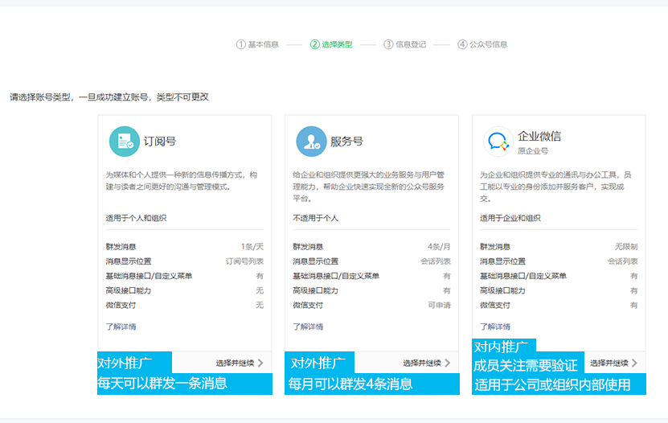
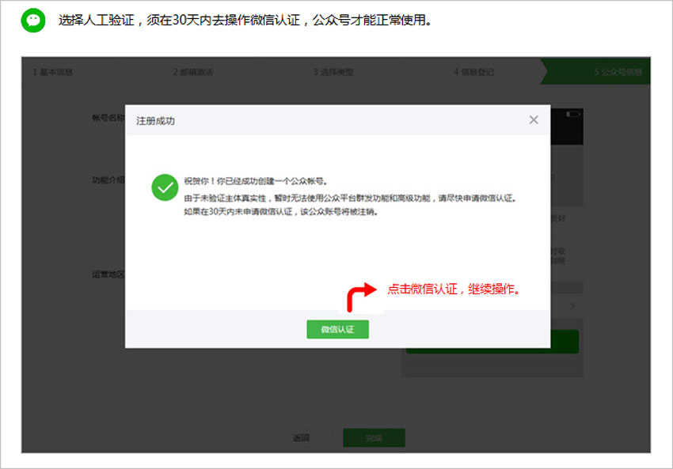

# 1. 005-微信服务号注册

[（企业）注册公众平台步骤](https://kf.qq.com/faq/120911VrYVrA151013MfYvYV.html)

如果想通过公众号主动向用户（公众号粉丝）发送消息，就必须注册并认证为服务号。本文基于注册和认证步骤，介绍过程中所需的资料。

## 1.1. 订阅号服务号的区别

## 1.2. 资料

服务号注册的完整过程包含三部分：注册、主体验证、微信认证。

注册是填写服务号基础信息，完成主体验证后即表示账户注册成功，完成微信认证后账号才成为服务号。

### 1.2.1. 注册

注册过程中所需资料如下：

* 未注册过微信或公众号的邮箱
* 企业基础信息（企业名称、营业执照注册号）
* 管理员信息（管理员姓名、身份证号、手机号）
* 服务号信息（服务号名称、服务号功能介绍）

### 1.2.2. 主体验证

[公众账号注册时主体验证方式区别](https://kf.qq.com/faq/120911VrYVrA150604BJnQn2.html)

注册过程中需要验证账号主体，验证方式有三种：法人验证、支付验证、微信验证。

验证完成后仅是完成了账号注册过程，要想获取服务号的相关能力，还必须进行微信认证（参考：《微信认证》）。

#### 1.2.2.1. 支付验证方式

验证过程所需资料如下：

* 企业对公账号
* 向腾讯指定账号进行小额打款，打款金额在界面中有提示。

10 天内由申请公众号时候填写的主体`对公账户`，向腾讯指定账户打款随机金额，打款验证成功后即完成订阅号注册。`小额打款费用会原路退回`，退回周期大致为 3 到 10 个工作日。

#### 1.2.2.2. 法定代表人验证方式

验证过程所需资料如下：

* 法人姓名
* 法人身份证号
* 使用法人的微信进行扫码（该微信必须已经绑定了法人自己的银行卡）

若将法人设置为服务号的管理员，还需要 `法人手机号`，验证过程中会向该手机号发送验证码。

为了后续方便维护，建议设置非法人为管理员。

设置非法人为管理员时需要提供：

* 管理员姓名、
* 身份证号、
* 手机号，
* 还需要使用该管理员的微信扫码确认。

详细可参考 [企业/个体户类型法定代表人验证方式注册相关说明](https://kf.qq.com/faq/1709296jQFfq170929UjieYf.html)。

#### 1.2.2.3. 微信认证验证方式

微信认证验证方式内部包含了两部分：基础信息验证、微信认证。此处仅描述基础信息验证部分所需资料，微信认证所需资料参考 《微信认证》。

基础信息验证所需资料如下：

企业基础信息：

* 企业名称
* 营业执照注册号

联系人信息：

* 联系人姓名
* 联系人身份证号
* 联系人手机号
* 联系人座机
* 联系人邮箱

详细参考：[什么是微信认证流程？](https://kf.qq.com/faq/120911VrYVrA151013zu63u6.html)

完成上述基础信息的填写之后，会出现如下提示界面：

点击上图中的 `微信认证`，进入认证过程，详见 《微信认证》。

> 支付验证、法人验证、微信验证这三种方式都只是创建了公众账号，要想成为服务号，都必须进行 `微信认证`。

详细可参考：[什么是微信认证流程？](https://kf.qq.com/faq/120911VrYVrA151013zu63u6.html)

### 1.2.3. 微信认证

完成微信认证之后即可成为服务号。认证时所需资料如下：

企业基础信息：

* 企业名称
* 企业营业执照照片（可以是原件照片、扫描件或加盖公章的复印件，大小不超过 10M）
* 统一社会信用代码（必须与营业执照上的注册号或统一社会信用代码一致）

对公账户信息：

* 对公账户开户名
* 开户银行
* 银行账号

过程中还需要验证企业主体，有三种验证方式：

* 对公账户小额打款（向腾讯指定账户打款，打款后10个工作日退回）
* 法人扫脸
* 电子营业执照

联系人信息：

* 姓名
* 电话
* 座机
* 邮箱
* 身份证号
* 还需要使用绑定了联系人银行卡的微信号扫码确认

**除上述资料外，还需要支付 300 元认证费用，且每年都需要支付一次。**

付费之后，审核大约需要 3 个工作日，审核过程中如有问题会联系上面填写的联系人。

详细可参考：[微信认证申请流程（企业类型）](https://kf.qq.com/faq/161220Brem2Q161220uUjERB.html)

## 1.3. 补充

### 1.3.1. 参考资料

* [（企业）注册公众平台步骤](https://kf.qq.com/faq/120911VrYVrA151013MfYvYV.html)
* [腾讯官方文档](https://kf.qq.com/product/weixinmp.html) ，该文档中包含了公众号注册、认证、账号迁移等其他相关问题。

