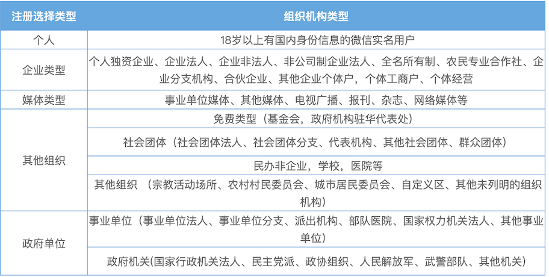
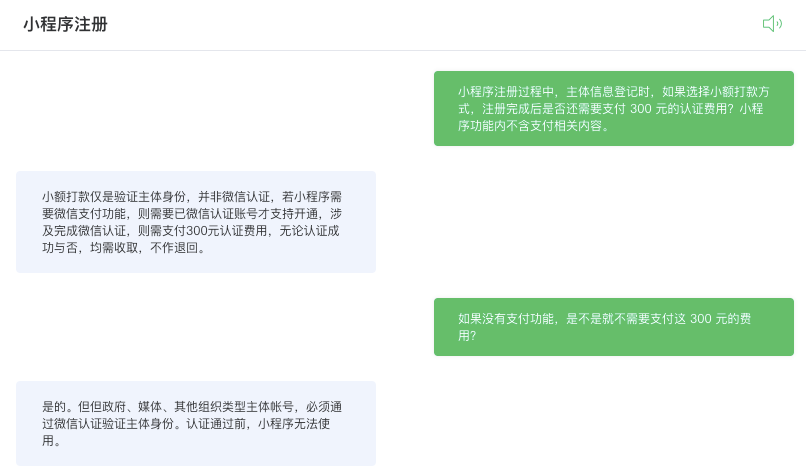

# 1. 小程序注册须知

## 1.1. 注册资料信息

* 注册地址：[mp.weixin.qq.com](mp.weixin.qq.com)

* 准备一个未注册过公众平台、开放平台、企业号、未绑定个人号的邮箱。

* 主体为企业时，需要认证，认证需要营业执照照片、法人基本信息（姓名、身份证号）、联系人信息（姓名、电话、身份证号）
    * [企业认证有两种方式](https://kf.qq.com/faq/170109QvMNRB170109nYnYFr.html)：对公账户认证、企业法人微信扫码认证。
    * 对公账户认证时需要进行小额打款，且打款必须在10个自然日内完成，款项会在10个工作日内原路退回。（如果不需要微信支付相关 API ，不用缴纳额外的 300 元费用。）
    * 企业法人微信扫码认证时必须缴纳 300 元费用，缴纳费用后即可使用微信支付相关的 API。
    * 政府、媒体、其他组织类型帐号，必须通过微信认证（法人微信扫码）验证主体身份。
    * 如果小程序的名称较为正式，则**还需要一张加盖公章的营业执照扫描件照片**。
* 小程序需要访问网络资源时，需要填写网络域名，且域名必须备案。

补充：小程序用户主体有如下类型：

## 1.2. 相关限制

[文档：小程序注册上限和绑定上限](https://kf.qq.com/faq/170109F3MRFj170109eYJ7fi.html)

### 1.2.1. 注册上限

* 同一个邮箱只能申请1个小程序；
* 同一个手机号码可绑定5个小程序；
* 同一身份证注册个人类型小程序数量上限为5个；
* 同一企业、政府、媒体、其他组织资料注册小程序数量上限为50个；
* 同一个体工商户注册小程序数量上限为5个。

### 1.2.2. 绑定上限

* 同一身份证可绑定5个小程序；
* 同一手机号可绑定5个小程序；
* 同一微信号可绑定5个小程序。

温馨提示：

* 主体注册次数不占公众号次数限制；
* 个人类型主体身份证与管理员或项目成员绑定的微信号独立计算（不与其他类型重合）。

### 1.2.3. 关联问题

* 如何查询身份证、手机、微信号、企业绑定的小程序？
查看身份证、手机、微信号、企业绑定的小程序，请关注微信公众号“公众平台安全助手”（mphelper），通过公众号底部菜单“绑定查询”进行查看。

* 如何查询主体绑定的小程序？
登录该主体的任意一个小程序，在“设置-基本信息-主体信息-详情-主体绑定账号-查询”查询该主体绑定的账号信息。

### 1.2.4. 账号迁移

文档：[小程序迁移](https://kf.qq.com/faq/180831vu6bMn1808317R73AV.html)

迁移时也有费用，每迁移一个 300 元费用。

### 1.2.5. 认证的分类

认证分为**主体认证**和**微信认证**：

* 在注册小程序过程中，需要登记主体信息（即所有者信息，可以是企业或个人）。如果主体为企业，需要进行**企业主体认证**。
* 如果小程序内部需要调用微信支付相关的 API , 则必须进行**微信认证**（费用 300￥）。反之，则不需要进行微信认证。

### 1.2.6. 企业主体认证注意事项

完成企业主体认证之后才能编辑小程序基本信息，才能获取AppID 和 AppKey 信息，才能进行开发和发版。

企业主体认证的方式有两种：**对公账户小额打款**和**微信认证**。

* 对公账户小额打款：先填写对公账户信息，然后使用公司对公账户向腾讯指定的账户中打款，打款必须在**10个自然日**内完成。所打款项会在**10个工作日**内原路退回。
* 微信认证：需要使用法人的微信进行扫码验证，并支付 300 元费用，该费用不退。

对公账户小额打款仅是完成了**企业主体认证**；微信认证则同时完成了**企业主体认证**和**微信认证**。

如果小程序涉及微信支付：

* 在做企业主体认证时，如果选择了微信认证则不需要再次缴纳费用；
* 如果选择了小额打款认证，则需要再缴纳 300 元微信认证费用。

综上，如果小程序中有微信支付相关功能，可以优先使用微信认证；否则可优先使用小额打款验证。

### 1.2.7. 与客服对话摘录

> 以下内容来自与小程序注册客服的对话。客服入口在[注册页面](https://mp.weixin.qq.com/wxopen/waregister?action=step1&token=&lang=zh_CN)的右上角——[咨询客服](https://mp.weixin.qq.com/webpoc/customerService?type=22)

* 注册小程序过程中，如果注册方式选择 小额打款 ，是否还需要进行微信认证？
如您这边还需要微信认证功能，例如微信支付接口，就可以发起微信认证缴费300元，这个是无论成功与否都不退回的，不需要可以选择小额打款注册

* 如果仅是小额打款注册的话，是否可以进行正常的开发和体验？
不涉及微信认证特权功能都可以正常开发使用的

* 特权功能有哪些？
1、已认证的小程序账号可申请微信支付功能；
2、已认证的小程序可绑定最多20个开发者，未认证小程序可绑定最多10个开发者。
具体可以参考开发指南：https://developers.weixin.qq.com/miniprogram/dev/framework/ 

* 企业申请多个小程序时每个都要缴纳费用么？
注册无需收费，但需根据你选择的主体类型，若后续涉及完成微信认证，则需支付300元认证费用，无论认证成功与否，均需收取，不作退回。

* 每认证一个就要缴纳一次费用？
是的，涉及微信认证，就需要缴费注册哈

* 每个企业 50 个小程序的限制是包含未认证和已认证的么？还是仅包含已认证的？
都包含在内，注册成功的都算绑定一个名额

* 不认证的有哪些功能会受限？
不认证的小程序无法使用微信认证的特权功能，例如：1、已认证的小程序账号可申请微信支付功能；2、已认证的小程序可绑定最多20个开发者，未认证小程序可绑定最多10个开发者。

* 小程序内部配置的服务器域名不属于当前企业会有影响么？
域名必须要经过备案才支持设置成为小程序域名的，在设置业务域名和服务器域名不要求主体一致，但在设置类目环节域名备案需与小程序注册主体一致，详情参考文档：https://developers.weixin.qq.com/miniprogram/dev/framework/ability/network.html#1.%20%E6%9C%8D%E5%8A%A1%E5%99%A8%E5%9F%9F%E5%90%8D%E9%85%8D%E7%BD%AE
具体可以参考开发文档：https://developers.weixin.qq.com/miniprogram/dev/framework/

* 设置类目在哪里来着？
登陆【微信公众平台】-【小程序类目】

* 设置类目环节的域名备案是必填的么?
涉及需要的类目资质要求是域名备案，就必须要提交申请

* 有哪些类目需要资质?
不同的类目要求不一样，可以参考[小程序开放类目](https://developers.weixin.qq.com/miniprogram/product/material/)