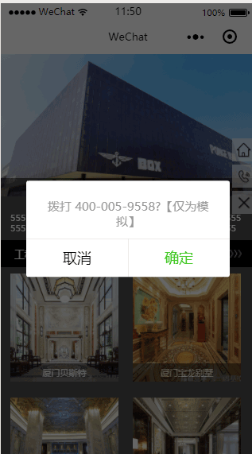

# 1. 2-一键拨号

1. 在.wxml文件中绑定拨号事件

```xml
<button type="default" bindtap="calling">拨打电话</button>
```

2. 在.js文件中加入逻辑代码

```js
calling: function () {
  wx.makePhoneCall({
    phoneNumber: '***************',
    success: function () {
      console.log("拨打电话成功！")
    },
    fail: function () {
      console.log("拨打电话失败！")
    }
  })
}
```

