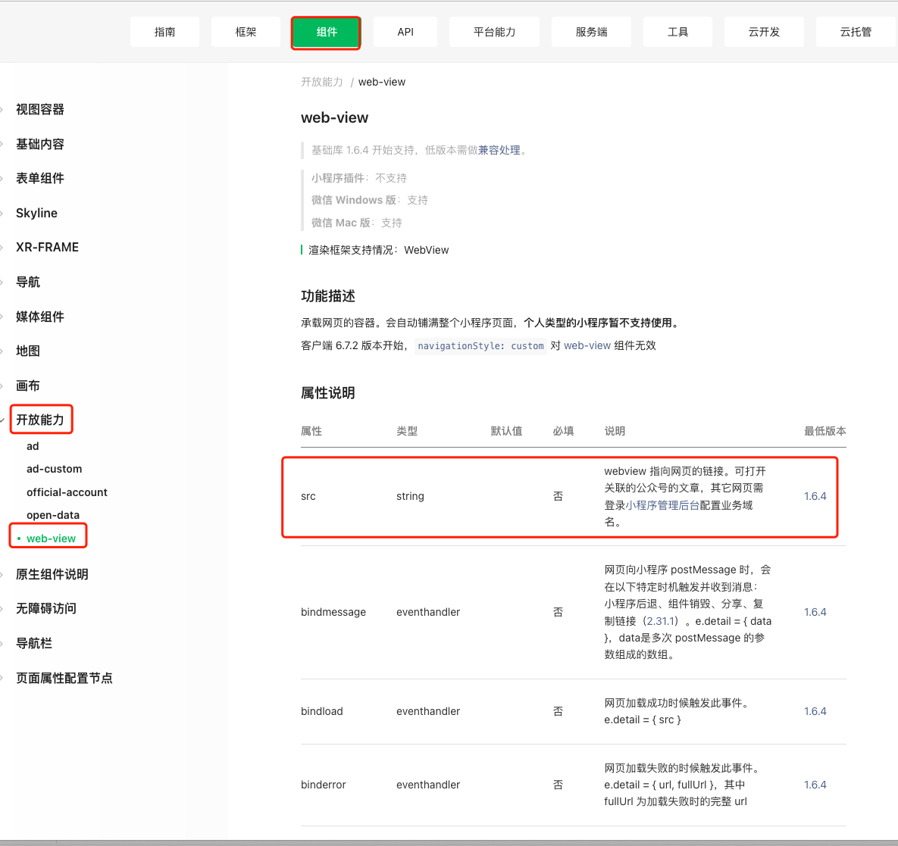
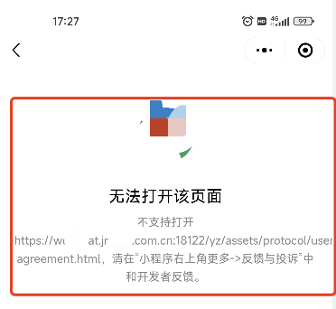
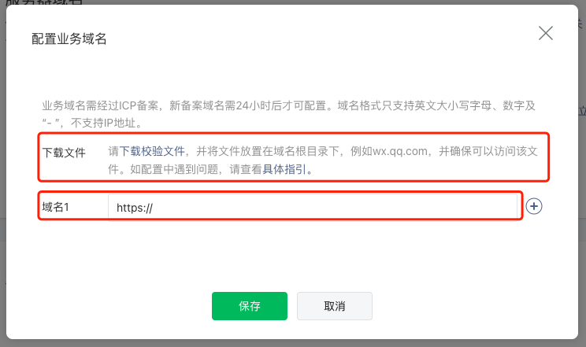

# 1. 012-使用WebView加载外部页面


小程序内可以使用 WebView 加载外部 html 页面，



示例如下：

```js
<WebView src={baseUrl+'/yz/assets/protocol/user-agreement.html'}  /> 
```

但需要注意，如果

* 页面是公众号的页面，可以直接打开。
* 页面非公众号的页面，需要配置业务域名
    * 管理后台-开发-开发管理-开发设置-业务域名

在加载非公众号的外部 Web 页面时，如果么有配置业务域名，会出现如下错误提示：



配置方式如下：





