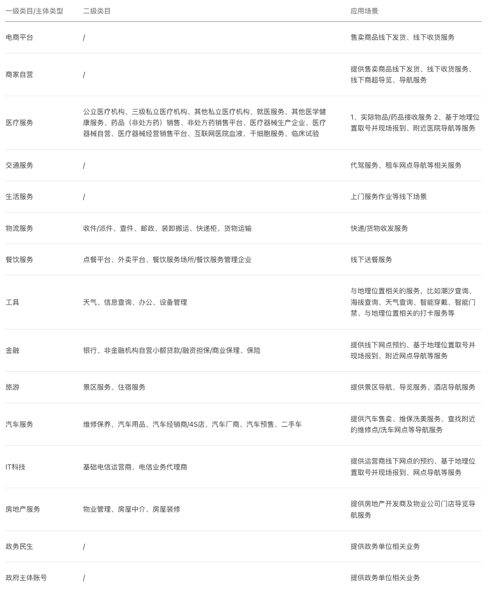
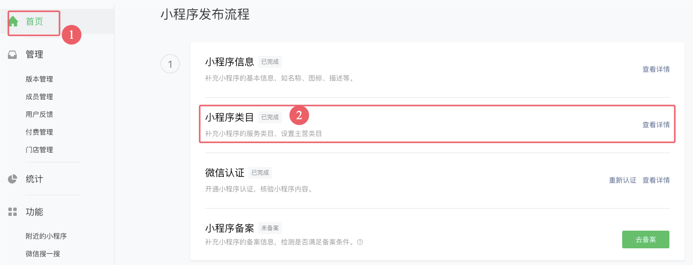
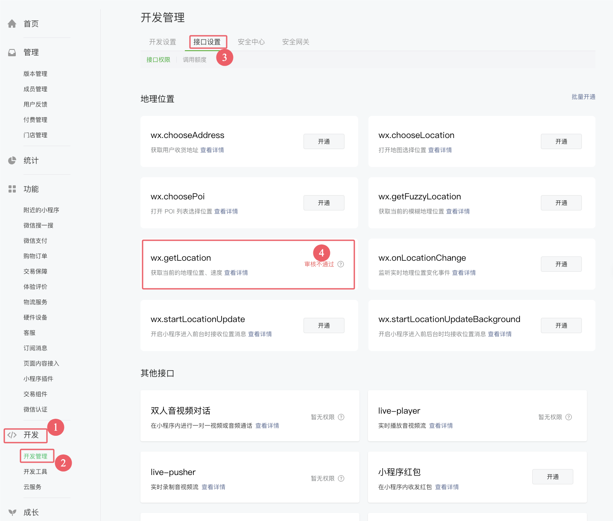

# 1. 013-实现地理位置定位

[官方文档：wx.getLocation(Object object)](https://developers.weixin.qq.com/miniprogram/dev/api/location/wx.getLocation.html)

## 1.1. 对接概述

实现地理位置定位时大致需要如下步骤：

* 在小程序管理后台配置类目
* 在小程序管理后台开通定位功能（需要审核）
* 在 `app.json` 中声明权限
* 代码中检查定位权限并获取定位

> 注意：本文仅获取地理坐标，并未基于坐标进一步获取可读的位置信息（即逆地址解析）。如果需要转换可以参考：[《官方：微信小程序JavaScript SDK——逆地址解析》](https://lbs.qq.com/miniProgram/jsSdk/jsSdkGuide/methodReverseGeocoder) 和 [《微信开放社区-微信小程序定位授权，获取经纬度并转换为实际地址》](https://developers.weixin.qq.com/community/develop/article/doc/00086aefe74ec07fdc3be754150013)


## 1.2. 配置类目

按照官方文档说明，并非所有小程序都可以申请地理定位，允许申请定位权限的小程序类目如下：

注意：可以申请地理位置的类目如下：



在后台管理系统中结合实际情况配置类目：




## 1.3. 开通定位功能

在小程序管理平台中开通定位功能（开通时按照官方提示的格式填写申请原因，并提交功能截图。应该是机审，提交后两三分钟内就有结果；被拒后可以重新提审）：



## 1.4. 声明权限

在 `app.json` 中声明权限. （ Taro 项目在 `app.config.ts` 文件中声明）：

```json
  "permission": {
    "scope.userLocation": {
      "desc": "您的位置信息将用于提供低碳打卡"
    }
  }
```

## 1.5. 请求权限并获取定位


```ts
  // 检查用户是否已经授权位置信息
  const checkLoactionSetting = () => {
    Taro.getSetting({
      success(res) {
        if (!res.authSetting['scope.userLocation']) {
          // 用户没有授权位置信息，需要引导用户开启
          Taro.authorize({
            scope: 'scope.userLocation',
            success() {
              onLocationAllowed()
            },
            fail() {
              onLocationRefused()
            }
          })
        } else {
          // 已有授权，直接调用获取位置信息
          onLocationAllowed(cfgID)
        }
      }
    })
  }

  // 定位权限被拒绝了，引导用户进入设置界面打开位置权限
  const onLocationRefused = () => {
    Taro.showModal({
      title: '提示',
      content: '需要获取您的位置信息才能完成低碳打卡，请在设置中开启位置权限。',
      showCancel: false,
      confirmText: '去开启',
      success: function (res) {
        if (res.confirm) {
          Taro.openSetting({
            success: (res) => {
              if (res.authSetting["scope.userLocation"]) {
                console.log('用户重新开启了位置权限！')
              } else {
                console.log('用户未开启位置权限！')
              }
            }
          })
        }
      }
    })
  }

  // 用户允许访问定位
  const onLocationAllowed = () => {
    // 用户已授权，可以调用获取位置信息
    Taro.getLocation({
      type: 'wgs84', // 默认为wgs84的gps坐标，如果要返回直接给openLocation用的火星坐标，可传入'gcj02'
      success: function (res) {
        const latitude = res.latitude; // 纬度
        const longitude = res.longitude; // 经度
        // 成功获取到坐标了
        // TODO 执行后续操作
      },
      fail: function () {
        // 获取位置失败的回调
        showToast({ title: "打卡失败-获取位置信息失败！", icon: "error" })
      }
    });
  }
```
