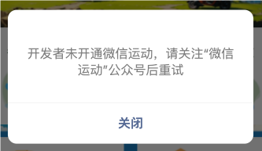
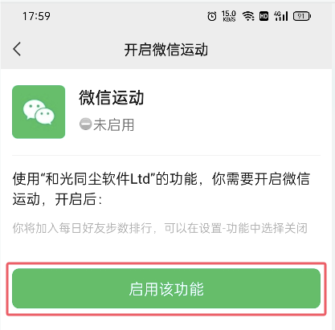

# 1. 014-获取微信运动步数

官方文档：[开放接口/微信运动/wx.getWeRunData(Object object)](https://developers.weixin.qq.com/miniprogram/dev/api/open-api/werun/wx.getWeRunData.html)

获取用户过去三十一天微信运动步数。需要先调用 [wx.login](https://developers.weixin.qq.com/miniprogram/dev/api/open-api/login/wx.login.html) 接口。步数信息会在用户主动进入小程序时更新。

## 1.1. 对接概述

* 用户通过  [wx.login](https://developers.weixin.qq.com/miniprogram/dev/api/open-api/login/wx.login.html)  触发微信一键登录
    * 我们的`wxpush` 服务中已经对接过微信一键登录了，所以此处省略服务端对接一键登录的逻辑。
* 请求用户允许微信运动权限
* 调用 `wx.getWeRunData` 获取加密数据及向量
* 调用自己的服务器解析加密数据


## 1.2. 用户登录

小程序端触发 `wx.login()` 后获取到 `code`, 然后携带 `code` 请求业务服务端接口，该接口内部触发腾讯官方的一键登录接口并获取响应数据。

在响应数据中，`openID` 和 `unionID` 可以作为用户在微信系统中的唯一标识；`sessionKey` 可以用于微信加密数据的解密——微信运动步数的解密就需要该字段。

每次触发微信一键登录都会得到 `sessionKey` ，按官方说明 `sessionKey` 不定期更新，所以，用户一键登录成功之后，我们需要在数据库中存储或更新该字段。（可参考 《碳小宝》服务端 `customer_login.go/getCustomerByWechat()` 中的处理）

### 1.2.1. 小程序端

以《碳小宝》中的代码为例：

```ts
export async function refreshToken(): Promise<any> {
  return new Promise(async (resolve) => {
    // 1、触发 login, 获取 code
    const res = await Taro.login()
    if (res.errMsg === 'login:ok') {
      const params = {
        code: res.code,
        app_id: '这里填写小程序的 appID',
        promotion_code: Taro.getStorageSync('fromPromotionCode')
      }

      // 2、调用业务服务端的登录接口，（该接口内部触发腾讯官方的 /sns/jscode2session 接口实现微信一键登录，并返回用户信息 ）
      request({ url: '/mall/api/v1/customer-login/wechat/miniprogram', method: 'POST', data:params }, true)
        .then((resu) => {
          console.log('resu', resu)
          if (resu?.data && resu?.data?.expiry&&moment(resu.data.expiry).unix() > Date.now() / 1000) {
            resolve(resu.data)
          } else {
            resolve(null)
          }
        })
        .then(() => {
          resolve(null)
        })
    }
  })
}
```

### 1.2.2. 服务端

摘自《碳小宝》服务端 `customer_login.go` 文件：

* 获取微信一键登录的响应数据（含 `openID`、`sessionKey`）等信息。

```go
// wechatLoginUseMiniprogram 获取微信小程序录id
func (a *CustomerLoginService) wechatLoginUseMiniprogram(ctx context.Context, req *schema.CustomerLoginWechatReq) (*wxpush.WxLoginRes, error) {
    appid, err := a.getMiniProgramAppID()
    if err != nil {
        return nil, err
    }

    req.AppID = appid
    res, err := a.wxpush.LoginMiniProgram(ctx, appid, req.Code)
    if err != nil {
        return nil, errors.ErrInternalServer("微信登录失败", err)
    }
    if res.OpenID == "" {
        return nil, errors.ErrBadRequest("微信登录失败, 未获取openID")
    }
    return res, nil
}
```

* 调用 `wxpush` 服务中暴露的接口，实现微信一键登录。（`wxpush` 服务中集成了微信一键登录、小程序推送、服务号推送等相关内容。）


```go
// LoginMiniProgram 小程序用户登录
func (a *WechatMsgTemplateManager) LoginMiniProgram(ctx context.Context, appid, code string) (*WxLoginRes, error) {
	u, err := url.Parse(a.wxpushAgent + wxpushLoginAPIMiniprogram)
	if err != nil {
		return nil, fmt.Errorf("解析请求地址发生错误: %w", err)
	}
	q := u.Query()
	q.Set("appid", appid)
	q.Set("code", code)
	u.RawQuery = q.Encode()
	req, err := http.NewRequestWithContext(ctx, http.MethodPost, u.String(), nil)
	if err != nil {
		return nil, fmt.Errorf("创建请求发生错误: %w", err)
	}
	c := a.httpClient
	if c == nil {
		c = http.DefaultClient
	}
	resp, err := c.Do(req)
	if err != nil {
		return nil, fmt.Errorf("请求发生错误: %w", err)
	}
	defer resp.Body.Close()
	b, err := io.ReadAll(resp.Body)
	if err != nil {
		return nil, fmt.Errorf("读取响应内容发生错误: %w", err)
	}
	if resp.StatusCode != http.StatusOK {
		return nil, fmt.Errorf("响应错误: %s", b)
	}
	var result WxLoginRes
	if err := json.Unmarshal(b, &result); err != nil {
		return nil, fmt.Errorf("解析响应内容发生错误: %w", err)
	}
	return &result, nil
}
```


## 1.3. 请求权限

小程序端添加如下代码：

```ts
// 检查微信运动的设置
  const checkWxRunSetting = () => {
    Taro.authorize({
      scope: 'scope.werun',
      success() {
        // 用户已授权，可以获取步数
        onWxRunAllowed();
      },
      fail() {
        // 用户拒绝授权，可以提示用户需要授权才能使用相关功能
        onWxRunRefused();
      }
    })
  }

  // 获取微信运动步数的权限被拒绝了
  const onWxRunRefused = () => {
    Taro.showModal({
      title: '授权提示',
      content: '需要您授权访问微信运动数据以便记录步数。',
      showCancel: false,
      confirmText: '去授权',
      success: function (res) {
        if (res.confirm) {
          Taro.openSetting({
            success: (res) => {
              if (res.authSetting["scope.werun"]) {
                // 用户重新开启了权限，可以获取步数
                onWxRunAllowed();
              }
            }
          })
        }
      }
    })
  }
```

## 1.4. 获取加密数据及向量


小程序端添加如下代码：

```ts
  // 获取微信运动步数的权限被允许了
  const onWxRunAllowed = () => {
    Taro.getWeRunData({
      success: (res) => {
        const { encryptedData, iv } = res;
        console.log("发送数据到服务端进行解密：", encryptedData, iv)
        // 这里需要将encryptedData和iv发送到自己的服务器进行解密，因为微信小程序内不能直接解密
        // sendToServerForDecryption(encryptedData, iv);
      },
      fail() {
        console.log('获取微信运动步数失败');
      }
    });
  }
```

## 1.5. 服务端解密

服务端数据解密包含两部分：

* 数据解密
* 筛选今日的运动步数


### 1.5.1. 数据解密

注意下列代码中，

* `appID` 是小程序的 appID, 
* `sessionKey` 是用户通过微信的 `wx.login()` 登录时得到的返回数据，
* `encryptedData`、`iv` 是 ` wx.getWeRunData` 得到的数据


```go
package wx

import (
    "crypto/aes"
    "crypto/cipher"
    "encoding/base64"
    "encoding/json"
    "fmt"
)

// WXBizDataDecrypt 微信业务数据解密
type WXBizDataDecrypt struct {
    appid      string
    sessionKey string
}

// NewWXBizDataCrypt 微信业务数据解密
func NewWXBizDataCrypt(appid, sessionKey string) *WXBizDataDecrypt {
    return &WXBizDataDecrypt{appid: appid, sessionKey: sessionKey}
}

// DecryptData 对加密数据进行解密
func (w *WXBizDataDecrypt) DecryptData(encryptedData, iv string) (string, error) {
    const (
        IllegalAesKey = -41001 // encodingAesKey 非法
        IllegalIv     = -41002
        IllegalBuffer = -41003 // aes 解密失败
        OK            = 0
    )

    if len(w.sessionKey) != 24 {
        return "", fmt.Errorf("Error: %d", IllegalAesKey)
    }
    aesKey, err := base64.StdEncoding.DecodeString(w.sessionKey)
    if err != nil {
        return "", err
    }

    if len(iv) != 24 {
        return "", fmt.Errorf("Error: %d", IllegalIv)
    }
    aesIV, err := base64.StdEncoding.DecodeString(iv)
    if err != nil {
        return "", err
    }

    aesCipher, err := base64.StdEncoding.DecodeString(encryptedData)
    if err != nil {
        return "", err
    }

    block, err := aes.NewCipher(aesKey)
    if err != nil {
        return "", err
    }

    mode := cipher.NewCBCDecrypter(block, aesIV)
    decrypted := make([]byte, len(aesCipher))
    mode.CryptBlocks(decrypted, aesCipher)

    // PKCS7UnPadding
    decrypted = pkcs7UnPadding(decrypted)
    result := string(decrypted)

    return result, nil
}

// PKCS7UnPadding 解填充
func pkcs7UnPadding(origData []byte) []byte {
    length := len(origData)
    unpadding := int(origData[length-1])
    return origData[:length-unpadding]
}

// UnmarshalData 是一个泛型函数，用于解码JSON数据到任意类型T，T需要实现json.Unmarshaler接口
func UnmarshalData[T any](dataStr string) (T, error) {
    var dataObj T
    err := json.Unmarshal([]byte(dataStr), &dataObj)
    if err != nil {
        return dataObj, fmt.Errorf("Error: 解码JSON数据失败, %v", err)
    }
    return dataObj, nil
}
```

用于解密的结构体：

```go
// RpUserWxSportDecryptedDatas 解密后的数据s
// {
//  "stepInfoList": [
//    {
//      "timestamp": 1445866601,
//      "step": 100
//    },
//    {
//      "timestamp": 1445876601,
//      "step": 120
//    }
//  ]
// }
type RpUserWxSportDecryptedDatas struct {
    StepInfoList []RpUserWxSportDecryptedData `json:"stepInfoList"`
}

// RpUserWxSportDecryptedData 解密后的数据格式
type RpUserWxSportDecryptedData struct {
    // 时间戳。如："timestamp": 1445876601,
    Timestamp int64 `json:"timestamp"`
    // 步数。如："step": 100
    Step int64 `json:"step"`
}
```

### 1.5.2. 筛选今日数据


```go
// 解析步数数据，返回今日运动步数（如果步数为0，直接给出错误提示）
func (a *RewardPointUserWxSportExchangeService) decryptSteps(sessionKey string, encryptedData string, iv string) (int64, error) {
    appID, err := a.getMiniProgramAppID()
    if err != nil {
        return 0, errors.ErrInternalServer("出错了(获取小程序appid出错)")
    }

    // 得到解析后的json字符串数据
    decryptData, err := wx.NewWXBizDataCrypt(appID, sessionKey).DecryptData(encryptedData, iv)
    if err != nil {
        return 0, errors.ErrInternalServer("出错了(解析数据出错)", err)
    }
    // zap.S().Infof("解析得到的微信数据: %s", decryptData)

    // 转换为结构体
    dataObj, err := wx.UnmarshalData[schema.RpUserWxSportDecryptedDatas](decryptData)
    if err != nil {
        return 0, errors.ErrInternalServer("出错了(解析数据出错-json转结构体出错)", err)
    }
    if len(dataObj.StepInfoList) == 0 {
        return 0, errors.ErrBadRequest("暂无运动数据")
    }

    // 筛选出今日的运动步数
    var todayData schema.RpUserWxSportDecryptedData
    for _, data := range dataObj.StepInfoList {
        if a.checkIsToday(data.Timestamp) {
            todayData = data
        }
    }
    if todayData.Step == 0 {
        return 0, errors.ErrBadRequest("今日暂无运动数据")
    }
    return todayData.Step, nil
}
```


```go
// 判断给定的时间戳是不是属于今天
func (a *RewardPointUserWxSportExchangeService) checkIsToday(timeStamp int64) bool {
    // 将时间戳转换为time.Time对象
    t := time.Unix(timeStamp, 0)
    now := time.Now
    // 判断给定时间戳是否为今天
    return t.Year() == now().Year() && t.Month() == now().Month() && t.Day() == now().Day()

    // isToday := t.Truncate(24 * time.Hour).Equal(time.Now().UTC().Truncate(24 * time.Hour))
    // return isToday
}
```


```go
// 从本地配置文件中读取配置的 appid 
func (a *RewardPointUserWxSportExchangeService) getMiniProgramAppID() (string, error) {
    miniProgramAppID := viper.GetString("wechat.customer.miniprogram.appid")
    if miniProgramAppID == "" {
        return "", errors.ErrInternalServer("找不到小程序的参数")
    }
    return miniProgramAppID, nil
}

```


## 1.6. 问题解决

### 1.6.1. 启用微信运动

在微信开发者工具中，使用模拟器获取微信运动信息时可能会出现如下弹窗：



这是因为微信开发者工具登录的微信账号未开通微信运动功能。

此时，使用 `真机调试` 功能在真机上运行该小程序，再次触发获取步数信息的操作，小程序会自动打开如下界面：



点击上图中的 `启用该功能` 即可获取到加密数据和用于解密的向量。


