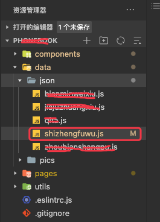
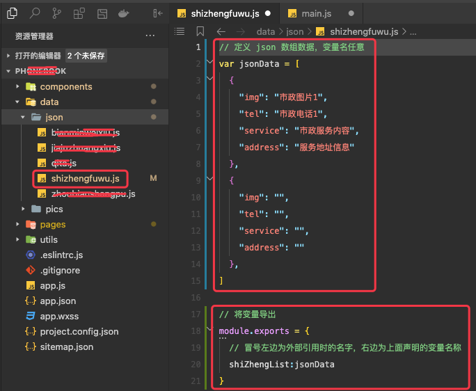
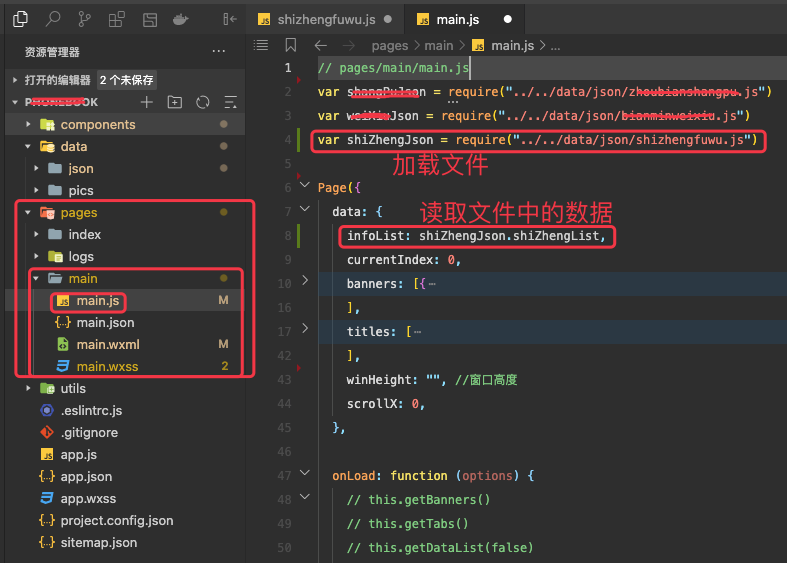
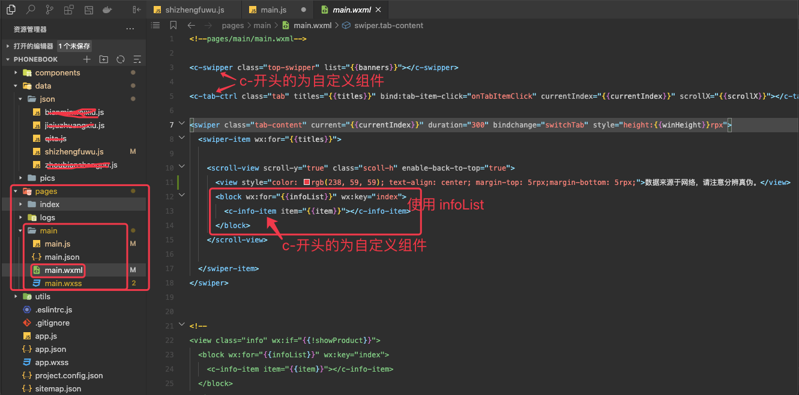

# 1. 7-加载本地json文件中的数据

将项目本地文件中的 json 数据加载到小程序的页面中进行呈现。步骤如下：

## 1.1. 新建目录及json数据

在项目根目录下新建 `data/json` 目录，专门用于存储 json 数据:

在 `data/json` 目录下新建 `xxx.js` 文件，注意此处的文件后缀名必须为：`.js`，因为需要在该文件中使用 `module.exports`:

## 1.2. 加载文件并读取数据

### 1.2.1. 页面的 js 文件中解析数据

📢  注意：

* **在加载文件时，`require(path)` 中的路径必须是相对于当前文件的相对路径。**
* 路径末尾的 `.js` 不加也可以，但建议加上

上述截图中，加载了文件，并读取其中的 json 数组数据赋值给了 infoList，接下来我们就可以直接在页面中使用了。

### 1.2.2. 页面 wxml 中使用数据

