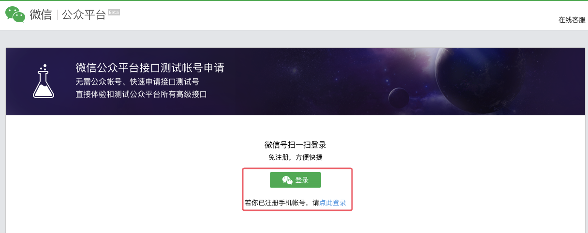
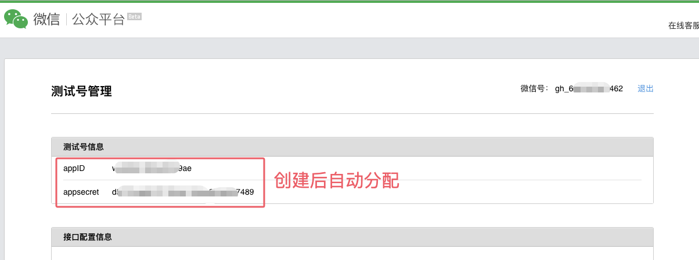
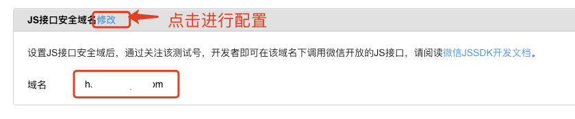
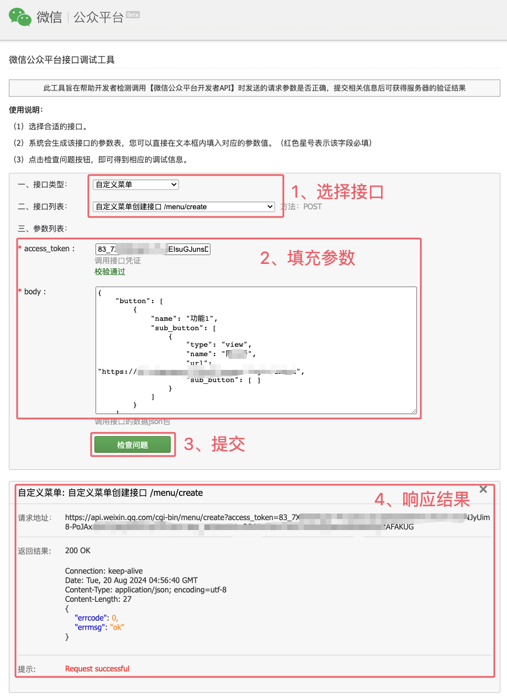
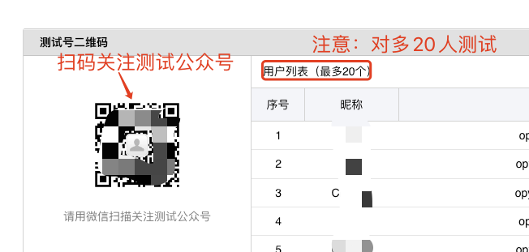
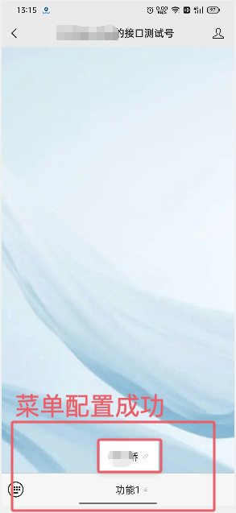

# 1. 002-为测试公众号配置菜单

在对公众号进行开发过程中，部分功能仅针对企业账号或者已经认证过的企业账号开放，如果不方便进行企业认证，则可以申请测试公众号进行测试，测试完成上线时再替换为正式的账号信息。

## 1.1. 创建测试公众号

点击进入 [创建测试号](https://mp.weixin.qq.com/debug/cgi-bin/sandboxinfo?action=showinfo&t=sandbox/index) 页面，然后扫码创建测试号。






## 1.2. 配置JS安全域名

> 注意：如果 H5 功能中没有访问微信的 JSSDK 接口，此处可以不配置。

此处配置的 JS 安全域名即 H5 页面访问域名。




## 1.3. 获取 access_token 

按照 [官方文档：获取 Access token](https://developers.weixin.qq.com/doc/offiaccount/Basic_Information/Get_access_token.html) 中的说明，我们直接在浏览器中访问如下地址即可获取 `access_token`:

```
https://api.weixin.qq.com/cgi-bin/token?grant_type=client_credential&appid=APPID&secret=APPSECRET
```

注意，需要将上面地址中的 APPID 和  APPSECRET 替换为测试公众号中的  APPID 和 APPSECRET。

获取到 token 后拷贝下来备用。

## 1.4. 配置测试公众号菜单

### 1.4.1. 准备菜单参数

按照 [官方文档：自定义菜单 /创建接口](https://developers.weixin.qq.com/doc/offiaccount/Custom_Menus/Creating_Custom-Defined_Menu.html) 中的描述，组织请求体备用。示例如下：

```json
{
    "button": [
        {
            "name": "功能1",
            "sub_button": [
                {
                    "type": "view",
                    "name": "测试功能1",
                    "url": "测试功能的访问地址",
                    "sub_button": []
                }
            ]
        }
    ]
}
```

### 1.4.2. 配置菜单

点击进入 [微信公众平台接口调试工具](https://mp.weixin.qq.com/debug/) 页面，按下图选择并填写请求参数，完成后点击 `检查问题` 提交：



出现上图 4 处的结果即表示添加成功。

## 1.5. 手机端验证



点击菜单进入待测试功能：




