# 1. 001-公众号网页中获取定位并逆解析为可读地址


项目是基于 Taro+React+Ts 实现，最终将编译为 H5 ，并作为公众号中的菜单进行使用。服务端基于 golang 实现。


## 1.1. 确认开通了地理位置权限

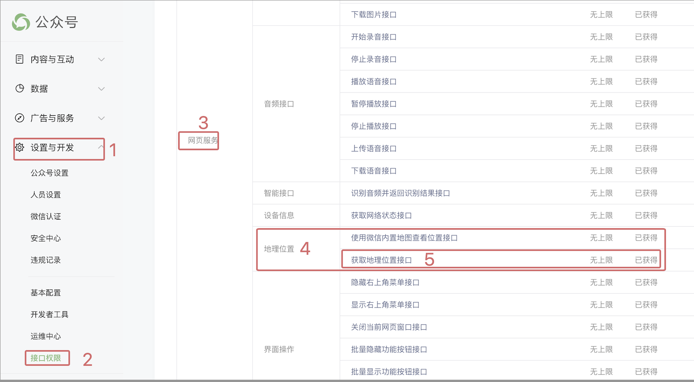


## 1.2. 配置安全域名

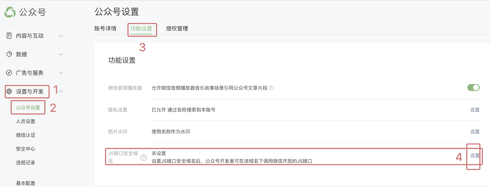

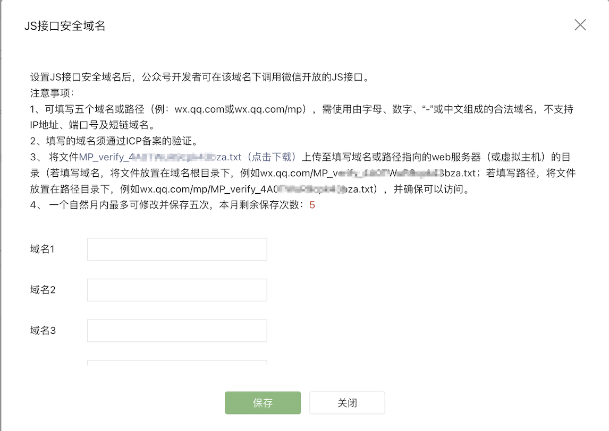

## 1.3. H5端导入 jsdk

在开发内置于微信公众号的 H5 页面时，通常你需要在页面加载时引入微信 JSSDK (`jweixin-1.2.0.js`)。对于使用 Taro + TypeScript + React 的项目，你可以将引入 JSSDK 的代码放在项目的公共头部文件中，或者直接在需要使用 JSSDK 的页面中引入。


### 1.3.1. 方案 1: 在公共头部文件中引入

如果你的应用中有全局的头部文件，比如 `_app.tsx` 或者 `index.html`，可以考虑将 JSSDK 的引入放在那里。

注意：**以下两个只配置一项即可，不需要同时配置。**

#### 1.3.1.1. 在 `index.html` 中引入

> 实际项目中使用了该方案，实测可用。

```html
   <!DOCTYPE html>
   <html lang="en">
   <head>
     <meta charset="UTF-8">
     <meta name="viewport" content="width=device-width, initial-scale=1.0">
     <title>Document</title>
     <!-- 引入微信 JSSDK -->
     <script src="https://res.wx.qq.com/open/js/jweixin-1.2.0.js"></script>
   </head>
   <body>
     <div id="root"></div>
   </body>
   </html>
```


#### 1.3.1.2. 在 `_app.tsx` 文件中引入：

> 未测试。

如果使用的是 Next.js 或其他类似的框架，可以在 `_app.tsx` 文件中引入 JSSDK。

```tsx
   import React from 'react';
   import App from 'next/app';
   import Head from 'next/head';

   export default class MyApp extends App {
     componentDidMount() {
       // 引入微信 JSSDK
       const script = document.createElement('script');
       script.src = 'https://res.wx.qq.com/open/js/jweixin-1.2.0.js';
       script.async = true;
       document.head.appendChild(script);
     }

     render() {
       const { Component, pageProps } = this.props;
       return (
         <>
           <Head>
             <title>My App</title>
           </Head>
           <Component {...pageProps} />
         </>
       );
     }
   }
```

### 1.3.2. 方案 2: 在需要使用 JSSDK 的页面中引入

> 未测试。

如果 JSSDK 只在特定的页面中使用，你可以考虑直接在该页面的组件中引入。

```tsx
   import React, { useEffect } from 'react';

   const MyPage: React.FC = () => {
     useEffect(() => {
       // 引入微信 JSSDK
       const script = document.createElement('script');
       script.src = 'https://res.wx.qq.com/open/js/jweixin-1.2.0.js';
       script.async = true;
       document.head.appendChild(script);
     }, []);

     return (
       <div>
         {/* 页面内容 */}
       </div>
     );
   };

   export default MyPage;
```


## 1.4. 服务端获取签名

### 1.4.1. 获取 appID 和 AppSecret

将下图 3 、4 处的 AppID 和 AppSecret 提供给开发者。

注意：AppSecret 在第一次获取后需谨慎保存。如果确有必要重置，务必同步修改已有项目。

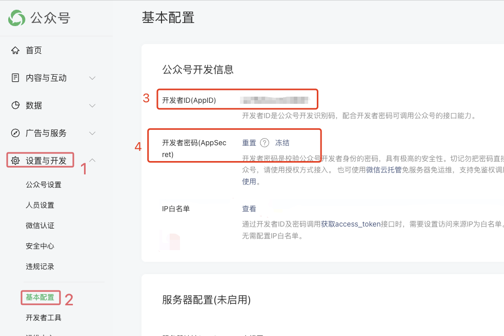

开发者将以上 AppID 和 AppSecret 配置到我们的 `wxpush` 服务中的 `p_wx_app` 表中，示例如下：

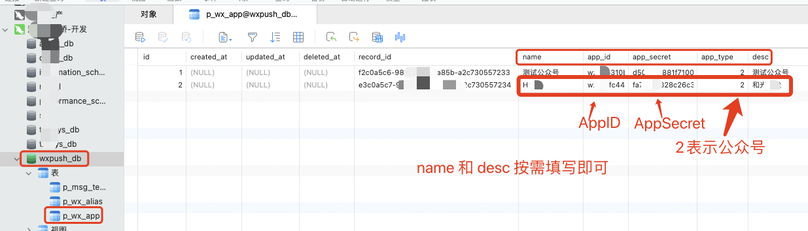


还需要在对应的服务中配置 appid ，如下图：

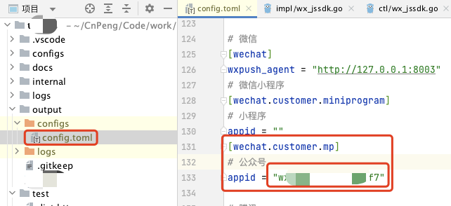

### 1.4.2. 获取 access_token

[官方文档：获取 acctss_token](https://developers.weixin.qq.com/doc/offiaccount/Basic_Information/Get_access_token.html)

#### 1.4.2.1. 配置ip白名单

在获取 `access_token` 前需要先配置 ip 白名单，只有在白名单中的 ip 才可以正常获取到 token , 如果不配置，会报错：`40164`。错误示例如下：

```json
{"errcode":40164,"errmsg":"invalid ip 123.456.789.0 ipv6 ::ffff:123.456.789.0, not in whitelist rid: 345fcd60b-74f0bdb1-2046cd47"
```

配置白名单步骤如下：

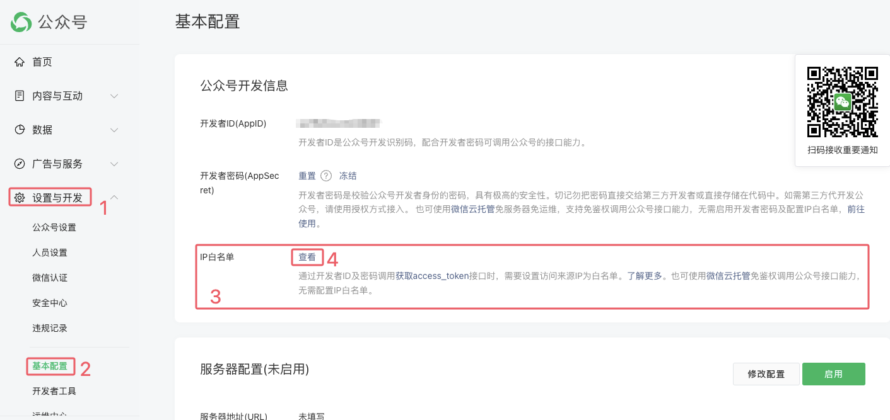

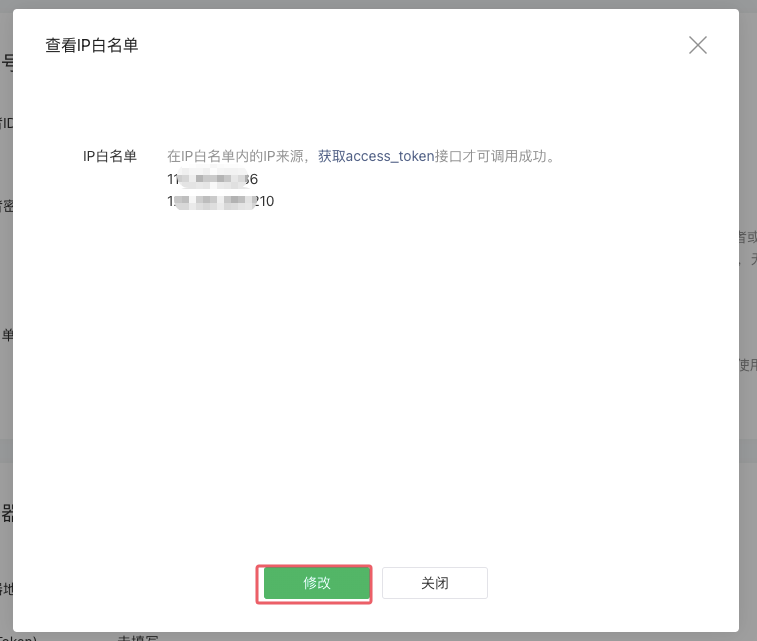

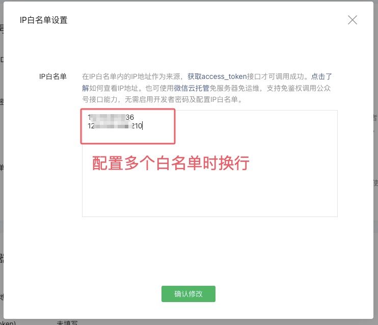

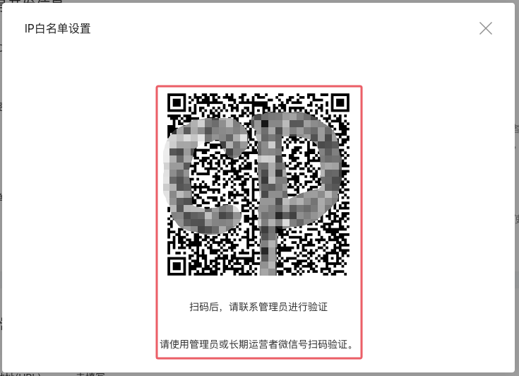

注意：

* 由于获取 access_token 的操作是在服务端进行的，所以此处配置的是服务器的 ip 地址。
* 部分 ip 配置后会立即生效， 部分 ip 配置后需要等待大约十几分钟才会生效。
* 如果配置了 ip 白名单，并且等待一段时间后依旧没有生效，则需要确认 ip 是否正确，服务器中发起请求时使用的 appId 是否与配置白名单的 appId 一致。


#### 1.4.2.2. 获取 token 

在服务端实现获取 access_token 的操作，代码如下（基于 `golang` 实现）：

* 获取 access_token 的核心代码1：

```go
// GetAccessToken 获取微信小程序的access_token
// 接口在线测试工具：https://mp.weixin.qq.com/debug/cgi-bin/apiinfo?t=index&type=%E5%9F%BA%E7%A1%80%E6%94%AF%E6%8C%81&form=%E8%8E%B7%E5%8F%96access_token%E6%8E%A5%E5%8F%A3%20/token&token=&lang=zh_CN
func getAccessToken(callBack chan *TokenReBean, opt *option) error {
	err := checkOptInfos(opt)
	if err != nil {
		return err
	}

	// token_uri 中包含了两个 %s 占位服务，分别对应 appId 和 appSecret
	uri := fmt.Sprintf(opt.tokenUri, opt.appID, opt.appSecret)
	tokenUrl := fmt.Sprintf("%s%s", opt.host, uri)
	logplus.Default().Debugf("【getAccessToken】-请求地址为:%s", tokenUrl)

	// 发送请求
	byteR, err := DoGet(tokenUrl)
	if err != nil {
		return errplus.New("【getAccessToken】-执行请求时出错")
	}

	logplus.Default().Debugf("【getAccessToken】-请求token时的响应数据:%s", byteR)

	// 响应码是200，解析为我们期望的数据
	var tokenRe TokenReBean
	if err = json.Unmarshal(byteR, &tokenRe); err != nil {
		callBack <- nil
		return errplus.New("【getAccessToken】-json.Unmarshal解析响应数据为 结构体 时出错")
	}

	// 校验解析出来的响应数据
	if errCode := tokenRe.ErrCode; errCode != 0 {
		if errCode == clearQuotaCode {
			return clearQuota(opt.tokenStr, opt.appID, func(flag bool) error {
				if flag {
					return getAccessToken(callBack, opt)
				} else {
					callBack <- nil
					errMSg := fmt.Sprintf("【getAccessToken】-错误码为:%d,错误描述为：%s", tokenRe.ErrCode, tokenRe.ErrMsg)
					return errplus.New(errMSg)
				}
			})
		} else {
			callBack <- nil
			errMSg := fmt.Sprintf("【getAccessToken】-错误码为:%d,错误描述为：%s", tokenRe.ErrCode, tokenRe.ErrMsg)
			return errplus.New(errMSg)
		}
	}
	if tokenRe.AccessToken == "" {
		callBack <- nil
		return errplus.New("【getAccessToken】-access_token为空")
	}

	// // 用 map 来接收全部字段（也可以用结构体来接收）
	// result := make(map[string]interface{})
	// if err = json.Unmarshal(byteR, &result); err != nil {
	//	callBack <- nil
	//	return errplus.New("【getAccessToken】-json.Unmarshal解析响应数据为 map 时出错")
	// }
	//
	// tokenStr := result["access_token"].(string) //此处使用了类型断言，格式：x.(类型)，检查 x 是否为指定类型，并返回对应的值
	// if tokenStr == "" {
	//	callBack <- nil
	//	return errplus.New("【getAccessToken】-access_token为空")
	// }

	callBack <- &tokenRe
	return nil
}
```

* 核心代码2：

```go
// GetAccessToken 获取当前客户端的访问令牌
func (c *PushClient) GetAccessToken(ctx context.Context) (string, error) {
	job := c.jobPool.Get().(*pushJob)
	opt := c.opts
	// 鉴权-获取令牌
	if shouldUpdateToken(opt) {
		tokenCallBack := make(chan *TokenReBean, 1)
		if err := getAccessToken(tokenCallBack, opt); err != nil {
			return "", err
		}
		tokenRe := *(<-tokenCallBack)
		opt.tokenStr = tokenRe.AccessToken                         // 令牌信息
		opt.tokenExpiredAt = time.Now().Unix() + tokenRe.ExpiresIn // 获取令牌到期的秒级时间戳
		c.jobPool.Put(job)
	}
	return job.opts.tokenStr, nil
}
```

* 其他关联代码：

```go
// 检验是否需要更新推送令牌，令牌有效期为 2 小时
func shouldUpdateToken(opt *option) bool {
	if "" == opt.tokenStr {
		logplus.Default().Debug("【shouldUpdateToken】-true ，tokenStr为空")
		return true
	}

	// 提前 20 分钟更新令牌
	var threshold int64 = 20 * 60
	curMs := time.Now().Unix()
	flag := (opt.tokenExpiredAt - curMs) <= threshold

	logplus.Default().Debugf("【shouldUpdateToken】-%t , 当前时间戳:%d, 过期时间戳:%d", flag, curMs, opt.tokenExpiredAt)
	return flag
}

// 调用次数重置的回调。
// @param bool flag true--调用次数重置成功，false-调用次数重置失败
type clearQuotaCallback func(flag bool) error

// 当接口返回 45009 —— 超过天级的调用次数限制时，调用该方法重置调用额度。
// https://developers.weixin.qq.com/miniprogram/dev/OpenApiDoc/openApi-mgnt/clearQuota.html
func clearQuota(tokenStr string, appid string, callback clearQuotaCallback) error {
	// 组织请求地址
	uri := util.TT(viper.GetStringMap("wechat_push.clear_quota")).String()
	url := fmt.Sprintf("%s%s", uri, tokenStr)

	// 组织请求参数
	param := ClearQuotaParam{
		AppId: appid,
	}
	byteSlice, err := json.Marshal(param)
	if err != nil {
		logplus.Default().Debugf("【clearQuota-清空调用次数-1】%s", err.Error())
		return callback(false)
	}
	buffer := bytes.NewBuffer(byteSlice)

	// 执行 post 请求
	byteRe, err := DoPost(url, buffer)
	if err != nil {
		return callback(false)
	}

	// 响应码是200,解析为我们期望的结构体
	var reBean BaseReBean
	if err = json.Unmarshal(byteRe, &reBean); err != nil {
		logplus.Default().Debugf("【clearQuota-清空调用次数-4】%s", err.Error())
		return callback(false)
	}
	if reBean.ErrCode != 0 {
		logplus.Default().Debugf("【clearQuota-清空调用次数-5】错误码：%d，错误信息：%s", reBean.ErrCode, reBean.ErrMsg)
		return callback(false)
	}

	logplus.Default().Debug("【clearQuota-清空调用次数-6】- 成功")
	return callback(true)
}

// 校验 opt 中的核心参数信息
func checkOptInfos(opt *option) error {
	// 校验数据
	if opt == nil {
		return errplus.New("【getAccessToken】-opt 不能为 nil")
	}
	if opt.appID == "" {
		return errplus.New("【getAccessToken】-opt 中的 appID 不能为空")
	}
	if opt.appSecret == "" {
		return errplus.New("【getAccessToken】-opt 中的 appSecret 不能为空")
	}
	if opt.host == "" {
		return errplus.New("【getAccessToken】-opt 中的 host 不能为空")
	}
	return nil
}

// DoGet 执行 get 请求
func DoGet(url string) ([]byte, error) {
	resp, err := http.Get(url)
	if err != nil {
		logplus.Default().Debugf("【DoGet】-出错:-%s", err.Error())
		return nil, err
	}

	// 读取响应数据
	defer resp.Body.Close()
	byteR, err := ioutil.ReadAll(resp.Body)
	if err != nil {
		logplus.Default().Debugf("【DoGet】-ioutil.ReadAll读取响应数据出错-%s", err.Error())
		return nil, err
	}

	// 如果响应码不是 200
	if reCode := resp.StatusCode; reCode != http.StatusOK {
		return nil, errplus.New(fmt.Sprintf("【DoGet】-resp.StatusCode-%d", reCode))
	}
	logplus.Default().Debugf("【DoGet】的响应数据：%s", byteR)
	return byteR, nil
}

// DoPost 执行 post 请求
func DoPost(url string, bodyBuffer io.Reader) ([]byte, error) {
	resp, err := http.Post(url, "POST", bodyBuffer)
	if err != nil {
		logplus.Default().Debugf("【DoPost】%s", err.Error())
		return nil, err
	}

	// 读取响应数据为 []byte
	defer resp.Body.Close()
	byteR, err := ioutil.ReadAll(resp.Body)
	if err != nil {
		logplus.Default().Debugf("【DoPost】%s", err.Error())
		return nil, err
	}

	// 如果响应码不是 200
	if reCode := resp.StatusCode; reCode != http.StatusOK {
		msg := fmt.Sprintf("【DoPost】响应码：%d,响应数据：%s", reCode, byteR)
		logplus.Default().Debugf(msg)
		return nil, errplus.New(msg)
	}
	return byteR, nil
}
```


### 1.4.3. 获取 ticket

[基于 access_token 获取 ticket](https://developers.weixin.qq.com/doc/offiaccount/OA_Web_Apps/JS-SDK.html#61)

获取到 access_token 后，基于 access_token 后获取 ticket，示例代码如下（基于 `golang` 实现）：

* 使用到的结构体：

```go
// JsSdkTicketRe 微信 JsSdk 响应的结构体
type JsSdkTicketRe struct {
	Ticket    string `json:"ticket"`     // 获取到的 ticket
	ExpiresIn int64  `json:"expires_in"` //  凭证有效时间，单位：秒。目前是7200秒之内的值。
	BaseReBean
}

// BaseReBean 基础响应信息
type BaseReBean struct {
	ErrCode int    `json:"errcode"` // 错误码信息。-1：系统繁忙；400001：AppSecret 错误，或者 access_token 无效；40013：appID 非法
	ErrMsg  string `json:"errmsg"`  // 错误信息描述
}
```

* 获取 ticket:

```go
package wechat

import (
	"encoding/json"
	"fmt"
	"github.com/spf13/viper"
	"time"
	"wxpush/util/errplus"
	"wxpush/util/logplus"
)

// 检验是否需要更新 Ticket，Ticket 默认有效期为 2 小时
func shouldUpdateTicket(opt *option) bool {
	if "" == opt.ticketInfo.ticket {
		logplus.Default().Debug("【shouldUpdateTicket】-true ，ticket 为空")
		return true
	}

	// 提前 20 分钟更新票据
	var threshold int64 = 20 * 60
	curMs := time.Now().Unix()
	flag := (opt.ticketInfo.expiresAt - curMs) <= threshold

	logplus.Default().Debugf("【shouldUpdateTicket】-%t , 当前时间戳:%d, 过期时间戳:%d", flag, curMs, opt.ticketInfo.expiresAt)
	return flag
}

// 获取微信 JsSdk 的 ticket 信息
// 通过 GET https://api.weixin.qq.com/cgi-bin/ticket/getticket?access_token=ACCESS_TOKEN&type=jsapi 获取
func getJsSdkTicket(callBack chan *JsSdkTicketRe, opt *option) error {
	ticketUri := viper.GetString("wx_jssdk.ticket_uri")
	if "" == ticketUri {
		return errplus.New400Error("配置文件中未指定 ticket_uri")
	}
	ticketUrl := fmt.Sprintf("%s%s", opt.host, fmt.Sprintf(ticketUri, opt.tokenStr))
	logplus.Default().Debugf("【getJsSdkTicket】-请求地址为:%s", ticketUrl)

	// 发送请求
	byteR, err := DoGet(ticketUrl)
	if err != nil {
		return errplus.New("【getJsSdkTicket】-执行请求时出错")
	}
	logplus.Default().Debugf("【getJsSdkTicket】-请求token时的响应数据:%s", byteR)

	// 响应码是200，解析为我们期望的数据
	var ticketRe JsSdkTicketRe
	if err = json.Unmarshal(byteR, &ticketRe); err != nil {
		callBack <- nil
		return errplus.New("【getJsSdkTicket】-json.Unmarshal解析响应数据为 结构体 时出错")
	}

	// 校验解析出来的响应数据
	if errCode := ticketRe.ErrCode; errCode != 0 {
		callBack <- nil
		errMSg := fmt.Sprintf("【getJsSdkTicket】-错误码为:%d,错误描述为：%s", ticketRe.ErrCode, ticketRe.ErrMsg)
		return errplus.New(errMSg)
	}

	if ticketRe.Ticket == "" {
		callBack <- nil
		return errplus.New("【getJsSdkTicket】-access_token为空")
	}
	callBack <- &ticketRe
	return nil
}
```

* 业务层调用的方法：

```go
// GetJsSdkTicket 获取微信 JsSdk 中需要使用的 ticket
// JsApiTicket 微信 jssdk 中使用的 ticket
// 按照 https://developers.weixin.qq.com/doc/offiaccount/OA_Web_Apps/JS-SDK.html#61 中说明，
// 通过 GET https://api.weixin.qq.com/cgi-bin/ticket/getticket?access_token=ACCESS_TOKEN&type=jsapi 获取
func (c *PushClient) GetJsSdkTicket(ctx context.Context) (string, error) {
	// 先确保 token 有值
	if _, err := c.GetAccessToken(ctx); err != nil {
		return "", err
	}

	job := c.jobPool.Get().(*pushJob)
	opt := c.opts
	// 鉴权-获取Ticket
	if shouldUpdateTicket(opt) {
		ticketCallBack := make(chan *JsSdkTicketRe, 1)
		if err := getJsSdkTicket(ticketCallBack, opt); err != nil {
			return "", err
		}
		ticketRe := *(<-ticketCallBack)
		opt.ticketInfo = JsApiTicket{
			expiresAt: time.Now().Unix() + ticketRe.ExpiresIn, // 获取令牌到期的秒级时间戳
			ticket:    ticketRe.Ticket,
		}
		c.jobPool.Put(job)
	}
	return job.opts.ticketInfo.ticket, nil
}
```

上述代码中 `"wxpush/util/errplus"` 和 `"wxpush/util/logplus"` 为自行封装的工具类。

### 1.4.4. 获取签名 signature

[基于 ticket 获取签名](https://developers.weixin.qq.com/doc/offiaccount/OA_Web_Apps/JS-SDK.html#61)


注意签名时使用的 url 地址信息:

* 不要做URL编码，
* 必须是当前页面的完整地址（含地址参数）
* 地址不包含`#`，如果真实地址中包含 `#`则只取 `#` 前的内容

获取到 ticket 后，在服务端进行 signature 操作，示例代码如下（基于 `golang` 实现）：

```go

// GetSignature 获取调用 WxJsSdk 方法时使用的 signature 值
// @param appID string 公众号的 appid
func (a *WxJsSdk) GetSignature(ctx context.Context, appID string, webPageUrl string) (*wechat.JsSdkSignatureRe, error) {
	client, err := a.pushB.getPushClient(ctx, appID)
	if err != nil {
		return nil, err
	}

	// 获取 ticket
	ticket, err := client.GetJsSdkTicket(ctx)
	if err != nil {
		return nil, err
	}

	// 获取 signature
	signatureRe := a.generateSignature(ticket, webPageUrl)
	return signatureRe, nil
}

// 基于传入的 ticket 生成签名
// * 签名用的noncestr和timestamp必须与wx.config中的nonceStr和timestamp相同。
// * 签名用的url必须是调用JS接口页面的完整URL。不包含#及其后面部分。不进行URL 转义。
func (a *WxJsSdk) generateSignature(ticket string, webPageUrl string) *wechat.JsSdkSignatureRe {
	// 1、对所有待签名参数按照字段名的ASCII 码从小到大排序（字典序）
	nonceStr := util.UUID()
	timeStamp := time.Now().UnixMilli()
	paramMap := map[string]interface{}{
		"jsapi_ticket": ticket,
		"noncestr":     nonceStr,
		"timestamp":    timeStamp,
		"url":          webPageUrl,
	}
	sortedSlice := util.Map2SortedSlice(paramMap)

	// 2、使用URL键值对的格式（即key1=value1&key2=value2…）拼接成字符串string1
	paramsStr := ""
	for _, entry := range sortedSlice {
		if paramsStr == "" {
			paramsStr = fmt.Sprintf("%s=%v", entry.Key, entry.Value)
		} else {
			paramsStr = fmt.Sprintf("%s&%s=%v", paramsStr, entry.Key, entry.Value)
		}
	}

	// 3、对string1进行sha1签名，得到signature
	return &wechat.JsSdkSignatureRe{
		NonceStr:  nonceStr,
		Signature: util.SHA1HashString(paramsStr),
		TimeStamp: timeStamp,
	}
}

```


## 1.5. H5端初始化配置

在前端 H5 项目中包装一个工具文件（假设文件名为 `WxJssdk.tsx`），内部包含获取签名以及获取签名后初始化 wx 配置的方法。

```tsx
import request from '@/utils/Http'

interface IWechatConfig {
  app_id: string;
  time_stamp: number;
  nonce_str: string;
  signature: string;
}

// 初始化 WxJsSdk
// 从服务端请求配置信息，调用 wx.config 执行初始化。
export function InitWxJsSdk(onReady: () => void, onError: (error: any) => void) {
  const url = '/txqsys/api/v1/wx-jssdk/signature'
  const body = {
    page_url : 'https://h5.cnpeng.com/'
  }
  request({ url: url, method: 'POST' ,data:body})
    .then((res) => {
      if (res && res.code==0){
        onGetWxSignature(res.data, onReady, onError)
      }
    })
    .catch((error) => {
      console.error('获取微信配置失败:', error)
    })
}

/*
* 获取到 signature 之后，执行 wx.config 初始化操作，并在 wx.ready 和 wx.error 中监听。
* 虽然 wx.xx 会飘红报错，但不需要关心，构建后可以正常运行。
*/
function onGetWxSignature(data: IWechatConfig, onReady: () => void, onError: (error: any) => void) {
  const config = {
    debug: false, // 是否开启调试，开启后，真机运行时会以弹窗的形式反馈调用结果。
    appId: data.app_id,
    timestamp: data.time_stamp,
    nonceStr: data.nonce_str,
    signature: data.signature,
    jsApiList: [   // 需要使用的 API 列表
      'getLocation',
      'openLocation',

      'startRecord',
      'stopRecord',
      'onVoiceRecordEnd',
      'playVoice',
      'pauseVoice',
      'stopVoice',
      'onVoicePlayEnd',
      'uploadVoice',
      'downloadVoice'
    ]
  }

  // console.log("=====调用 wx.config 开始===========================",config)
  // 设置微信 JS-SDK 的配置信息
  wx.config(config)

  // 可选：配置成功后的回调函数
  wx.ready(() => {
    console.log('微信 JS-SDK 初始化成功')
    if (onReady) {
      onReady()
    }
  })

  // 可选：配置失败后的回调函数
  wx.error((err) => {
    console.error('微信 JS-SDK 初始化失败:', err)
    if (onError) {
      onError(err)
    }
  })
  // console.log("=====调用 wx.config 结束===========================")
}
```

注意：`import request from '@/utils/Http'` 中的 `/utils/Http` 是我们自行封装的网络请求工具类。

## 1.6. H5端获取位置

在前端 H5 项目中定义如下方法用于获取用户当前的位置坐标。

```tsx
// 在微信公众号页面中，使用 wx-jssdk 实现定位。（mp 是微信公众号缩写。）
export function getWxLocation4Mp(onSuccess: (result) => void, onFail: (msg) => void) {
  console.log('调用wxjssdk获取定位')
  wx.getLocation({
    type: 'gcj02', // 默认为wgs84的gps坐标，如果要返回直接给openLocation用的火星坐标，可传入'gcj02'
    success: function(res) {
      console.log('定位成功', res)
      // var latitude = res.latitude // 纬度，浮点数，范围为90 ~ -90
      // var longitude = res.longitude // 经度，浮点数，范围为180 ~ -180。
      // var speed = res.speed; // 速度，以米/每秒计
      // var accuracy = res.accuracy; // 位置精度
      // console.log(JSON.stringify(res))
      if (onSuccess) {
        onSuccess(res)
      }
    },
    cancel: function() {
      console.log('定位失败,请重新获取并允许定位')
      if (onFail) {
        onFail('定位失败,请重新获取并允许定位-onCancel')
      }
    },
    fail: function() {
      console.log('定位失败,请检查您设备权限后重新尝试')
      if (onFail) {
        onFail('定位失败,请重新获取并允许定位-onFail')
      }
    }
  })
}
```

注意：

* 调用上述方法获取用户位置时，会自动一个定位授权弹窗。如果用户允许了，则可以继续获取位置信息。如果用户拒绝了， 将无法获取位置信息。

* 用户拒绝时，官方并没有提供 API 可供开发者主动调起设置页面。用户退出当前页面并重新进入时会再次自动弹窗询问是否授权。


## 1.7. 逆地理位置解析解析

逆地理位置解析解析就是把坐标转换为可读的位置信息。

### 1.7.1. 获取key

先注册 [腾讯WebService位置服务](https://lbs.qq.com/) 的账号，

然后创建应用并获取 key 信息：

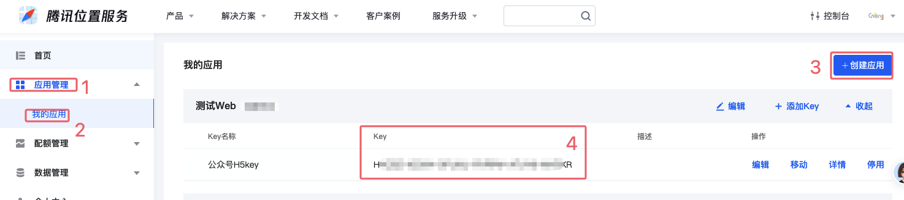


获取到 key 之后提供给研发，由研发添加到服务端的配置文件（`config.toml`）中，示例如下：


```toml
# 腾讯
[tencent]
# 腾讯位置服务 https://lbs.qq.com/dev/console/home 的 key,用于逆地理位置解析
web_service_key = "上面得到的key"
```

#### 1.7.1.1. 配置域名

如下图：

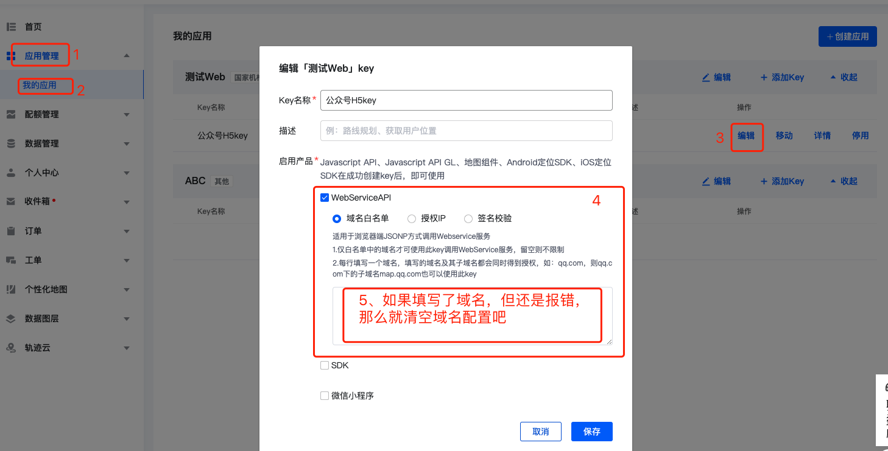


如果项目在运行过程中出现“域名未被授权”的错误提示，则需要按照上图确认域名白名单是否配置正确。如果配置了但还是报错，那么就清空不做配置了吧。

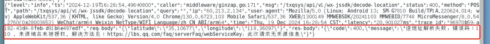


#### 1.7.1.2. 分配额度

参照下图配置 key 的额度：

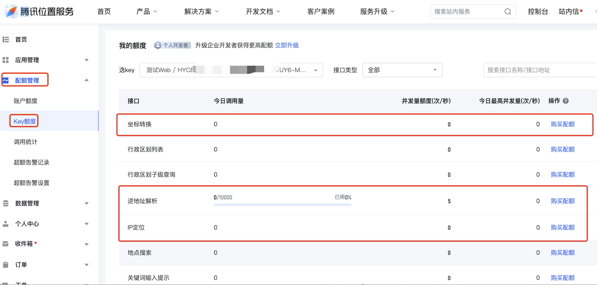

如果项目运行过程中出现如下错误（`错误码：121，此key每日调用量已达上限`），则需要适当调整上述三个额度信息。

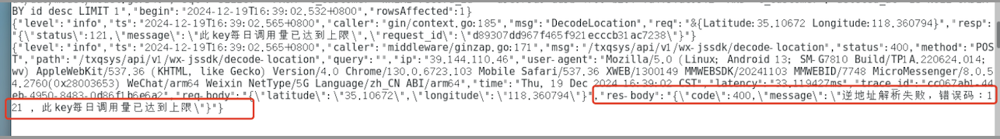


### 1.7.2. 解析

* [腾讯-逆地理位置解析解析文档](https://lbs.qq.com/service/webService/webServiceGuide/address/Gcoder)

#### 1.7.2.1. 服务端包装解析接口

按照官方文档，可以在前端发起解析请求，也可以在服务端发起解析请求，但为了 key 的安全，我们把解析过程以及 key 信息都放在服务端，由服务端包装一个解析接口供前端使用。

解析方法如下（基于 `golang` 实现）：


* 使用到的结构体信息

```go

// WxDecodeLocationReq 基于坐标解析为地址时的请求信息
type WxDecodeLocationReq struct {
    Latitude  string `json:"latitude"`  // 纬度。wx.getLocation 返回的纬度是字符串类型，所以此处也定义为字符串。
    Longitude string `json:"longitude"` // 经度。wx.getLocation 返回的纬度是字符串类型，所以此处也定义为字符串。
}

// WxDecodeLocationFullRe 基于坐标解析为地址时的响应信息
// 即：https://lbs.qq.com/service/webService/webServiceGuide/address/Gcoder 的响应信息。此处仅截取部分需要的字段
type WxDecodeLocationFullRe struct {
    Status    int                    `json:"status"`     // 状态码，0为正常，其它为异常，详细请参阅 https://lbs.qq.com/service/webService/webServiceGuide/status
    Message   string                 `json:"message"`    // 状态说明
    RequestId string                 `json:"request_id"` // 本次请求的唯一标识
    Result    WxDecodeLocationResult `json:"result"`     // 逆地址解析结果
}

// WxDecodeLocationResult 核心结果内容
type WxDecodeLocationResult struct {
    AddressComponent   WxAddressComponent   `json:"address_component"`   // 省市县街道信息
    FormattedAddresses WxFormattedAddresses `json:"formatted_addresses"` // 结合知名地点形成的描述性地址，更具人性化特点 
}

// 省市县街道信息
type WxAddressComponent struct {
    Nation       string `json:"nation"`        // 国家
    Province     string `json:"province"`      // 省
    City         string `json:"city"`          // 市，如果当前城市为省直辖县级区划，city与district字段均会返回此城市
    District     string `json:"district"`      // 区，可能为空字串
    Street       string `json:"street"`        // 道路，可能为空字串
    StreetNumber string `json:"street_number"` // 门牌，可能为空字串
}

// 结合知名地点形成的描述性地址，更具人性化特点
type WxFormattedAddresses struct {
    Recommend       string `json:"recommend"`        // 推荐使用的地址描述，描述精确性较高。如：高新区御路文化公园(中心街东100米)
    Rough           string `json:"rough"`            // 粗略位置描述。如：高新区御路文化公园(中心街东100米)
    StandardAddress string `json:"standard_address"` // 如：山东省济南市高新区文化路与灵槐路交叉口正北方向150米左右
}
```


* 解析方法

```go

// DecodeLocation 逆地理位置解析。将传递的坐标解析为可读的位置信息。
// 前端也可以直接调用腾讯的解析接口，但为了 webServiceKey 的安全，由服务端发起解析，然后暴露给前端。
func (a *WxJsSdkService) DecodeLocation(ctx context.Context, req *schema.WxDecodeLocationReq) (*schema.WxDecodeLocationResult, error) {
    webServiceKey := viper.GetString("tencent.web_service_key")
    if webServiceKey == "" {
        // 在配置文件中配置
        return nil, errors.ErrBadRequest("webServiceKey 不能为空,请联系管理员配置")
    }

    targetUrl := fmt.Sprintf("https://apis.map.qq.com/ws/geocoder/v1?location=%s,%s&key=%s", req.Latitude, req.Longitude, webServiceKey)

    httpRequest, err := http.NewRequestWithContext(ctx, http.MethodGet, targetUrl, nil)
    if err != nil {
        return nil, fmt.Errorf("出错了（创建请求发生错误: %w)", err)
    }
    c := a.httpClient
    if c == nil {
        c = http.DefaultClient
    }

    resp, err := c.Do(httpRequest)
    if err != nil {
        return nil, fmt.Errorf("出错了（请求发生错误: %w)", err)
    }
    defer resp.Body.Close()
    b, err := io.ReadAll(resp.Body)
    if err != nil {
        return nil, fmt.Errorf("出错了（读取响应内容发生错误: %w)", err)
    }

    zap.L().Info("DecodeLocation", zap.String("req", fmt.Sprintf("%+v", req)), zap.String("resp", string(b)))
    if resp.StatusCode != http.StatusOK {
        return nil, fmt.Errorf("出错了（响应错误: %s)", b)
    }

    var result schema.WxDecodeLocationFullRe
    if err := json.Unmarshal(b, &result); err != nil {
        return nil, fmt.Errorf("解析响应内容发生错误: %w", err)
    }

    // 出错了。完整错误码：https://lbs.qq.com/service/webService/webServiceGuide/status
    if result.Status != 0 {
        return nil, errors.ErrBadRequest(fmt.Sprintf("逆地址解析失败，错误码：%d , %s", result.Status, result.Message))
    }

    return &result.Result, nil
}
```

上述代码中 `viper` 是配置文件解析库，`tencent.web_service_key` 是 toml 配置文件中的一个字段，toml 文件中部分内容如下：

```toml
# 腾讯
[tencent]
# 腾讯位置服务 https://lbs.qq.com/dev/console/home 的 key,用于逆地理位置解析
web_service_key = "你的key"
```

#### 1.7.2.2. H5端调用解析接口

在前端 H5 项目中，调用服务端的解析接口实现逆地理位置解析解析。

```tsx
// 解析地理坐标为可读的位置信息（即逆地理位置解析）
// 将 https://lbs.qq.com/service/webService/webServiceGuide/address/Gcoder 中解析的内容包装到服务端，由服务端做一次中转，但响应数据不做变更。
// 腾讯 WebServiceApi 测试页面：https://lbs.qq.com/dev/console/demo-center?request_url,该页面可以查看响应数据
// 核心响应字段
// {
//     "address_component": {
//         "nation": "中国",
//         "province": "山东省",
//         "city": "济南市",
//         "district": "高新区",
//         "street": "中心街",
//         "street_number": ""
//     },
//     "formatted_addresses": {
//         "recommend": "高新区御路文化公园(中心街东100米)",
//         "rough": "高新区御路文化公园(中心街东100米)",
//         "standard_address": "山东省济南市高新区文化路与灵槐路交叉口正北方向150米左右"
//     }
// }
export function decodeLocation(location, onSuccess: (result) => void, onError: (error: any) => void) {
  const url = '/txqsys/api/v1/wx-jssdk/decode-location'
  const body = {
    latitude: location.latitude+'',// 纬度，浮点数，范围为90 ~ -90
    longitude: location.longitude+'' // 经度，浮点数，范围为180 ~ -180。
  }
  request({ url: url, method: 'POST', data: body })
    .then((res) => {
      if (res && res.code === 0 && res.data) {
        onSuccess(res.data)
      }
    })
    .catch((error) => {
      console.error('解析地址出错:', error)
      onError(error)
    })
}

// 实现微信公众号中 H5 页面的定位并将获取到的坐标解析为可读的位置信息
export function locationAndDecode4Mp(onSuccess: (result) => void, onFail: (msg) => void) {
  getWxLocation4Mp((location) => {
    decodeLocation(location, onSuccess, onFail)
  }, onFail)
}
```

##### 1.7.2.2.1. 注意

Android 端定位成功之后，`location` 对象中的经纬度是字符串类型的，但 iOS 中是数字类型的，所以上面的代码中做了一个字符串拼接，确保传递给服务端的是字符串数据。

未做处理时，iOS 设备获取数据和提交时的报错信息如下：

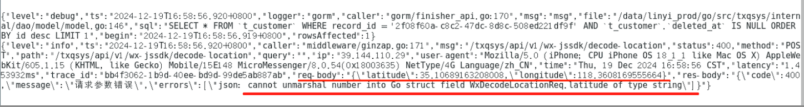

Android 设备获取到的数据和提交情况如下：

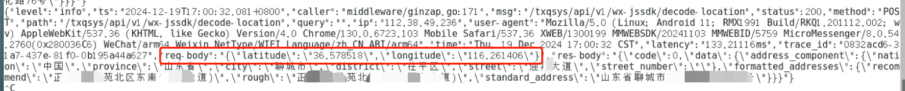

所以，为了兼容两端设备，需要做字符串拼接：

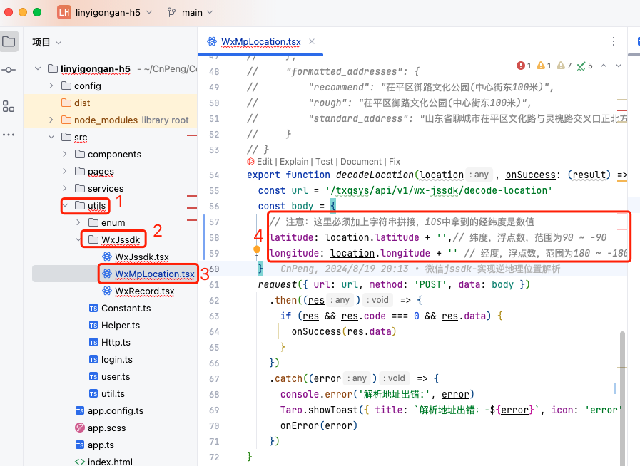

如果不做字符串拼接处理，


### 1.7.3. 附：WebServiceAPI 测试页面

* [WebServiceAPI 测试页面](https://lbs.qq.com/dev/console/demo-center?request_url)

通过该页面可以方便的测试某个 api , 以查看请求方式、请求参数和响应参数信息。 

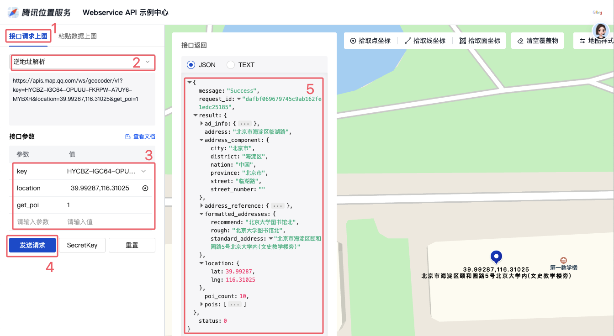


## 1.8. 参考

* [微信网页开发 /JS-SDK说明文档](https://developers.weixin.qq.com/doc/offiaccount/OA_Web_Apps/JS-SDK.html)

* [微信官方文档/公众号/开始开发 /获取 Access token](https://developers.weixin.qq.com/doc/offiaccount/Basic_Information/Get_access_token.html)
