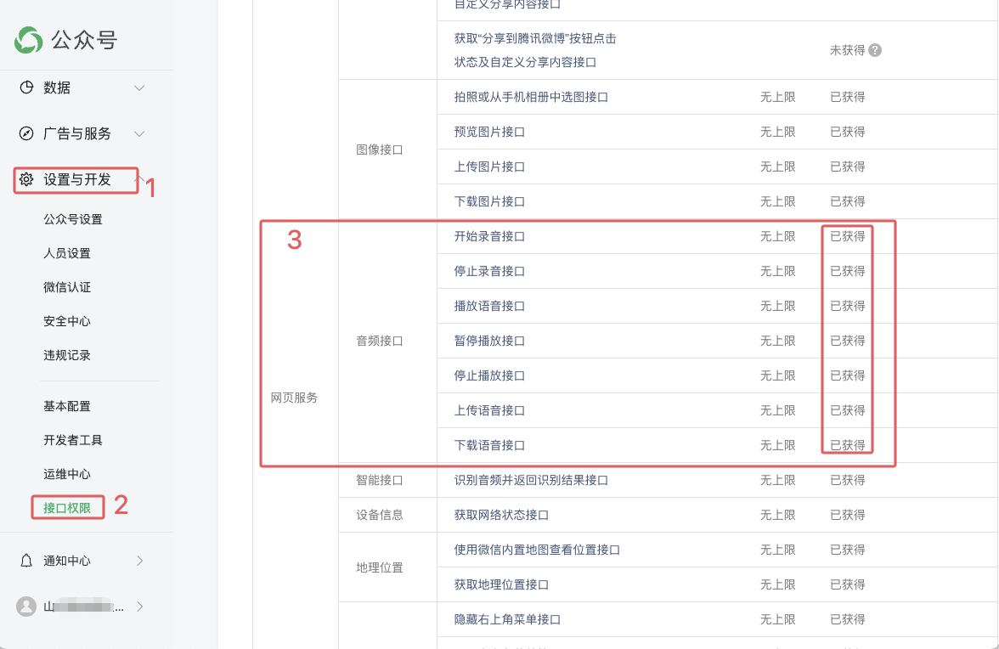
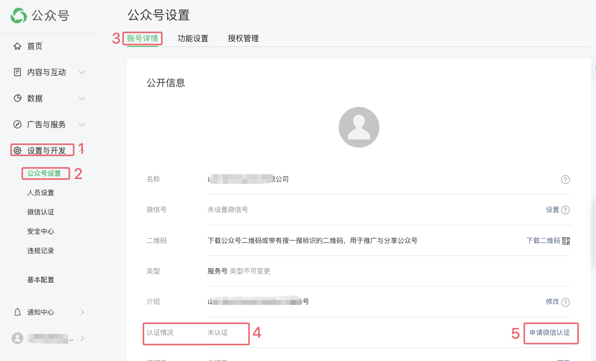
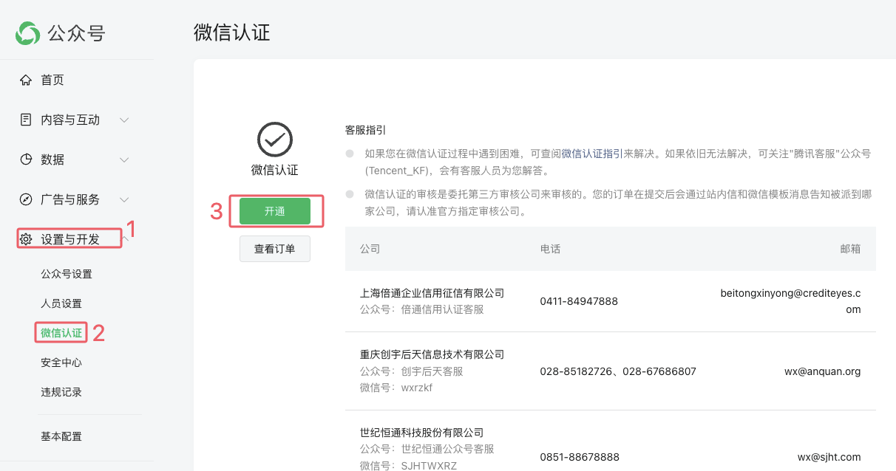
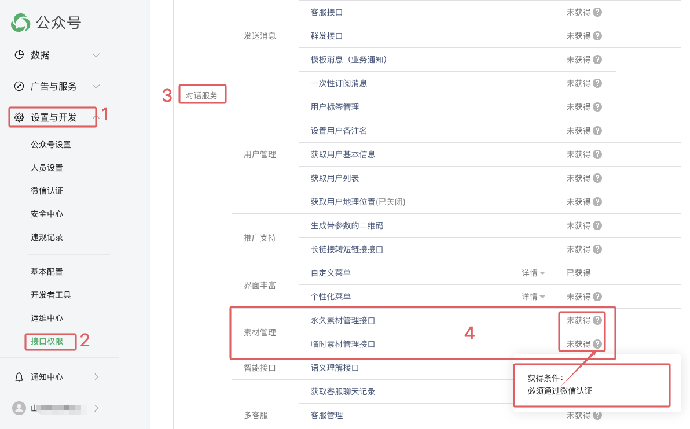

# 1. 003-公众号H5页面实现录音并上传至业务服务器

> 配置安全域名、获取 token 、获取icket、获取signature、H5端导入微信Jssdk、H5端初始化微信Jssdk 的操作与 [《002-公众号H5页面获取定位并逆解析为可读地址.md》](002-公众号H5页面获取定位并逆解析为可读地址.md) 中内容一致。

H5 端项目基于 Taro+React+Ts 实现，服务端基于 golang 实现。


## 1.1. 确认获取了权限

### 1.1.1. 确认获取了音频相关接口



上述接口中:

* `上传语音接口` 是把录制完成的音频文件上传到微信服务器，存储有效期为 3 天。
* `下载语音接口` 是从微信服务器中获取上传的音频文件的 `serverId`，并不是直接把音频文件下载下来。

### 1.1.2. 确认获取了素材管理接口权限

如果需要把音频文件下载到我们自己的业务服务器，需要先完成微信认证，并确认已经获取了 `对话服务/素材管理` 接口权限。

#### 1.1.2.1. 确认是否已完成微信认证

`微信认证` 需要每年操作一次，每次 300 元人民币。





#### 1.1.2.2. 确认是否获取了素材管理接口

完成 `微信认证` 后，确认是否获取了素材管理接口权限：



## 1.2. H5 端包装录音功能

微信 jssdk 中`wx.startRecord` 开始录音 ,  `wx.stopRecord` 停止录音，录音结束后并不会暴露原始音频文件，需要我们调用 `wx.uploadVoice` 将数据上传至微信服务器，上传成功后会返回 `serverID`，微信服务器会暂存3天。

如果业务中需要获取音频文件，则需要调用 [素材管理-临时素材管理接口](https://developers.weixin.qq.com/doc/offiaccount/Asset_Management/Get_temporary_materials.html) 进行下载，下载后得到的是 amr 文件，`audio` 组件无法播放，需要先转换为 mp3 格式。

录制、结束录制和上传的操作在 H5 完成，下载和转码由服务端完成。H5 端内容如下：

* WxRecord.tsx

```tsx
// 开始录音
import request from '@/utils/Http'

export function startWxRecord() {
  wx.startRecord()
}

// 停止录音
export function stopWxRecord(onSuccess: (localID) => void, onFail: (err) => void) {
  wx.stopRecord({
    success: function(res) {
      console.log('录音结束，localId:', res.localId)
      if (onSuccess) {
        onSuccess(res.localId)
      }
    },
    fail: function(err) {
      console.error('停止录音失败:', err)
      if (onFail) {
        onFail(err)
      }
    }
  })
}

// 将音频上传至微信服务器，默认保存三天
export function uploadWxRecord2Wx(localID, onSuccess: (serverID) => void) {
  wx.uploadVoice({
    localId: localID, // 需要上传的音频的本地ID，由stopRecord接口获得
    isShowProgressTips: 1, // 默认为1，显示进度提示
    success: function(res) {
      var serverId = res.serverId // 返回音频的服务器端ID
      if (onSuccess) {
        onSuccess(serverId)
      }
    }
  })
}

// 停止录音，并自动上传
export function stopAndUploadWxRecord(onSuccess: (serverID) => void, onFail: (err) => void) {
  stopWxRecord((localID) => {
    uploadWxRecord2Wx(localID,(serverID)=>{
      if (onSuccess){
        onSuccess(serverID)
      }
    })
  }, onFail)
}


// 上传到我方服务器(此处的接口和方法为业务中自定义逻辑)
export function push2BizServer(mediaID, onSuccess: (fileUrl) => void, onError: (error: any) => void) {
  const url = '/txqsys/api/v1/wx-jssdk/upload-voice'
  const body = {
    media_id: mediaID
  }
  request({ url: url, method: 'POST', data: body })
    .then((res) => {
      if (res && res.code == 0) {
        onSuccess(res.data.url)
      }
    })
    .catch((error) => {
      console.error('获取微信配置失败:', error)
      onError(error)
    })
}
```

## 1.3. Server端下载录音

### 1.3.1. 下载音频

#### 1.3.1.1. 下载音频文件

调用 [素材管理-临时素材管理接口](https://developers.weixin.qq.com/doc/offiaccount/Asset_Management/Get_temporary_materials.html) 下载媒体资源时，需要传递 `access_token` 和 `media_id`。

`media_id` 就是 `wx.uploadVoice` 返回的 `server_id`；`access_token` 是基于 `appID` 和 `appSecret` 获取的，具体参考  [《002-公众号H5页面获取定位并逆解析为可读地址.md》](002-公众号H5页面获取定位并逆解析为可读地址.md) 中获取 `access_token` 的逻辑。

为了安全，`access_token` 完全由服务端维护和使用，所以下载媒体资源的逻辑也放在服务端进行，这样也便于由服务端完成转码操作。


```golang
// GetTempWxMediaData 基于 mediaID 获取上传到微信服务器的临时媒体文件
// @param appID string 公众号的 appid
// @param mediaID string 临时媒体文件的ID。H5调用jssdk中的 wx.uploadVoice 等方法时会收到 serverId ，该id即 mediaID
// 参考文档：https://developers.weixin.qq.com/doc/offiaccount/Asset_Management/Get_temporary_materials.html
// 参考文档：https://developers.weixin.qq.com/doc/offiaccount/OA_Web_Apps/JS-SDK.html#30
func (a *WxJsSdk) GetTempWxMediaData(ctx context.Context, appID string, mediaID string) ([]byte, error) {
	// 自定义的获取 token 的逻辑
	client, err := a.pushB.getPushClient(ctx, appID)
	if err != nil {
		return nil, err
	}
	accessToken, err := client.GetAccessToken(ctx)
	if err != nil {
		return nil, err
	}

	// 从微信服务器中获取 amr 音频文件的字节码
	targetUrl := fmt.Sprintf("https://api.weixin.qq.com/cgi-bin/media/get?access_token=%s&media_id=%s", accessToken, mediaID)
	resp, err := wechat.DoGet(targetUrl)
	if err != nil {
		return nil, fmt.Errorf("出错了（请求发生错误: %w)", err)
	}
	return resp, nil
}
```

执行上述代码后，将得到媒体文件的字节码。（即原始文件，在浏览器中直接执行 targetUrl 后得到的就是原始的 amr 音频文件。）

#### 1.3.1.2. 将下载逻辑包装成接口

如果需要将上述方法包装成一个独立接口供其他服务调用，那么需要修改接口响应头中的 `Content-Type` 为具体的媒体类型或 `application/octet-stream`，示例如下：

```golang
// GetTempWxMediaData 从微信服务器中下载媒体文件
func (a *WxJsSdk) GetTempWxMediaData(ctx *ctxplus.CpContext) error {
	var req schema.WxMediaDataReq
	if err := ctx.ParseJSON(&req); err != nil {
		return err
	}

	res, err := a.jsSdkB.GetTempWxMediaData(ctx.NewContext(), req.AppID, req.MediaID)
	if err != nil {
		return ctx.ResServerErr(err)
	}

	// return ctx.ResOkBytes("audio/amr", res)
	return ctx.ResOkBytes("application/octet-stream", res)
}
```

```golang
// ResOkBytes 响应成功
func (a *CpContext) ResOkBytes(contentType string, v []byte) error {
	a.ctx.Res.Set("Content-Type", contentType)
	return a.ctx.End(http.StatusOK, v)
}
```

上述代码中，使用了 [https://github.com/teambition/gear](https://github.com/teambition/gear) 来处理网络请求。

### 1.3.2. 音频转码

从微信临时存储中下载下来的音频是 amr 格式，前端的 `audio` 标签无法播放，需要转换为 mp3 格式。

**转换时使用 ffmpeg , 所以，为了确保转换成功，服务器必须安装 ffmpeg.**

#### 1.3.2.1. 业务服务器下载音频

由于前面我们将媒体下载的逻辑包装到了统一的微信功能服务（`wxpush`）中，通过接口对业务服务进行暴露，所以我们的业务服务需要调用微信功能服务（`wxpush`）中的接口获取媒体文件。

**如果下载逻辑和其他业务逻辑在同一个服务中，则不需要如下代码。**

```golang
// 向推送服务发起请求，以获取存储在微信服务器中的临时媒体文件
func (a *WxJsSdkService) getVoiceDataFromWx(ctx context.Context, mediaID string) ([]byte, error) {
    mpAppid := viper.GetString("wechat.customer.mp.appid")
    if mpAppid == "" {
        return nil, errors.ErrBadRequest("appid 不能为空")
    }

    wxpushAgent := strings.TrimSuffix(viper.GetString("wechat.wxpush_agent"), "/")
    uri := "/wxpush/srv/v1/temp_media_data"
    u, err := url.Parse(wxpushAgent + uri)
    if err != nil {
        zap.L().Info(fmt.Sprintf("解析请求地址发生错误: %+v", err))
        return nil, fmt.Errorf("解析请求地址发生错误: %w", err)
    }

    req := map[string]string{
        "app_id":   mpAppid,
        "media_id": mediaID,
    }
    reqBytes, err := json.Marshal(req)
    if err != nil {
        zap.L().Info(fmt.Sprintf("解析请求地址发生错误-json.Marshal: %+v", err))
        return nil, fmt.Errorf("marshal data error: %w", err)
    }

    httpRequest, err := http.NewRequestWithContext(ctx, http.MethodPost, u.String(), bytes.NewReader(reqBytes))
    if err != nil {
        zap.L().Info(fmt.Sprintf("解析请求地址发生错误-请求出错: %+v", err))
        return nil, fmt.Errorf("创建请求发生错误: %w", err)
    }
    httpRequest.Header.Set("X-Wx-App-Id", mpAppid)
    httpRequest.Header.Set("Content-Type", "application/json")
    c := a.httpClient
    if c == nil {
        c = http.DefaultClient
    }

    resp, err := c.Do(httpRequest)
    if err != nil {
        zap.L().Info(fmt.Sprintf("解析请求地址发生错误-执行出错: %+v", err))
        return nil, fmt.Errorf("请求发生错误: %w", err)
    }
    defer resp.Body.Close()

    if resp.StatusCode != http.StatusOK {
        zap.L().Info(fmt.Sprintf("解析请求地址发生错误-响应出错2: %+v", resp.StatusCode))
        return nil, fmt.Errorf("响应错误: %d", resp.StatusCode)
    }

    // 检查 Content-Type
    contentType := resp.Header.Get("Content-Type")
    if contentType != "audio/amr" && contentType != "application/octet-stream" {
        zap.L().Info(fmt.Sprintf("响应内容类型不符合预期: %+v", contentType))
        return nil, fmt.Errorf("响应内容类型不符合预期: %s", contentType)
    }

    b, err := io.ReadAll(resp.Body)
    if err != nil {
        zap.L().Info(fmt.Sprintf("解析请求地址发生错误-响应出错: %+v", err))
        return nil, fmt.Errorf("读取响应内容发生错误: %w", err)
    }
    return b, nil
}
```

#### 1.3.2.2. 音频转码

调用 ffmpeg 的相关命令，将 amr 格式的音频转码为 mp3。

```go
// 将 amr 转换为 mp3
// 该服务部署所在的服务器必须同时安装 ffmpeg。并且配置文件中配置了 ffmpeg 的路径——通过 which ffmpeg 可以校验是否安装正确，有输出则正确。
func (a *WxJsSdkService) convertAmr2Mp3(amrBytes []byte) ([]byte, error) {
    // 临时保存 AMR 数据到缓冲区
    var amrBuffer bytes.Buffer
    _, err := amrBuffer.Write(amrBytes)
    if err != nil {
        zap.L().Info(fmt.Sprintf("转换为mp3出错了--1: %+v", err))
        return nil, fmt.Errorf("格式转换出错: %w", err)
    }

    // 使用 FFmpeg 转换 AMR 数据为 MP3 数据
    mp3Buffer := &bytes.Buffer{}
    // cmd := exec.Command("ffmpeg", "-i", "pipe:0", "-f", "mp3", "pipe:1")
    // 添加额外的参数来提高音质
    cmd := exec.Command("ffmpeg",
        "-i", "pipe:0",
        "-c:a", "libmp3lame",
        "-b:a", "128k",
        "-ar", "44100",
        "-f", "mp3",
        "pipe:1")
    cmd.Stdin = &amrBuffer
    cmd.Stdout = mp3Buffer

    // if err = cmd.Run(); err != nil {
    //     zap.L().Info(fmt.Sprintf("转换为mp3出错了--2: %+v", err))
    //     return nil, fmt.Errorf("转换为mp3出错: %w", err)
    // }

    // 启动转换命令，并使用 zap 接管命令行日志——方便转码出错时分析原因。如果不需要日志，可以直接使用上面被注释掉的 cmd.Run() 执行转码。
    // 创建一个管道来捕获 stderr 输出
    stderrPipe, err := cmd.StderrPipe()
    if err != nil {
        zap.L().Error(fmt.Sprintf("创建 stderr 管道失败: %+v", err))
        return nil, fmt.Errorf("创建 stderr 管道失败: %w", err)
    }

    // 启动命令
    if err = cmd.Start(); err != nil {
        zap.L().Error(fmt.Sprintf("启动 ffmpeg 命令失败: %+v", err))
        return nil, fmt.Errorf("启动 ffmpeg 命令失败: %w", err)
    }

    // 读取 stderr 并记录
    stderrBytes, err := io.ReadAll(stderrPipe)
    if err != nil {
        zap.L().Error(fmt.Sprintf("读取 stderr 失败: %+v", err))
        return nil, fmt.Errorf("读取 stderr 失败: %w", err)
    }
    // 记录 stderr 输出
    if len(stderrBytes) > 0 {
        zap.L().Info("ffmpeg stderr output", zap.String("output", string(stderrBytes)))
    }

    // 等待 ffmpeg 命令完成
    if err = cmd.Wait(); err != nil {
        zap.L().Error(fmt.Sprintf("转换为mp3出错了--2: %+v", err))
        return nil, fmt.Errorf("转换为mp3出错: %w", err)
    }

    // 读取 MP3 数据
    mp3Data := mp3Buffer.Bytes()
    return mp3Data, nil
}
```

执行上述代码后，将获得 mp3 格式的音频文件。

### 1.3.3. 将MP3音频存储到服务器中

将 amr 音频转码之后，我们最终的目的是存储下来，并对前端暴露文件地址，以便前端通过地址访问转码后的 mp3 文件。

```go
// 上传 mp3 文件到文件存储服务器
func (a *WxJsSdkService) uploadMp3File(ctx context.Context, mediaID string, mp3Bytes []byte) (*schema.CommonFileUploadRes, error) {
    bucketName := filestore.DefaultBucket()
    // fileName := fmt.Sprintf("audio_%d.mp3", time.Now().UnixMilli())
    fileName := fmt.Sprintf("audio_%s.mp3", mediaID)
    contentType := "audio/mpeg"
    re, err := a.fileUploadB.UploadFile2Bucket(ctx, io.NopCloser(bytes.NewReader(mp3Bytes)), int64(len(mp3Bytes)), bucketName, fileName, contentType)
    if err != nil {
        return nil, err
    }

    return re, nil
}
```


```go
// UploadFile2Bucket 上传文件到指定的 bucket
func (a *FileStore) UploadFile2Bucket(ctx context.Context, reader io.Reader, fileSize int64, bucketName, filename, contentType string) (*schema.CommonFileUploadRes, error) {
    filepath := filestore.GetFilePath(filename, filestore.WithPath(uuid.NewString()))
    res := &schema.CommonFileUploadRes{
        Name: filename,
        // 文件的URL
        URL:  filestore.FilePathWithPrefix(filepath),
        Size: fileSize,
    }

    // 文件上传
    _, err := a.minioClient.PutObject(ctx, bucketName, filepath, reader, fileSize, minio.PutObjectOptions{
        ContentType: contentType,
    })
    if err != nil {
        return nil, errors.ErrInternalServer("上传文件失败", err)
    }
    logger.WithContext(ctx).Debug("file result", zap.String("name", res.Name), zap.Int64("size", res.Size), zap.Any("url", res.URL))
    return res, nil
}
```

文件存储使用了 [minio](https://github.com/minio/minio)

## 1.4. 参考


* [官方文档-JS-SDK说明文档-音频接口](https://developers.weixin.qq.com/doc/offiaccount/OA_Web_Apps/JS-SDK.html#23)
* [官方文档：素材管理-临时文件管理接口](https://developers.weixin.qq.com/doc/offiaccount/Asset_Management/Get_temporary_materials.html)