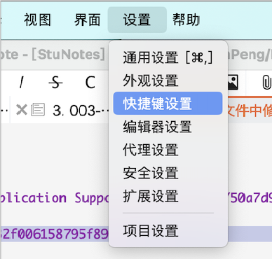
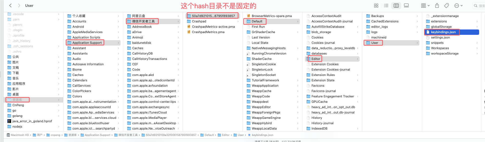
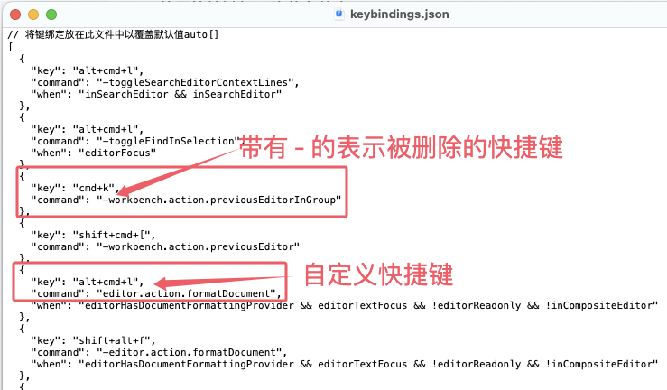

默认情况下，从 `设置/快捷键设置` 即可修改快捷键配置信息，但在 Mac 电脑上，可能会把 `cmd` (即 `Command` ) 键识别成 `unknown`，此时就可以找到配置文件进行修改。

从微信开发者工具中，是无法直接找到配置文件的，我们需要去系统目录中查找。

先从 Mac 电脑中设置显示隐藏文件（对应的快捷键为 `shift+cmd+.`）, 然后进入如下目录：

`/Users/cnpeng/Library/Application Support/微信开发者工具/50a7d9210159a32f006158795f893857/Default/Editor/User`

注意，中间的 `50a7d9210159a32f006158795f893857` 不是固定的。

`keybindings.json` 就是快捷键的配置文件，其内容如下：

上图中，

* `key` 是对应的快捷键
* `command` 表示触发的动作，
    * 如果不知道动作的描述，可以先从 `设置/快捷键设置` 中为期望的动作随便配置一个快捷键，然后再到这个文件中修改。
    * `command` 的值如果是以 `-` 开头的，表示该快捷键被删除了。