# 1. 000-1-公众号(服务号)注册

变更记录

版本 |变更日期 | 变更人 | 变更内容
---|----|---|---
v1.0 | 2024-12-30 | CnPeng | 初次编辑
  

## 1.1. 资料准备

* 未被微信公众平台注册，未被微信开放平台注册，未被个人微信号绑定的邮箱

* [《微信公众平台信息登记指引》](https://kf.qq.com/faq/120911VrYVrA130619v6zaAn.html)中归纳的不同账户类型所需的其他资料如下：
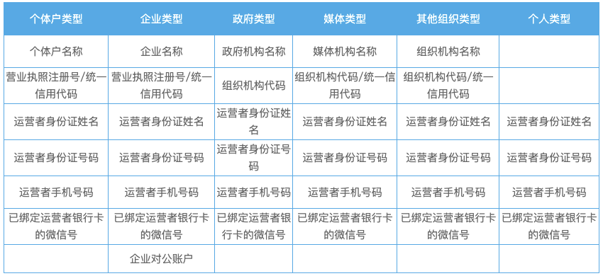

## 1.2. 注册

### 1.2.1. 填写基本信息

进入 [微信公众平台官方网站](https://mp.weixin.qq.com/)，然后选择下图中的 2 ：

根据实际情况选择注册类型：

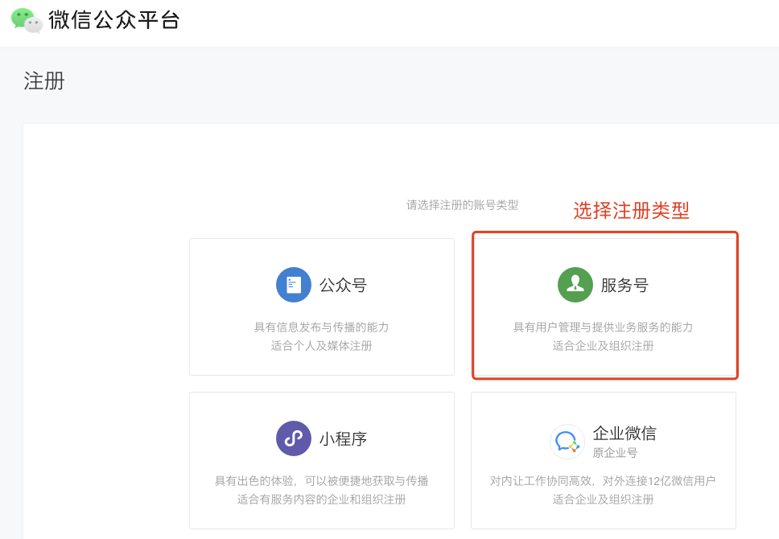

输入注册信息：

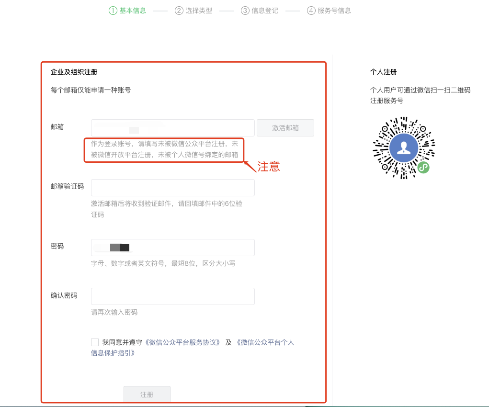

### 1.2.2. 选择注册地和类型：

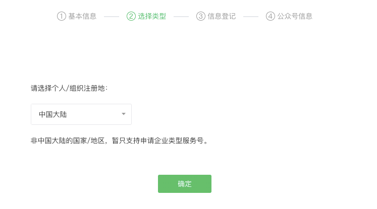

选择账号类型：

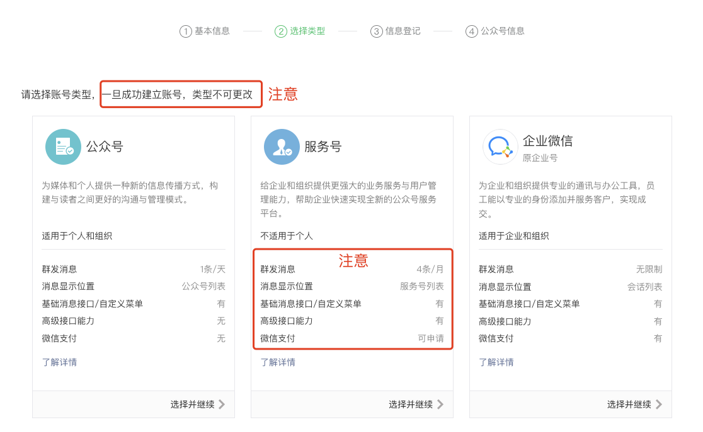

### 1.2.3. 登记主体信息

#### 1.2.3.1. 选择主体类型：

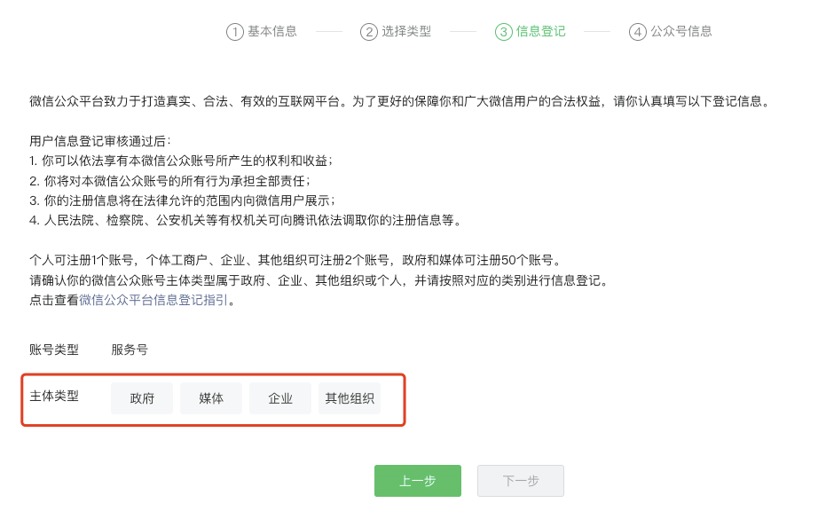

> 点击查看上图中的 [《微信公众平台信息登记指引》](https://kf.qq.com/faq/120911VrYVrA130619v6zaAn.html)

#### 1.2.3.2. 填写主体信息

填写主体信息时，主体验证方式有三种，可根据实际情况选择其一：

* 主体验证方式-法人验证：

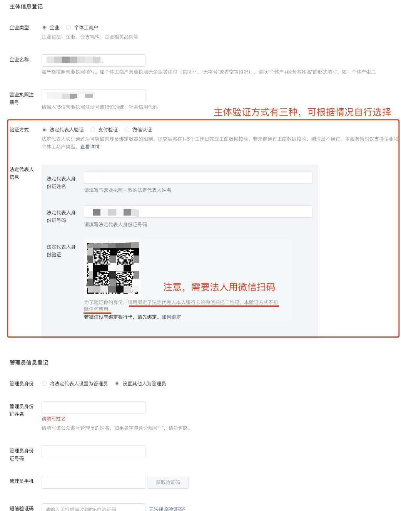

* 主体验证方式-支付验证

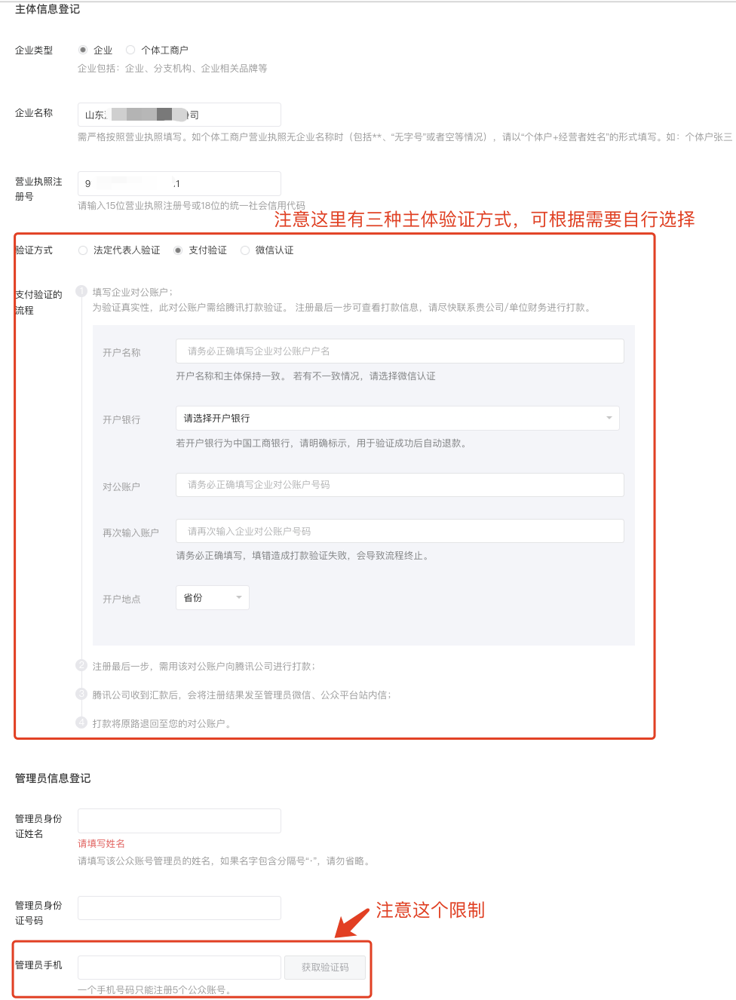

* 主体验证方式-微信认证

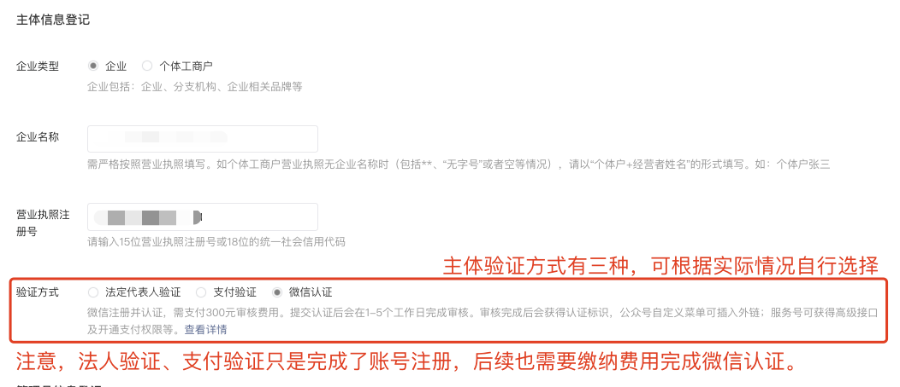

#### 1.2.3.3. 管理员信息登记

##### 1.2.3.3.1. 主体验证方式为法人验证时

主体验证方式为法人验证时，可以选择将法人设为管理员，也可以选择设置其他人为管理员。

在设置其他人为管理员时，注意这里没有 `一个手机号码只能注册5个公众账号` 的限制，也就是说，即便这个管理员已经注册（管理）过超过了5个的公众号，也可以继续管理新注册的公众号，其他主体验证方式则无法突破该限制。

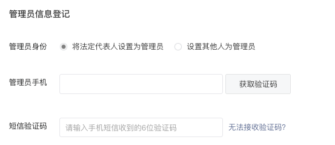

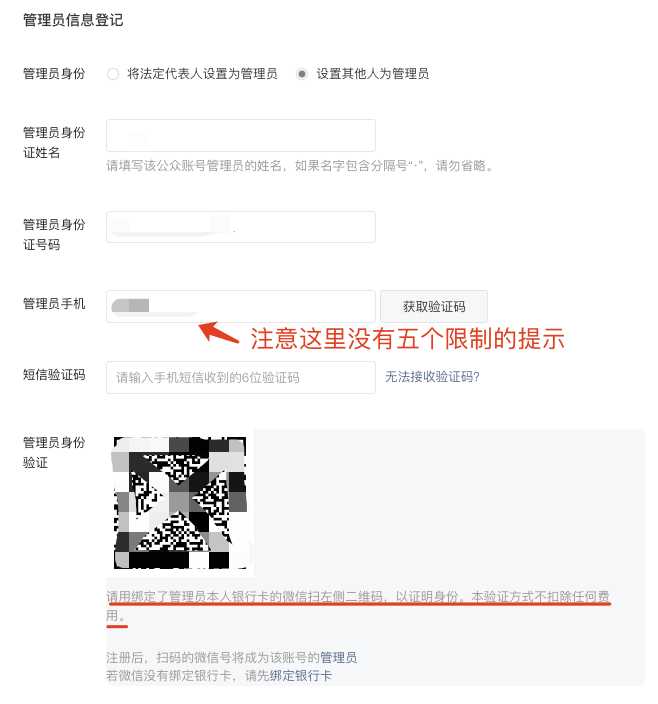

##### 1.2.3.3.2. 使用支付或微信认证验证主体时

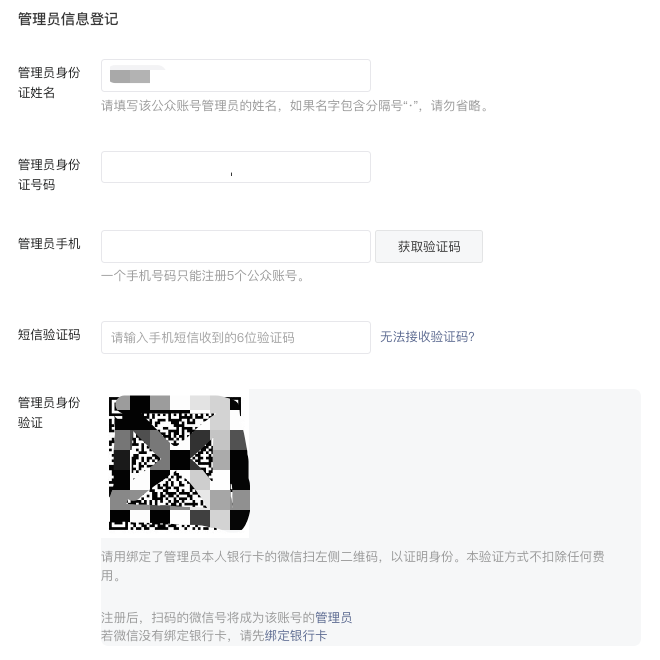

## 1.3. 临时记录

### 1.3.1. 服务号

|    类别    |                    账号                    |         密码          |       手机号        |
| -------- | ----------------------------- | ---------------- | -------------- |
| 163邮箱 | sdpengpaifuwuhao@163.com | Pengpai2015     | 15621860825 |
| 服务号    | sdpengpaifuwuhao@163.com | sdPengpai2015 |                        |