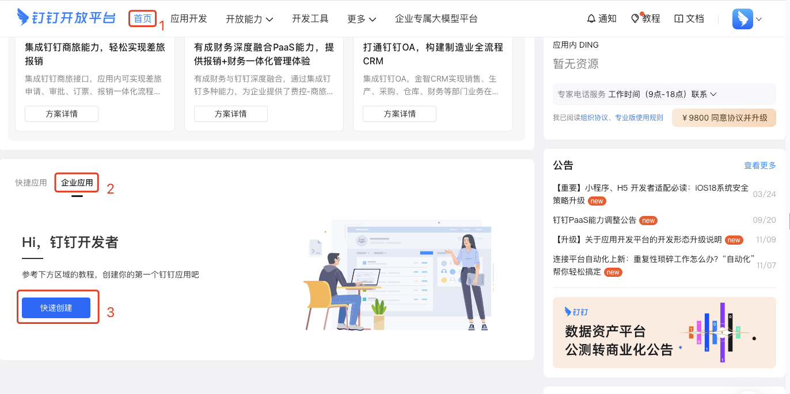
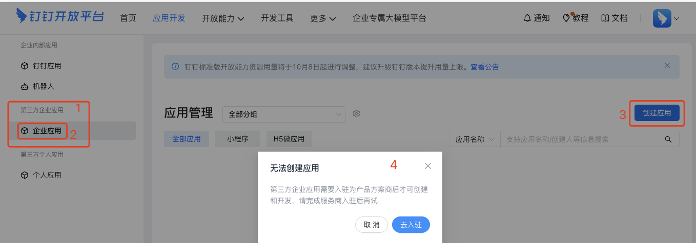
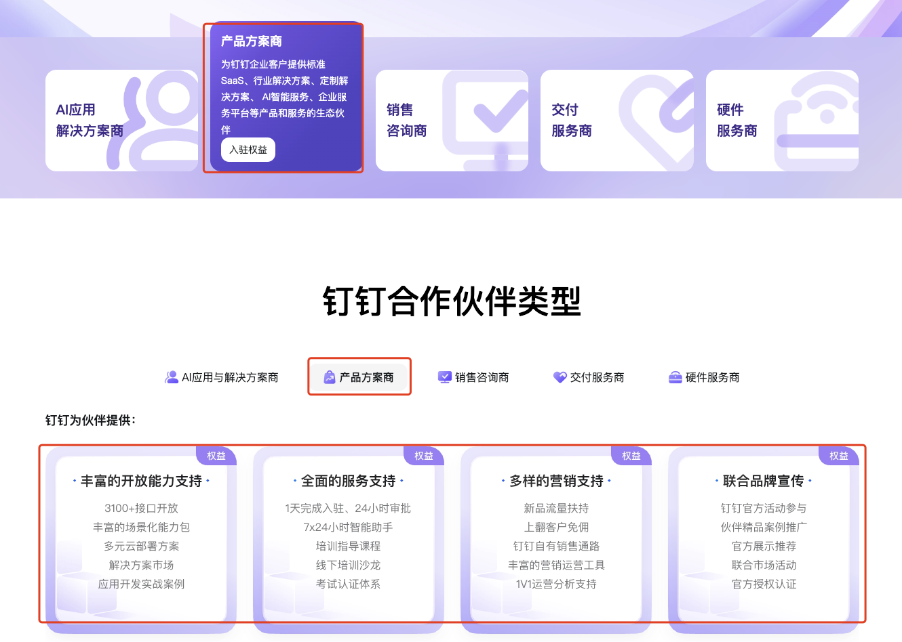
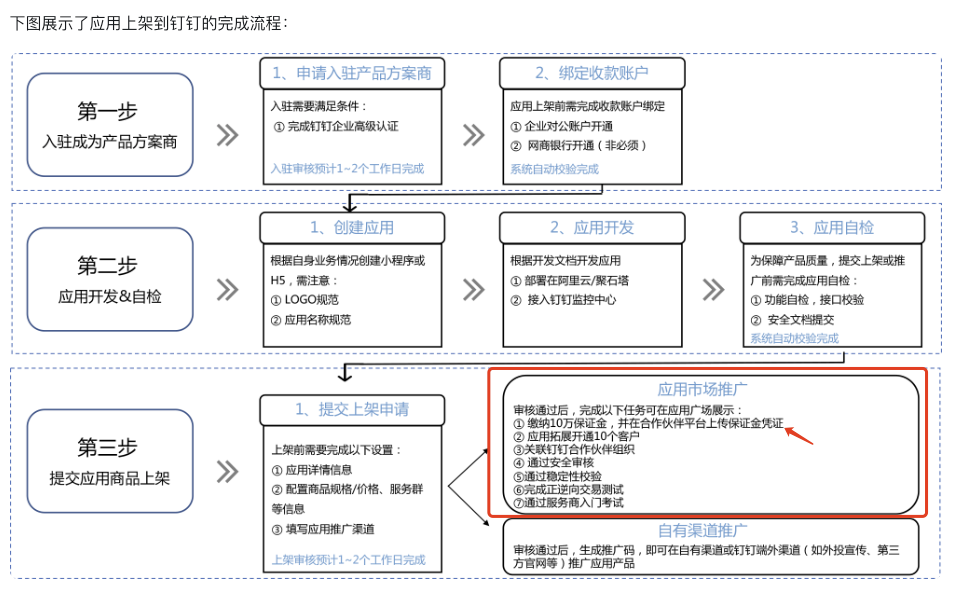
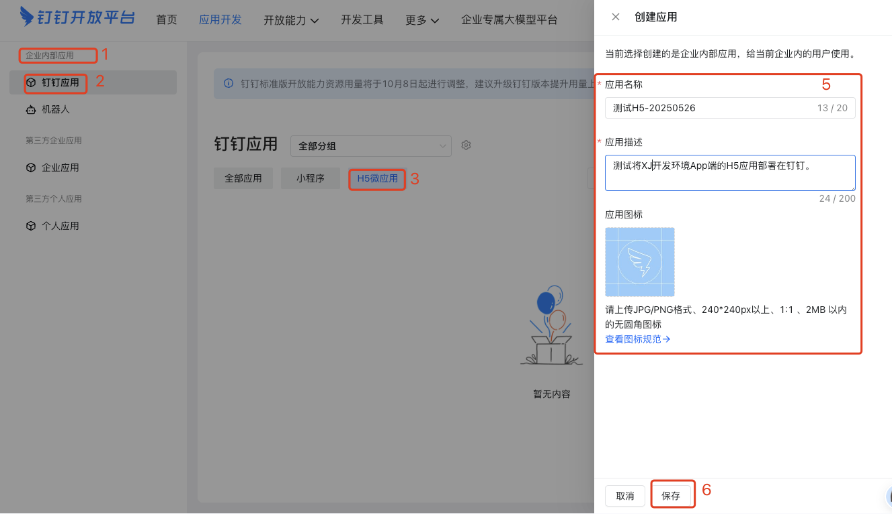
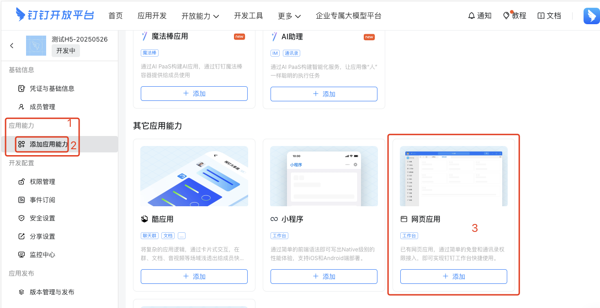
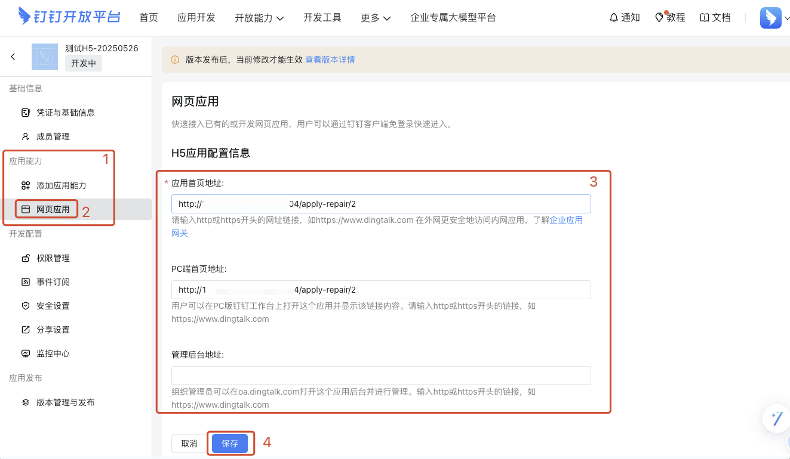
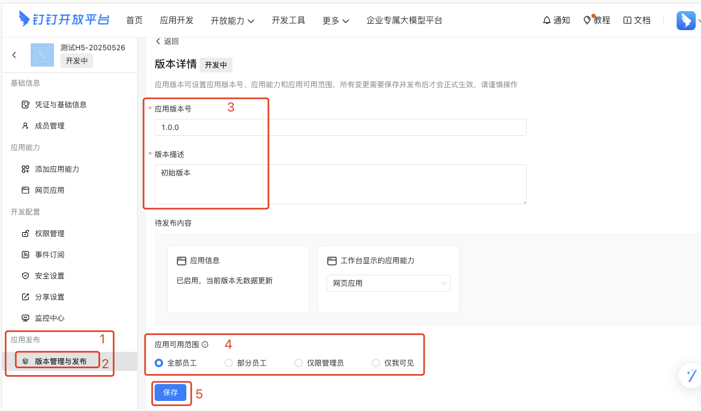

# 1. H5微应用

## 1.1. 须知

* [钉钉平台应用类型介绍（20250526）](https://open.dingtalk.com/document/orgapp/application-types)
* [钉钉平台应用能力介绍（20250526）](https://open.dingtalk.com/document/orgapp/introduction-to-application-capability)

## 1.2. 创建H5微应用

### 1.2.1. 第三方企业应用

> 流程略繁琐，一般中小企业不建议使用这种方式。

若要创建第三方企业应用，必须先成为服务商，

在认证成为服务商之前，需要先对本企业进行认证，然后再提交相关资料。具体参考[合作全流程指引(20250423)](https://open.dingtalk.com/document/isvapp/isv-cooperation-guide)

需要注意，如果服务商类型有多重，可根据实际情况选择。对于“产品服务商”，有如下简介：

“产品服务商”身份认证完成后，应用在钉钉上架时，需要缴纳 10 万元保证金并完成其他相关操作。[官方说明](https://open.dingtalk.com/document/isvapp/isv-cooperation-guide)如下：

后续服务商认证、应用创建等流程可参考官方文档。

### 1.2.2. 企业内部应用

## 1.3. 核心功能

### 1.3.1. 功能点

* 新开发一个全部功能入口页面，列出可用功能
* 用户、登录和token
    * 我方 H5 系统中 token 的生成和获取 
    * 集成钉钉[免登录](https://open.dingtalk.com/document/orgapp/logon-free-h5)
    * [获取钉钉用户信息](https://open.dingtalk.com/document/app/dingtalk-retrieve-user-information)，
        * 在调用 API 前，需要先在 「基础信息-权限管理-个人权限-个人手机号信息」中 [申请权限](https://open.dingtalk.com/document/orgapp/permission-management)，
    * 如何将钉钉用户信息与我方系统用户合并。（或者基于钉钉用户创建我方用户）
* [扫码](https://open.dingtalk.com/document/orgapp/jsapi-scan) 功能的实现（无需鉴权）
    * [扫码的调试页面](https://open.dingtalk.com/tools/explorer/jsapi?spm=ding_open_doc.document.0.0.33674945w9l52h&id=10160)
    * 扫码之后向指定页面跳转（巡检功能使用）
* [相册](https://open.dingtalk.com/document/orgapp/jsapi-choose-image)选择图片（无需鉴权）
* [其他常见问题](https://open.dingtalk.com/document/orgapp/h5-micro-applications-1#title-bki-kx2-6wh)，含：
    * 去除钉钉默认的导航栏（目前我方路由中包含了一个 "?" 会导致去除的方法不生效，需要研究如何去除这个 "?"）
    * 调起拍照：`<input type="file" name="pic" accept="image/*" capture="user">。`

## 1.4. 注意：

### 1.4.1. 关于登录

#### 1.4.1.1. 登录方式实现思路

如果免登录非必须，可以考虑把首页设置为登录页面，登录之后把用户信息存储到本地缓存中。

下次登录时检测是否有缓存用户信息，有直接用，没有则展示正常的登录界面。

如果这样实现的话，不需要再考虑钉钉免登录、鉴权等内容。

#### 1.4.1.2. 免登录实现思路

在按照 [免登录](https://open.dingtalk.com/document/orgapp/jsapi-get-auth-code)文档实现免登录并获取用户信息时，我们可以考虑把这些内容做成一个单独的服务，然后由其他服务进行调用。

其他服务调用时，可以使用标准 Http 方式也可以使用 Rpc 方式。

使用 Rpc 方式实现时，需要在当前服务以及业务服务中增加 Rpc 初始化操作。

参考之前的 wxpush 服务实现，但需要简化 client 逻辑。

### 1.4.2. 免鉴权功能需要导入SDK

虽然前面提到的 扫码、相册 不需要鉴权，但在使用前需要先引入 [钉钉客户端SDK](https://open.dingtalk.com/document/orgapp/webapp-read-before-development)

